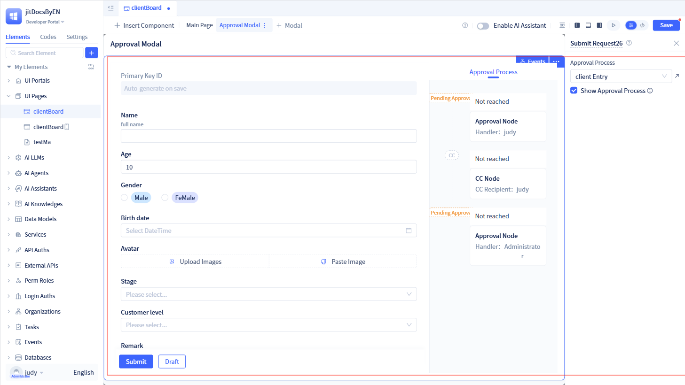
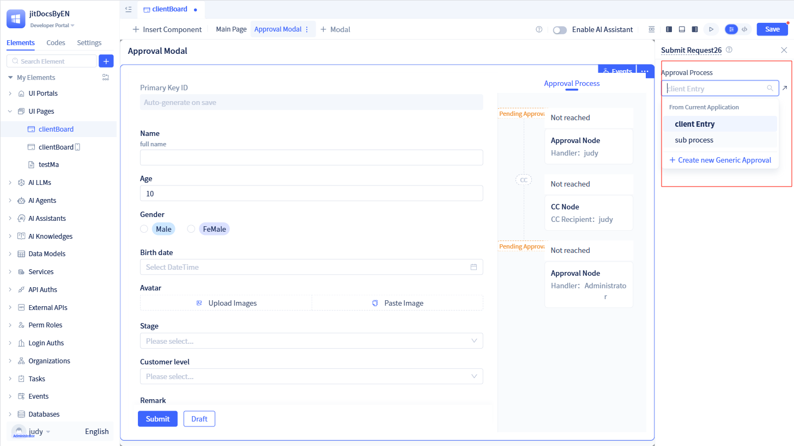
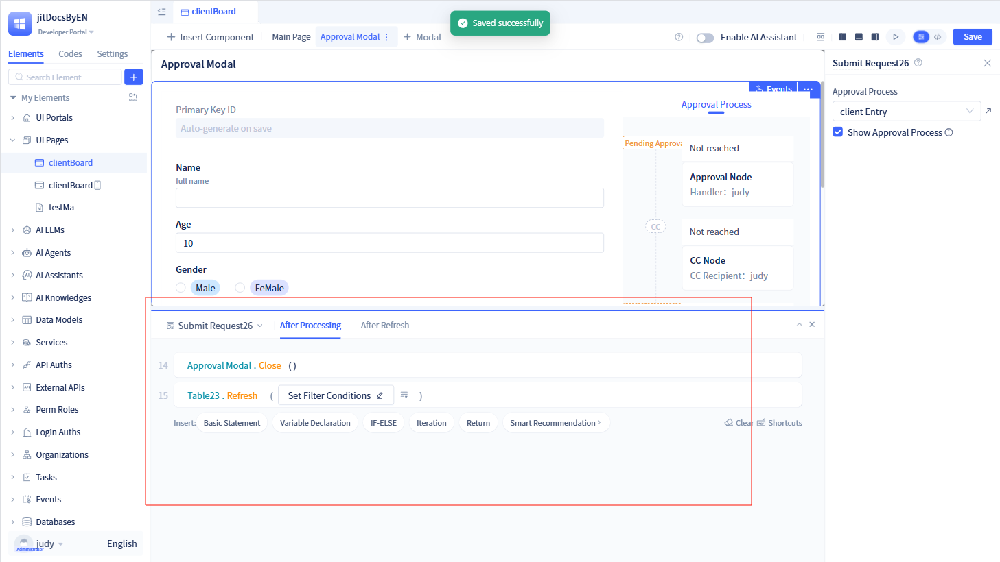
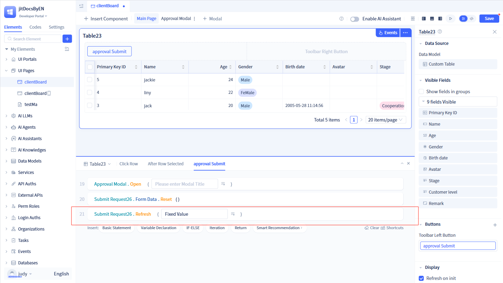
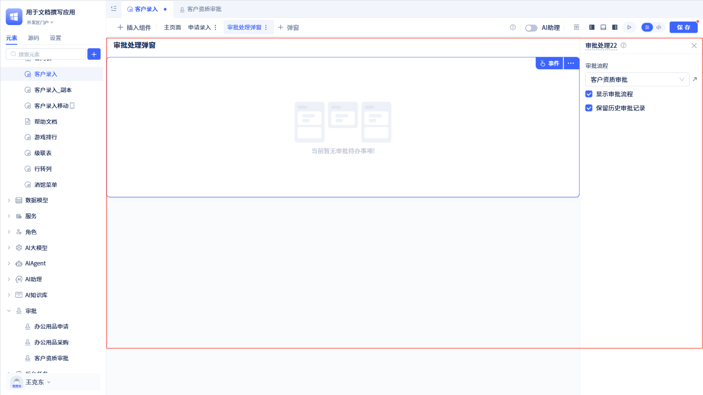
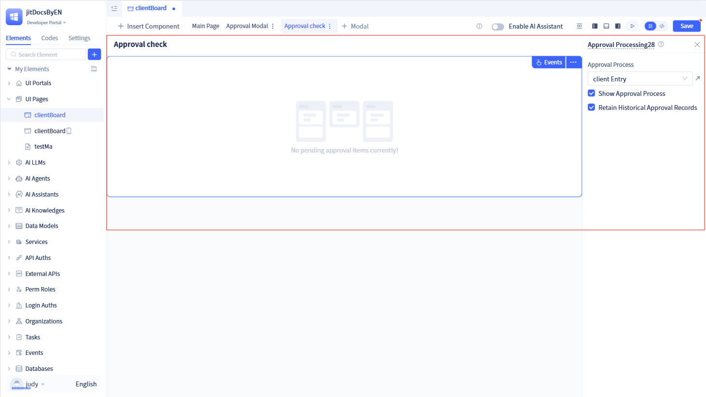
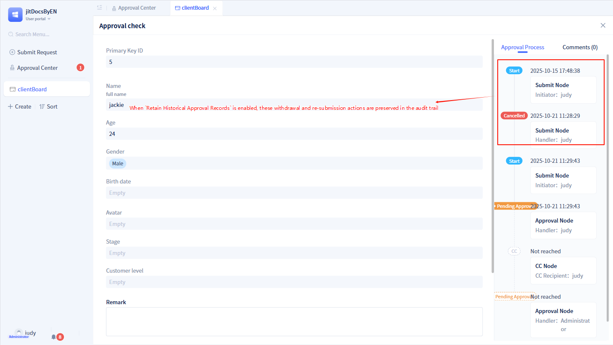
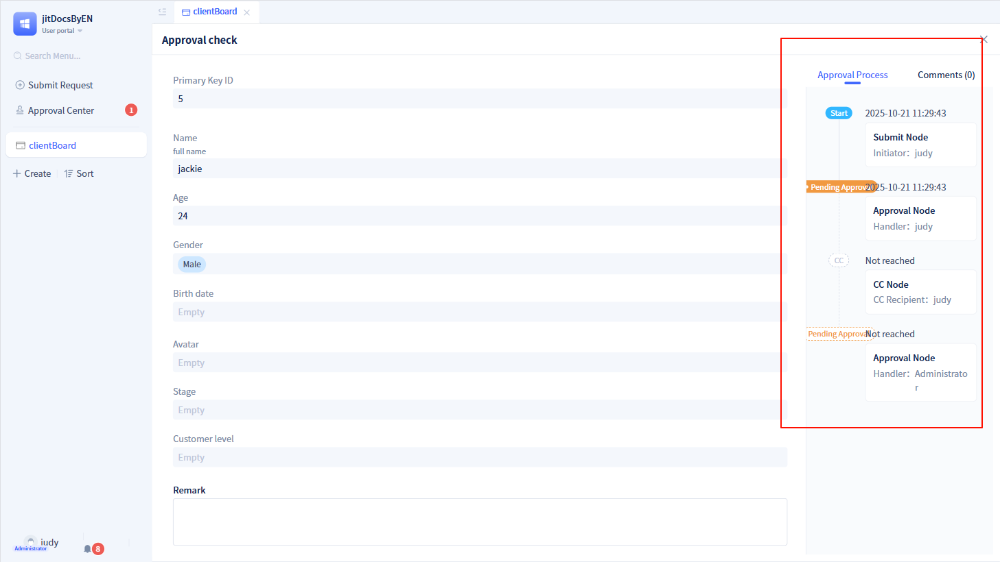
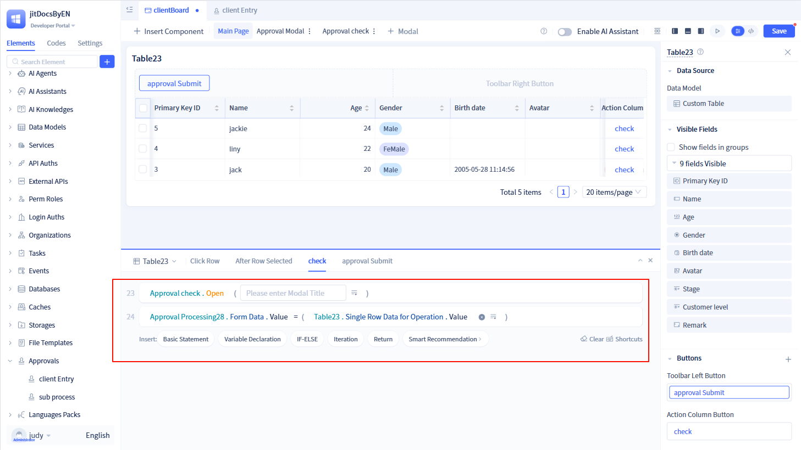
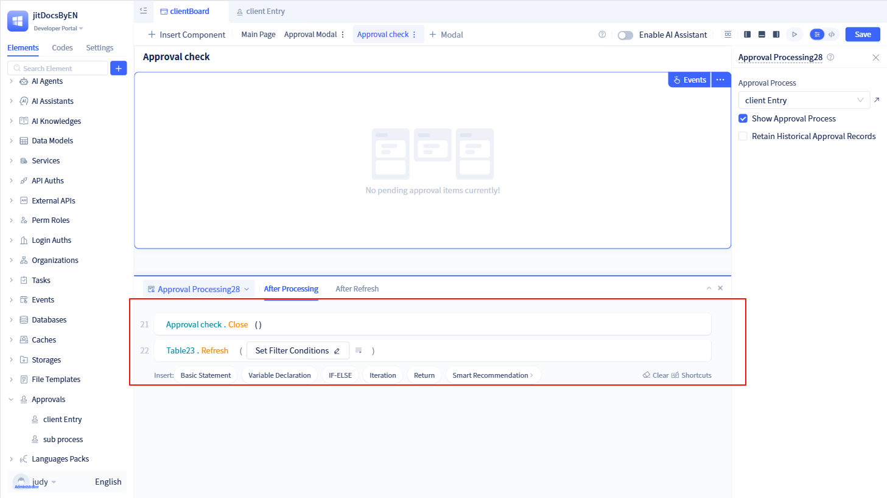

# 审批组件
## 发起申请组件
发起申请是审批流程的入口组件，基于表单数据模型实现审批申请的发起和管理功能。它负责收集用户填写的表单数据、启动审批流程和展示审批流程，支持数据刷新和事件通知机制。

### 创建发起申请组件

在页面可视化编辑器中点击`插入组件`，将“发起申请”组件拖拽到页面中。然后在右侧配置面板中配置发起申请组件参数。

### 参数配置
使用发起申请组件时，需要指定使用的[审批流程实例元素](../approval-process/approval-process-basic-configuration)。

在可视化编辑器中，点击发起申请组件后，可以看到发起申请组件的参数配置面板。在配置面板中，选择对应的审批流程实例元素。另外，开发者可以选择是否显示审批流程记录。

:::warning 注意
一般情况下，在创建发起申请组件之前，需要提前创建好审批流程，具体请参考[审批流程](../approval-process/approval-process-basic-configuration)。

开发者也可以点击下拉框中的`新建常规审批`进行创建审批流程。

发起申请组件所看到的审批流程记录，其实是根据所选的审批流程生成的审批流程预测数据。

如果审批流程关闭了预测功能，那么发起申请组件将不会显示审批流程记录。

:::

### 处理后/刷新后事件
发起申请组件提供了`处理后`和`刷新后`两个事件，用于处理完成后和刷新完成后的逻辑。

处理后事件用于发起申请提交后的逻辑，例如，当审批数据提交后，关闭当前弹窗并刷新表格数据等。

刷新后事件用于发起申请组件刷新后的逻辑，需要配合发起申请的刷新函数使用。

例如，开发者在表格中配置打开弹窗并刷新发起申请组件，那么发起申请组件内的刷新后事件才会生效。

## 审批处理组件
审批处理是工作流审批任务的核心操作组件，基于工作流引擎实现审批任务的处理、查看和状态管理。它负责加载指定工作流的待处理任务、展示审批历史记录和处理用户的审批操作。

### 创建审批处理组件

在页面可视化编辑器中点击`插入组件`，将“审批处理”组件拖拽到页面中。然后在右侧配置面板中配置审批处理组件参数。

### 参数配置
使用审批处理组件时，也需要指定使用的[审批流程实例元素](../approval-process/approval-process-basic-configuration)。除了配置审批流程外，审批处理组件还可以选择是否显示审批流程以及是否保留历史审批记录。

### 保留历史审批记录
发起人可以对审批单进行撤销操作和重新发起操作。如果开发者勾选了`保留历史审批记录`，那么这些撤销操作和重新发起操作会保留在审批记录中。反之，这些操作不会保存在审批记录中。

:::warning 注意
一般情况下，在创建审批处理组件之前，需要提前创建好审批流程，具体请参考[审批流程](../approval-process/approval-process-basic-configuration)。

审批组件在开发区是无法预览的，需要到使用区才能查看。

如果审批表单无需当前登录人审批，将显示“当前暂无审批待办事项”。

如果取消勾选`显示审批流程`，那么无论是否勾选`保留历史审批记录`都不会出现审批流程记录。

如果审批流程关闭了预测功能，那么审批处理组件仅显示已经流转的审批记录。

:::

在使用审批处理组件时，需要为该组件提供数据源，否则将无法使用。

如上图，我们使用表格和审批处理组件配合使用，需要在表格的事件中为审批处理组件提供数据源。

### 处理后/刷新后事件
审批处理组件提供了`处理后`和`刷新后`两个事件，用于处理完成后和刷新完成后的逻辑。

处理后事件用于对审批单处理后的逻辑，例如，当审批数据处理后，关闭当前弹窗并刷新表格数据等。

刷新后事件用于审批处理组件刷新后的逻辑，需要配合审批处理组件的刷新函数使用。
