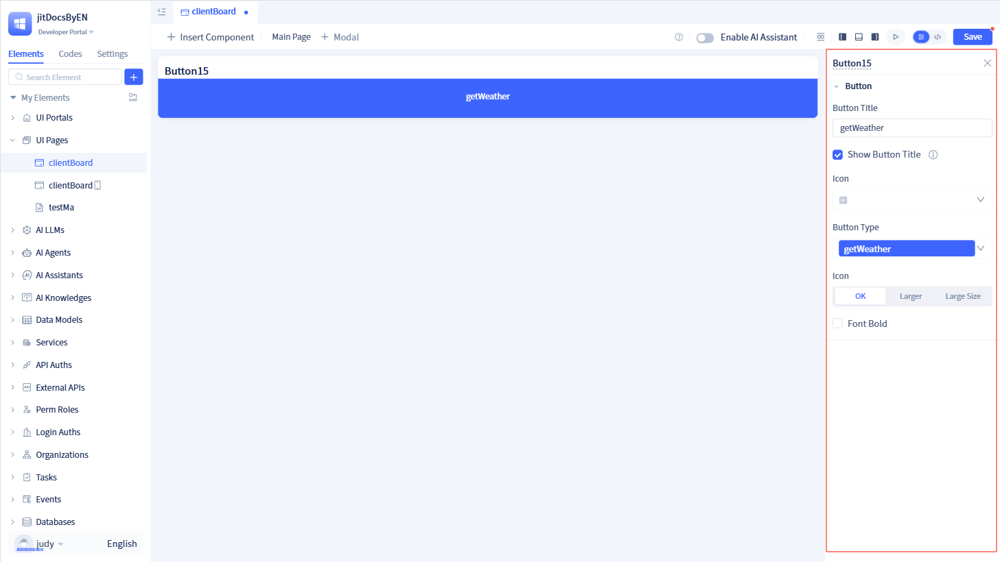
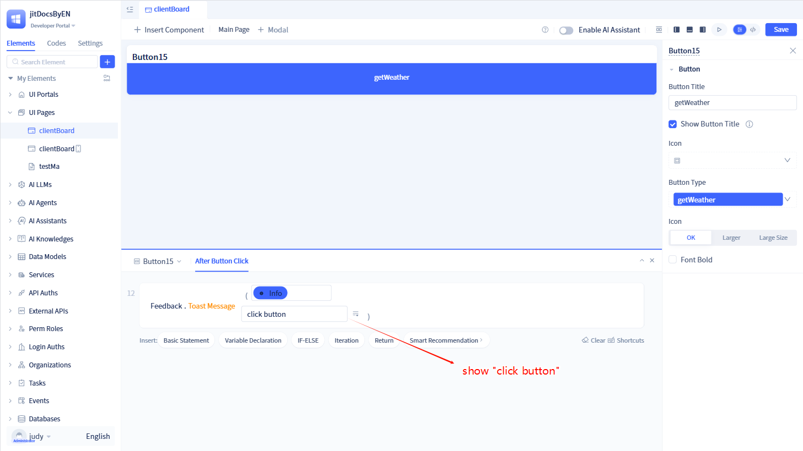

# 按钮组件
按钮是基础交互组件，负责触发各种操作和事件。它基于Ant Design Button组件实现用户交互功能，支持多种按钮样式、状态显示、权限控制和条件显示，提供异步操作和加载状态反馈能力。

## 按钮组件创建 {#button-component-creation}

在页面可视化编辑器中点击`插入组件`，将“按钮”组件拖拽到页面中。然后在右侧配置面板中配置按钮组件参数。

## 标题/图标/类型配置 {#title-icon-type-configuration}
类似于Ant Design的Button组件，按钮组件提供了丰富的参数配置，用于配置按钮的标题、图标、样式、类型、大小等功能。

在可视化编辑器中，点击按钮组件后，可以看到按钮组件的参数配置面板，可以进行参数配置。

:::warning 注意
一般情况下，按钮组件默认显示按钮标题。如果隐藏按钮标题，那么图标会设为必填项。

默认情况下，按钮尺寸会按照比例自适应缩放。但是，如果当前页面中按钮组件下面没有其他组件，那么按钮会占据剩余空间。

按钮组件可以设置固定宽高，通过`设置尺寸`完成，具体操作参考[设置尺寸](../shell-and-page/component-based-page-development#custom-size-or-adaptive)。
:::

## 点击后事件 {#click-event}
按钮组件支持`点击后`事件，用于处理按钮点击后的逻辑。

当按钮被点击时，可以执行一些操作，比如跳转到新的页面、弹出提示框、调用API接口等等。
