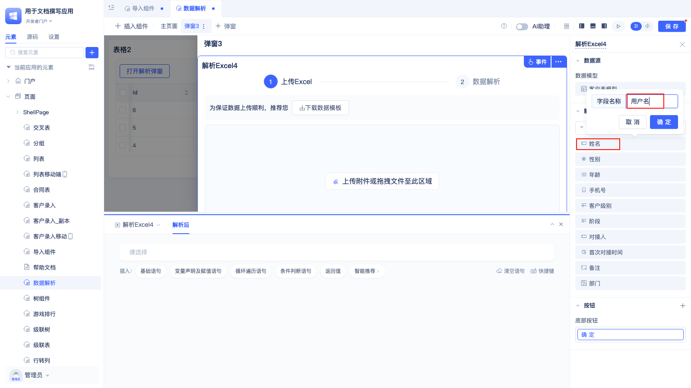

# Data Parsing and Import
## Import Component {#import-component}

In web development, importing data from Excel files is a common scenario. Business requirements such as bulk employee information entry, financial report data import, and inventory list updates all require support for users to upload Excel files and batch import the data into the system.

### Adding Import Component to Page {#add-import-component-to-page}

After dragging the import component into the page editor, all fields except primary key ID, serial number, and subtable fields will be marked as importable by default:

The data table model fields used in this example are shown in the figure below:

The generated import template has the sheet name in the bottom left corner consistent with the data table model, and the header field names and order displayed in the configuration area are consistent:

### Import Serial Number Fields {#import-serial-number-fields}

By default, the `Support Import Serial Number Fields` option is unchecked because serial numbers are usually automatically generated in business processes. If you need to import serial number data through Excel, please check this option and then check the serial number field in the display field selection panel.

### Set Required Fields {#set-required-fields}

By default, the import component does not require any fields to be mandatory. It supports setting certain fields as required:

Click on the field name, check `Required During Import` in the popup window, then click OK.

After setting the required attribute for a field, the field name in the import template will be marked with `*`

### Import Subtable Data {#import-subtable-data}

When the main table has subtable fields configured, customers may want to import subtable field data directly while importing main table data for a better experience. Configure according to the following steps:

First, in the right configuration area `Import Subtable` option, check the subtable to be imported.

Second, set the `Template Sheet Page Name`. When importing data, subtable data is placed in a separate sheet page, and the sheet page name in the template should match the `Template Sheet Page Name`.

Finally, configure `Association Matching` and `Map Main Table Field`. As shown in the figure, configure the `Association Matching` field name as `Subtable Matching Field` and `Map Main Table Field` as `Name`. In the import template, the `Subtable Matching Field` in the subtable and the `Name` field in the main table should correspond. The import template and data are shown below:

1. Main table import template and data:

2. Subtable import template and data:

:::tip
    When importing, do not modify the template sheet name, field names and order in the first row of the template. Otherwise, it may cause import failure.
:::

On the import page, after uploading the template, the page looks like this:

You can switch the imported sheet page at the top of the page using `Select Main Table Worksheet`. Customers can check if the data is parsed correctly by switching the main table worksheet.

Import success is shown below:

You can see the imported main and subtable data in the data table model:

### Append Import/Update Import {#append-import-or-update-import}

By default, the import component uses append import mode. When importing only main table data, you can switch the import mode to `Replace Import`:

Click the dropdown below `Import Configuration` and select replace import.

Then click the dropdown under `Replace Settings` and select the matching field for replacement from the dropdown.

:::tip
    You can select up to 5 replacement matching fields. During import, the platform will replace data in the data table model with data from Excel based on matching fields. If no matching data is found, unmatched data will not be imported.
:::

Usage example, as shown in the configuration below, perform replace import based on the `Name` field:

Import template and data:

Data in the data table model before replace import:

Data in the data table model after replace import:

### Import Data by Conditions {#import-data-by-conditions}

Sometimes, the customer's Excel file contains a large amount of data, and only data that meets specific conditions needs to be imported. This scenario can be addressed by configuring import conditions.

Click the `Configure Import Conditions` button, first configure the filter conditions in the popup panel, then click OK. As shown in the figure above, the configured filter condition is: name contains "Wang". In the data shown below, only the first two rows will be imported.

Import results are as follows:

Import failure records will indicate that the last two data rows do not meet the conditions:

### Add Import Description Text {#add-import-description-text}

The import component will by default provide descriptions for file format, file size, etc. When users configure import conditions, they can add corresponding import descriptions for additional prompts:

After entering description information in the input box under `Import Description` and clicking save, the custom import description will be displayed below the component's default prompt information.

### Pre-processing/Post-trigger Functions {#pre-processing-and-post-trigger-functions}

When pre-processing of imported data is needed, you can configure `Pre-import Processing Functions`. For example: format validation and standardization of phone numbers in Excel, unified conversion of different date formats to standard formats, or numerical validation and precision adjustment of amount fields and other data cleaning tasks.

When post-processing is needed after data import is completed, you can configure `Post-import Trigger Functions`. For example: automatically sending import completion notification emails to relevant users, updating statistical information of other related data tables, triggering business process approval workflows, or generating data import reports and pushing them to enterprise WeChat groups and other subsequent business operations.

Click the `Configure Trigger Function` button, select the service and corresponding function in the popup panel. Users can also choose their own created services and functions.

:::tip
    The import component will pass all data to be imported as parameters to the processing function. The parameter format is an array, where each element in the array corresponds to one row of records in the data table model.
:::

### Import Hint Button Click Event {#import-hint-button-click-event}

Users can configure the import hint button click event themselves. Custom prompts can be created in this event. If the import component is in a popup, the popup can also be closed in this event.

In the event, click `After Import Hint Button Click` and configure the corresponding event logic.

This event differs from `Post-import Trigger Function` in the following ways:

| Feature | Post-import Trigger Function | After Import Hint Button Click |
|---------|----------------------------|--------------------------------|
| Always Triggered | Yes | Triggered after user clicks |
| Extensibility | Can only select services and functions | Can choose richer custom statements |

## Parse Excel {#parse-excel}

In web applications, most cases require parsing data from Excel and importing it into corresponding data table models. Additionally, there is another common usage scenario: parsing data from Excel and directly updating form or table data on the current page without going through the data table model storage process.

### Create Parse Excel Component {#create-parse-excel-component}

In `Main Page` or popup components, after dragging in the `Parse Excel` component, the component will by default select non-primary key fields as the default configuration for parsing fields.

### Configure Field Aliases {#configure-field-aliases}

When the original field names in the data table model are too long or difficult to understand, developers can set aliases for fields to improve user experience.

Click on the field name, enter a custom alias in the popup dialog, and click OK.

### Adjust Field Order {#adjust-field-order}

Developers can adjust the order of parsing fields by dragging, placing more frequently used fields at the front.

When you hover over the field name, a drag sort icon will appear at the end of the row. Click the drag icon and drag the field up and down to sort.

### Delete Parse Fields {#delete-parse-fields}

The component will by default select all fields except primary keys as parsing fields. If developers feel there are too many fields, they can delete fields that don't need parsing. The component will automatically update the data template based on the selected field names and order.

Hover over the field name and click the delete icon on the far right.

### Create Custom Buttons {#create-custom-buttons}

Developers can add custom buttons to the parsing page to perform other custom operations after parsing is complete. For example: performing secondary processing on the parsed data.

Click the `+` to the right of `Button`, click `Bottom Button`, set the button name, icon, type, and color attributes in the popup, then click OK.

The page effect is as follows:

### Post-parse Events {#post-parse-events}

Developers can configure data processing logic in the `Post-parse` event, such as updating the parsed username to a form component:

The current example main page is a form component:

Usage effect:

