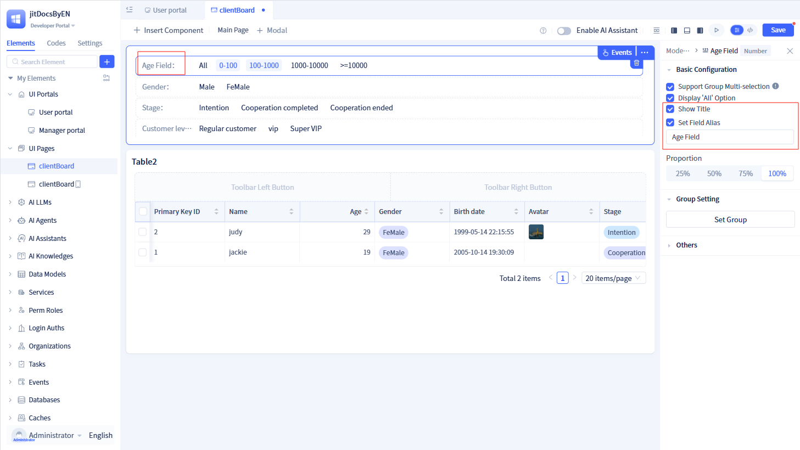
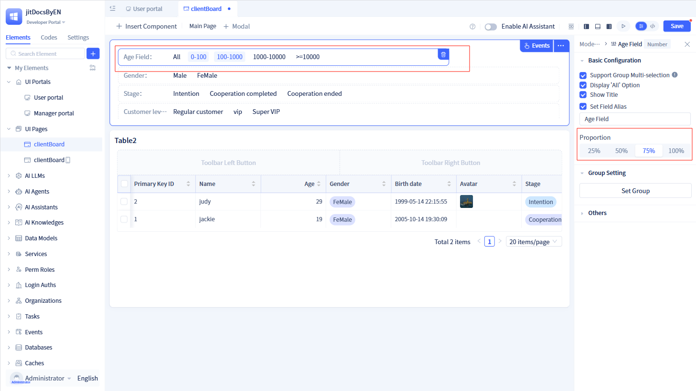
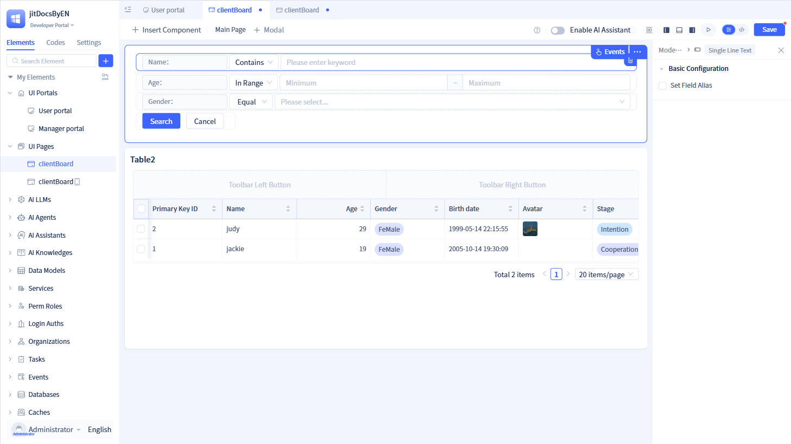
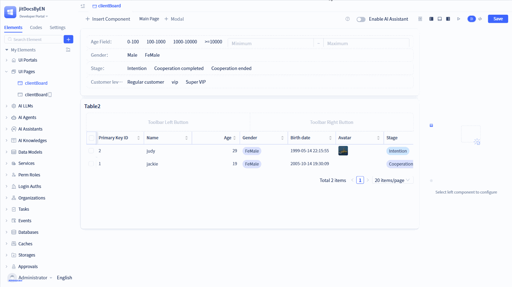
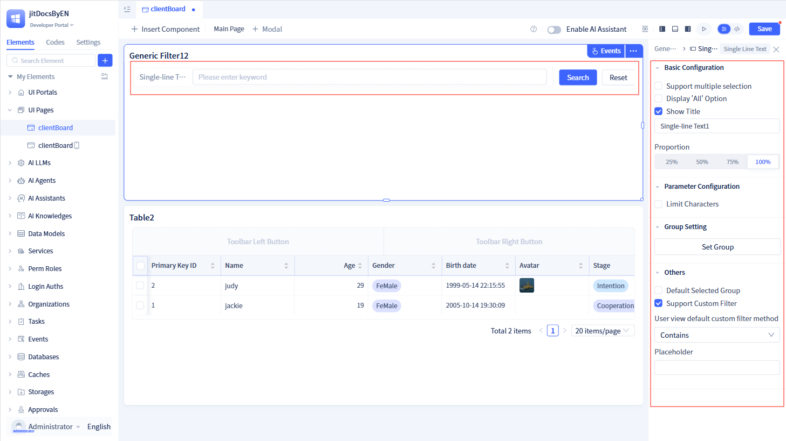

# Filter Components
Filters are essential data processing tools designed to extract specific data subsets from large datasets based on defined criteria. They enable users to customize search parameters—such as date ranges, price intervals, or categories—to display results that match their requirements.

JitAI offers two types of filters: model filters that target specific data models, and universal filters that can be configured at runtime to filter multiple models simultaneously.

## Model filters {#model-filters}
In the page visual editor, click `Insert Component` and drag the `Model Filter` component onto the page. Select a data model in the data source configuration and click `Confirm`.

Model filters support three operation modes: simple filter, complex filter, and free filter. The default mode is simple filter. Note that free filter mode is not currently supported on mobile devices.

### Simple filter {#simple-filter}
Simple filter mode organizes various data types into groups and displays them in a tiled layout. Users can achieve precise data filtering without complex input operations—simply clicking on preset group tags enables efficient navigation through large datasets.

Simple filters automatically generate filter fields for common data types, providing built-in recommended groupings such as numeric ranges for numbers and amounts, interval groups for percentages, and option groups for selection fields.

Building on this foundation, you can customize filter fields by clicking "Displayed Fields" to add or remove fields, then configure individual field attributes and groupings.

Clicking on any field in the page configuration area opens the field configuration panel on the right, where you can fine-tune filter settings. Note that filter fields are connected using AND logic by default.

#### Basic configuration
**Multiple selection support**

When enabled, the filter field allows multiple option selection simultaneously. Options are connected using OR logic, meaning data matching any selected option will be included in results.

When disabled, the filter field restricts selection to a single option.

**"All" option display**

When enabled, displays an "All" option by default in the option group, which is mutually exclusive with other selections.

**Title display**

When disabled, the filter field title is hidden from the interface.

**Field alias configuration**

When enabled, displays an input field for entering a custom field alias. Note that "Title display" must be enabled to use this feature.

#### Width proportion

Adjust filter field widths by dragging in the page configuration area, or select from preset width ratios in the "Proportion" section of the right configuration panel.

#### Group settings

Configure fine-grained data groupings for both discrete and continuous variables, enabling systematic data classification and organization. Predefined groups include numeric ranges for numbers and amounts, interval groups for percentages, and option groups for selection fields.

Click "Set Groups" to open the configuration dialog for defining group options. Each group consists of three components:

-   **Group name**: The display label shown to users on the interface.
-   **Filter method**: The specific filtering logic applied to the group.
-   **Filter range**: The criteria range for the group, supporting both constant and variable assignments.

:::tip Tip
Numerous filter methods are available, including: contains any, contains, does not contain any, does not contain, equals any, equals, does not equal any, does not equal, starts with, ends with, in range, greater than, less than, great than or equal to, less than or equal to, belongs to, does not belong to, is empty, is not empty, selected, not selected, and more. Each data type supports specific filter methods—not all methods apply to every type. Consult the detailed data type documentation for type-specific filtering options.
:::

#### Default selected group
Configure the initial selection state by choosing one option from existing groups as the default filter criteria.

#### Custom filtering support

When enabled, allows users to apply custom filtering logic to the field using the configured default filter method.

#### Mobile platform differences

Simple filtering on mobile devices differs from desktop in several ways:

-   **Configuration ordering**: Drag fields up or down in the right configuration area to adjust display order
-   **Display style**: Defaults to list style, showing a maximum of three filter items with an expand icon for additional options
-   **Layout arrangement**: When using "Tag" style, choose between horizontal or vertical arrangement

### Complex filter {#complex-filter}

Complex filtering provides greater flexibility than simple filtering by allowing users to define filter fields while maintaining full control over filtering methods. Users can select appropriate filter methods based on each field's characteristics and data type.

Filter field addition follows the same process as simple filtering—selecting fields through checkboxes—but generates customizable filters for each data type, each with a sensible default filter method.

Complex filter field configuration focuses on essential settings, providing only "Field Alias" configuration. Users retain full flexibility to modify specific filtering methods during runtime based on their needs.

### Free filter {#free-filter}

Free filtering represents the most flexible operation mode, providing complete user control over filter configuration. Building upon complex filtering capabilities, it removes all field restrictions, enabling users to dynamically select both filter fields and conditions. This mode offers maximum adaptability for diverse filtering requirements.

### Layout settings {#layout-settings}

Filters (except free filter mode) support rapid layout configuration through "Quick Layout" in the "Quick Operations" menu. Choose from preset arrangements: single column, two columns, three columns, or four columns per row. Alternatively, customize layouts by dragging elements within the page configuration area.

:::tip Tip
Simple filter mode includes a "Filter on First Load" option. When enabled, the filter automatically executes upon page load, immediately displaying filtered results.
:::

### Filter usage {#filter-usage}

Access the event configuration panel by clicking the "Events" button in the filter's upper-right corner within the page configuration area. The "After Query" event captures filtered values, which can then be passed to other components to implement filtering functionality.

:::warning Note
Filters require "After Query" event configuration to pass filtered values to other components for filtering implementation.

The "After Query" event returns a [Q Expression Object](../../reference/framework/JitORM/TQL). Other components use this expression object to apply the specified filtering criteria.
:::

## Universal filters {#universal-filters}
The key distinction between universal and model filters lies in their configuration approach: model filters require a predefined data model, while universal filters can be configured without specifying a model upfront, offering greater flexibility for dynamic filtering scenarios.

### Filter field configuration {#filter-field-configuration}
Universal filters start with a blank configuration, requiring manual addition of filter fields. Once added, click on any filter field in the page configuration area to access its configuration options in the right panel.

:::tip Tip
Universal filter field configurations mirror those of model filters with one key addition.

Since universal filters operate without predefined models, each filter field includes "Parameter Configuration" options. Examples include character length limits for text fields, decimal precision and units for numeric fields, and more. Consult [Data Types](../../reference/framework/JitORM/data-types#type-specific-parameters) for comprehensive parameter details.
:::

### Quick layout {#quick-layout}
Utilize "Quick Layout" in the "Quick Operations" menu to arrange filter elements in preset configurations: single column, two columns, three columns, or four columns per row. Manual layout customization is also available through drag-and-drop operations in the page configuration area.

### Query/reset button display {#show-query-reset-buttons}
Query and Reset buttons are displayed on the filter's right side by default. Disable this option to hide both buttons. Both Query and Reset button interactions trigger the "After Query" event.

### Auto-query on condition change {#condition-change-trigger-query}
By default, filter field value changes do not automatically trigger the "After Query" event. Enable "Trigger Query After Condition Change" to automatically execute queries when filter conditions are modified.

### Initial load filtering {#first-load-filter}
The filter component automatically triggers the "After Query" event upon initial load by default. This behavior can be disabled based on specific application requirements.

:::tip Tip 
When "Query/Reset Button Display" is disabled, "Auto-query on Condition Change" must be enabled to ensure the "After Query" event can still be triggered.
::: 

### Filter usage {#universal-filter-usage}

Universal filters require "After Query" event configuration similar to model filters. The key difference is that users must first specify the target data table model, invoke the universal filter's "Get Filter Conditions" method, and then pass the resulting filter criteria to other components for filtering implementation.
