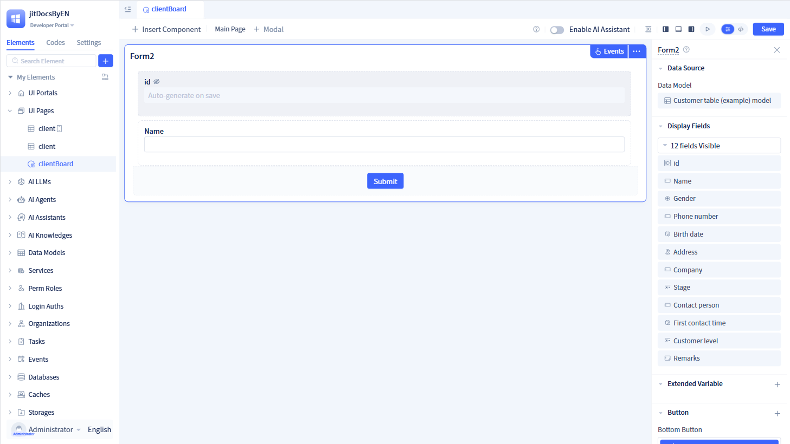
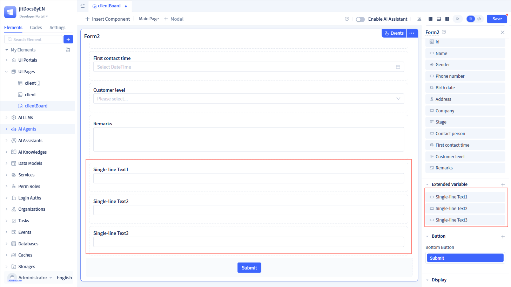
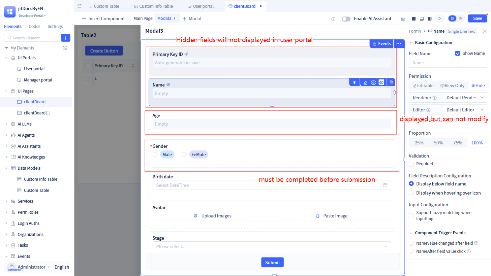
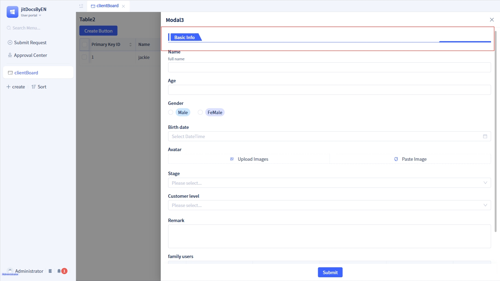
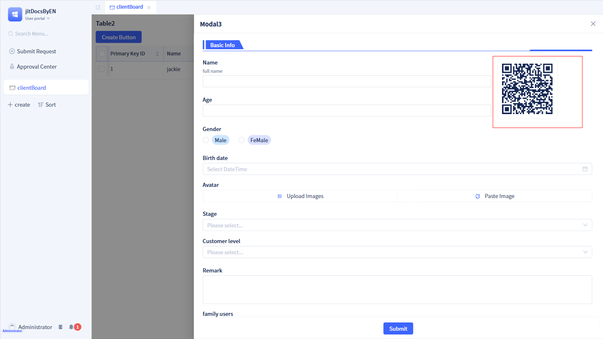
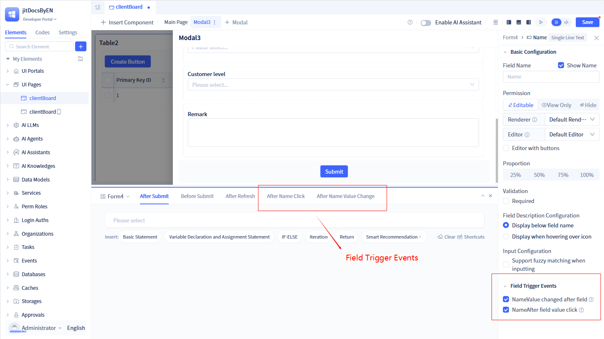
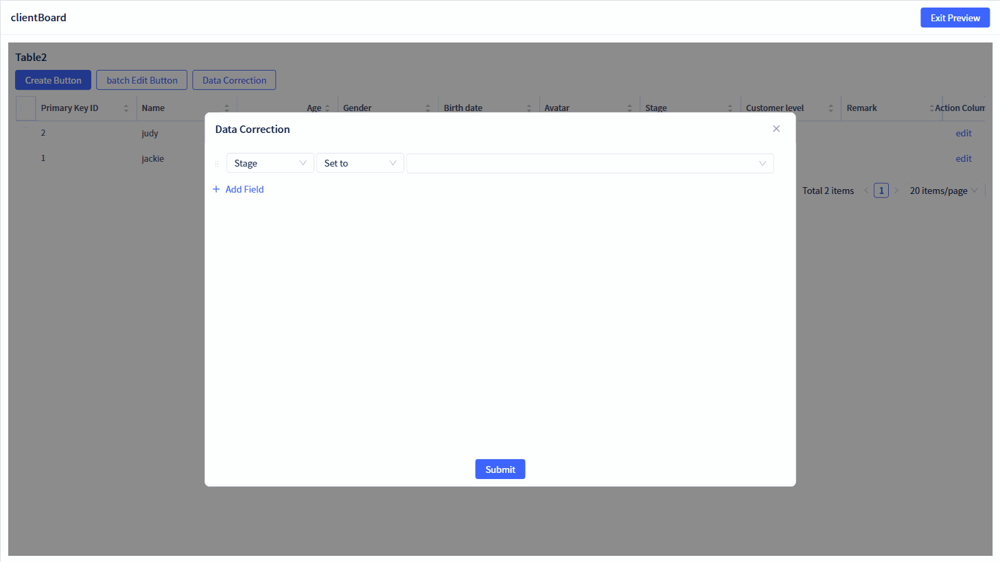
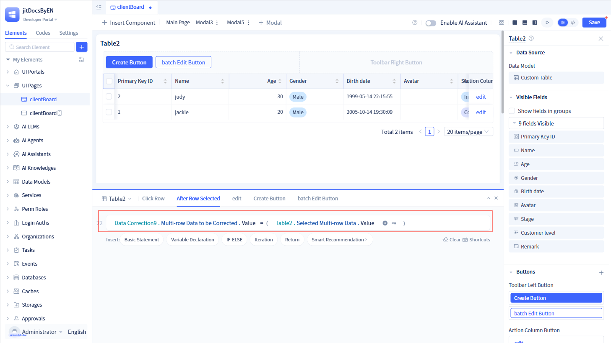

# Form Components

Forms are among the most frequently used components in application development. While traditional forms are limited to collecting, validating, and submitting user input data, JitAi's form components extend far beyond these basic functions. They provide powerful capabilities including visual design, data model binding, permission control, and business rule configuration. Through intuitive drag-and-drop operations, you can construct enterprise-grade form applications with sophisticated interaction logic and advanced data processing capabilities.

## Basic configuration and item management {#basic-configuration-and-item-management}
In the page visual editor, click `Insert Component` and drag the `Form component` onto the page. Select a data model in the data source configuration and click `Confirm`.

:::warning Note
Supported model types include Data Tables, Aggregate Tables, and Extended Tables. Note that when Aggregate Tables are selected, data submission is not available.
:::

By default, form components display all fields from the selected model. You can customize field visibility through the "Display Fields" module in the right configuration panel.

For fields that are only needed within the form but should not be persisted to the data model, you can utilize "Extended Variables". The key distinction between extended variables and model fields is that extended variables are not stored in the underlying data model. Extended variables support most standard data types, including single-line text, multi-line text, numeric values, and more.

Extended variables are automatically positioned at the bottom of the form (above the action buttons) by default. Field names are generated using a combination of the data type and a sequential number. For instance, adding a single-line text field creates "Single-line Text 1", with subsequent additions becoming "Single-line Text 2", and so forth.

:::tip Note
All fields support drag-and-drop repositioning within the page configuration panel. Simply select a field and drag it to the desired position using the left mouse button.
:::

### Configuration item design {#configuration-item-design}

Click on any field in the page configuration area to access its configuration panel on the right side.

The field configuration panel includes the following key configuration options:

1. **Field Name**: Displays the field title from the model by default and supports customization. The field name can also be hidden if needed. For extended variables, the name defaults to a combination of data type and sequence number.
2. **Field Permissions**: Controls field accessibility with three states: Editable, View Only, and Hidden. Primary key fields are hidden by default and non-editable. Formula fields in data table models are read-only by default. Associated fields are also read-only by default.
3. **Field Editor/Renderer**: Uses the system's built-in field editor and renderer by default. You can create and select custom field editors or renderers as needed.
4. **Width Proportion**: Defines the field's width percentage within the form layout. Default is 100%, meaning the field spans the entire row.
5. **Validation**: Configures whether the field is required for form submission.
6. **Field Description**: Available only for data table model fields. Can be configured to display below the field name or on mouse hover.
7. **Parameter Settings**: Exclusive to extended variables, with different parameter configurations based on data type. For data table model fields, parameters are configured during field creation. See [Data Types](../../reference/framework/JitORM/data-types#type-specific-parameters) for details.
8. **Component Trigger Events**: For editable fields, enables "Field Changed" events triggered when field values change. For view-only fields, enables "Field Clicked" events, making the field interactive within the form.

Certain field types offer specialized configuration options:

#### Single-line text
**Fuzzy matching support**: When enabled, the system performs real-time fuzzy matching against configured options as users type, displaying relevant suggestions.

**Scan input support**: A mobile-specific feature that automatically activates the device camera for barcode/QR code scanning when users interact with the field, populating it with scan results.

#### Option group radio/dropdown radio
Two display modes are available: show only selected options, or show all options with selected items highlighted.

:::tip Note
Display modes are only applicable when the field is in read-only state.
:::

**Display only selected options**

**Display all with selected parts highlighted**

#### Images
Two display modes are supported: Default (four images per row) and Scale to container width (occupies 100% of container width).

:::tip Note
Display modes are only effective when the field is in read-only state. Scale to container width only applies when displaying a single image.
:::

**Default mode**

**Scale to container width**

#### Associated radio
Associated radio fields display the title data from linked tables within the form. You can configure filtering criteria and display order for the associated data in dropdown lists.

**Data filtering**: Define filtering conditions that are applied when retrieving associated data from the linked table.

**Data sorting**: Configure sorting rules to organize the retrieved data before presenting it to users in the dropdown interface.

#### Sub-table

**Enable adding sub-table records**: When enabled, displays the interface for adding new sub-table entries.

**Enable multiple row selection**: When enabled, allows users to select multiple rows within the sub-table.

**Enable batch deletion of selected rows**: When enabled, provides a batch delete button for removing multiple selected rows.

**Enable row data copying**: When enabled, allows users to duplicate individual rows within the sub-table.

**Enable row data deletion**: When enabled, provides delete functionality for individual rows.

**Enable sub-table row reordering**: When enabled, allows users to move rows up or down to change their order.

**Enable sub-table data insertion**: When enabled, allows users to insert new rows at any position within the sub-table.

**Sub-table input mode toggle**: When enabled, the sub-table displays in editable mode during add and edit operations.

**Sub-table field visibility**: Configure which fields are displayed or hidden within the sub-table. All sub-table fields are visible by default.

**Business rules**: Configure validation and editing rules for sub-table fields (configuration follows the same principles as main table business rules).

-  **Validation rules**: Validate sub-table fields during form submission. Failed validation either prevents submission or displays warnings.
-  **Editing rules**: Control field edit ability based on specified conditions. Fields become read-only when conditions are not met.

**Data filtering**: Apply filtering criteria to sub-table data when the form is in add or edit mode, displaying only filtered results.

**Custom buttons**: Beyond the default sub-table buttons, you can add custom navigation bar buttons and operation column buttons.

**Column width adjustment**: Customize the width of individual columns within the sub-table for optimal display.

:::warning Note
All buttons support customization of titles, types, and other properties.

To enable "batch deletion of selected rows", you must first enable "multiple row selection".
:::

## Field validation and interaction {#field-validation-and-interaction}
### Input/view/edit modes {#inputviewedit-modes}
Forms support three distinct display modes: input mode, view mode, and edit mode. Forms default to input mode when first created.

#### Input mode

Input mode presents an empty form for data entry. When users submit the form, a new record is created in the associated data table model.

#### View mode

View mode renders all fields as read-only, with no submit button displayed. This mode is ideal for displaying existing data without allowing modifications.

#### Edit mode

Edit mode enables modification of existing data, with all fields in an editable state. Form submission updates the corresponding record in the data table model.

You can configure different display modes for various events through the parent component's event configuration settings.

### Field operation permissions  {#field-operation-permissions}
#### Setting permissions for individual fields
Each form field supports individual permission configuration to control visibility, edit ability, and validation requirements.

Access permission settings by clicking the indicator in the upper-right corner of each field in the page configuration area, or through the field configuration panel on the right.

**Hidden** fields are not displayed in the form. **Read-only** fields display data but prevent user modifications. **Required** fields must be completed before form submission.

#### Batch setting field permissions

Apply permission changes to multiple fields simultaneously by setting them to editable, view-only, or hidden status. You can also clear all form data at once.

#### Setting permissions through field rules
The main form table supports four rule types: validation rules, visibility rules, required rules, and editing rules.

Sub-tables support two rule types: validation rules and editing rules.

**Validation rules**

Validation rules ensure that submitted form data meets specified criteria. Configuration options include:

-   **Rule name**: Descriptive identifier for the validation rule, facilitating management and modification.
-   **Validation condition**: Defines the criteria that must be satisfied for successful form submission.
-   **Failure handling**: Two approaches are available:
    -   **Warning still can save**: Displays a warning when validation fails, allowing users to either "Continue to Save" or "Cancel" the submission.
    -   **Forbid Submission**: Prevents form submission entirely when validation fails, displaying an error message.
-   **Failure message**: Custom text displayed in warning or error prompts when validation criteria are not met.

:::warning Note

Validation rules are active only in input and edit modes.

When multiple validation rules exist, "Forbid Submission" rules are evaluated first (top to bottom), followed by "Warning still can save" rules (also top to bottom).
:::

**Visibility rules**

Visibility rules control the conditional display of fields and layout elements based on form data. Configuration options include:

-   **Rule name**: Descriptive identifier for the visibility rule, facilitating management and modification.
-   **Display condition**: Defines when the specified fields or layout controls should become visible.
-   **Conditional fields**: Fields that become visible when the display condition is satisfied.
-   **Conditional layout elements**: Tabs, collapse panels, or dividers that are shown or hidden based on the filtering condition.

:::warning Note

Visibility rules are active across all form modes (input, edit, and view).

For optimal visibility rule behavior, affected fields should typically be hidden by default when conditions are not met. After saving visibility rules, fields that are not hidden will be automatically set to hidden state. This behavior can be overridden if needed.

During form operation, if data doesn't meet the filtering condition, visibility rules preserve the field's current state rather than forcing it to hidden.

Multiple visibility rules are executed sequentially from top to bottom.

:::

**Required rules**

Required rules dynamically enforce field requirements based on form data conditions. Configuration options include:

-   **Rule name**: Descriptive identifier for the required rule, facilitating management and modification.
-   **Requirement condition**: Defines when the specified fields should become mandatory.
-   **Conditional required fields**: Fields that become required when the condition is satisfied.

:::warning Note

Required rules are active only in input and edit modes.

For optimal required rule behavior, affected fields should typically be non-required by default. After saving required rules, fields that are currently required will be automatically set to non-required state.

During form operation, if data doesn't meet the filtering condition, required rules preserve the field's current requirement state.

Multiple required rules are executed sequentially.

Required validation is bypassed for fields that are hidden due to visibility rules.

:::

**Editing rules**

Editing rules control field edit ability based on form data conditions. Configuration options include:
-   **Rule name**: Descriptive identifier for the editing rule, facilitating management and modification.
-   **Edit condition**: Defines when the specified fields should become editable.
-   **Conditional editable fields**: Fields that become editable when the condition is satisfied.

:::warning Note

Editing rules are active only in input and edit modes.

For optimal editing rule behavior, affected fields should typically be read-only by default. After saving editing rules, fields that are currently editable or hidden will be automatically set to read-only state. This behavior can be overridden if needed.

During form operation, if data doesn't meet the filtering condition, editing rules preserve the field's current edit ability state.

Multiple editing rules are executed sequentially from left to right.

:::

#### Setting permissions in role pages
Role-based permissions can be configured when certain fields or buttons should only be visible to specific user roles.

### Field description display {#field-description-display}

**Below field name**: Displays the field description as small gray text beneath the field label.

**On hover**: Shows a gray icon next to the field name, with the description appearing when users hover over the icon.

## Layout design {#layout-design}

Individual fields support independent width and height adjustments. Hover over any field in the page configuration area to reveal sizing controls. For overall layout modifications, use the "Quick Set Form Layout" options in the right configuration panel, which supports one to four columns per row.

Field label and input positioning can be configured as either vertical (default) or horizontal layout.

Beyond field elements, forms support various layout controls including buttons, tabs, collapse panels, placeholders, dividers, and QR codes.

### Button configuration {#button-configuration}

Forms support three button placement zones: top, middle, and bottom. Top and bottom buttons remain fixed in their respective positions. Adding buttons automatically creates corresponding events in the event panel.

### Layout controls {#layout-controls}

Various layout controls can be added through the right panel, including tabs, collapse panels, placeholders, dividers, and QR codes.

**Tabs**

Tab containers can be positioned anywhere within the form layout. Configuration options include:

**Tab name**: Identifier for the tab container, which can be hidden in the final form display.

**Position**: Relative placement within the form's tab container hierarchy.

**Style**: Visual appearance, with Minimalist and Card style options available.

**Tab items**: Defaults to three tabs, with support for adding or removing tabs as needed.

**Collapse panel**

Collapse panels can be positioned anywhere within the form layout. Configuration options include:

**Panel name**: Identifier for the collapse panel, which can be hidden in the final form display.

**Accordion mode**: Enabled by default, ensuring only one panel section is expanded at a time.

**Style**: Visual appearance, with Minimalist and Card style options available.

**Default expanded state**: When enabled, all panels start in expanded state (only effective in non-accordion mode).

**Background color**: Customizable panel background, defaulting to white.

**Panel sections**: Defaults to three sections, with support for adding or removing sections as needed.

:::warning Note

When tabs or collapse panels are present, all fields display a "Move to" button in their upper-right corner. Use this to relocate fields into specific tabs or panel sections.

:::

**Placeholder**

Placeholders reserve blank space within the form layout, preventing other elements from occupying that area. During form rendering, automatic layout adjustments based on visibility rules and permissions can cause field positioning issues. Placeholders maintain consistent spacing and prevent layout disruption.

**Divider**

Dividers provide visual separation between form sections and can be positioned anywhere within the layout. Configuration options include:

**Divider title**: Optional heading displayed above the divider line for section identification.

**Description**: Optional explanatory text displayed below the divider line.

**Divider style**: Selection from built-in visual styles for the divider line.

**Color**: Theme color configuration for the divider element.

**Title Color**: Specific color configuration for the divider title text.

**QR code**

QR code controls embed scannable codes within forms, typically containing links or text data. Configuration options include:

**Name**: Identifier for the QR code control for management purposes.

**Display link**: When enabled, shows the encoded URL as text below the QR code.

**Display name**: When enabled, shows the control name as a label below the QR code.

**Content source**: Defines what the QR code encodes:
- **In-app menu link**: Select from available application menus to encode their URLs.
- **Text value**: Directly input custom text or URLs for encoding.

## Using custom controls to render fields {#use-custom-controls-to-render-fields}
**Field renderer**

When implementing [Custom Controls](../frontend-ui-customization/custom-controls) as field renderers, the custom components must support these required properties:

**fieldConfig**: Configuration metadata for the current field within the form structure.

**data**: The current value of the field being rendered.

**rowData**: Complete data object for the current form record from the associated data table model.

**Field editor**

When implementing [Custom Controls](../frontend-ui-customization/custom-controls) as field editors, the custom components must support these required properties:

**fieldConfig**: Configuration metadata for the current field within the form structure.

**data**: The current value of the field being edited.

**rowData**: Complete data object for the current form record from the associated data table model.

**onChange**: Callback function triggered when the field value changes, passing the updated value back to the form system.

## Event configuration {#event-configuration}
Forms support comprehensive event handling for pre-submission, post-submission, post-refresh, and other lifecycle events. Default event types include pre-submission, post-submission, and refresh events.

Beyond the default form events, adding buttons or fields automatically creates additional event handlers.

**Button events**: Adding buttons automatically creates corresponding click event handlers.

**Field events**: Adding regular fields (excluding sub-table fields) and enabling component trigger events creates field value change and dictionary value click event handlers.

**Sub-table events**: Adding sub-table fields creates multiple event handlers including add, delete, copy, and row selection events.

The form configuration includes a "Trigger data model add/update data events" option. When enabled, form submissions automatically trigger corresponding data model events for record creation or updates.

## Advanced functions {#advanced-functions}

Forms support additional advanced features including approval records display, operation logging, result feedback, and batch field status management.

### Display draft button {#display-draft-button}

When enabled, a draft button appears at the bottom of the form, allowing users to save incomplete form data for later completion. Upon reopening the form, users receive a prompt to restore previously saved draft data.
:::tip
Enabling this feature adds a draft event to the event panel for handling post-draft actions.
:::

### Display re-entry button {#display-re-entry-button}

When enabled, successful form submission displays a confirmation page with a "Re-entry" button, allowing users to immediately create another record using the same form.

### Display approval records {#display-approval-records}

When enabled, forms associated with approval workflows display approval history and status information in a side panel.

:::tip Note
Approval records include [Approval Prediction Results](../approval-workflow/approval-workflow-basic-configuration#prediction-feature) by default.

Workflows with disabled prediction features will not display prediction results.
:::

### Display operation records {#display-operation-records}

When enabled, displays a comprehensive log of all operations performed on the record in a side panel.

### Display entry result feedback {#display-entry-result-feedback}

When enabled, provides users with detailed feedback about the success or failure of their data entry operations.

## Batch edit form configuration {#batch-edit-form-configuration}

Batch edit forms enable simultaneous modification of multiple fields across multiple data table records. After making changes and submitting, all selected records are updated in the underlying data table model.

To add a batch edit form, use the page visual editor to drag the `Batch Edit Form` component onto the page, then select the target data model in the data source configuration.

:::warning Note
Batch edit forms are designed specifically for bulk data modification and only support data table models as data sources. They must be used in conjunction with view components like tables or kanban boards for record selection.
:::

By default, batch edit forms display all model fields except read-only and sub-table fields. Field visibility can be customized through the "Display Fields" module in the right configuration panel.

:::tip Tip
Batch edit forms only support data table model fields; extended variables are not available.

Field configuration, business rules, and layout controls function identically to standard form components.

QR code layout controls are not supported in batch edit forms.
:::

## Batch edit form events and interaction {#batch-edit-form-events-and-interaction}
Batch edit forms require a data source to function properly. Without selected records, data submission is not possible.

The example above demonstrates the integration of tables with batch edit forms. The table's event configuration must provide selected record data to the batch edit form component.

## Data correction configuration {#data-correction-configuration}
Data correction components provide simplified bulk editing capabilities for specific field types. While less comprehensive than batch edit forms, they excel at making uniform adjustments to individual fields across multiple records without complex operations.

To add data correction functionality, drag the `Data Correction` component from the component library onto the page, then select the target data model in the configuration panel.

Access the field selection interface through the "Editable Fields" panel to configure which fields are available for correction.

:::warning Note

Data correction supports the following data types: single-line text, multi-line text, numbers, amounts, percentages, dates, times, date-times, ID numbers, phone numbers, license plates, checkboxes, option group radio, option group multi-select, dropdown radio, dropdown multi-select, member radio, member multi-select, department radio, department multi-select.
:::

Data correction offers different processing methods tailored to each data type:
- **Single-line text**: set to, delete, append, clear, and other text manipulation operations
- **Date-time**: comprehensive date arithmetic including add/subtract operations for years, months, weeks, days, hours, minutes, seconds, plus set to and clear operations

Refer to the data types documentation for complete operation details.

## Data correction usage {#data-correction-usage}

Data correction requires integration with view components like tables or kanban boards for record selection. Configure the table's "After Row Selection" event to pass selected records to the data correction component.

Once configured, select the desired records in the table component, apply corrections through the data correction interface, and submit to apply changes to all selected records.
