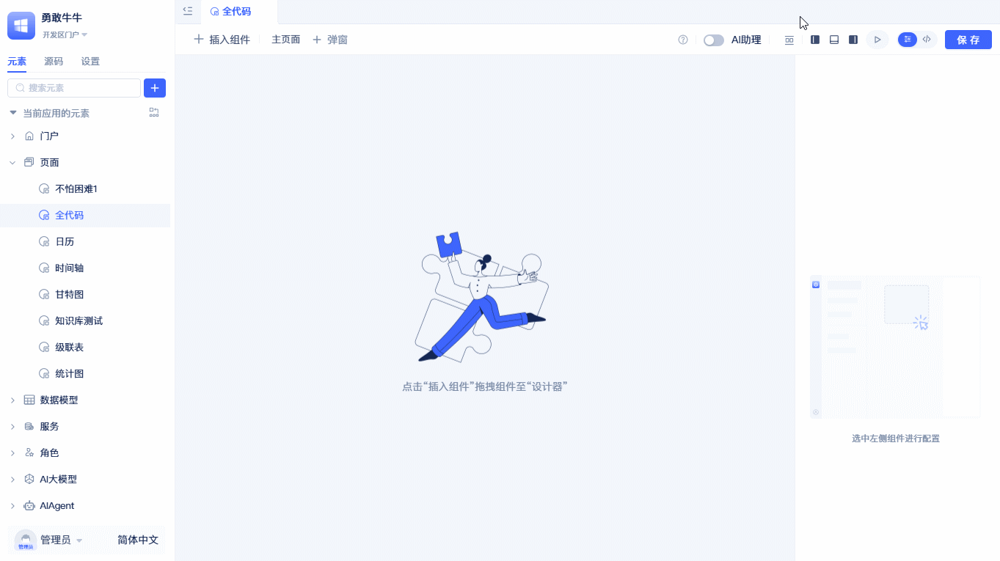

import Tabs from '@theme/Tabs';
import TabItem from '@theme/TabItem';

# 全代码组件

全代码组件是一种特殊类型的组件，它可以实现任何功能，但需要编写完整的组件逻辑；通过自定义界面、逻辑、样式及对模型数据的各种操作来扩展功能。全代码组件基于 React 开发，因此需要熟悉 React 开发知识。

:::tip
与自定义组件类型不同的是，全代码组件的适用范围是当前页面，而自定义组件类型可以在多个页面中重复使用。全代码组件适合一些快速验证，需求灵活多变的场景。
:::

## 创建全代码组件 {#create-full-code-components}

在可视化页面编辑器中选择全代码组件，将全代码组件拖拽到页面画布中，就生成了一个全代码组件。生成的组件文件为 `BlankComponent2.tsx`，界面上展示一个居中的"Click Me!"按钮；点击后会触发 `handleClickMe` 事件，并通过 `message.success` 弹出"so cool !!!"。

## 开发指南

创建全代码组件后，你可以：

- 自定义组件的界面和交互逻辑
- 调用页面上其他组件的方法和数据
- 发布和订阅事件实现组件间通信
- 在页面代码中调用全代码组件的函数

## 详细开发文档

要了解全代码组件的详细开发方法和技术细节，请参考：

- [全代码组件接口规范](../fullcode-ui-components-in-pages/ui-component-interface-specifications) - 了解组件的基本结构和接口
- [在全代码组件中调用页面和组件函数](../fullcode-ui-components-in-pages/calling-page-and-component-functions-in-fullcode-components) - 学习如何调用其他组件
- [发布和订阅事件](../fullcode-ui-components-in-pages/emitting-events) - 掌握组件间的事件通信
- [在页面代码中调用全代码组件函数](../fullcode-ui-components-in-pages/calling-fullcode-component-functions-in-page-code) - 学习从页面调用组件方法
