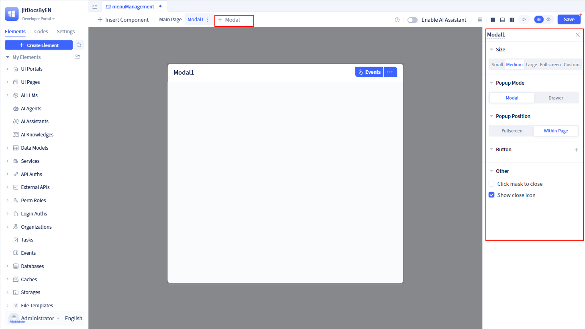
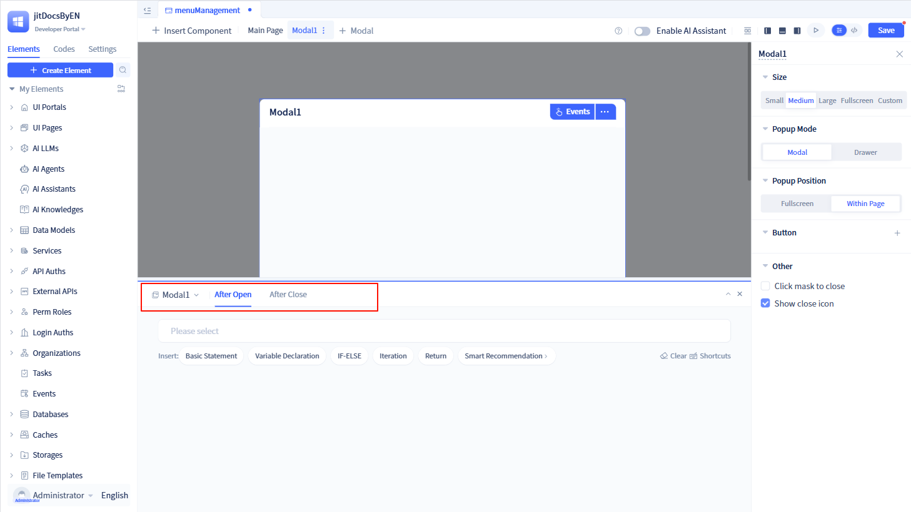
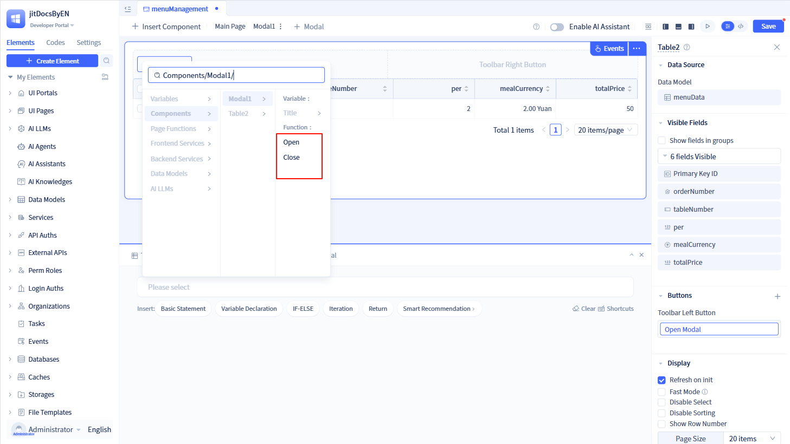
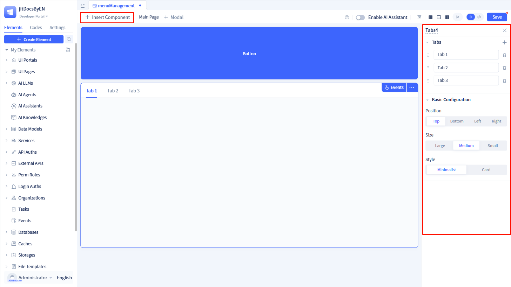
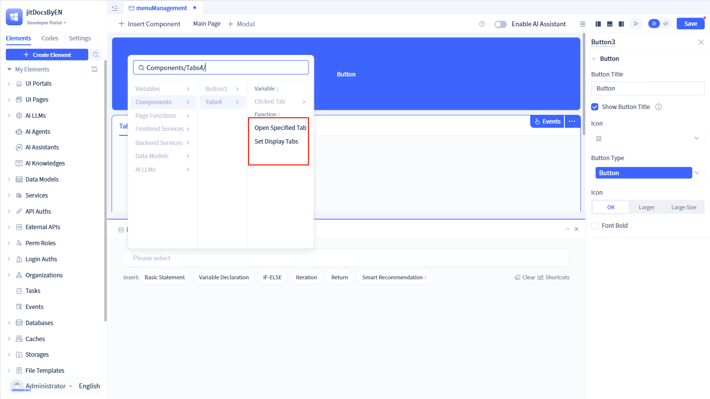
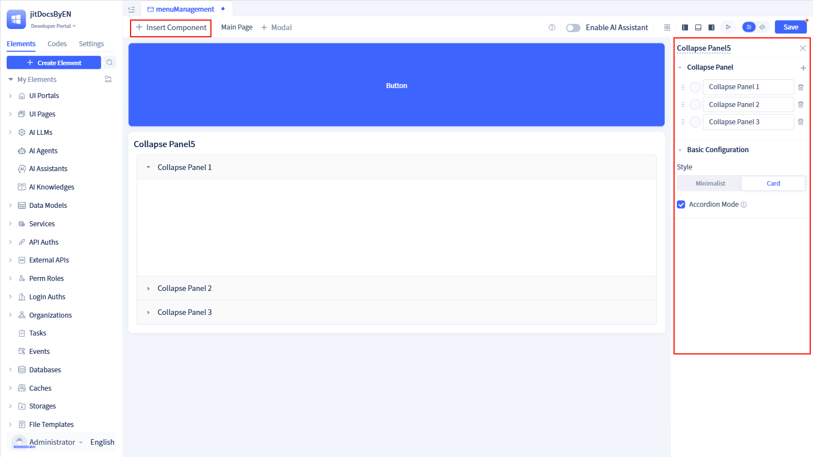
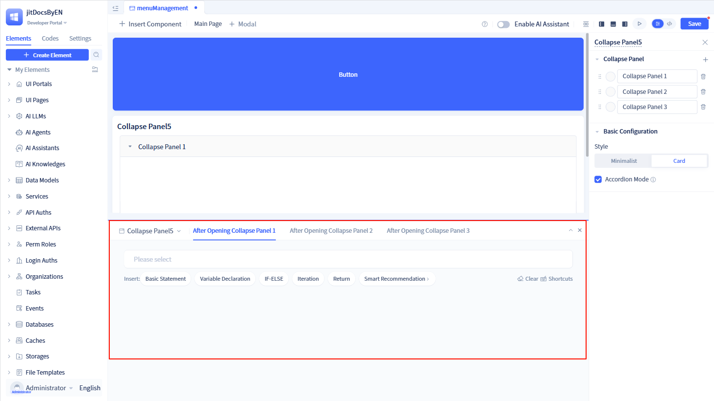
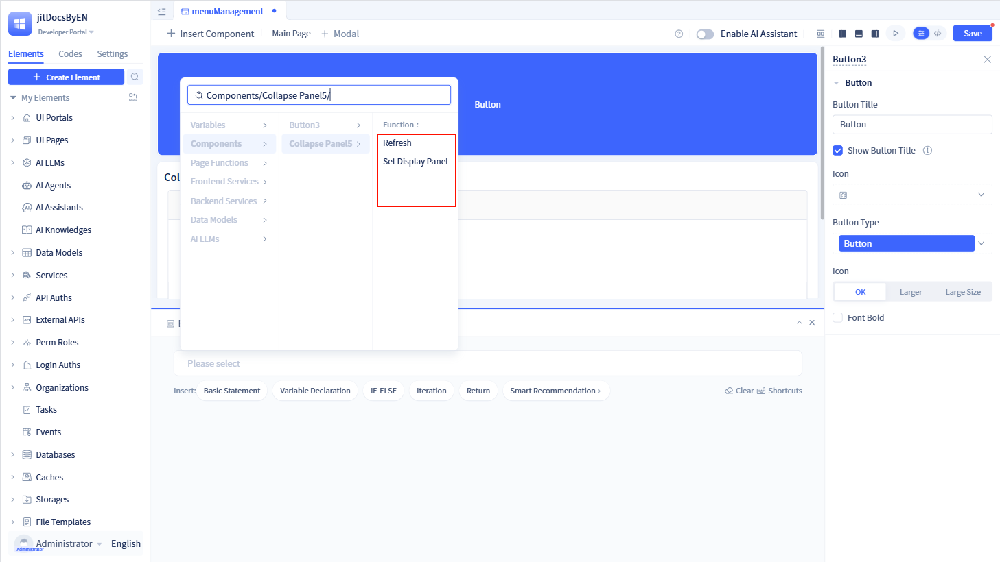
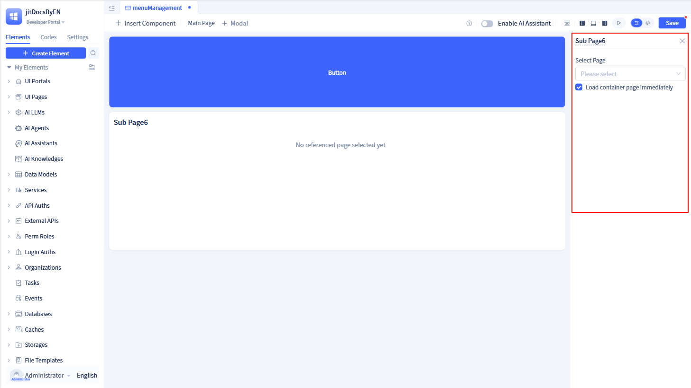
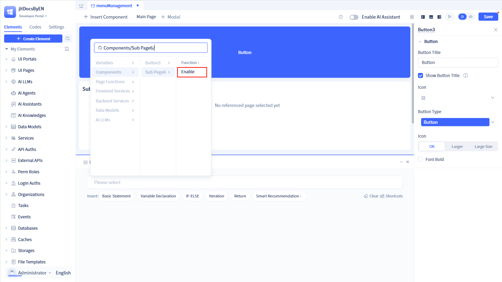

# Layout Components

## Popup components {#popup-components}

Popup components are one of the most commonly used layout components in web application development. They are primarily used to display temporary information or to provide interfaces for creating and editing data.

In JitAI, popups support both standard dialog popups and side-drawer style popups. You can choose whether the popup appears within the current page or as a full-screen overlay. In addition, you can configure common behaviors such as predefined popup sizes, whether clicking the mask closes the popup, and event logic that runs when the popup opens and closes.

### Popup component configuration {#popup-components-configuration}

Within a popup component, you can configure the preset size of the popup, how it opens, the mask style, how it is closed, the popup buttons, and the event logic for when the popup opens and closes.

Click the `+ Modal` button on the page to open the popup component configuration page. By default, the popup size is set to `Medium`, the open method is `Modal`, the popup position is `Within Page`, and the open/close event logic is empty.

### Popup interaction design {#popup-components-interaction-design}

The popup component provides two built-in events: `After Open` and `After Close`. You can implement custom logic for both events. The `After Open` event is triggered after the popup opens, while the `After Close` event is triggered after the popup closes.

In addition, the popup component exposes two functions, `Open` and `Close`. You can call these functions to programmatically open and close the popup.

## Tab components {#tab-components}

Tab components are used to display multiple tabs within a page and switch between them to show different content.

### Tab component configuration {#tab-components-configuration}

Within a tab component, you can configure the title of each tab, as well as the position, size, and style of the tabs.

Click the `+ Insert Component` button on the page and drag the "Tabs" component onto the page. By default, the component contains three tabs. The tab position is set to `Top`, the size is `Medium`, and the tab style is `Minimalist`.

### Tab interaction design {#tab-components-interaction-design}

Each tab in the tab component has a click event. When you click a tab, the corresponding click event logic is triggered.

In addition, the tab component provides two functions: `Open Specified Tab` and `Set Display Tabs`. You can call these functions to open a specific tab and control which tab is currently displayed.

## Collapse components {#collapse-components}

Collapse components are used to display multiple panels on a page, allowing users to expand or collapse panels to view different sections of content.

### Collapse component configuration {#collapse-components-configuration}

Within a collapse component, you can configure each panel's title and background color, as well as the overall style of the collapse component and whether to enable accordion mode.

Click the `+ Insert Component` button on the page and drag the "Collapse Panel" component onto the page. By default, the component contains three panels. The panel background color is `#fafafa`, the component style is `Card`, and accordion mode is enabled by default.

### Collapse interaction design {#collapse-components-interaction-design}

Each panel in the collapse component has a click event. When you click a panel, the corresponding click event logic is triggered.

In addition, the collapse component provides two functions: `Refresh` and `Set Display Panel`. You can call these functions to refresh a specific panel and open a specified panel.

## Subpage components {#subpage-components}

When a page needs to be displayed inside another page, you can use a subpage component. First, treat the page to be displayed as a subpage. Then, add a subpage component to the parent page and configure which target page the subpage component should load.

Click the `+ Insert Component` button on the page and drag the "Sub Page" component onto the page. By default, the subpage component has no target page configured, so no content is displayed inside it. Select a page in the configuration panel on the right to display that page as a subpage within the current page.

By default, the subpage component enables `Load container page immediately`, meaning that once the subpage component is added to the parent page, it immediately loads the subpage content. You can also disable `Load container page immediately` and use the `Enable` function provided by the subpage component to load the subpage manually.

