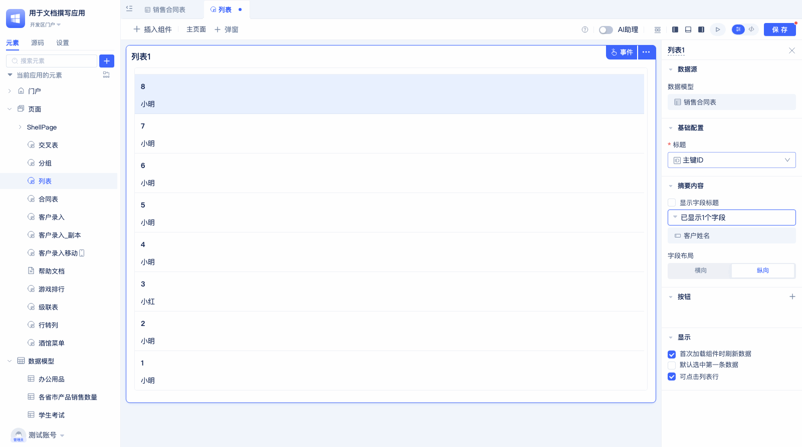
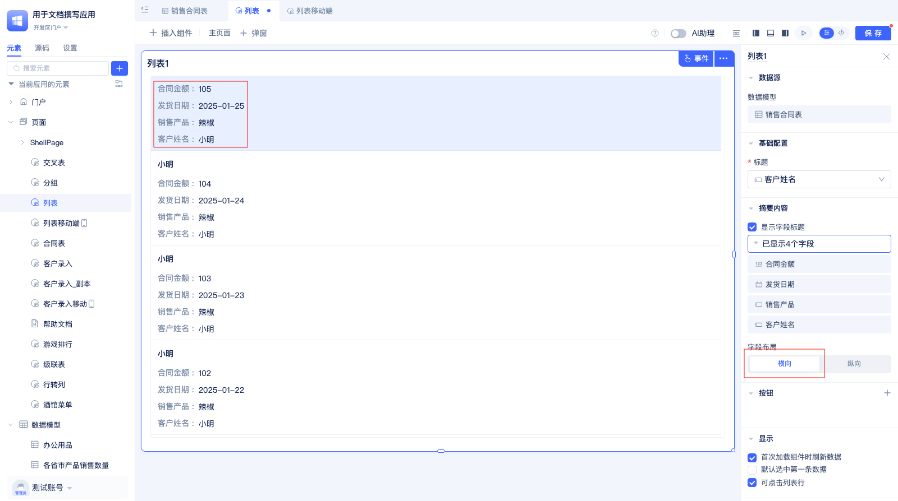
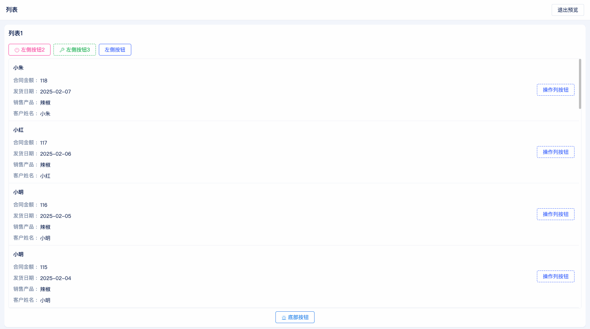
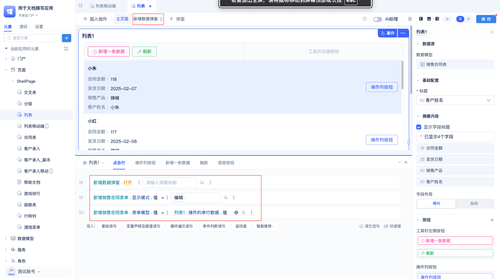

# 列表组件
列表组件以列表形式展示数据，支持标题、摘要、按钮等灵活配置，适用于各类列表展示场景，如新闻列表、消息列表、任务列表等，比如在企业管理系统中展示员工信息。

## 配置列表标题 {#configure-list-title}
在[页面编辑器](../shell-and-page/generic-page#visual-page-editor)中拖入列表组件后，会默认使用数据表模型中的第一个字段作为字段标题。用户可以按照下面操作修改标题：

点击当前标题字段名称，在下拉框中选择新的字段作为标题。

## 设置摘要内容 {#set-summary-content}
列表组件会默认将除主键id外的第一个字段设为摘要内容。用户可以根据实际需求重新配置摘要内容，支持多选。

点击配置区`摘要内容`栏下的`已显示X个字段`，在左侧弹出的面板中，勾选要展示的摘要字段。

## 摘要中显示字段标题 {#show-field-titles-in-summary}
列表组件默认不会勾选 `显示字段标题`。

用户可在摘要内容配置栏下勾选 `显示字段标题`。

## 设置摘要内容布局 {#set-summary-content-layout}
列表组件默认采用纵向布局。在此布局下，字段标题和内容上下排列：

用户可在`字段布局`配置栏中切换布局方向为`横向`， 这样标题和内容就会左右排列：

## 列表组件按钮 {#list-component-button}
JitAI不仅可以展示列表，还可以为列表添加按钮来增强交互能力。列表组件的按钮分为以下三种类型：
工具栏按钮，底部按钮，操作列按钮。

### 添加按钮 {#add-button}

点击配置区中 `按钮`右侧的 `+`按钮，在弹出框中选择按钮类型，弹出配置按钮属性的对话框。

在对话框中，可设置按钮名称，图标，按钮类型和按钮颜色。点击`确定`按钮，即可在编辑区预览按钮。

### 修改按钮属性 {#modify-button-attributes}
在配置完按钮后，开发者可以二次修改按钮属性：

在配置区按钮列表中，点击按钮名称，在弹出的按钮配置的对话框中重新设置按钮属性。

### 按钮收起到更多 {#button-collapse-to-more}
当按钮太多时，可以把按钮收起到`更多`按钮中，让页面更简洁。

鼠标放到按钮名称上，按钮右侧出现按钮操作图标，点击`收起至更多`。即可将按钮收起。

### 按钮拖拽排序 {#button-drag-sort}
JitAI支持拖拽调整按钮顺序。

鼠标放到按钮列表的按钮上，按钮右侧会弹出操作图标，鼠标放到最后一个图标上，鼠标变成 ✛ 后拖拽调整按钮顺序。

### 设置底部按钮大小 {#set-bottom-button-size}
添加底部按钮后，会在配置区出现`底部按钮大小`的配置项。默认大小为`中`，用户可以自行调整为其他大小。

## 首次加载组件时刷新数据 {#refresh-data-on-first-component-load}
 本配置项是指页面上列表渲染完后，是否走查询接口获取数据。默认勾选，当需要跟[筛选器](./filter-components)配合使用时，可不勾选，在筛选器组件中调用列表的刷新方法根据筛选条件更新数据。

## 是否启用点击行事件 {#enable-row-click-event}
本配置项用于控制点击列表行时是否触发"点击行"事件，勾选表示启用该事件，默认勾选。

本示例中，点击行时，弹窗展示操作的单行数据的客户名称的值，使用效果如下：

## 默认选中第一条数据 {#default-select-first-data}
本配置项用于在组件渲染后自动点击第一条数据，默认不勾选。

在配置区`显示`栏中，可勾选本配置，勾选后效果如下：

## 显示行间距 {#show-row-spacing}
本配置项用于控制是否以卡片显示显示列表每条数据，只在**移动端**有这个选项，默认情况下不勾选，以下边线分割列表数据。

配置区`显示`配置项下，勾选`显示行间距`。

勾选后效果：

## 列表组件事件 {#list-component-event}
事件用于处理交互逻辑，常用的场景如下：新增一条列表数据，编辑列表数据，手动刷新列表。

使用效果：

### 点击行事件 {#row-click-event}
本配置项表示点击列表中每一行后触发的事件，一般用于点击行时编辑当前行的数据。

实现这个功能需要以下几步：
1. 首先新建一个弹窗，弹窗中插入form-components，表单的[数据表模型](../data-modeling/data-table-model)和当前列表的[数据表模型](../data-modeling/data-table-model)要是同一个。
2. 在点击行事件中，配置相应的事件处理逻辑：打开弹窗，将弹窗中的表单的`显示模式`设置为`编辑`，最后将`列表的操作的单行数据的值`赋值给`弹窗中的表单的表单模型的值`。

下图是弹窗中的表单：

下面是使用效果：

### 按钮事件 {#button-event}
当开发者在配置区配置按钮后，在事件编辑区会显示对应的按钮事件。相比于`点击行`事件，`按钮`事件可以有很多个， 开发者可以通过合理的配置按钮事件实现更强大的功能。

使用效果：

## 列表组件变量/当前展示的数据行列表/当前操作的单行数据/当前筛选条件 {#list-component-variables}
列表组件提供以下变量用于访问数据和状态：当前展示的数据行列表，当前操作的单行数据，当前筛选条件。

 

## 刷新列表组件 {#refresh-list-component}

列表组件自带刷新方法，可通过按钮或者其他组件触发。

 

 在事件编辑区，点击`请选择`， 鼠标放到列表名称上，选择`刷新`方法即可。开发者可以根据需要继续设置刷新的[筛选条件](./filter-components)。

  效果如下：

