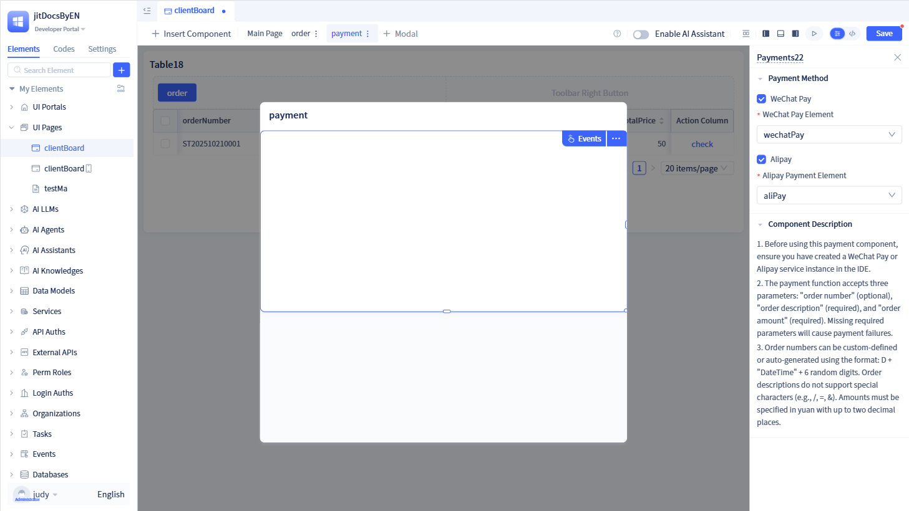
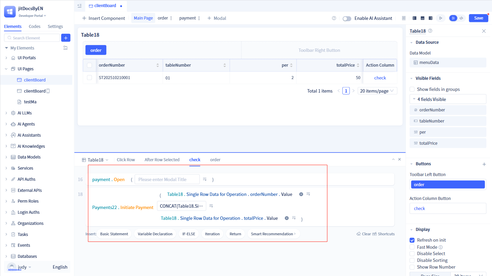
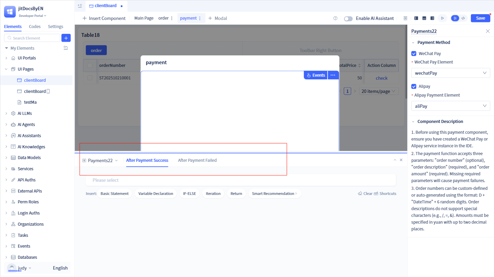
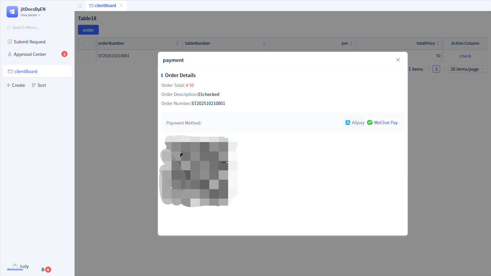

# Payment Components
Payment components are operational components that implement multi-platform payment functionality based on unified payment interfaces. They are responsible for order creation, payment process management, and status monitoring, supporting Alipay and WeChat Pay platforms while providing complete payment lifecycle management.

## Creating payment components {#payment-component-creation}

In the page visual editor, click "Insert Component" and drag the "Payment" component onto the page. Then configure the payment component parameters in the right configuration panel.

:::warning Note
When creating payment components, payment service elements must be created in advance. Please refer to [Payment Services](../third-party-integration/payment-service) for details.

Before using payment components, you need to invoke the payment component functions.
:::

## Initiate payment function {#initiate-payment-function}
Payment components provide an "Initiate Payment" function for triggering payment processes.

This function accepts three parameters: order number, order description, and order amount. The order number is optional, but order description and order amount are required; otherwise, payment exceptions will occur.

The logic for invoking this function must be configured in the event configuration of its parent component. For example, when using tables and payment components together, configuration is required in the table's event logic.

## Event logic {#event-logic}
Payment components provide after payment success and after payment failure events for handling post-payment success and failure logic.

Configure the relevant logic in the payment component's event logic. For example, event logic such as printing receipts after successful payment.

## Component usage {#component-usage}
After creating payment components in the visual editor and configuring related events, you can initiate payments on the page.

In the usage area, clicking the "Payment" button in the table triggers the payment component's payment logic and opens the payment page. After selecting a payment method on the payment page, the payment QR code refreshes. When users scan the code to pay, it triggers the payment component's after payment success or after payment failure event logic.
