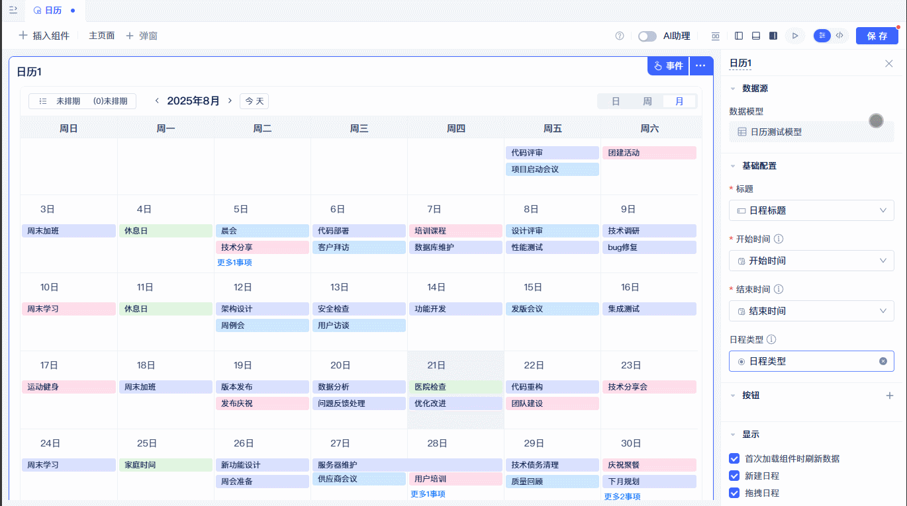
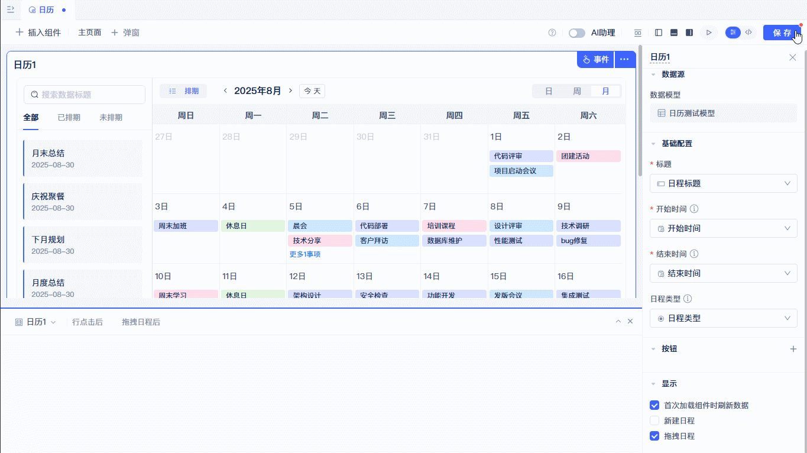

# 时间管理组件
## 日历 {#calendar}
以日历形式展示你的数据，按时间线组织和管理信息，直观显示任务、会议、活动等时间相关事项。支持拖拽、点击等便捷交互操作，常见于OA系统、项目管理及预约类应用。

### 数据模型准备及组件创建 {#data-model-preparation-and-component-creation}

日历组件的数据模型，需要配置开始时间、结束时间及标题。开始时间和结束时间配置项的字段类型项必须是日期/日期时间，标题配置项的字段类型必须是单行文本/手机/流水号/身份证/选项单选/下拉单选/车牌号/自增整数，日程类型配置项的字段类型必须是下拉框单选/选项组单选。准备好对应配置项的字段，即可到可视化页面编辑器中创建日历组件。
:::warning
开始时间和结束时间配置项必须是同一种类型，即全是日期或日期时间。
:::

在可视化页面编辑器中选择日历组件，将日历组件拖拽到页面画布中，会弹出选择数据模型弹窗，在弹窗中配置数据模型，点击确定，在右侧组件配置标题、开始时间、结束时间，这三个配置项是必填配置。
### 基础配置 {#basic-configuration}

日历组件显示的文字会对应标题配置项，文字的开始结束位置分别由开始时间和结束时间配置项控制。

### 日程类型 {#schedule-type}

配置日程类型，可以改变任务背景展示颜色，日程类型对应的字段颜色，在[数据模型配置](../data-modeling/data-table-model#design-table-fields-and-data-types)中修改。

### 日/周/月视图切换 {#day-week-month-view-switch}

日历组件支持三种不同的视图：日/周/月，可以在右上角进行切换，组件初始化时默认显示月视图。

### 切换时间 {#switch-time}

点击日历组件左上角时间两端的"箭头"按钮，可以切换日期，查看不同日期的数据，切换日期的跨度与当前视图匹配，即日视图为日，周视图为周，月视图为月。点击"今天"按钮，可快速跳转到今天对应的日期。

### 列表展示及搜索 {#list-display-and-search}

点击左上角排期按钮，可以打开列表面板，数据分为全部数据、已排期、未排期，顶部输入框支持搜索。

### 拖拽排期 {#drag-schedule}

拖拽左侧列表中数据项，可以拖放到日历组件中，拖拽完成后数据会自动保存到数据模型。
:::warning
拖拽排期功能需要开启"拖拽日程"的配置
:::

### 按钮配置 {#button-configuration}

日历组件的按钮区域分为两部分，日历组件顶部的工具栏按钮以及列表视图中右侧的操作栏按钮。

按钮支持配置名称，图标，类型，颜色。

按钮支持新增、删除、修改、排序，工具栏按钮如果数量过多支持折将按钮叠到"更多"中。每添加一个按钮，就会在事件面板中生成一个按钮事件，开发者可以自己编辑事件逻辑。当事件过多不好定位时，可以点击按钮上的"小手"图标快速打开当前按钮的事件面板。

### 首次加载组件时刷新数据 {#refresh-data-on-first-component-load}
下图展示开启"首次加载组件时刷新数据"配置，组件在页面中渲染后会主动加载数据，关闭"首次加载组件时刷新数据"配置，组件渲染后不会主动加载数据。

:::tip
关闭"首次加载组件时刷新数据"配置，可配合其他事件主动调用组件的刷新。如下图：在可视化页面编辑器中，添加一个按钮组件，打开按钮事件面板，在"按钮点击后"选项卡配置日历组件的刷新函数，可以实现点击按钮后，日历组件加载数据。
:::

### 新增日程 {#new-schedule}

如果勾选"新增日程"，则在鼠标经过对应日程时会出现一个"加号"按钮，同时在事件面板中会出现"新建日程后"的事件，开发者可以自己编辑事件逻辑。如图：配置了全局提示函数，当点击加号按钮时会弹出一个"hello world"。

### 拖拽日程 {#drag-agenda}

如果勾选"拖拽日程"，则在日历中可以拖拽日程修改排期，还可以拖拽列表中的数据项添加排期，同时在事件面板中会出现"拖拽日期后"的事件，开发者可以自己编辑事件逻辑，如图：配置了全局提示函数，当拖拽结束时会弹出一个"hello world"。

## 时间轴 {#timeline}
以时间轴形式展示你的数据，按时间顺序线性组织和管理信息，直观显示项目进度、事件流程、历史记录等时序相关事项。支持滚动浏览、节点点击、状态筛选等便捷交互操作，常见于项目管理、工作流追踪、历史记录查看及进度监控类应用。

### 数据模型准备及组件创建 {#timeline-data-model-preparation-and-component-creation}

时间轴组件的数据模型，需要配置日期和内容。日期配置项的字段类型项必须是日期/日期时间，内容配置项的字段类型没有限制，颜色类型配置项的字段类型必须是下拉框单选/选项组单选。准备好对应配置项的字段，即可到可视化页面编辑器中创建时间轴组件。

在可视化页面编辑器中选择时间轴组件，将时间轴组件拖拽到页面画布中，会弹出选择数据模型弹窗，在弹窗中配置数据模型，点击确定，在右侧组件配置日期、内容，这两个配置项是必填配置。

### 基础配置 {#timeline-basic-configuration}

时间轴组件显示的文字对应内容配置项，内容配置项可以配置多个字段，多个字段可以拖拽排序，组件中文字的先后顺序由日期配置项控制，同时日期也会显示在时间轴上。

### 颜色类型 {#color-type}

配置颜色类型，可以改变时间轴上节点的颜色，颜色类型对应的字段颜色，在[数据模型配置](../data-modeling/data-table-model#design-table-fields-and-data-types)中修改。

### 位置 {#position}

位置配置项支持左/中/右三种位置，默认为左，修改位置会改变组件在渲染容器中的位置。

### 按钮配置 {#timeline-button-configuration}

时间轴组件的按钮区域分为两部分，组件顶部的工具栏左侧以及组件顶部工具栏右侧。

按钮支持配置名称，图标，类型，颜色。

按钮支持新增、删除、修改、排序，工具栏按钮如果数量过多支持折将按钮叠到"更多"中。每添加一个按钮，就会在事件面板中生成一个按钮事件，开发者可以自己编辑事件逻辑。当事件过多不好定位时，可以点击按钮上的"小手"图标快速打开当前按钮的事件面板。

### 首次加载组件时刷新数据 {#timeline-refresh-data-on-first-component-load}
下图展示开启"首次加载组件时刷新数据"配置，组件在页面中渲染后会主动加载数据，关闭"首次加载组件时刷新数据"配置，组件渲染后不会主动加载数据。

:::tip
关闭"首次加载组件时刷新数据"配置，可配合其他事件主动调用组件的刷新。如下图：在可视化页面编辑器中，添加一个按钮组件，打开按钮事件面板，在"按钮点击后"选项卡配置时间轴组件的刷新函数，可以实现点击按钮后，时间轴组件加载数据。
:::

## 甘特图 {#gantt-chart}
以时间轴形式展示数据，集成日历的多时间视图功能，可视化任务时间线、进度和层级依赖关系。支持拖拽调整时间、多维度视图切换（日/周/月/季/年）等交互操作，适用于项目管理、任务协调、资源规划及进度监控等场景。

### 数据模型准备及组件创建 {#gantt-data-model-preparation-and-component-creation}

甘特图组件的数据模型，需要配置开始时间、结束时间及标题。开始时间和结束时间配置项的字段类型必须是日期/日期时间，标题配置项的字段类型支持除了关联字段和子表的其他所有类型。准备好对应配置项的字段，即可到可视化页面编辑器中创建时间轴组件。
:::tip
在甘特图中显示进度，需要预留一个百分比字段，后续在进度配置项中进行配置。如果需要甘特图按层级展示，要配置一个关联当前数据模型的关联字段。如果要显示任务的先后顺序，也要配置一个关联当前数据模型的关联字段。
:::

在可视化页面编辑器中选择甘特图组件，将甘特图组件拖拽到页面画布中，会弹出选择数据模型弹窗，在弹窗中配置数据模型，点击确定，在右侧组件配置标题，开始时间、结束时间，这三个配置项是必填配置。

### 基础配置 {#gantt-basic-configuration}

甘特图组件的标题会显示在左侧列表中和任务条上，开始时间和结束时间会控制任务条的长度。

### 进度 {#progress}

进度配置项被配置后，会体现在甘特图的任务条中，任务条长度根据开始时间和结束时间进行计算，整体背景颜色较浅，进度所占百分比的长度颜色较深，任务条中还会显示具体的进度数值。

### 层级关系 {#hierarchical-relationship}

层级关系字段配置后，甘特图将依次从最顶层开始展示，并会在列表的右侧显示一个"三角"图标，用于展开子层级。在获取第一层数据时，默认会添加一个过滤条件，即层级关系对应的字段为空，表示是顶层数据。点击"三角"图标，会获取当前层级关联的子层级数据，并展开。

### 先后关系 {#sequential-relationship}

先后关系字段配置后，会在任务条中出现关系线，用来表示任务之间的先后顺序。

### 日/周/月/季/年视图切换 {#gantt-view-switch}

甘特图组件支持五种不同的视图：日/周/月/季/年，可根据任务实际的时间范围选择适合的视图，同时在组件的右上角提供了快速切换不同视图的下拉框。

### 列表显示字段 {#list-display-fields}

列表显示字段用于配置列表中显示哪些字段，默认为空，当未配置列表显示字段配置项时，列表会显示标题字段，配置列表显示字段配置项后，列表会按配置的字段进行展示，支持多个字段，支持拖拽排序。配置对应的字段类型需为单行文本/流水号/身份证/手机/车牌号/自增整数/选项单选/下拉单选/数字/百分比/金额/日期/日期时间/时间中的一个或多个。

### 浮层显示字段 {#floating-layer-display-fields}

浮层显示字段用于配置鼠标经过任务条时，浮层中显示哪些字段，默认为空，当未配置浮层显示字段配置项时，浮层会显示标题字段，配置浮层显示字段配置项后，浮层会按配置的字段进行展示，支持多个字段，支持拖拽排序。配置对应的字段类型需为单行文本/流水号/身份证/手机/车牌号/自增整数/选项单选/下拉单选/数字/百分比/金额/日期/日期时间/时间中的一个或多个。

### 按钮配置 {#gantt-button-configuration}

甘特图组件的按钮区域分为两部分，甘特图组件顶部的工具栏按钮以及浮层中底部的操作按钮。

按钮支持配置名称，图标，类型，颜色。操作按钮还额外支持配置过滤条件，只有满足过滤条件的数据才会显示在操作栏按钮中。

按钮支持新增、删除、修改、排序，工具栏按钮如果数量过多支持折将按钮叠到"更多"中。每添加一个按钮，就会在事件面板中生成一个按钮事件，开发者可以自己编辑事件逻辑。当事件过多不好定位时，可以点击按钮上的"小手"图标快速打开当前按钮的事件面板。

### 首次加载组件时刷新数据 {#gantt-refresh-data-on-first-component-load}
下图展示开启"首次加载组件时刷新数据"配置，组件在页面中渲染后会主动加载数据，关闭"首次加载组件时刷新数据"配置，组件渲染后不会主动加载数据。

:::tip
关闭"首次加载组件时刷新数据"配置，可配合其他事件主动调用组件的刷新。如下图：在可视化页面编辑器中，添加一个按钮组件，打开按钮事件面板，在"按钮点击后"选项卡配置甘特图组件的刷新函数，可以实现点击按钮后，甘特图组件加载数据。
:::

### 拖拽日期进度 {#drag-date-progress}

如果勾选"拖拽日期进度"，拖拽任务条两端可单独修改开始时间或结束时间，也可以调整整个任务条，同时修改开始时间和结束时间，数据会自动同步到数据模型。在事件面板中的"拖拽日期后"选项卡中，开发者可以自己编辑事件逻辑，如图：配置了全局提示函数，当拖拽结束时会弹出一个"hello world"。

### 允许添加排期 {#allow-add-schedule}

如果勾选"允许添加排期"，当一条任务没有设置开始或结束时间，鼠标经过当前数据会出现一个加号，点击后会更新当前任务的开始时间和结束时间为当前选择的时间，数据会自动同步到数据模型。
