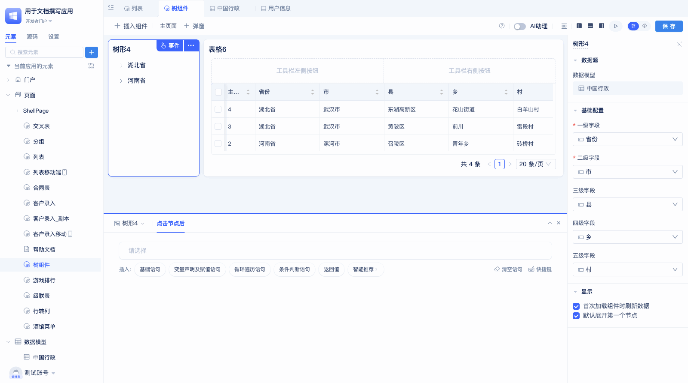

# 树组件
## 树形组件
**侧重特性：**

<!-- 
 -->

本示例的树形组件数据如下图，可以看出树形组件的层级字段为同一个数据表模型的不同字段。

### 创建树形组件

在[页面编辑器](../门户与页面开发/组件化页面开发.md#可视化页面编辑器)中拖入树形组件后，在预览区会显示配置出错，这是因为`基础配置`中的层级字段配置不全的原因。当开发者选择完层级字段后，就会按照配置正确的渲染出树形组件。

 

### 配置层级字段

鼠标点击`一级字段`下的`请选择`，在下拉框中选择一级字段。然后按照同样的操作配置其他层级的字段。树形组件要求最少配置两级字段。最多可配置5级。

使用效果：

### 树形组件首次加载组件时刷新数据

本配置项是指在页面上树形组件加载完毕后，是否立即调用接口获取数据，默认情况下会勾选本选项。当需要其他组件加载完再加载树形时，可以不勾选本选项。下面是点击按钮后手动加载树形组件数据的示例：

使用效果：

### 默认展开第一个节点

在默认情况下，树形组件渲染后所有节点都是闭合状态，勾选本选项后，会在组件渲染完后默认展开第一个节点，并展示第一个节点的下级节点：

### 点击节点后事件

当用户点击树的每一层的节点后，都会触发本事件，在本事件中可以更新其他组件的数据。一个比较常见的场景是，用树形组件展示层级关系，用表格展示详细数据，当点击树形组件后，更新表格中的数据。在这种情况下，表格和树形组件是同一个数据模型：

 

配置步骤如下：

1. 在树形组件的事件配置区的`点击节点后`事件编辑区，点击`请选择`,在弹框中选择`表格`的`刷新`方法。
2. 点击`设置筛选条件`右边的`设置`按钮（看起来像三条横线），然后选择变量值。
3. 点击`请选择`，在弹窗中选择树形的`节点的筛选条件`的`值`。
 
使用效果如下图：

## 级联树
**侧重特性：**

自关联字段：关联单选字段，`目标数据模型`和字段所处的数据表模型是同一个。

本示例所用数据如下图，每一层的数据通过`上一层级`字段关联其他数据，最顶层的数据的`上一层级`字段为空。

配置好后效果：

### 新建级联树

在[页面编辑器](../门户与页面开发/组件化页面开发.md#可视化页面编辑器)中拖入级联树后，组件会默认选择非主键id的第一个字段作为标题字段，选择第一个[自关联字段](#self-relation-field)为上级节点。

在使用级联树的时候，默认只查询第一层级的数据，当点击层级前面的`>`按钮后，会展示下一层级的数据。

### 配置节点标题

当组件默认选择的节点标题不符合用户需求时，开发者可自行修改：

点击`节点标题`下面的标题字段的名称，在下拉框中选择新的节点标题。

### 设置上级节点

当数据表模型中有多个自关联字段时，用户可根据实际需求修改上级节点字段。

 
点击`上级节点`下的字段名称，在下拉框中选择新的`上级节点`字段。

### 节点单选/多选

组件默认为单选模式，用户可根据需求设置为多选模式。

用户点击`模式`下的`单选`或`多选`进行切换。

### 级联树首次加载组件时刷新数据

本配置项是指在页面上级联树组件加载完毕后，是否立即调用接口获取数据，默认情况下会勾选本选项，使用方法与树形组件的[首次加载组件时刷新数据](#树形组件首次加载组件时刷新数据)相同，在此不再赘述。

### 级联树点击节点后事件

当用户点击级联树节点后，会触发本事件。在事件编辑区，可以获取到当前点击节点的详细数据。

可以通过如下配置在点击节点后，页面提示节点的值：

配置步骤如下：

1. 选中级联树组件，在右侧事件配置区找到`点击节点后`事件编辑区。
2. 点击`请选择`，在弹窗中选择`反馈提醒`下的`全局提醒`。
3. 点击`设置消息内容`右边的`设置`按钮，选择变量值。
4. 在弹窗中选择级联树的`操作的单行数据`中的相应字段值（如负责人的值）。

### 级联树选中节点后事件

当用户把`模式`设置为`多选`后，点击级联树中的选择框时触发本事件。

下面是一个简单的配置，可全局提示勾选的负责人信息：

配置详细步骤如下：

在事件配置区找到`选中节点后`事件，点击循环遍历语句。

点击`请选择循环的变量`。

 

选择级联树下的`选中的多行数据`的负责人。

点击循环语句内的`请选择`按钮。 

选择`反馈提醒`下的`全局提醒`。

最后，设置变量值为`遍历项`的值。

 
