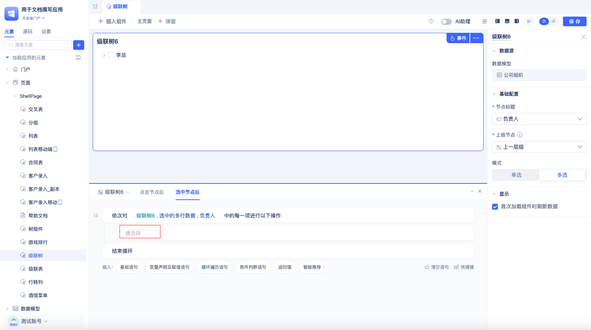

# Tree Components {#tree-components}

Tree components are primarily used to display hierarchical data structures, such as file directories, organizational structures, and product categories. They provide an intuitive visualization of parent-child relationships, supporting node expansion/collapse and selection operations, offering users a clear data navigation experience. JitAi's tree components are divided into tree form components and cascade tree components.

## Tree Form Component {#tree-form-component}

The tree form component is the most commonly used tree component, suitable for displaying multi-level data. By default, the tree form component only displays first-level data, and clicking the `>` icon will query the next level of data:

As shown in the figure below, the hierarchical fields of the tree form component all come from different fields of the same data table model.

### Creating Tree Form Component {#create-tree-form-component}

After dragging the tree form component into the page editor, the preview area will display a configuration error. This is because the hierarchical field configuration in `Basic Configuration` is incomplete. Once developers select the hierarchical fields, the tree form component will render correctly according to the configuration.

 

### Configuring Hierarchical Fields {#configure-hierarchy-fields}

Click on `Please Select` under `First Level Field`, then choose the first level field from the dropdown. Follow the same operation to configure fields for other levels. The tree form component requires at least two levels of fields to be configured, with a maximum of 5 levels.

Usage effect:

### Tree Form Component Refresh Data on First Load {#tree-form-refresh-on-first-load}

This configuration option determines whether the tree form component immediately calls the API to fetch data after loading on the page. By default, this option is checked. When you need other components to load before the tree form, you can uncheck this option. Below is an example of manually loading tree form component data after clicking a button:

Usage effect:

### Default Expand First Node {#default-expand-first-node}

By default, all nodes in the tree form component are in a collapsed state after rendering. After checking this option, the first node will be expanded by default after component rendering, displaying the child nodes of the first node:

### Click Node Event {#click-node-event}

This event is triggered when clicking on any level of node in the tree component, which can be used to update data in other components. Common application scenarios: using tree form components to display hierarchical relationships, using tables to display detailed data, and updating table content when clicking tree nodes. In this scenario, the tree form component and table need to use the same data table model:

 

Configuration steps:

1. In the tree form component's event configuration area, in the `Click Node` event editing area, click `Please Select`, then choose the table's `Refresh` method in the popup.
2. Click the `Settings` button (which looks like three horizontal lines) to the right of `Set Filter Conditions`, then select variable values.
3. Click `Please Select`, then choose the `Value` of the tree's `Node Filter Conditions` in the popup.
 
Usage effect as shown below:

## Cascade Tree {#cascade-tree}

The cascade tree component is similar to the tree form component and is also used to display hierarchical data. The difference from the tree form component is the data structure used. As shown in the figure below, the data model needs to have a self-relation field.

### Self-Relation Field {#self-relation-field}

A relation single-select field where the `Target Data Model` and the data table model where the field is located are the same.

The data used in this example is shown in the figure below. Each level of data is associated with other data through the `Previous Level` field, and the `Previous Level` field of the top-level data is empty.

Configuration effect:

### Creating Cascade Tree {#create-cascade-tree}

After dragging the cascade tree into the page editor, the component will default to selecting the first field that is not the primary key ID as the title field, and selecting the first [self-relation field](#self-relation-field) as the parent node.

When using the cascade tree, only the first level of data is queried by default. When clicking the `>` button in front of the level, the next level of data will be displayed.

### Configuring Node Title {#configure-node-title}

When the component's default selected node title doesn't meet user requirements, developers can modify it:

Click on the title field name under `Node Title`, then select a new node title from the dropdown.

### Setting Parent Node {#set-parent-node}

When there are multiple self-relation fields in the data table model, users can modify the parent node field according to actual needs.

 
Click on the field name under `Parent Node`, then select a new `Parent Node` field from the dropdown.

### Node Single/Multiple Selection {#node-selection-mode}

The component defaults to single selection mode, and users can set it to multiple selection mode according to their needs.

Users can click `Single Selection` or `Multiple Selection` under `Mode` to switch.

### Cascade Tree Refresh Data on First Load {#cascade-tree-refresh-on-first-load}

This configuration option determines whether the cascade tree component immediately calls the API to fetch data after loading on the page. By default, this option is checked. The usage method is the same as the tree form component's [Refresh Data on First Load](#tree-form-refresh-on-first-load), and will not be repeated here.

### Cascade Tree Click Node Event {#cascade-tree-click-node-event}

This event is triggered when users click on cascade tree nodes. In the event editing area, detailed data of the currently clicked node can be obtained.

You can configure the following to prompt the node value after clicking:

Configuration steps:

1. Select the cascade tree component, find the `Click Node` event editing area in the right event configuration area.
2. Click `Please Select`, then choose `Global Reminder` under `Feedback Reminder` in the popup.
3. Click the `Settings` button to the right of `Set Message Content`, then select variable values.
4. In the popup, select the corresponding field value (such as the person in charge) from the cascade tree's `Operation Single Row Data`.

### Cascade Tree Select Node Event {#cascade-tree-select-node-event}

This event is triggered when users set `Mode` to `Multiple Selection` and click the selection box in the cascade tree.

Below is a simple example that can globally prompt the selected person in charge information after node selection:

Detailed configuration steps:

Find the `Select Node` event in the event configuration area, click on the loop traversal statement.

Click `Please Select Loop Variable`.

 

Select the person in charge from the cascade tree's `Selected Multiple Row Data`.

Click the `Please Select` button inside the loop statement. 

Select `Global Reminder` under `Feedback Reminder`.

Finally, set the variable value to the value of `Loop Item`.
