# 发起节点配置

发起节点是默认生成的节点，有且仅有一个，是发起人需要处理的节点，即当流程发起时加载的节点就是发起节点。

### 流程撤销功能

当某个审批流程发起后，允许发起人手动结束。当发起人点击“撤销流程”后，将撤回所有待办，流程撤销。

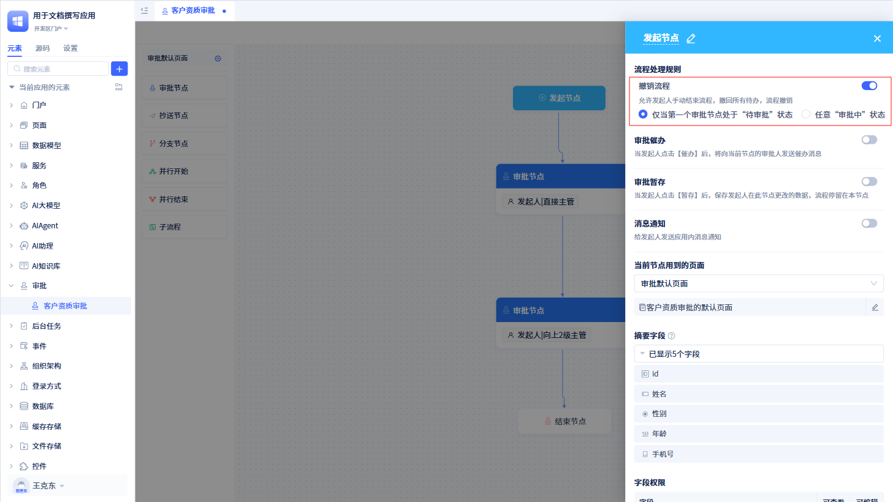

撤销流程默认只有当第一个审批节点还处于“待审批”的状态下才能撤销，可以调整为任意“审批中”的状态下都可以撤销。

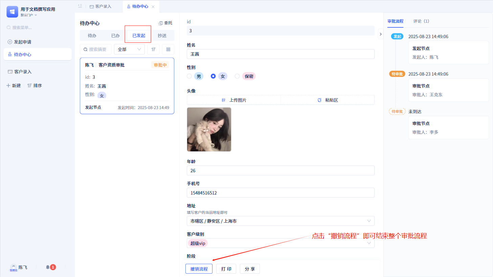

当开发者开启“撤销流程”功能后，发起人在“待办中心”的“已发起”标签下找到对应的流程，点击`撤销流程`按钮，即可撤销整个流程。

### 审批催办

当发起人发起一个审批单后，想督促审批人进行审批。此时就可以配置催办功能。

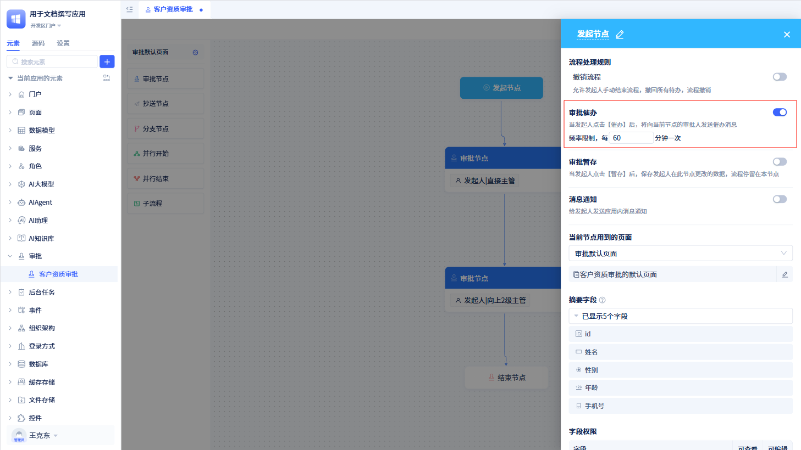

当开发者开启“审批催办”功能后，在待办中心”的“已发起”标签下的流程卡片会出现`催办`按钮。

同时可以限制催办的频率限制，默认 60 分钟，即如果两次催办间隔小于 60 分钟，则不会为最近审批人发送催办消息。

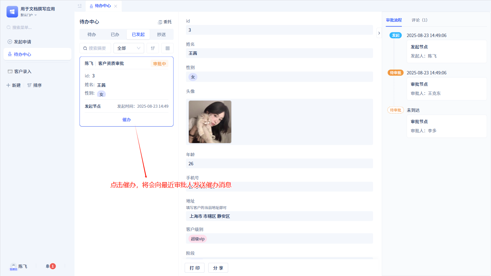

发起人点击`催办`按钮后，系统会向当前审批人发送催办消息，并记录催办时间。

### 审批暂存

当发起人在填写申请时，需要暂离填写，可以通过“暂存”功能保存填写内容，待填写完成后，再通过“提交”功能提交申请。

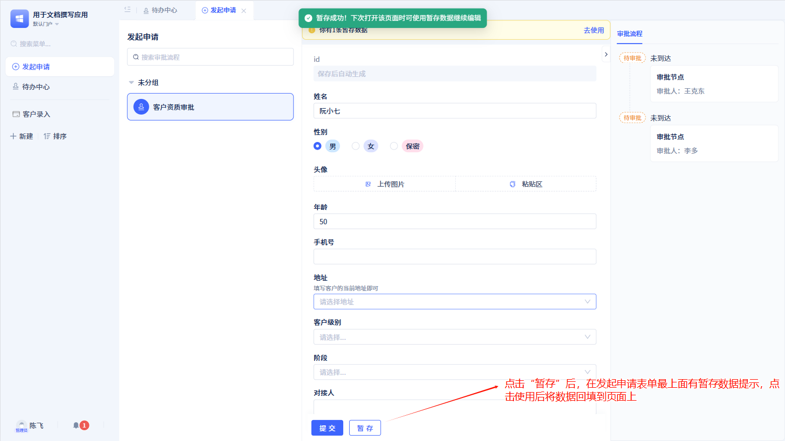

当发起人开启“审批暂存”功能后，在“发起申请”页面中会出现`暂存`按钮。点击`暂存`后，审批数据在数据表中保存为草稿状态，整个审批流程暂留在本节点。发起人再次打开申请页面，在页面最上方有一个“草稿”标签，点击该标签可查看暂存数据。

### 消息通知

当开发者开启“消息通知”功能后，系统会向发起人发送消息提醒。

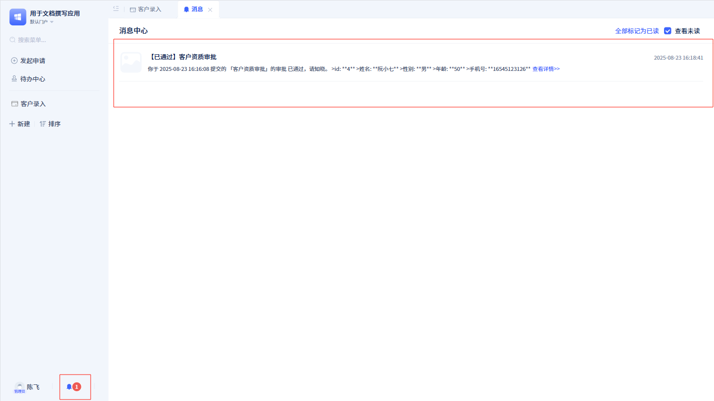

如果当前审批流程通过或被驳回后，发起人能在消息通知页面中会收到相应的消息。

### 当前节点用到的页面

创建审批流程后会生成一个默认的审批页面，该审批流程中所有的节点都会使用这个默认的审批页面。

开发者也可以根据不同的节点（发起节点、审批节点、抄送节点）创建不同的审批页面。如何创建自定义页面，请参考[审批页面定制](./审批页面定制.md)。

### 摘要信息显示

摘要字段主要是用于“待办中心”的“已发起”审批列表展示。

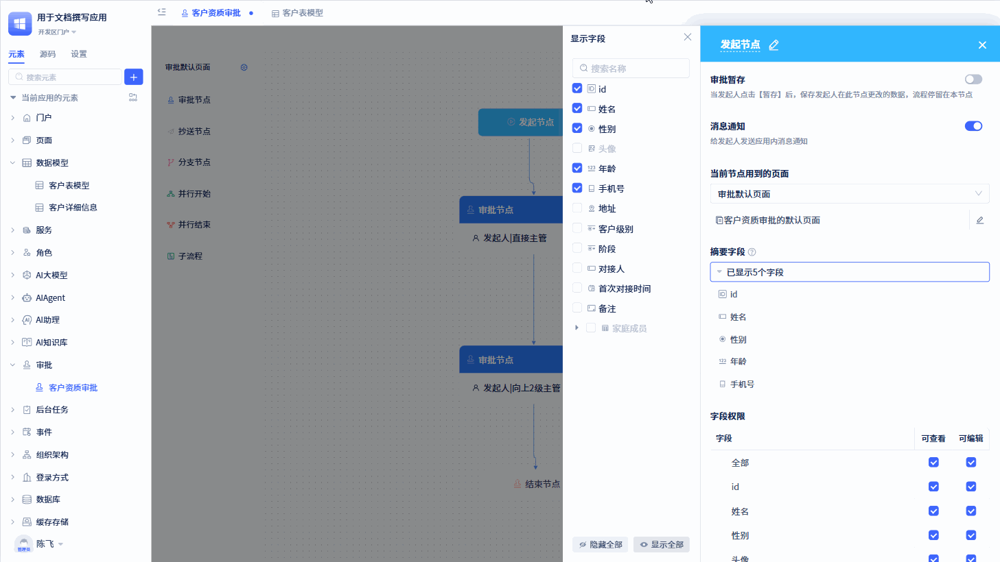

默认情况下，系统会获取数据表模型的（除图片、附件、子表外）前五个字段作为摘要信息。同时，最多也只能勾选 5 个字段，可拖拽字段卡片调整顺序。

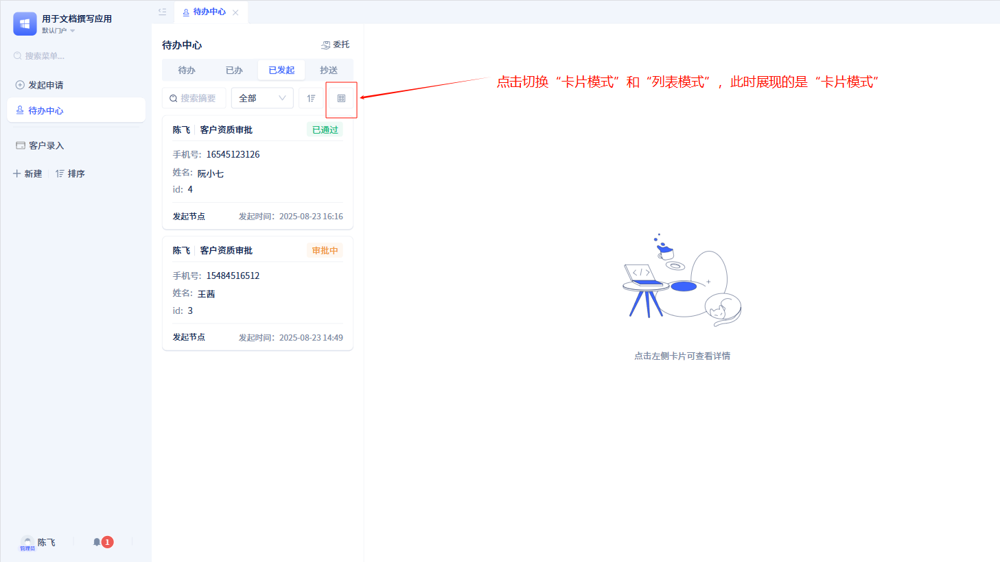
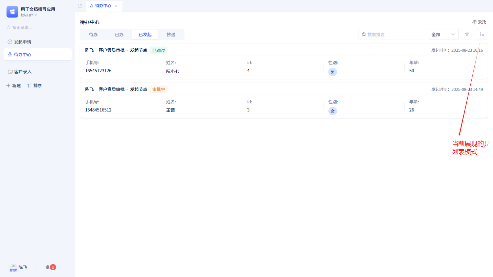

“待办中心”页面有两种展现方式：卡片模式和列表模式。在列表模式下，最多展示 5 个摘要信息。而在卡片模式下，最多展示前 3 个摘要信息。

### 字段的查看编辑权限

开发者可通过字段权限控制“发起申请”页面上的审批表单字段的查看和编辑权限。默认情况下，所有字段都处于可查看和可编辑状态。

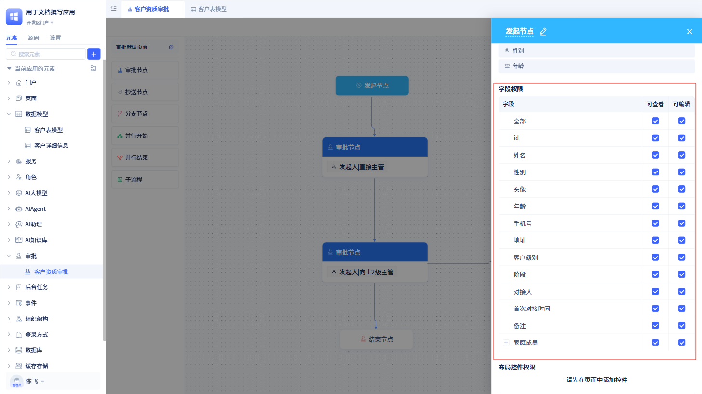

:::warning 注意

开始节点的字段权限仅对“发起申请”和“已发起”页面下的审批表单有效。

审批表单字段最终展示是同时受发起节点字段权限和表单自有的字段权限的影响。表单权限如何配置，参照[表单权限](../在页面中使用功能组件/表单组件.md#字段操作权限)。

当数据表新增某个字段后，需要先为其添加权限，再去对应的页面进行配置。

:::

### 布局控件权限

有些情况下，对于不同的节点，所展示的页面中某些布局控件可能不需要展示，此时可以使用布局控件权限进行权限控制。

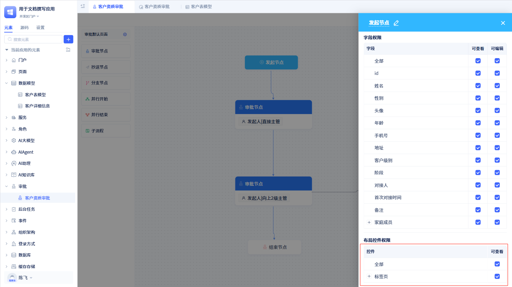

开发者可以控制当前节点下页面展示时的布局控件是否显示。默认情况下，对应的页面没有添加布局控件，需要先到对应的页面添加布局控件后才能进行权限控制。
