# 审批流程基础配置

审批流程通常是指在组织内部中，对特定事项请求进行审查和决定的一系列步骤。审批引擎通过预定义的规则、工作流和条件，从而去处理各种审批请求，如财务报销、请假申请、采购申请等。

JitAi 基于广泛的企业通用规律，实现企业审批流程的可视化构建。它集成了丰富的功能点定制选项，涵盖规则引擎、条件分支、并行分支及子流程审批流设计等高级特性。

## 创建流程

审批流程一般是根据某个业务场景来创建的，比如请假流程、报销流程、采购流程等，需要将对应的业务数据存储到某个数据表模型中。因此在创建审批流程时，需要选择关联的数据模型。

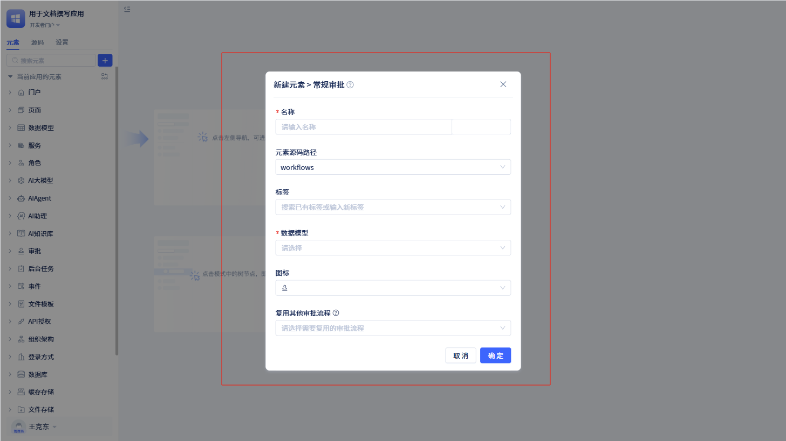

在左侧元素树上通过“审批”右侧的`+`按钮，打开新建审批流程的弹窗，填写审批流程名称和关联的数据模型，点击`保存`就创建了一个审批流程。

## 拖拽流程节点

JitAi 为开发者提供了可视化的流程配置界面，通过拖拽节点，可以快速创建流程。

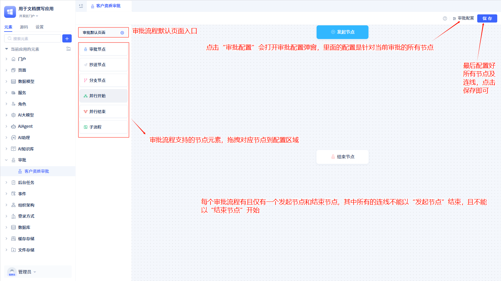

审批流程有很多审批节点，每个节点都有不同的功能。如：

**开始节点**：表示一个审批流程的开始，每个审批流程有且仅有一个开始节点。可以配置用户“发起申请”的一些配置信息。

**结束节点**：表示一个审批流程的结束，每个审批流程有且仅有一个结束节点。表示整个流程全部执行完毕。

**审批节点**：用于指定审批人员对当前审批流程进行审阅，在审批节点需要配置审批人，以及审批节点相关配置信息。

**抄送节点**：用于指定抄送人员对当前审批流程进行抄送，在抄送节点需要配置抄送人，以及抄送节点相关配置信息。

**分支节点**：用于分支判断，审批流程会根据条件返回结果流转到指定的分支路线。

**并行开始/并行结束**：用于流程的并行处理。审批流程到达并行开始节点后，会对所有的并行节点同时流转。

**子流程**：审批流程进入子流程后，会根据子流程的逻辑运行，处理完之后再返回到父流程。

:::tip 提示

一个完整的审批流程，除了开始节点和结束节点外，至少还有一个审批节点。

并行开始和并行结束节点，必须是成双成对的。
:::

## 审批流程默认页面

每个审批流程都有一个默认页面。当用户在进行发起申请、查看审批等操作时，就会进入该页面。

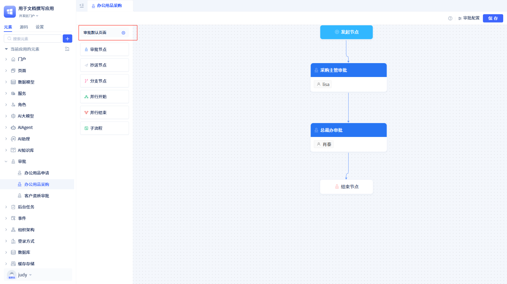

在流程配置面板中，点击左上角的`审批默认页面`，就会打开默认页面的配置面板。

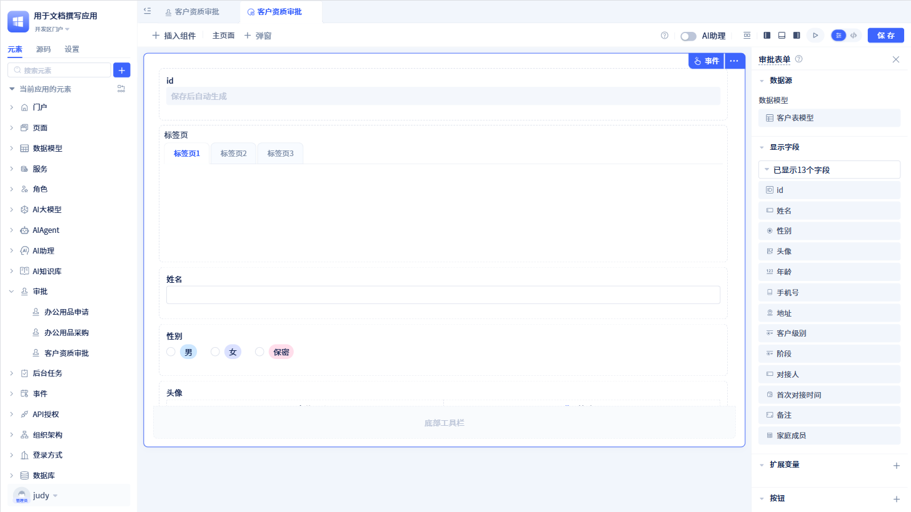

默认页面的配置面板中，可以对审批表单进行设置。

:::tip 提示

流程默认页面，默认情况下，所有节点都使用这个页面。因此，如果修改流程默认页面，那么在所有节点看到的页面都会改变。

开始节点、审批节点和抄送节点可以对页面进行定制。

审批流程默认页面生成的表单不可删除，如何操作表单，参考[表单组件](../在页面中使用功能组件/表单组件.md)

:::

## 其他流程配置

审批流程除了在页面上配置节点、页面调整外，还有其他一些配置。

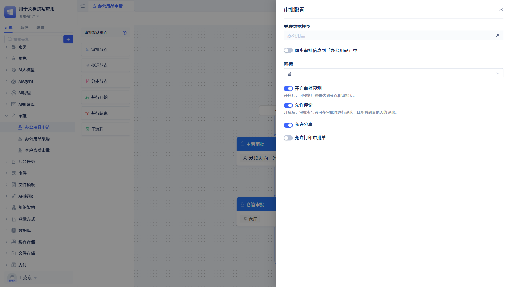

在流程配置面板中，点击右上角的`审批配置`，打开审批配置弹窗。

在配置弹窗中，我们可以查看关联数据模型、同步审批信息到对应的数据模型中、设置审批图标、是否开启审批预测功能、是否开启评论功能、是否允许分享、是否允许打印审批单等功能。

### 同步审批信息到数据表模型

为了方便用户将审批相关信息（如：发起人、发起时间、审批状态等）与业务数据结合使用、统计、分析，JitAi 允许将审批过程信息同步到开发者指定的数据表模型中。

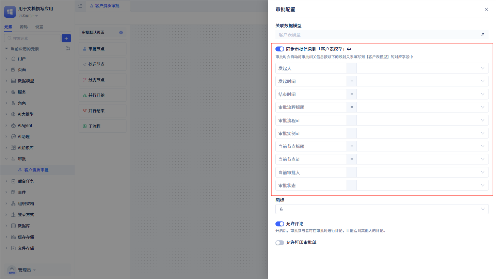

默认情况下`同步审批信息到数据表模型`呈现关闭状态，此时产生的审批信息会保存到系统自带的“审批流程实例”数据表中。如果用户想使用该功能，必须提前在数据表模型中准备好对应的字段以便存储审批相关信息，字段类型如下：

|   审批信息   |          数据表模型接收的数据类型          | 存储到模型中的时机 |
| :----------: | :----------------------------------------: | :----------------: |
|    发起人    |                  成员单选                  |     发起审批时     |
|   发起时间   |                  日期时间                  |     发起审批时     |
|   结束时间   |                  日期时间                  |     审批结束时     |
| 审批流程标题 | 单行文本、多行文本、选项组单选、下拉框单选 |     发起审批时     |
| 审批流程 id  |                  单行文本                  |     发起审批时     |
| 审批实例 id  |                    数字                    |     发起审批时     |
| 当前节点标题 | 单行文本、多行文本、选项组单选、下拉框单选 |     审批处理后     |
| 当前节点 id  |                  单行文本                  |     审批处理后     |
|  当前审批人  |             成员单选、成员多选             |     审批处理后     |
|   审批状态   | 单行文本、多行文本、选项组单选、下拉框单选 |   审批状态变更后   |

### 同步到第三方审批待办

当用户创建的应用接入了钉钉组织架构后，希望能将系统中的待办消息同步到钉钉的待办事项中。就可以在审批设置中开启`同步到第三方审批待办`功能。

当用户勾选该选项后，发起的审批就会通过钉钉的待办给对应的审批人进行同步。

:::tip 注意
该功能仅适用于钉钉组织架构接入的审批应用。若未接入钉钉组织架构，则看不到该选项。
:::

### 预测功能

当用户在发起审批或处理审批时，想知道后续流程节点的审批人，可以开启预测功能。

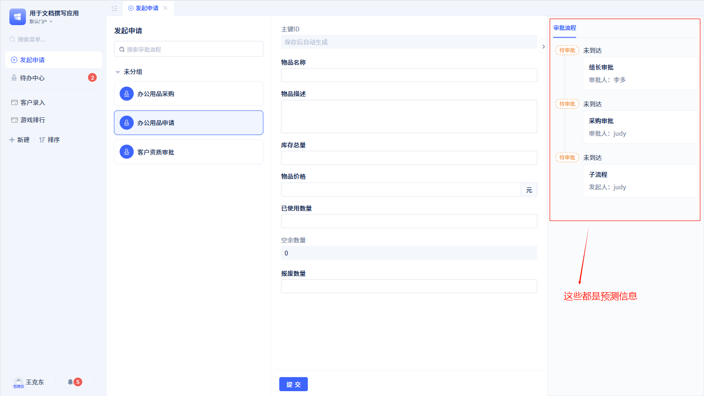

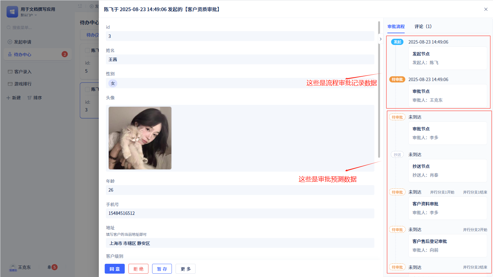

当预测功能开发后，用户在发起审批或处理审批时，都会看到后续节点的审批人。

:::warning 注意
系统默认开启预测功能。

审批预测数据也是展示在右侧的审批记录中。其中，已经流转过的节点边框为实线，且含有具体时间。未流转的节点边框为虚线，且无具体时间。

如果关闭预测功能，申请节点则不显示审批记录，审批处理节点只会显示已流转的审批记录。
:::

### 评论功能

当用户发起审批后，审批参与者可在审批时进行评论，且能看到其他人的评论。评论支持上传图片，并支持图片的预览。

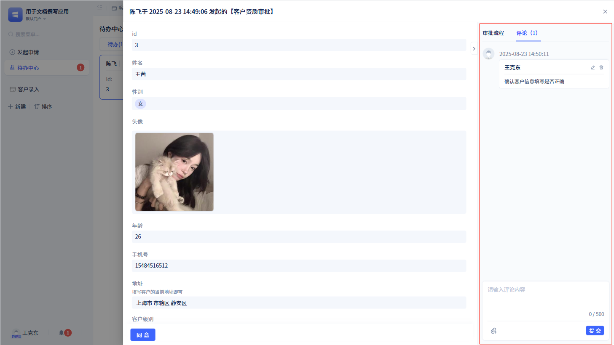

:::tip 注意
评论功能不是针对每个审批节点，而是针对整个审批流程。即只要是在同一个审批流程中，无论在哪个审批节点，用户都可以进行评论。
:::

### 分享

当用户需要对审批流程进行分享时，可以通过分享功能实现。

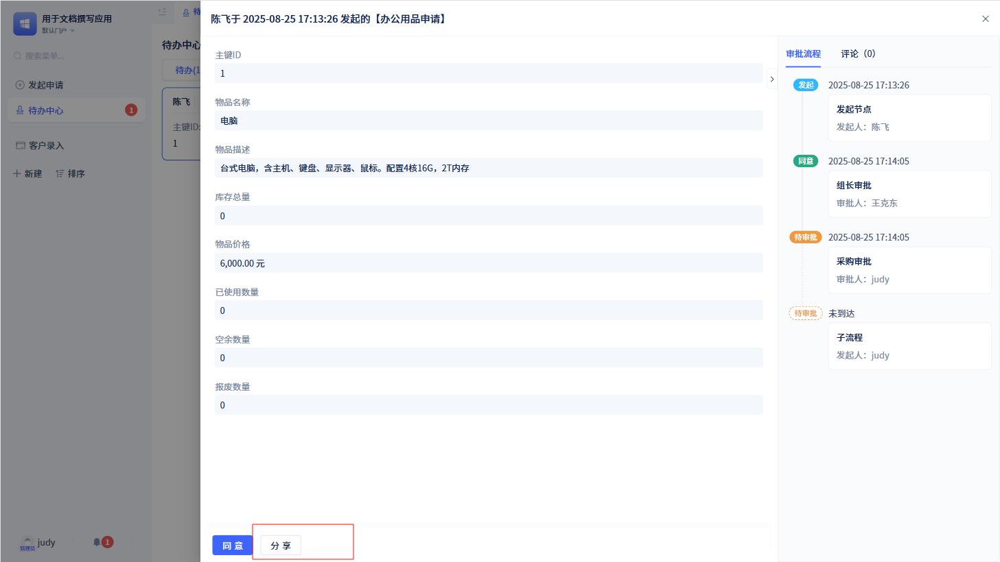

在“审批配置”弹窗中打开“允许分享”功能，那么与该审批流程相关的待办、已办、已发起、抄送的详情界面都会出现“分享”按钮。

### 打印审批单

有些用户在某些场景下需要打印审批单，此时可以通过打印功能实现。

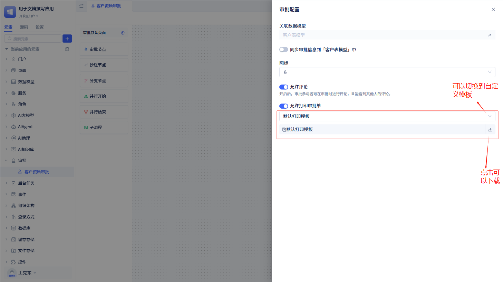

每个审批流程都有一张默认的审批单打印模板，用户可以下载默认模板进行查看。另外，用户也可以自定义打印模板，并保存为模板。

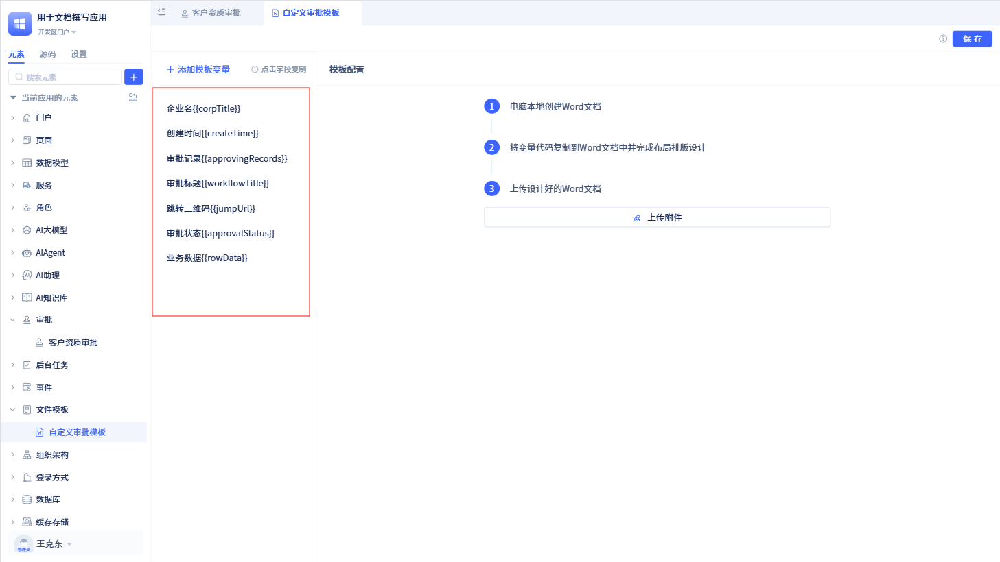

:::warning 注意
“打印审批单”也是针对整个审批流程的，即所有审批节点的审批单都使用同一套打印模板。但是不同审批节点展现的数据不同，比如节点名称、节点处理人、节点处理结果、节点处理意见、节点处理时间等等。

使用自定义打印模板，会有一些必须的参数，所设计的模板必须包含这些参数
:::

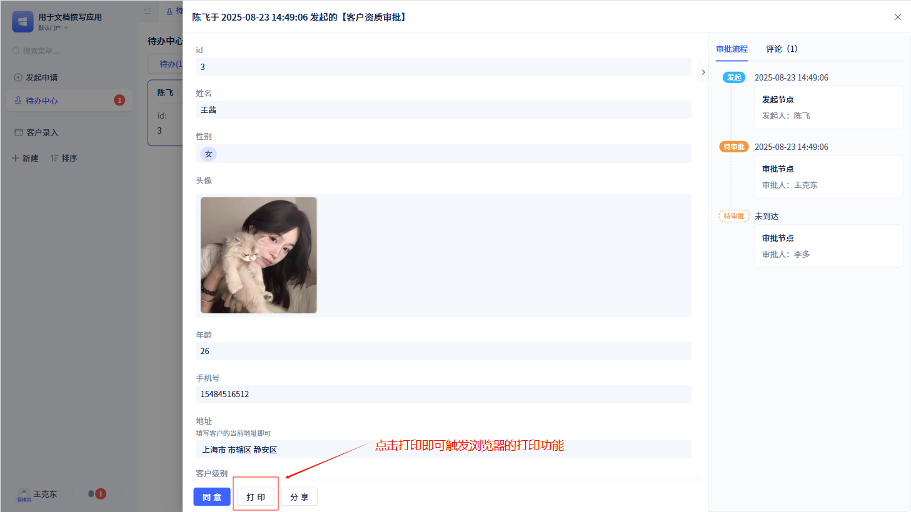

当用户打开“允许打印审批单”后，审批流程在每个审批节点都会显示一个打印按钮，点击`打印`按钮可打印当前审批单。

## 复用其他审批流程

如果想基于原有审批流程进行创建新的审批流程，新的审批流程会随着原有审批流程的更新而更新，可以使用审批流程的复用功能。

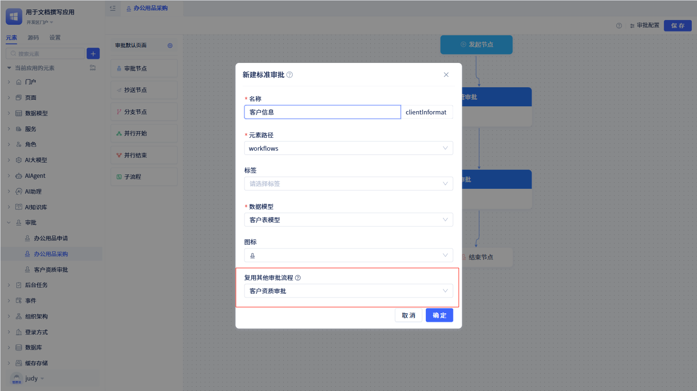

使用复用功能时必须保证当前审批流程的数据模型与复用审批流程的数据模型一致。

对于流转路径，默认情况下是跟随复用审批流程变更。若当前流程改变了路径（增删流程节点或调整节点连接），不再随复用流程变化而变化。

对于流程节点的配置，默认也是跟随复用审批流程的配置。如果当前流程节点配置发生变化，会将变化的配置重新存起来，而未修改的配置会随复用审批流程变化。

对于审批页面，当前审批流程会自动创建一个审批页面，但该页面继承复用审批流程的审批页面，支持局部修改，未修改的部分会随继承的页面自动更新。

:::warning 注意

如果想基于原有审批流程创建新的审批流程，但不想继承原有审批流程，可以使用审批流程的复制功能。

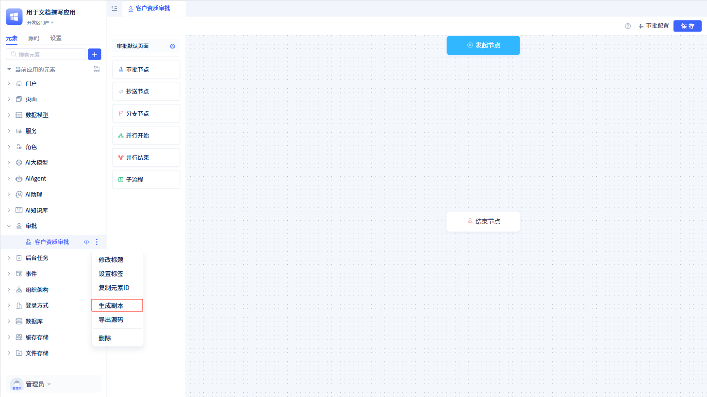

在左侧元素树中点击“生成副本”按钮，即可实现审批流程的复制功能。
:::
