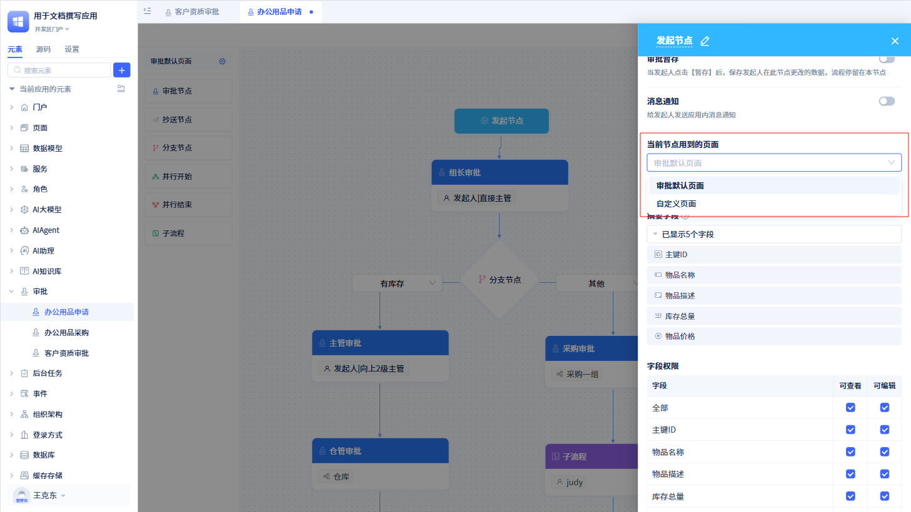
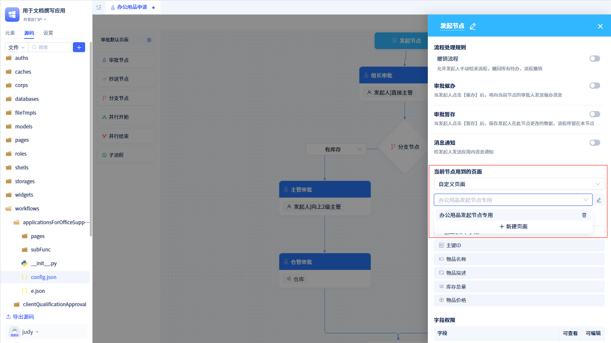
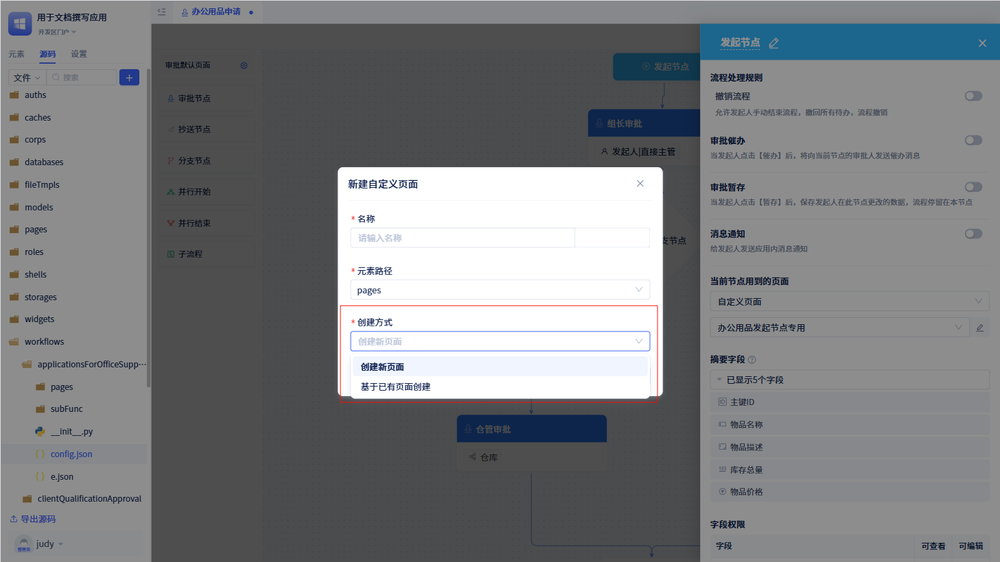
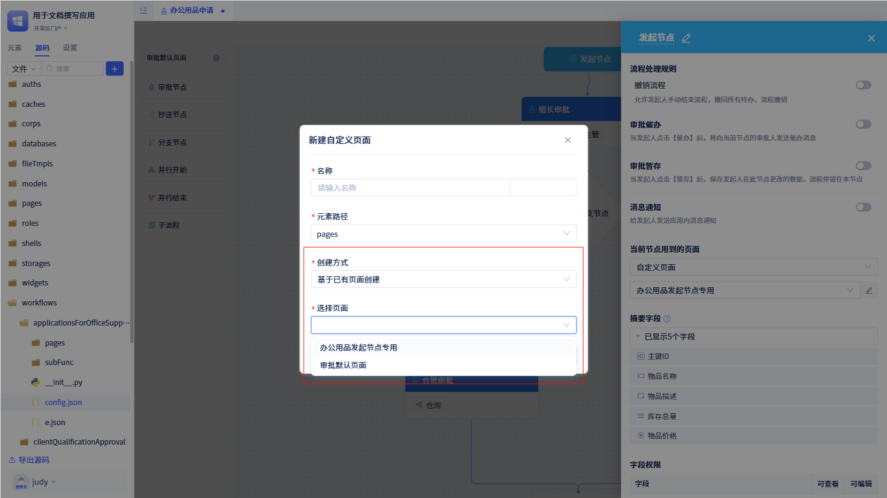
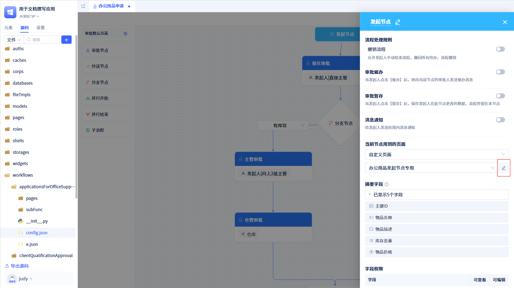

# 审批页面定制

在创建审批流程的时候，系统会默认创建一个审批页面。但某些情况下，用户需要针对不同的审批节点展现不同的页面，那么需要针对特定的审批节点进行页面定制。

## 审批页面高级定制

默认情况下，审批流程只有一个默认的审批页面。用户可以针对不同的审批节点进行页面定制，从而实现不同的审批页面。

### 审批页面类型

审批页面分为默认审批页面和自定义审批页面。

在节点的配置面板中，开发者点击“当前节点用到的页面”区域内的下拉框，可以选择使用“审批默认页面”还是“自定义页面”。

选择“自定义页面后”，系统会默认选中当前审批流程所有自定义页面中的第一个页面，开发者也可以选择创建新的页面。

### 自定义页面创建方式

创建自定义页面时，系统有两个创建方式：创建新页面和基于已有页面进行创建。

点击`+ 新建页面`后打开新建页面弹窗。在“创建方式”那里可以选择是“创建新页面”还是“基于已有页面创建”。

如果选择“基于已有页面创建”时，会弹窗“选择页面”的选项。所有信息填写完之后，点击“确定”按钮，就会创建一个新的含有审批表单的页面。

对于已经创建的页面，可以点击下拉框右侧的“编辑”按钮，进入页面进行编辑。

:::warning 注意

在审批流程中创建的页面，属于审批流程独有的。

每一个审批流程创建的页面只能在当前审批流程中使用，其他审批流程不能使用。

仅开始节点、审批节点和抄送节点才能进行页面定制。

无论哪个节点创建的页面，都可以被其他节点引用。

使用“基于已有页面创建”功能时，只能选择与当前审批流程有关的页面。

创建页面时生成的表单不可被删除，否则会导致页面无法使用。

页面中的表单配置，参照[表单组件](../在页面中使用功能组件/表单组件.md)。

:::
