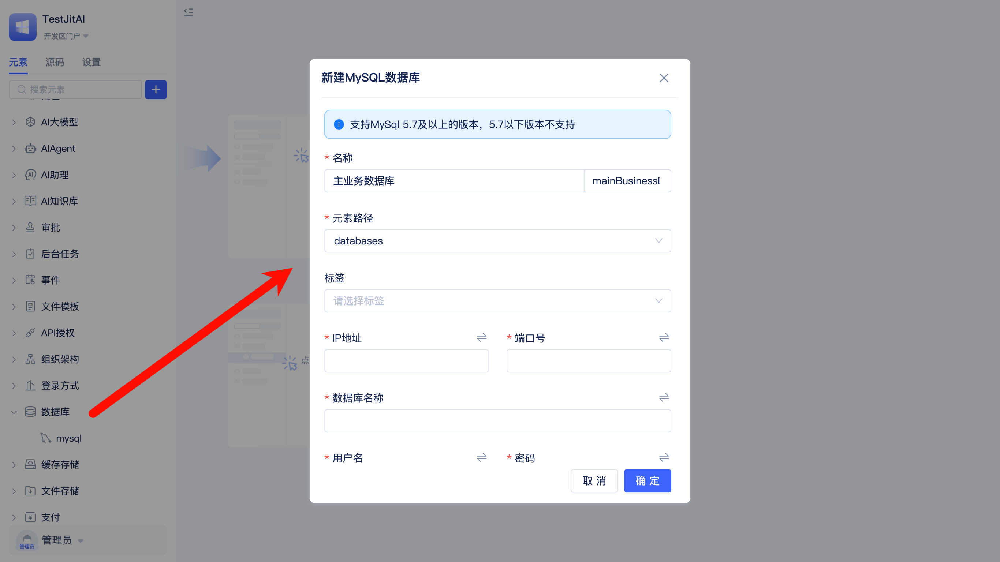
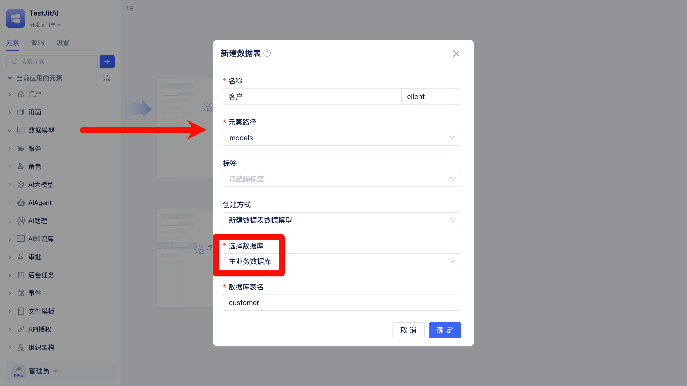
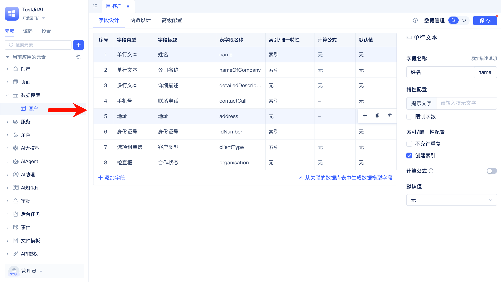
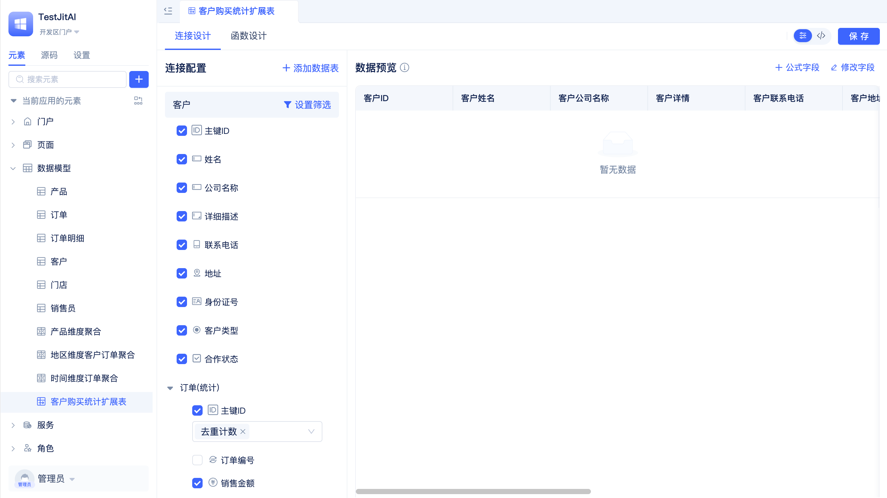
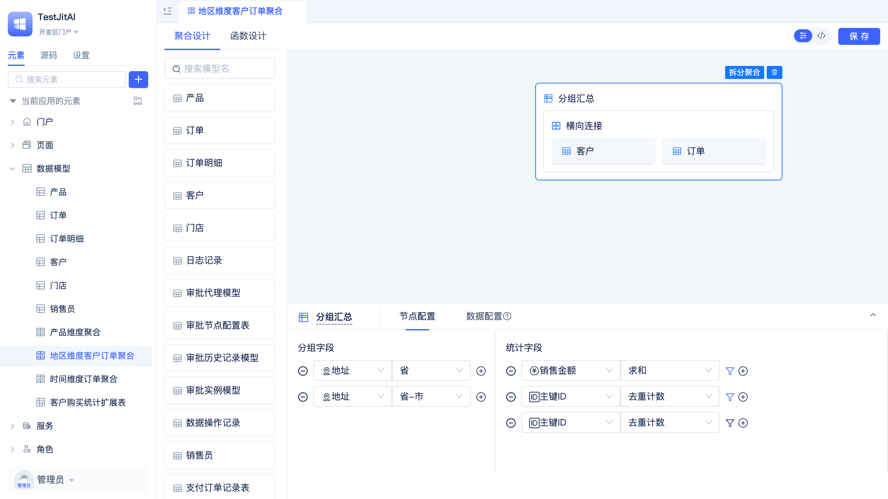
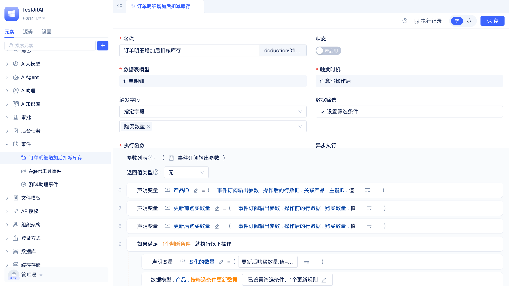

# 业务实体建模与数据分析

某大型消费品制造企业在全国有500多家门店，需要构建销售数据分析系统。系统要管理客户、门店、销售员、产品、订单等核心业务实体，支持多数据库配置，实现客户购买统计的实时扩展，提供时间、地区、产品等多维度分组分析，并通过模型事件自动化处理业务规则。

企业面临的核心挑战包括：如何设计合理的数据模型来准确反映业务关系，如何在客户管理中直接展示购买统计而无需频繁跳转查询，如何按不同维度快速生成销售分析报表，如何在数据变更时自动触发库存扣减、客户统计更新、外部系统同步等业务逻辑。

通过JitORM的数据建模、扩展表、聚合表和模型事件能力，可以构建一个完整的销售数据管理和分析系统，实现业务实体的准确建模、数据的实时扩展统计、多维度的灵活分析以及业务规则的自动化处理。

## 数据库配置

企业构建销售分析系统时，通常需要整合已有系统的数据。JitORM支持同时创建多个数据库实例元素，连接多种类型、多个数据库服务，可以通过创建模型元素映射已有数据库表结构。

- **主业务数据库**：新的销售订单、客户信息存储在主MySQL数据库，支持高并发的业务操作
- **历史数据库**：5年以上的历史订单数据保留在独立的MySQL数据库，专门用于数据分析和报表生成
- **已有系统对接**：原有CRM系统的客户基础数据保留在现有数据库中，通过JitORM创建模型映射已有表结构，实现数据集成

**开发步骤**：
1. 创建主业务数据库：配置MySQL数据库实例"databases.MainDB"，用于新的业务数据存储
   
    
   
2. 连接历史数据库（可选）：配置MySQL数据库实例"databases.HistoryDB"，连接历史数据分析库

## 业务实体建模与数据类型使用

销售业务中包含客户、订单、订单明细、产品、门店、销售员等多个核心实体，实体间通过关联关系构成完整的业务数据结构。

**实体关系设计**：
- **客户** ←→ **订单**：一对多关系，一个客户可以有多个订单
- **门店** ←→ **订单**：一对多关系，一个门店可以产生多个订单  
- **销售员** ←→ **订单**：一对多关系，一个销售员可以负责多个订单
- **门店** ←→ **销售员**：一对多关系，一个门店有多个销售员
- **订单** ←→ **订单明细**：一对多关系，一个订单包含多个产品明细
- **产品** ←→ **订单明细**：一对多关系，一个产品可以出现在多个订单明细中

**实体字段设计**：
- **客户信息**：姓名、公司名称、详细描述、联系电话、地址、身份证号、客户类型、合作状态
- **门店信息**：门店名称、地址、联系方式、门店分类、营业状态
- **销售员信息**：员工姓名、工号、联系电话、关联门店、在职状态
- **产品信息**：产品名称、产品分类、价格、库存数量、产品图片、规格参数、上架状态
- **订单信息**：订单编号、销售金额、订单日期、支付状态、关联客户、关联门店、关联销售员
- **订单明细**：关联订单、关联产品、购买数量、单价、小计金额

**开发步骤**：
1. 创建客户数据表模型：姓名(单行文本)、公司名称(单行文本)、详细描述(多行文本)、联系电话(手机号)、地址(地址)、身份证号(身份证号)、客户类型(选项组单选)、合作状态(检查框)
   
   

   

2. 创建门店数据表模型：门店名称(单行文本)、地址(地址)、联系方式(手机号)、门店分类(选项组单选)、营业状态(检查框)
3. 创建销售员数据表模型：员工姓名(单行文本)、工号(单行文本)、联系电话(手机号)、关联门店(关联数据单选)、在职状态(检查框)
4. 创建产品数据表模型：产品名称(单行文本)、产品分类(选项组单选)、价格(金额)、库存数量(数字)、产品图片(图片)、规格参数(富文本)、上架状态(检查框)
5. 创建订单数据表模型：订单编号(流水号)、销售金额(金额)、订单日期(日期时间)、支付状态(选项组单选)、关联客户(关联数据单选)、关联门店(关联数据单选)、关联销售员(关联数据单选)
6. 创建订单明细数据表模型：关联客户(关联数据单选)、关联订单(关联数据单选)、关联产品(关联数据单选)、购买数量(数字)、单价(金额)、小计金额(金额)

在创建模型时需要选择正确的数据库实例元素。

## 客户数据扩展与扩展表模型

在客户管理过程中，销售员希望能在客户列表中直接查看每个客户的购买统计信息，如累计消费金额、购买次数等，而不需要频繁跳转到订单表查询。

通过扩展表模型，可以在不修改原有客户模型结构的前提下，关联订单数据并扩展出客户的购买统计字段。扩展表模型会自动生成LEFT JOIN查询，将订单统计数据作为扩展字段展示在客户数据中。

- **客户购买统计扩展**：以客户模型为基础，关联订单模型，扩展累计消费金额(求和)、购买次数(计数)两个统计字段
- **实时数据更新**：当订单数据发生变化时，扩展表中的统计字段会自动更新，保证客户统计信息的实时性

**开发步骤**：
1. 创建客户购买统计扩展表：以客户模型为基础模型
2. 添加关联关系：通过客户模型的主键ID字段与订单模型的关联客户字段建立关联，在添加关联关系时可以配置对订单模型的筛选条件，如支付状态为已付款等。
3. 配置扩展字段：对销售金额字段求和，作为新的"累计消费金额"字段；对订单记录计数，作为新的"购买次数"字段。

## 分组聚合统计与聚合表模型

销售管理需要从时间、地区、产品、渠道等维度对销售数据进行分组统计，生成各类分析报表。通过聚合表模型的分组汇总、追加合并、横向连接功能，实现数据分析。聚合表模型背后会自动生成TQL来执行GROUP BY、UNION、JOIN等复杂SQL操作。

数据查询需要支持多种条件组合，如按金额范围、时间区间、地区归属、客户类型等进行筛选。JitORM的数据查询功能背后会自动生成Q表达式来构建WHERE条件，支持范围查询(range)、模糊匹配(like)、地区归属(province、city)、空值判断(isnull)等操作符。对于自定义复杂业务逻辑，JitAi支持开发者在业务代码中直接使用TQL和Q表达式。

- **时间维度分析**：基于订单日期字段按年、季度、月份、周对订单数据进行分组汇总，统计各时间段的销售金额(SUM)、订单数量(COUNT)
- **地区维度分析**：利用客户地址字段的province、city解析功能，关联订单按省份、城市分组，统计各地区销售业绩，结合门店地址信息分析区域密度与业绩的关系，生成地区排名报表
- **产品分类维度分析**：基于产品分类字段，通过订单明细关联订单数据按分类分组，分析各品类的销售表现，计算品类占比和贡献度，识别热销产品和滞销产品，支持产品组合分析

**开发步骤**：
1. 创建时间维度聚合表：以订单模型为数据源，筛选已支付订单，基于订单日期字段按年、季度、月、周分组，配置销售金额(对销售金额求和)、订单数(对订单ID计数)聚合
2. 创建地区维度聚合表：以客户模型为数据源，利用地址字段的province、city解析功能分组，关联订单模型统计销售金额、订单数、客户数
3. 创建产品分类聚合表：以产品模型为数据源，基于产品分类字段分组，关联订单明细模型配置购买数量(SUM)、小计金额(SUM)聚合

## 业务规则自动化与模型事件

销售业务中存在大量的业务规则和数据联动逻辑，如库存更新、客户类型调整、预警通知等。通过模型事件机制实现数据变更的自动化处理。

- **订单明细创建事件(AddAfter)**：自动扣减产品库存数量，计算客户消费统计
- **数据更新事件(UpdateAfter)**：支付状态变更时触发发货流程，客户信息变更时同步到外部CRM系统
- **字段变更事件(FieldUpdateAfter)**：客户类型发生变化时发送通知，销售金额修改时记录操作日志
- **数据审计事件(UpdateBefore)**：记录敏感信息修改前的原始数据，用于审计追踪

**开发步骤**：
1. 配置库存扣减事件：监听订单模型AddAfter事件，筛选支付状态为已付款的订单，根据订单明细扣减产品库存数量
   
2. 设置客户统计事件：监听订单模型AddAfter事件，异步计算客户消费统计，根据销售金额阈值调整客户类型
3. 建立外部同步事件：监听客户模型UpdateAfter事件，筛选关键字段变更，异步调用外部CRM系统API同步信息
4. 实现审计日志事件：监听敏感模型的UpdateBefore事件，记录变更前数据用于审计追踪
