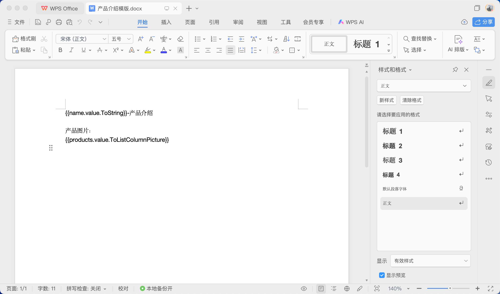
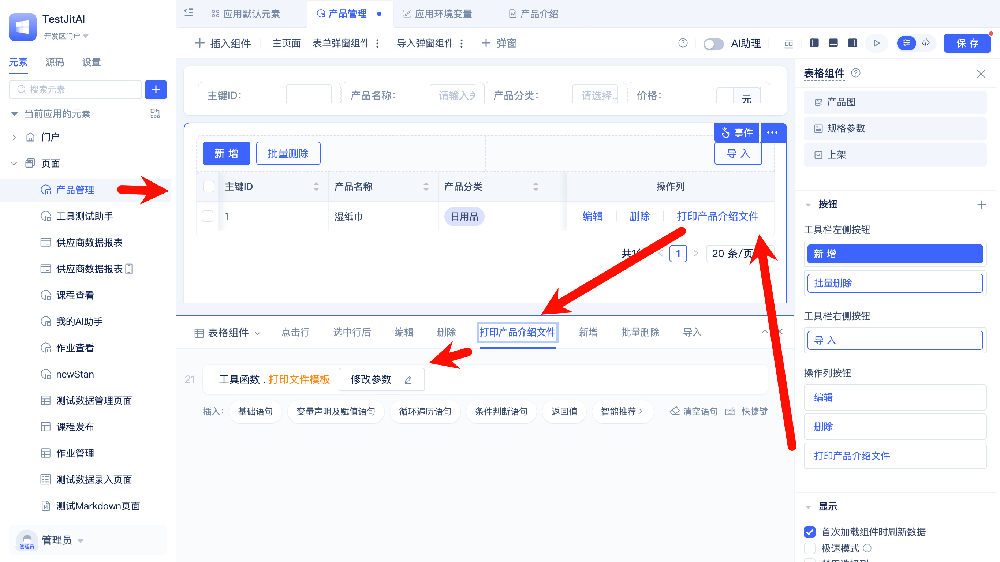
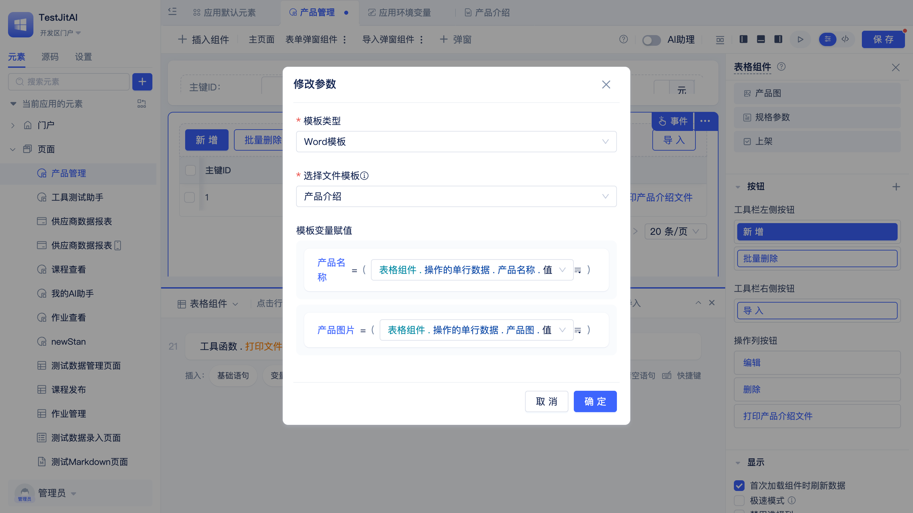
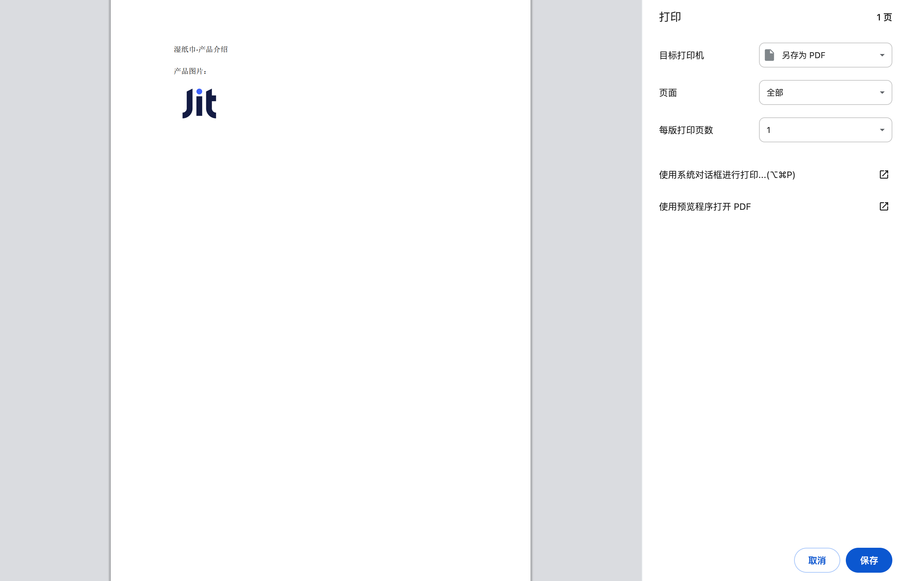

# 使用文件模版生成和打印文件

营销团队需要根据产品数据库信息快速生成标准化的产品介绍Word文档，传统手工制作方式存在效率低下、格式不统一等问题。

通过[JitStorage](/docs/category/jitstorage)中的文件模板元素，结合Word、Excel文件模板制作，可以实现文档的自动化生成和打印，将数据与文档输出流程有机集成。

## 创建并配置文件模板元素

创建Word文件模版并配置模版变量。

## 制作并上传模版文件

在文件模版元素编辑界面中将制作好的模版文件上传。

## 在文件打印中使用文件模板

在产品管理功能中集成文档打印功能，实现产品介绍文档的自动生成。

配置打印时的模版变量赋值规则。

## 测试文件打印

在产品管理页面预览中测试文件打印，系统自动将操作行的数据变量渲染到了文件中。

