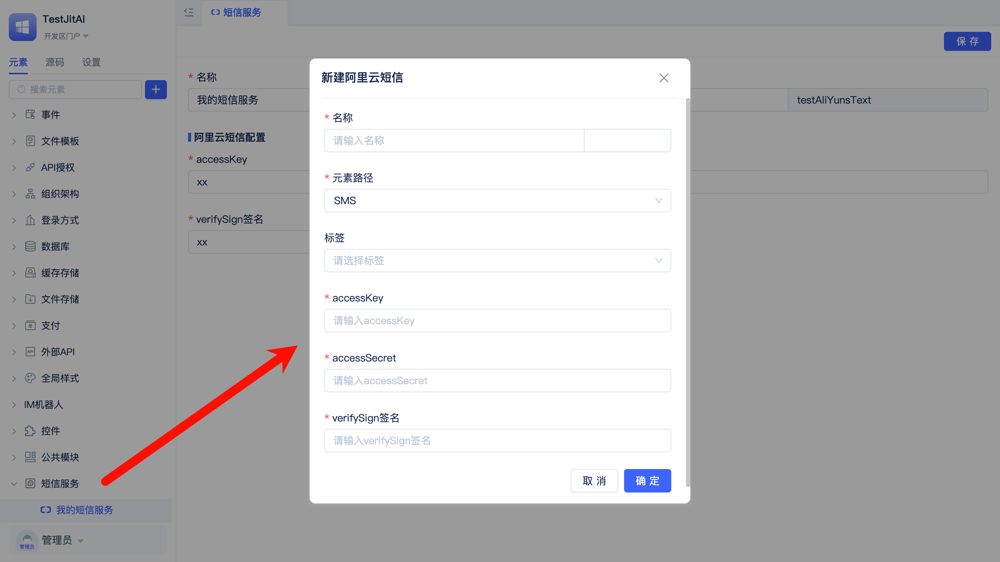
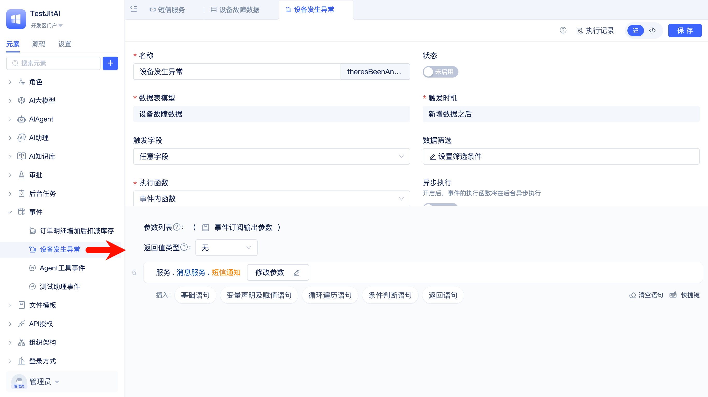
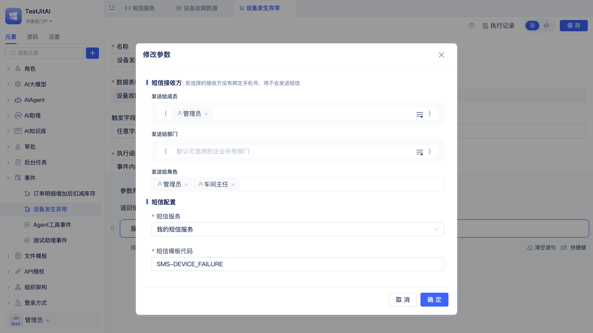

# 发送短信通知

某制造企业需要建立设备故障自动告警机制，当生产设备出现异常或故障时，系统立即发送短信通知运维团队和车间负责人。传统的现场巡检发现故障滞后，设备监控系统的邮件告警容易被忽略，导致故障处理不及时影响生产进度。

企业要求故障告警短信能够包含设备编号、故障类型和发生时间等关键信息，支持同时通知多名相关人员，确保设备故障能够被及时发现和快速响应，最大程度减少生产损失。

## 开通阿里云短信服务并申请签名和模版

在阿里云控制台开通短信服务，创建设备告警场景所需的签名和模板。

参考[阿里云短信服务介绍](https://help.aliyun.com/zh/sms/user-guide/sms-service)

## 创建阿里云短信实例元素

创建[阿里云短信](/docs/reference/开发框架/JitMessage/阿里云短信.md)实例元素，配置认证信息和签名。

## 配置故障数据新增的事件函数
新建[模型事件](/docs/reference/开发框架/JitORM/模型事件.md)元素实例，当故障数据新增时触发事件函数，函数中执行短信发送。

模型相关文档：[业务实体建模与数据分析](./业务实体建模与数据分析.md)

配置短信发送的参数

从阿里云短信服务控制台获取实际的短信模板代码。

