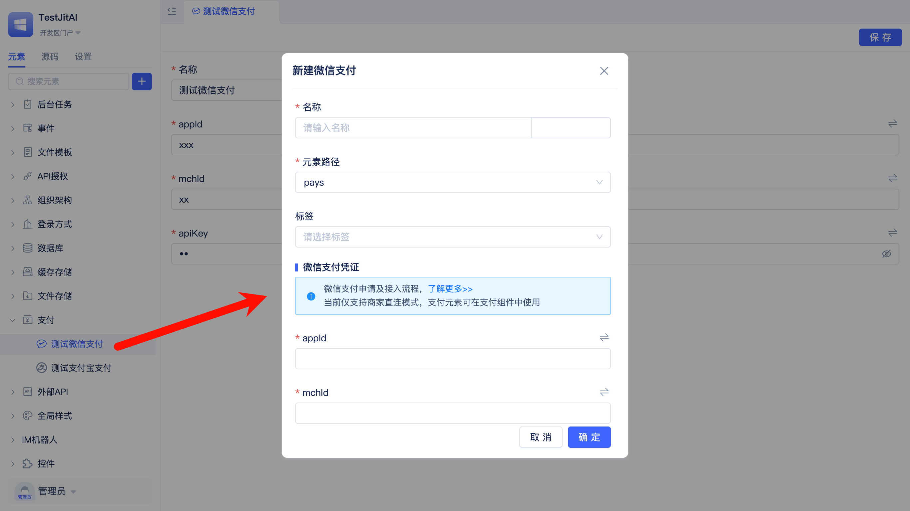
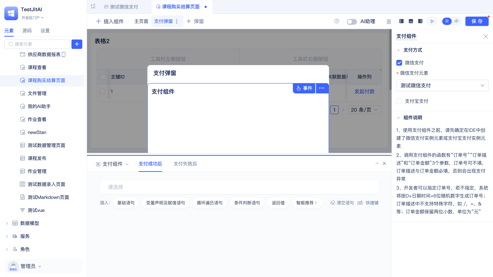
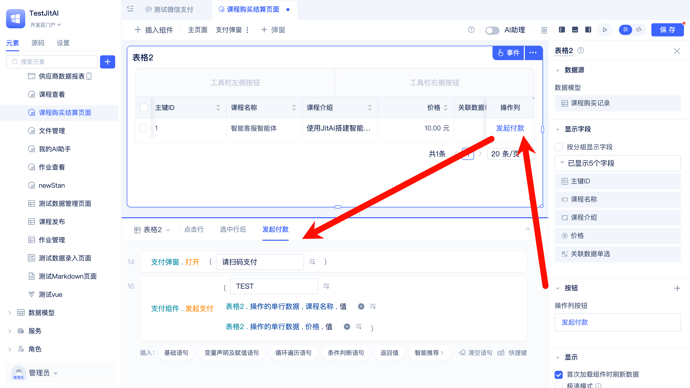
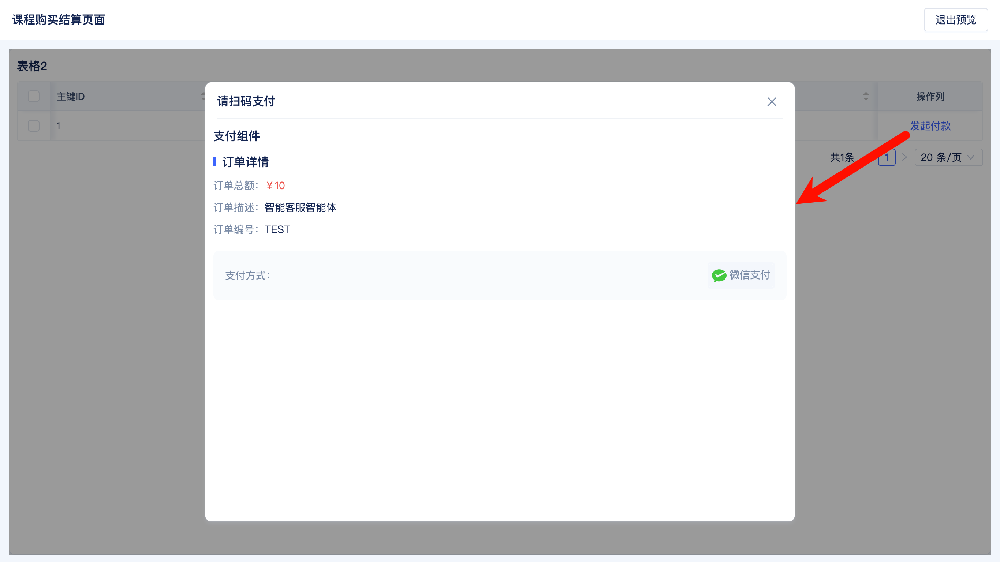

# 在线支付功能集成

某企业级在线培训平台需要为付费课程提供支付功能，当用户购买课程时自动创建支付订单并生成微信支付二维码，通过微信回调机制自动确认支付状态，实现完整的课程购买流程。

## 创建微信支付元素实例

用户需要先到微信商户平台开通支付账户[点击了解更多](https://pay.weixin.qq.com/wiki/doc/api/H5.php?chapter=3_1)，获得商户号、API密钥等配置信息。

在JitAi可视化开发工具中，创建微信支付元素实例，并配置参数。

## 在结算页面集成支付组件

在结算页面中添加一个弹窗组件，然后在弹窗中添加一个支付组件。

支付组件支持添加多个支付方式，开发者可以自行决定。

## 实现发起付款逻辑

在结算页面中，当用户点击发起付款按钮时，触发支付弹窗。

在页面预览中看看效果！

用户选择并点击支付方式后，支付组件会执行订单创建，并生成微信支付二维码。
