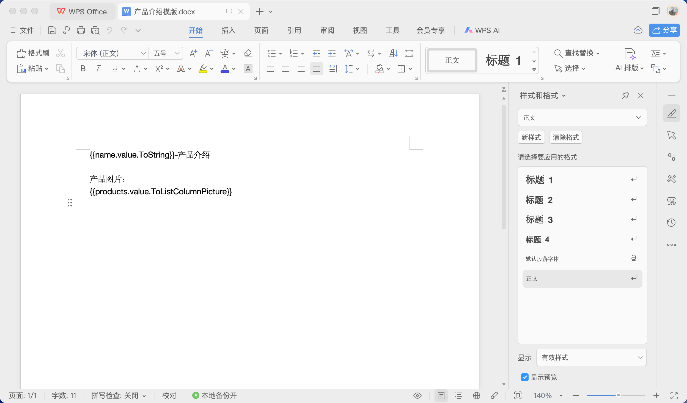

# 文件存储与文件模版渲染

营销团队需要根据产品数据库信息快速生成标准化的产品介绍Word文档，传统手工制作方式存在效率低下、格式不统一、图片处理繁琐等问题。

可以通过[JitStorage](/docs/category/jitstorage)中的文件存储元素管理产品图片，再结合Word、Excel文件模板制作，从而实现文档的自动化生成和打印，将数据建模与文档生成有机集成。

## 创建文件存储实例元素

创建阿里云OSS存储实例，用于存储用户上传的文件。

在产品数据管理页面中测试文件上传。

相关文档：在[业务实体建模与数据分析](./业务实体建模与数据分析.md)中了解业务实体模型的创建，在[系统界面设计与组件应用](./系统界面设计与组件应用.md)中了解数据管理页面的搭建。

## 设置为默认文件存储元素

将创建的文件存储设置为系统默认，所有文件上传都会默认存储到其中。

## 创建并配置文件模板元素

创建Word文件模版并配置模版变量。

## 制作并上传模版文件

在文件模版元素编辑界面中将制作好的模版文件上传。

## 在文件打印中使用文件模板

在产品管理功能中集成文档打印功能，实现产品介绍文档的自动生成。

配置打印时的模版变量赋值规则。

## 测试文件打印

在产品管理页面预览中测试文件打印，系统自动将操作行的数据变量渲染到了文件中。

