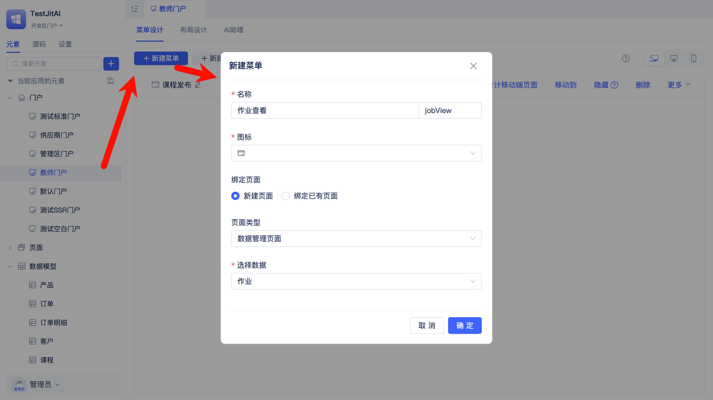
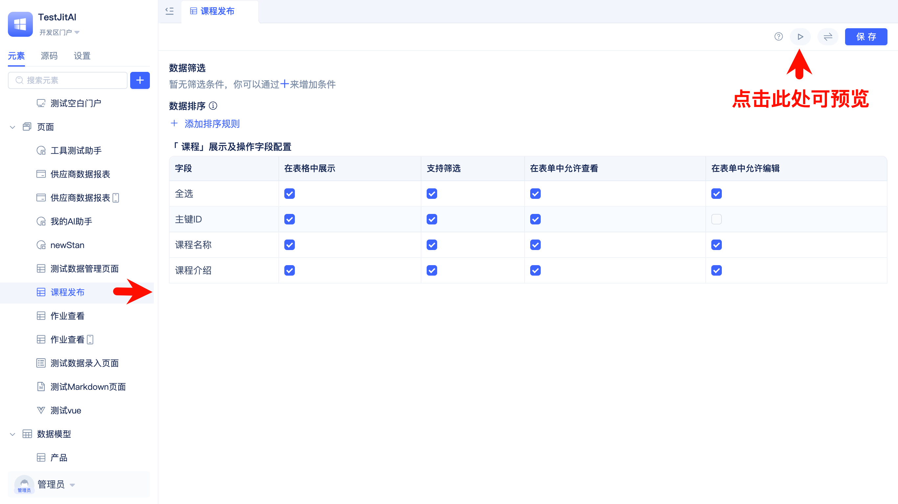
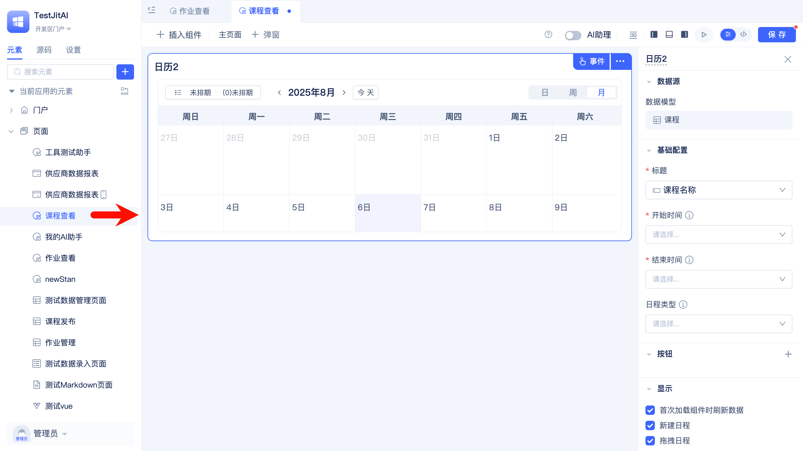

# 系统界面设计与组件应用

以一个简单的课程管理系统为例，包含课程发布、作业发布、作业批改、学员查看、作业提交等基础功能，系统需要教师端和学员端两个入口。

可以通过JitWeb的提供门户、页面和组件配置能力，快速搭建完整的教学管理界面。

## 按用户角色区分系统入口

系统需要教师端和学员端两个入口，教师负责课程发布，学员进行课程查看和作业提交。
- **教师端门户**：包含课程发布、作业查看等教学功能
- **学员端门户**：包含课程查看、作业提交等学习功能  
- **移动端支持**：学员可手机查看课程和提交作业

**开发步骤**：

创建三个标准门户：
1. 创建教师门户：配置教师端门户，设置课程发布、作业查看等功能菜单
   
   

   配置门户菜单的同时可以将菜单对应的页面创建好，页面类型参考[选择合适的页面类型](./系统界面设计与组件应用.md#选择合适的页面类型)

   
   
2. 创建学员门户：配置学员端门户，设置课程查看、作业提交等功能菜单
3. 配置移动端：为课程查看、作业提交配置手机端页面（配置菜单并选择新建页面时会自动创建手机端页面，不需要手机端页面可以在页面列表中手动删除）

给不同角色分配不同的门户涉及到权限管理，可以参考[门户规划与权限分配](./登录认证与权限管理.md#门户规划与权限分配)

## 选择合适的页面类型

不同门户中需要集成不同类型的页面来承载具体功能。
- **教师端门户**：
  - 课程发布页面：使用数据管理页面，录入课程信息
  - 作业管理页面：使用数据管理页面，发布作业
  - 作业批改页面：使用数据管理页面，批改学员提交的作业
- **学员端门户**：
  - 课程查看页面：使用标准页面，展示课程信息
  - 作业查看页面：使用标准页面，查看作业信息，提供作业提交操作入口

[点击了解页面类型](/docs/category/页面)

## 配置页面组件

**教师端**（数据管理页面开箱即用）：
- 课程发布页面：表格展示课程列表，表单录入编辑
- 作业管理页面：表格展示作业列表，弹窗查看批改
- 作业批改页面：表格展示提交列表，表单填写批改

**学员端**（标准页面需配置组件）：
- 课程查看页面：日历组件展示课程安排
- 作业查看页面：列表展示作业，弹窗提交作业

[点击了解更多组件](/docs/category/组件)

**开发步骤**：
1. 教师端页面：配置筛选条件、排序规则、字段的展示/支持筛选/允许查看/允许编辑，一般保持默认
   

2. 学员端页面：配置日历、列表、弹窗组件
   
