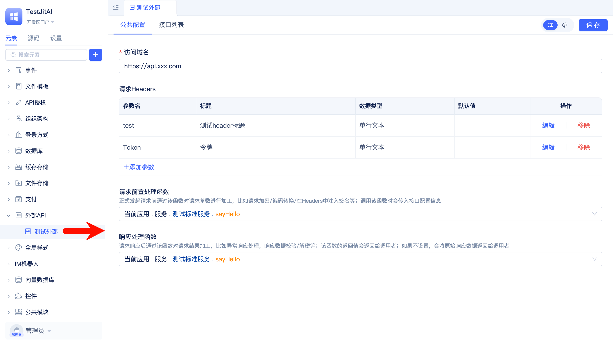
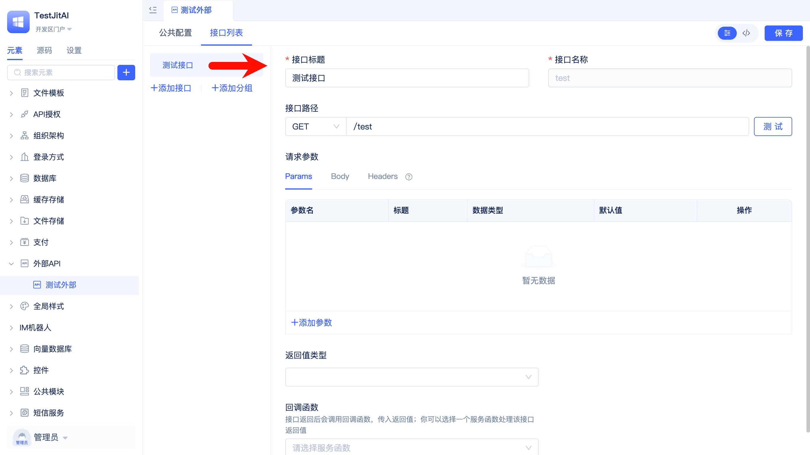

# 集成外部API接口
内部采购系统需要对接供应商平台，供应商接口采用统一域名+路径、需要公共认证头、响应采用统一格式。

## 创建外部API实例元素并完成公共配置
在JitAi可视化开发工具中新建一个[外部API](/docs/reference/开发框架/JitService/外部API集成.md)元素实例。



完成域名、请求头、前置和后置处理函数的配置。

前置和后置处理函数都是服务函数，开发者需要先创建[服务函数](/docs/reference/开发框架/JitService/自定义业务服务.md)，再在配置中引用。

## 接口配置
添加接口，并完成标题、路径、参数、返回值映射、回调函数的配置。



## 在业务服务中发起调用
获取外部API实例并发起调用：

```python title="调用示例"
api = app.getElement("externalAPIs.testExternal")

# 查询库存（GET，路径参数自动映射）
stock = api.getProductStock(code="SKU-001")
```

## 按需覆盖请求头与参数（可选）
当单次调用需要定制请求头或参数时，可在方法调用中直接覆盖：

```python
stock = api.getProductStock(
    code="SKU-001",
    headers={"X-Debug": "true"},
    params={"warehouse": "HZ"}
)
```
