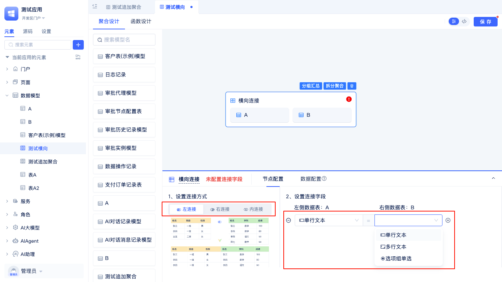
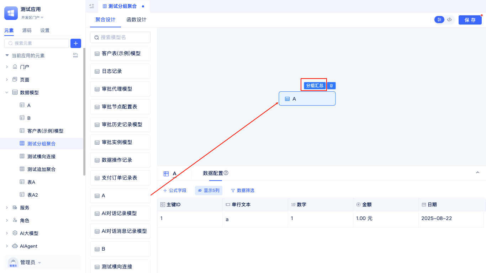
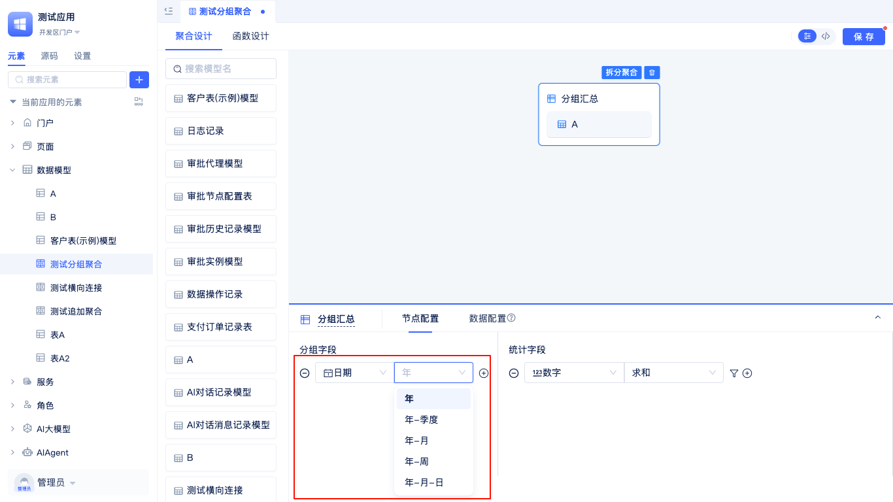
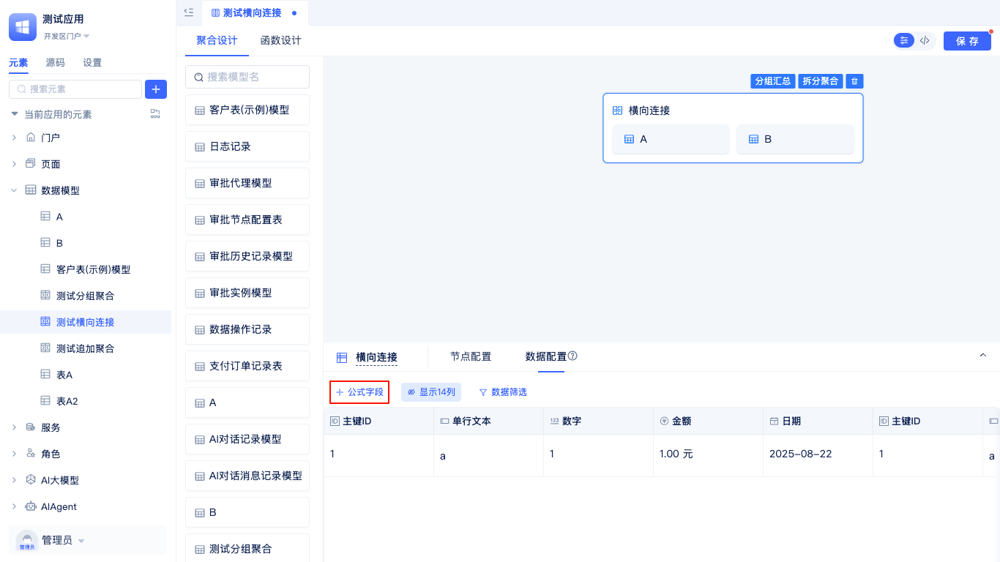
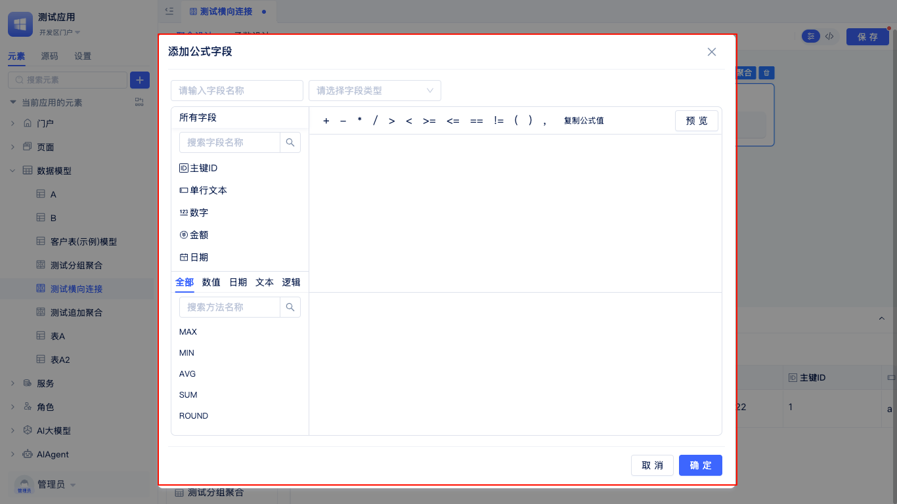
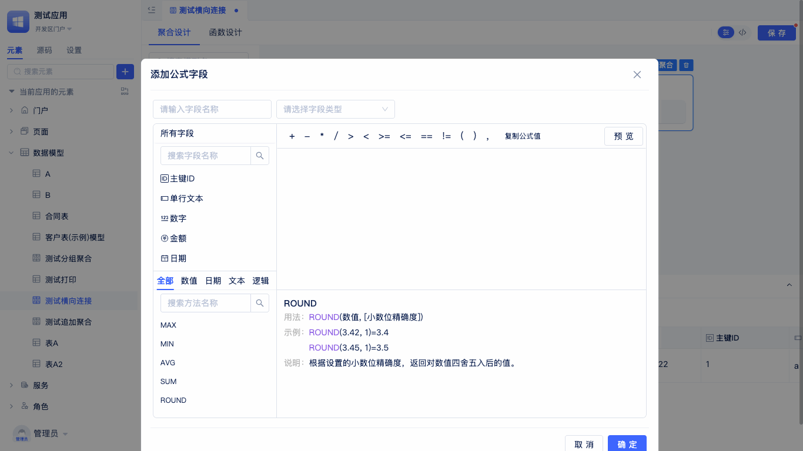
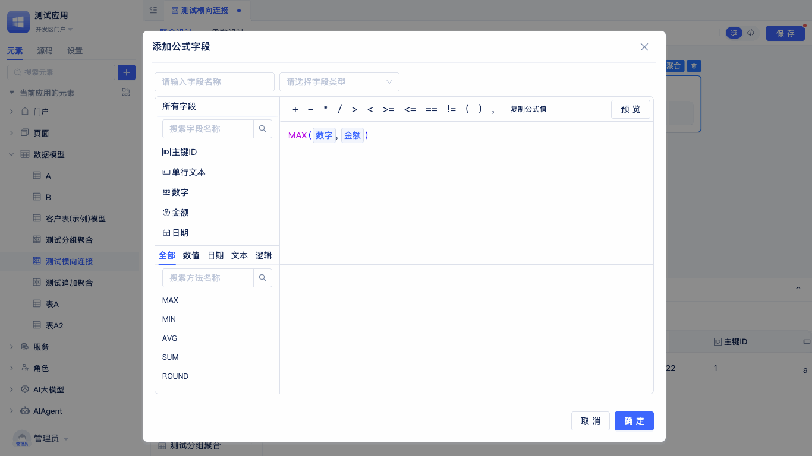
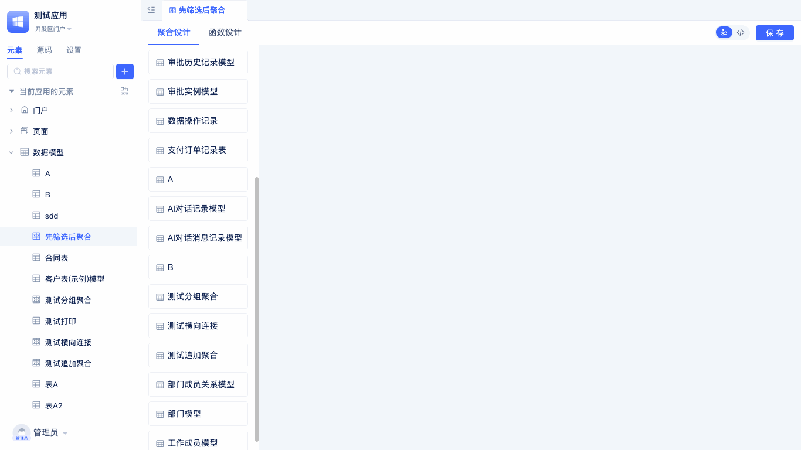

# 聚合表模型
聚合表模型是JitAi提供的一种高级数据建模方式，专门用于处理复杂的数据分析和统计场景。与[普通数据表模型](./数据表模型.md)不同，聚合表模型不直接对应数据库中的单一表结构，而是通过灵活的配置将多个数据表模型进行关联、合并和计算，最终生成满足特定业务需求的虚拟数据表。

## 新建聚合表模型

开发者在元素树中找到 `数据模型`，点击右侧 `+`，选择聚合表。 

在`新建聚合表`弹窗页面中，输入名称，英文名称会自动生成，点击`确定`按钮进入到聚合表可视化编辑器。

## 多表数据合并

追加合并是将多个结构相似的数据表合并成一个统一的数据集，类似于SQL中的UNION操作。系统会自动匹配各表中的相同字段，将所有数据追加到一起，并可选择是否对重复数据进行去重处理。

例如，开发者可以合并不同时期的销售数据、整合多个分店或部门的业务数据，以及合并相同业务类型但分散存储的历史数据等场景。

开发者从左侧模型列表中选择需要合并的数据表，拖拽到右侧工作面板，然后在`节点配置`中设置字段映射关系，确定哪些字段要合并在一起。系统默认会自动去除重复数据，如需保留重复数据可取消勾选`对合并后的数据去重`选项。

节点配置完成后，点击`数据配置`标签，进入数据预览，仅显示前50条数据。

## 多表横向连接

横向连接通过指定关联匹配字段将多个数据表进行连接，类似于SQL中的JOIN操作。支持左连接、右连接、内连接等多种连接方式，可以将分散在不同表中的相关信息整合到同一行记录中。

例如，开发者通过多表横向连接可以关联用户基本信息表和用户订单表，从而查看用户的完整档案；也可以连接产品信息表和库存信息表，获得产品的详细库存状态。此外，还可以关联员工信息表和部门信息表，生成包含部门详情的员工报表，或者将客户表与其联系记录表连接，形成客户关系管理视图。

开发者在左侧模型列表中选择需要横向连接的表拖拽到右侧面板中。

在`节点配置`标签页面，选择连接方式，添加匹配字段。连接方式有左连接、右连接、内连接，默认为左连接。匹配字段可以选择多个，只有相同数据类型才能匹配，例如，单行文本可以和多行文本，选项组，手机号，身份证号等匹配，因为这些都是存储的文本类型。

节点配置完成后，点击`数据配置`标签，进入数据预览，仅显示前50条数据。

## 分组聚合统计

分组统计是对数据表按照指定字段进行分组，然后对每个分组内的数据执行聚合计算（如求和、计数、平均值等），类似于SQL中的GROUP BY操作。支持多层级分组和多种聚合函数，可以快速生成各种统计报表。

例如，开发者通过分组统计可以将各种维度的数据统计分析，如按地区、时间、部门、产品类别、客户等级等字段进行分组汇总，快速生成销售报表、员工统计、库存分析、客户价值评估等业务报告。

开发者在左侧模型列表中选择需要分组聚合的表拖拽到右侧面板中，在面板中点击`分组汇总`进入到聚合配置页面。

在`节点配置`中添加分组字段和添加统计字段。
除了普通字段分组外，还有一些特殊的字段分组：日期或日期时间字段按年月日等分组、地址字段按省市区分组。

分组字段选择日期或日期时间字段，分组方式可以选择`年`、`年-季度`、`年-月`、`年-周`、`年-月-日`或者不选。

分组字段选择地址字段，分组方式可以选择`省`、`省-市`、`省-市-区`或者不选。

节点配置完成后，点击`数据配置`进入数据预览页面，仅显示前50条数据。

## 扩展自定义计算字段

聚合表可以基于已有的聚合字段添加公式字段，公式字段显示的值就是公式计算出来的值。

以横向连接聚合表为例，在数据配置页面，点击`+公式字段`进入公式配置面板。

在公式面板中，可以选择字段，可以选择函数，也可以选择上方的`+`、`-`、`*`、`/`等运算符，点击即可添加到面板中。

JitAi提供了丰富的公式函数库，涵盖不同数据类型的计算需求。**数值类型**包括最大值（`MAX`）、平均值（`AVG`）、求和（`SUM`）等聚合函数，用于数据统计分析；**日期类型**包括当前时间（`NOW`）、日期增加（`DATEADD`）、月初（`MONTHSTART`）等函数，用于时间相关计算；**文本类型**包括文本拼接（`CONCAT`）、文本替换（`REPLACE`）、文本长度（`LEN`）等函数，用于字符串处理；**逻辑类型**包括条件判断（`IF`）、多层判断（`IFS`）、条件拼接（`AND`/`OR`）等函数，用于业务逻辑控制。

例如，开发者如果想计算两个字段的最大值，可以上述公式`MAX(数字, 金额)`。如果想确认公式是否设置正确，可以点击右侧的`预览`按钮。
在预览面板中填写公式中用到的数字字段和金额字段的值，然后点击`测试`按钮，测试结果就会出来正确的计算结果。

预览成功后，配置公式字段名称，类型以及字段配置等，点击`确定`就可以看到公式计算够的数据。

## 先聚合后筛选

这种方式是先完成数据表的聚合操作（合并、连接或分组统计），然后对聚合结果进行筛选。适用于需要基于聚合结果进行条件判断的场景。

以追加合并聚合表为例，在数据配置预览页面，点击`数据筛选`标签进入到筛选条件配置页面。在`设置筛选条件`弹窗中，点击`+`添加筛选条件。如果想筛选数字在1-300之间的数据，先选择对应数字字段，再选择比较符`在范围内`，最后填入范围值1和300，点击`确定`。数据预览只会显示满足数字字段在1-300之间的行数据。

## 先筛选后聚合（推荐）

这种方式是先对各个数据表分别设置筛选条件，筛选出符合条件的数据后再进行聚合操作。这种方式能够显著减少参与聚合计算的数据量，避免产生过大的笛卡尔积，从而大幅提升查询性能。

在聚合表配置页面，首先选择要聚合的数据表A，在其数据配置页面点击`数据筛选`，设置筛选条件（如数字在1-300之间）。接着选择要合并的数据表B，同样设置相应的筛选条件。完成各表的筛选配置后，再执行聚合操作，最终的数据预览将显示经过预筛选后的聚合结果。

:::tip 性能优化提示
建议优先采用先筛选后聚合方式，这样能显著减少数据库引擎的扫描行数，提升查询性能。大数据量场景应避免直接对大表无条件聚合，以免导致超时或系统卡顿。筛选条件应尽量精准，以获得最佳性能优化效果。
:::

