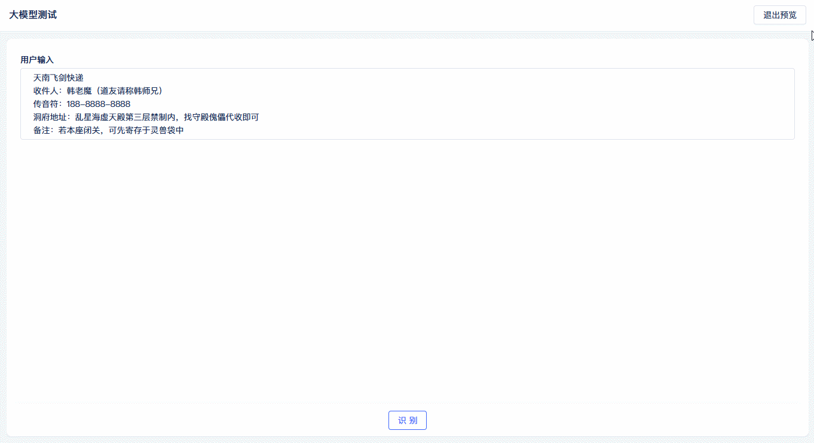
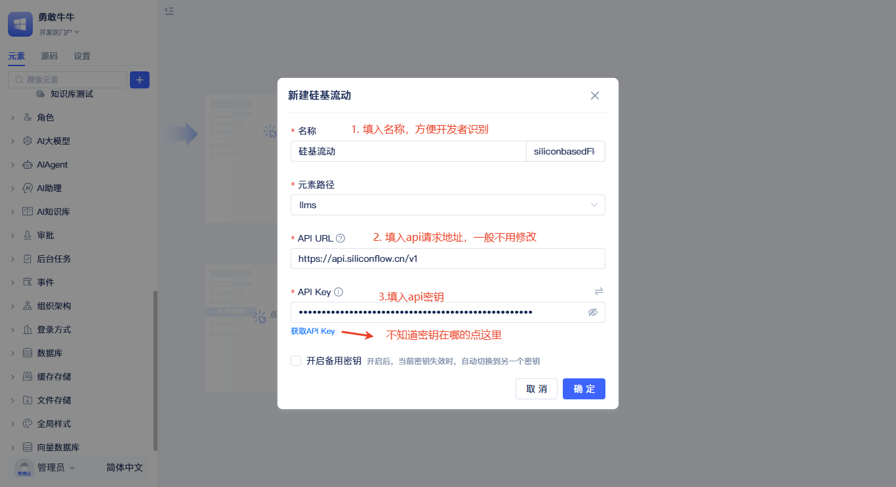
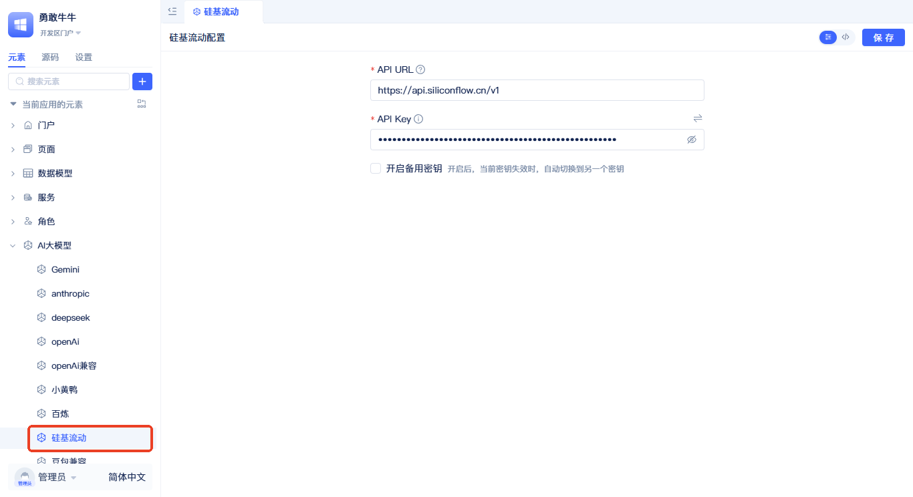
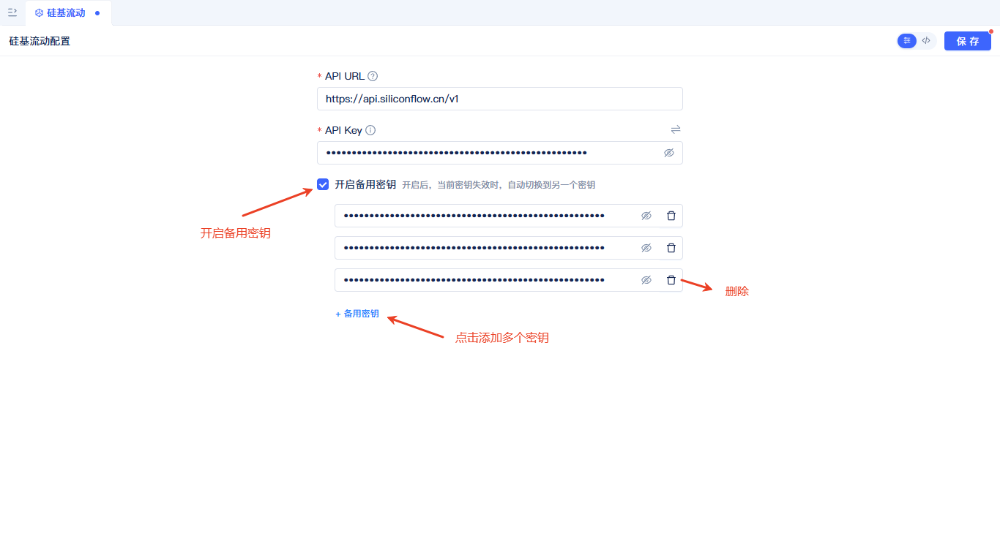
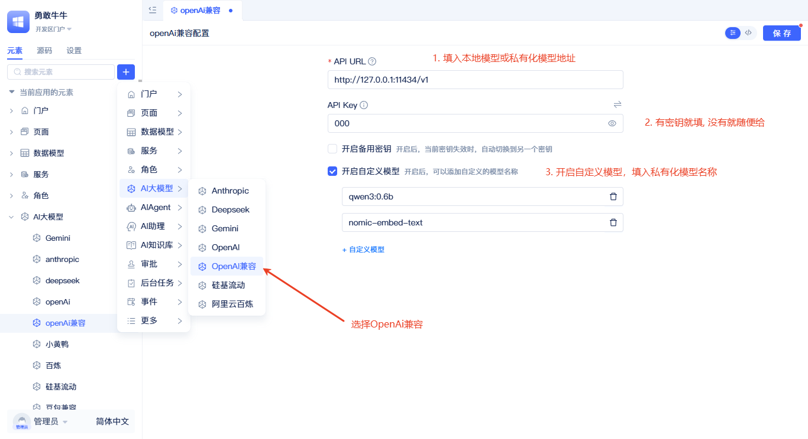
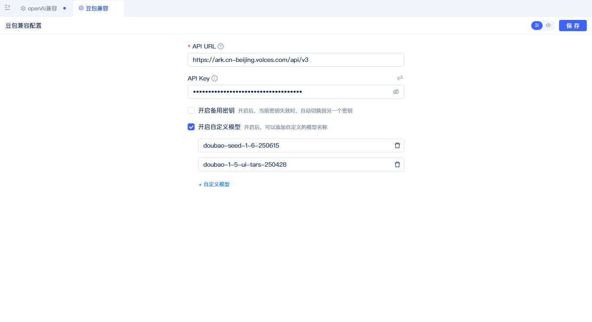
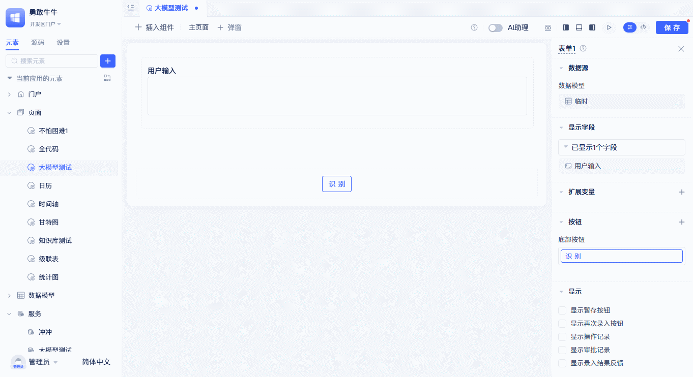
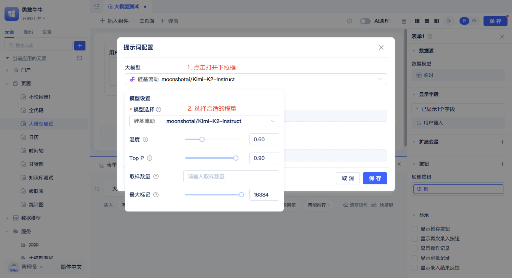
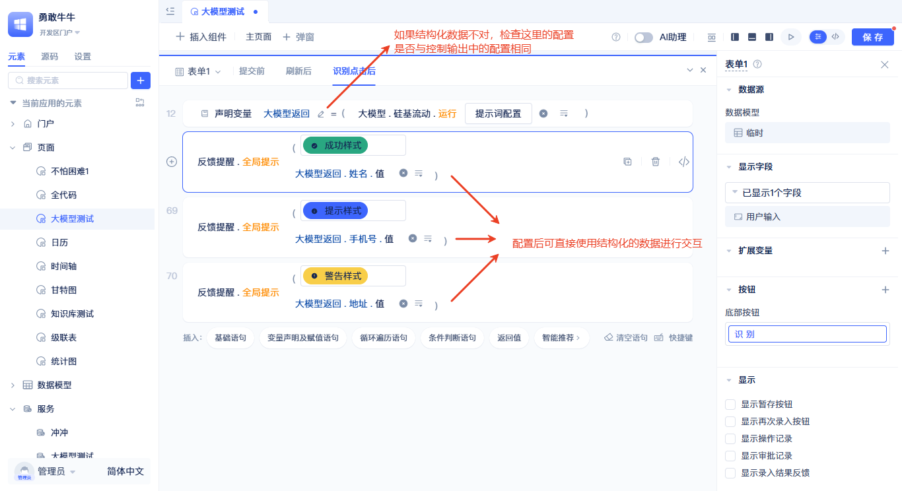
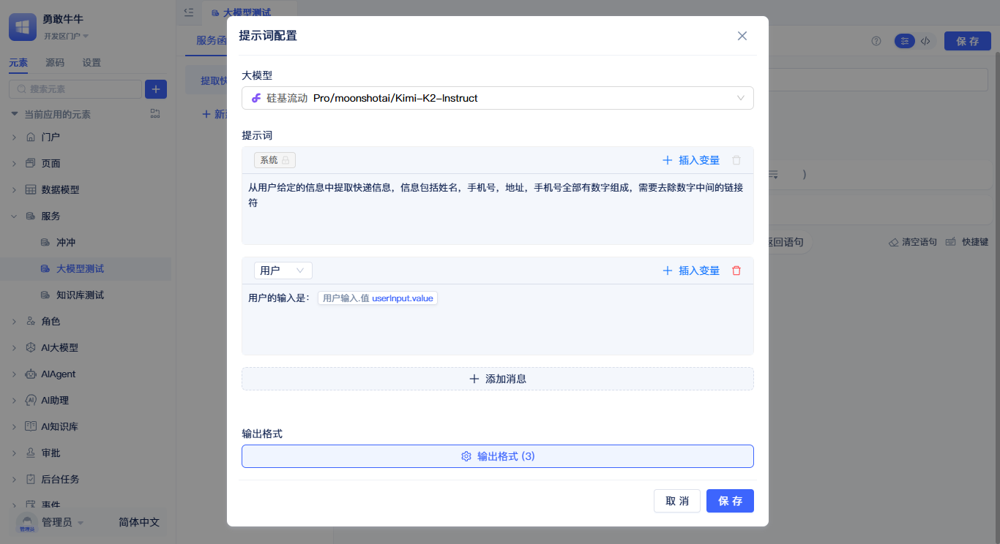

# 大模型配置
大模型厂商元素是连接JitAI平台与各种AI大模型服务的桥梁。当你想要在应用中使用AI服务时，需要先创建一个大模型厂商元素来建立连接。通过简单的配置，你可以轻松接入主流AI服务商，让你的应用具备智能对话、文本生成等AI能力。

大模型根据用户输入的快递信息，提取姓名、手机号，地址

## 主流大模型厂商支持列表
*   Anthropic
*   阿里云百炼
*   Deepseek
*   Gemini
*   OpenAI
*   硅基流动
*   OpenAI兼容

## 大模型厂商元素的创建

开发模式的元素面板中，点击搜索框右边的`加号`按钮，在弹出的菜单中选择`AI大模型`，根据实际情况再选择对应的大模型厂商，选择完成后会弹出如下弹窗。

在弹窗中，填入名称，然后到对应模型厂商的配置页添加一个API Key(不知道地址的可以点击左下角的`获取API Key`)，然后再将API Key填入这里，点击`保存`按钮完成创建，创建完成后会在左侧元素树中显示。
:::tip
API URL一般不需要修改，每个厂商的默认配置已经填写。
:::

在元素树中显示

## 重试及备用API Key机制

当API调用遇到速率限制、连接错误、请求过多等可重试错误时，系统会启动重试机制。默认最大重试3次，每次重试的等待时间分别为1秒、2秒、4秒。如果配置了多个API Key，每次重试都会轮询到备用的API Key。这意味着系统不会在同一个失效的Key上反复尝试，而是智能地切换到备用Key来提高成功率。如果只有一个API Key，系统将会在这个Key上尝试4次(1次调用 + 3次重试)。

## 私有化大模型集成

私有化模型使用OpenAI兼容元素进行连接，以Ollama为例，默认地址为`http://127.0.0.1:11434/v1`，本地大模型不用密码可随意填写，需要注意的是，私有化模型要开启`开启自定义模型`配置项，并输入完整的模型名称，如：qwen3:0.6b、nomic-embed-text。

:::tip
支持OpenAI接口的厂商，都可以使用OpenAI兼容元素进行连接，如"豆包"。
:::

## 在页面函数中使用大模型函数
在可视化页面编辑器的事件中，开发者可以使用大模型厂商元素的运行函数来调用大模型，获取大模型返回值。

具体使用步骤为：点击组件右上角的事件，点击事件面板中的语句，在面板中选择大模型选项，选择大模型厂商元素，完成后会生成大模型厂商运行函数，点击提示词配置，会弹出大模型提示词配置面板。

### 设置大语言模型

在提示词配置弹窗中，首先要选择使用的模型，点击大模型选择框，在弹出的下拉面板中选择对应的大模型即可。选择模型后会自动匹配对应模型的参数，开发者可根据具体模型的特性进行修改。
:::tip
不同模型支持的配置参数不同，但是一般都支持温度参数，温度参数是最重要的参数之一，开发者可根据业务情况来选择合适的温度参数从而控制模型生成的随机性。
:::

### 使用提示词

提示词是决定大模型输出质量的关键。提示词类型分为系统提示词、用户提示词、助手提示词三种。

系统提示词总是作为第一个提示词输入，一般用于定义模型的角色、行为准则、语气风格、安全限制等。用户提示词作为第二个提示词输入，一般用于描述用户意图、需求、上下文等。助手提示词作为第三个提示词输入，是模型根据系统提示和用户提示生成的回应内容。

提示词右上角有`插入变量`按钮，通过`插入变量`将页面可用的变量内容插入到提示词中，变量内容可以动态改变提示词的内容，从而控制大模型输出的内容。

### 控制输出

控制输出是对大模型输出的格式进行控制。例如图中展示的是提取快递信息中的姓名、手机号、地址。

为了控制大模型结构化输出这三个信息，可以依次点击输出格式，在弹出的面板中点击输出结果，再根据业务情况依次填写名称、标题和类型。注意这里填写的名称尽量和你的业务名称一致或者有关联，比如要提取`姓名`，那么就添加一个`姓名`的输出。系统会根据配置生成一份标准的控制输出提示词，如下图。
:::tip
若不配置控制输出配置项，默认输出的是文本。
:::

开发者可以使用结构化的返回数据在函数语句中与其他业务逻辑进行交互。
:::warning 注意
若大模型返回的数据结构正确，仍然拿不到结构化数据的值，检查图中铅笔所示的位置，查看配置是否与大模型提示词控制输出的配置保持一致。
:::

## 在服务函数中使用大模型函数

配置参考[设置大语言模型](#设置大语言模型)
