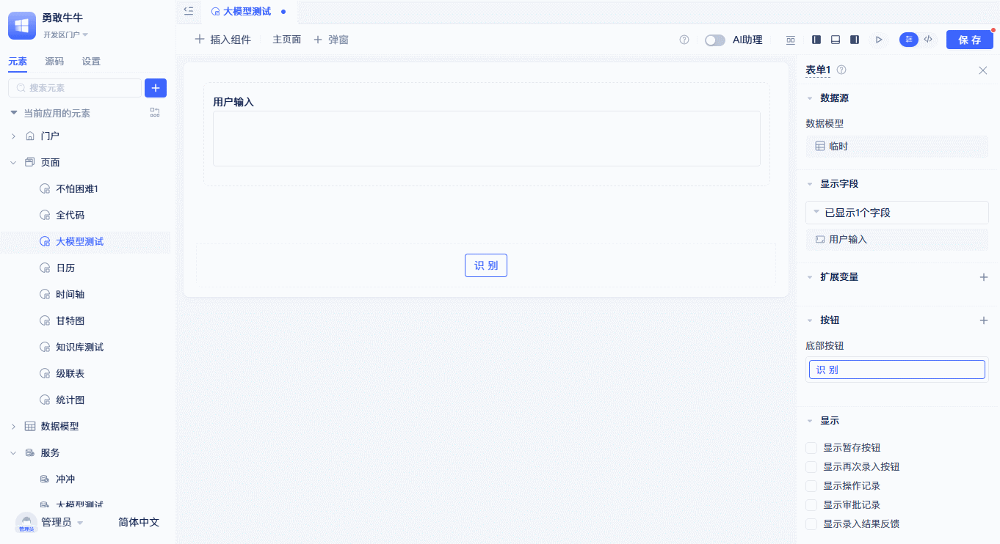
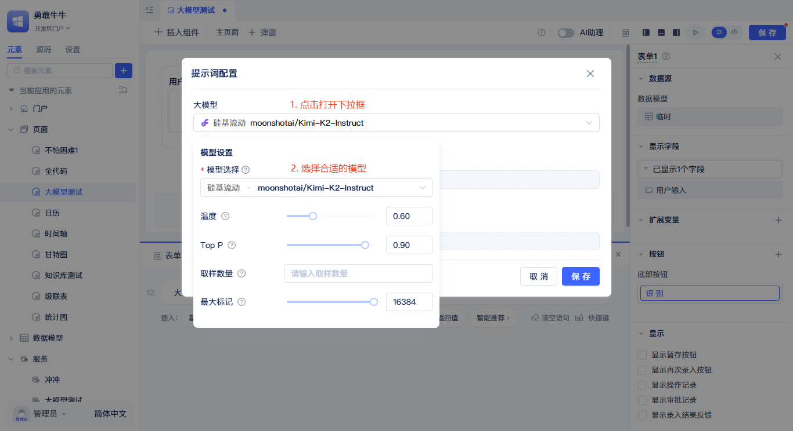
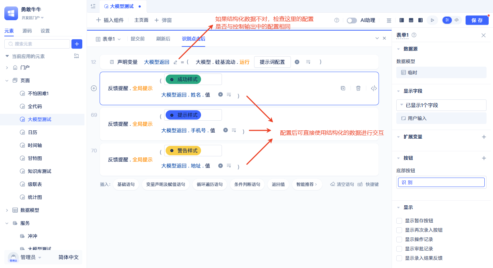

# AI大模型

随着AI技术快速发展，现代应用系统正在经历智能化革命。然而，面对众多的AI服务提供商和不断更新的模型版本，开发者往往面临选择困难和集成复杂性的挑战。

大模型厂商元素正是JitAi平台为解决这一问题而设计的统一AI接入方案。无论您要构建智能[AI知识库](./AI知识库.md)、开发AI助理、还是创建自主决策的Agent，它都能提供稳定可靠的大模型服务支撑。

以上图为例，使用大模型提取快递信息中的姓名、手机号，地址。

## 主流大模型厂商支持列表
*   Anthropic
*   阿里云百炼
*   Deepseek
*   Gemini
*   OpenAI
*   硅基流动
*   OpenAI兼容

## 大模型厂商元素的创建

在元素目录树上点击搜索框右边的`+`按钮，在弹出的菜单中选择`AI大模型`，根据实际情况再选择对应的大模型厂商，选择完成后会弹出如下弹窗。

在弹窗中，填入名称，然后到对应模型厂商的配置页添加一个API Key(不知道地址的可以点击左下角的`获取API Key`)，然后再将API Key填入这里，点击`保存`按钮完成创建。
API Key可以通过点击右上角的按钮使用环境变量，避免泄露。
:::tip
API URL一般不需要修改，每个厂商的默认配置已经填写。
:::

创建完成后会在左侧元素树中显示。

## 重试及备用API Key机制
为了避免单个密钥速率限制、请求过多等限制导致模型调用失败，我们提供了重试及多密钥机制。最大重试3次，每次重试的等待时间分别为1秒、2秒、4秒。如果配置了多个API Key，每次重试都会轮询到备用的API Key。这意味着系统不会在同一个失效的Key上反复尝试，而是智能地切换到备用Key来提高成功率。如果只有一个API Key，系统将会在这个Key上尝试4次(1次调用 + 3次重试)。

在界面上点击`开启备用密钥`-`+备用密钥`就可以添加一个密钥输入框，将你的备用没要密钥填入，然后点击`保存`即可。

## 私有化大模型集成
为了信息安全，开发者可能会部署私有化模型，平台同样支持私有化模型集成。

私有化模型使用OpenAI兼容元素进行连接，以Ollama为例，默认地址为`http://127.0.0.1:11434/v1`，若有API Key则填入，需要注意的是，私有化模型要开启`开启自定义模型`配置项，并输入完整的模型名称，如：qwen3:0.6b、nomic-embed-text。

:::tip
支持OpenAI接口的厂商，都可以使用OpenAI兼容元素进行连接，下图以火山引擎的豆包为例作为参考。
:::

## 在页面中调用大模型
在页面函数及事件函数逻辑里，开发者可以使用大模型厂商元素的运行函数来调用大模型，获取大模型返回值。

点击组件右上角的`事件`，点击事件面板中空白语句上的`请选择`文案，在面板中选择`大模型`-`大模型厂商`，完成后会生成大模型厂商运行函数，点击`提示词配置`，会弹出大模型`提示词配置`面板。

### 设置大语言模型

在`提示词配置`弹窗中，首先要选择使用的大模型，点击大模型选择框，在弹出的下拉面板中选择对应的大模型即可。选择模型后会自动匹配对应模型的参数，开发者可根据具体模型的特性进行修改。
:::tip
不同模型支持的配置参数不同，但是一般都支持温度参数，温度参数是最重要的参数之一，开发者可根据业务情况来选择合适的温度参数从而控制模型生成的随机性。
:::

### 使用提示词
提示词是决定大模型输出质量的关键。系统提示词总是作为第一个提示词输入，一般用于定义模型的角色、行为准则、语气风格、安全限制等。用户提示词作为第二个提示词输入，一般用于描述用户意图、需求、上下文等。

点击`+添加消息`可以添加新的提示词输入框，左上角的下拉菜单可以切换提示词类型，系统提示词不允许修改类型，也不允许删除。开发者可根据大模型的用途自行规划提示词的内容，填入到不同类型的提示词输入框中。
点击右上角`插入变量`按钮，可将页面变量内容插入到提示词中，变量内容可以动态改变提示词的内容，从而控制大模型输出。

### 控制输出
开发者如果想控制输出的格式，无需在提示词中描述，使用下图的`控制输出`配置即可实现。

例如图中展示的是提取快递信息中的姓名、手机号、地址。

为了控制大模型结构化输出这三个信息，可以依次点击`输出格式`，在弹出的面板中点击`添加输出结果`，再根据业务情况依次填写名称、标题和类型。注意这里填写的名称尽量和你的业务名称一致或者有关联，比如要提取`姓名`，那么就添加一个`姓名`的输出。系统会根据配置生成一份标准的`控制输出`提示词，如下图。

:::tip
若不配置控制输出配置项，默认输出的是文本。
:::
配置完成后，开发者可以使用结构化的返回数据在函数语句中与其他业务逻辑进行交互。

:::warning 注意
若大模型返回的数据结构正确，仍然拿不到结构化数据的值，检查图中铅笔所示的位置，查看配置是否与大模型提示词`输出格式`的配置保持一致。
:::

## 在后端函数中调用大模型
大模型运行函数不仅可以在前端页面中使用，也可以在后端函数(服务函数/模型函数/事件函数/任务函数)中使用。

配置参考[在页面中调用大模型](#在页面中调用大模型)

## 大模型编程接口
### runLlm
AI大模型的核心方法，用于发送请求到大模型服务。[API文档](../../reference/开发框架/JitAi/AI大模型.md#runllm)

### embedDocuments
AI大模型的文档向量化方法，用于将文本列表转换为高维向量表示。[API文档](../../reference/开发框架/JitAi/AI大模型.md#embeddocuments)

### rerankDocuments
AI大模型的文档重排方法，用于基于查询文本对候选文档进行重新排序。[API文档](../../reference/开发框架/JitAi/AI大模型.md#rerankdocuments)

