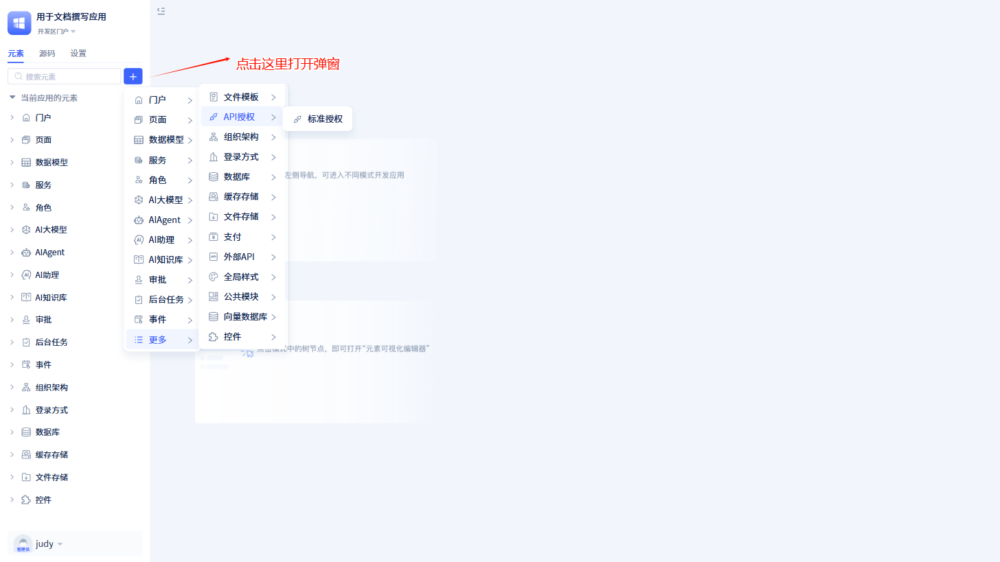

# API 授权

API 授权（API Authorization）是控制应用程序编程接口（API）访问权限的过程，旨在确保只有被授权的用户、客户端或服务能够访问特定资源或执行特定操作。

JitAi 提供了 API 密钥管理、API 访问权限控制、API 调用监控等功能，帮助开发者灵活地定义和管理不同层级的权限规则，并集中处理 API 调用前的权限验证逻辑。

## API 授权的创建

在左侧元素树上点击`+`会打开弹窗，将鼠标移动到“更多”中，会看到“API 授权”。点击“API 授权”里面的“标准授权”，就会打开标准授权的新建弹窗页面。

在标准授权的新建弹窗页面中，填写 API 授权名称和 accessKey 后，点击`保存`即可创建一个新的 API 授权。

:::tip 提示
accessKey 是 API 授权的密钥，是由 8-32 位字母或数字组成的字符串，不能包含特殊字符。

在创建 API 授权之前，系统会先根据 accessKey 生成 accessSecret。accessKey 和 accessSecret 是 API 授权访问的凭证。

:::

## API 访问权限控制

开发者可以通过对授权接口的控制，从而实现对 API 授权的访问权限控制。

在开发者在新建 API 授权弹窗里点击`确认`后，页面会跳转到授权列表页面，并显示刚创建的授权信息。

在授权信息展示的调用 url 就是授权接口的调用地址，其他应用如果想访问该 API，则通过该 url 进行调用。

目前系统仅支持服务中的接口开放，各个接口独立配置授权。如果想提供哪些服务功能，在对应的接口名称前面进行选中授权即可。如果要提供全部服务，点击右上角的“全部授权”即可。

:::warning 注意

在授权页面，开发者可以修改 accessKey。但是修改完 accessKey 后，请务必重新生成新的 accessSecret。否则校验将无法通过。

:::

## API 调用监控

当其他应用通过 url 调用该 API 时，会记录 API 调用信息，可以看出 API 调用情况。

点击 API 详情右上角的`调用记录`，打开调用记录弹窗。

在调用记录弹窗可以查看接口地址、调用时间、调用 IP、调用结果等信息。

## SDK 集成指南

开发者配置好授权信息和授权接口后，可以通过 SDK 继承，从而生成 SDK 安装包给其他应用使用。

JitAi 提供了 python、nodejs、java 三种语言的 SDK。

在授权页面中点击`下载SDK`，可以查看 SDK 使用指南和下载地址。
