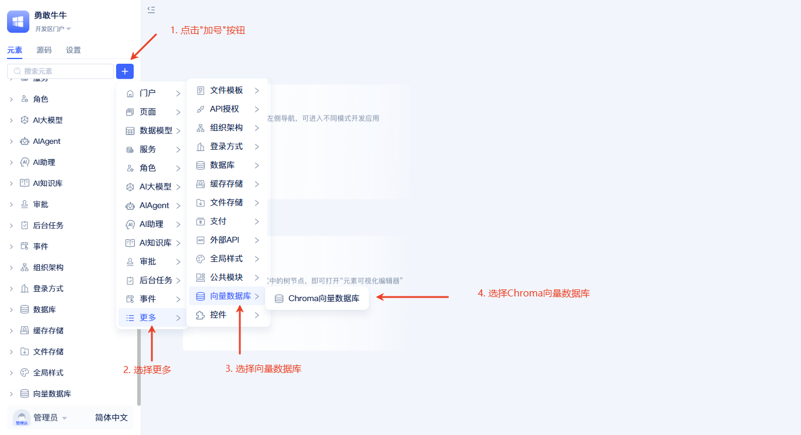
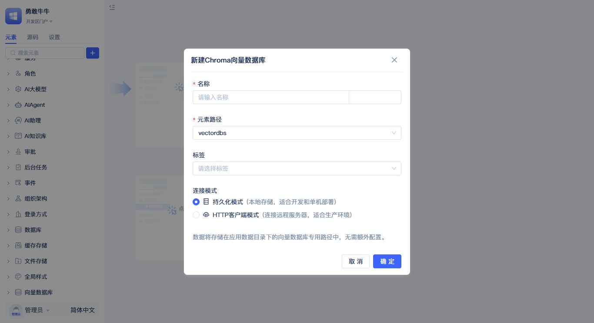

# 向量数据库

向量数据库是JitAi平台中用于存储和检索知识库内容的核心组件，是[AI知识库](./AI知识库.md)元素的底层存储引擎。

通过配置向量数据库，[AI知识库](./AI知识库.md)可以将文档内容转换为向量数据存储。这种存储方式使得应用能够基于语义相似度快速检索相关知识，为智能问答、内容推荐等功能提供强大的数据支撑。

:::tip
向量数据库默认使用`余弦相似度`作为距离度量算法，该算法特别适用于文本语义相似性计算。
:::
## Chroma向量数据库

Chroma是JitAi平台默认集成的向量数据库，它具有轻量级、易部署、高性能的特点，支持余弦相似度、欧几里得距离等多种相似性度量算法。它既可以作为嵌入式数据库在本地运行，也可以部署为独立服务支持远程访问，为不同规模的应用提供灵活的向量存储解决方案。

### 本地向量数据库配置
本地向量数据库采用内置存储方式，数据直接保存在JitAi平台的本地环境中。这种模式无需额外的数据库服务器，开箱即用(只需配置名称即可)，适合小规模应用和开发测试场景。

输入`名称`，`连接模式`选择`持久化模式`，点击`保存`即可创建本地向量数据库。

### 远程向量数据库连接
远程向量数据库通过连接外部独立部署的Chroma数据库服务来存储和检索数据，适合生产环境以及集群方式部署的应用服务。

除了配置`名称`外，还要配置`数据库地址`、`端口`、`超时时间`、`认证令牌`。

## 向量数据库编程接口

### health_check
检查向量数据库的连接状态和运行健康情况，返回数据库基本信息。[API文档](../../reference/开发框架/JitAi/向量数据库.md#health_check)

### create_collection
在向量数据库中创建新的集合，用于存储和管理相关的向量数据。[API文档](../../reference/开发框架/JitAi/向量数据库.md#create_collection)

### add_vectors
将向量数据及其元数据存储到指定的集合中。[API文档](../../reference/开发框架/JitAi/向量数据库.md#add_vectors)

### query_vectors
基于查询向量在集合中搜索最相似的向量数据。[API文档](../../reference/开发框架/JitAi/向量数据库.md#query_vectors)

