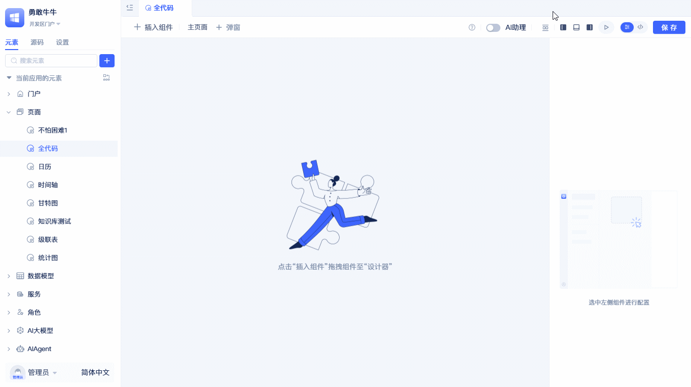
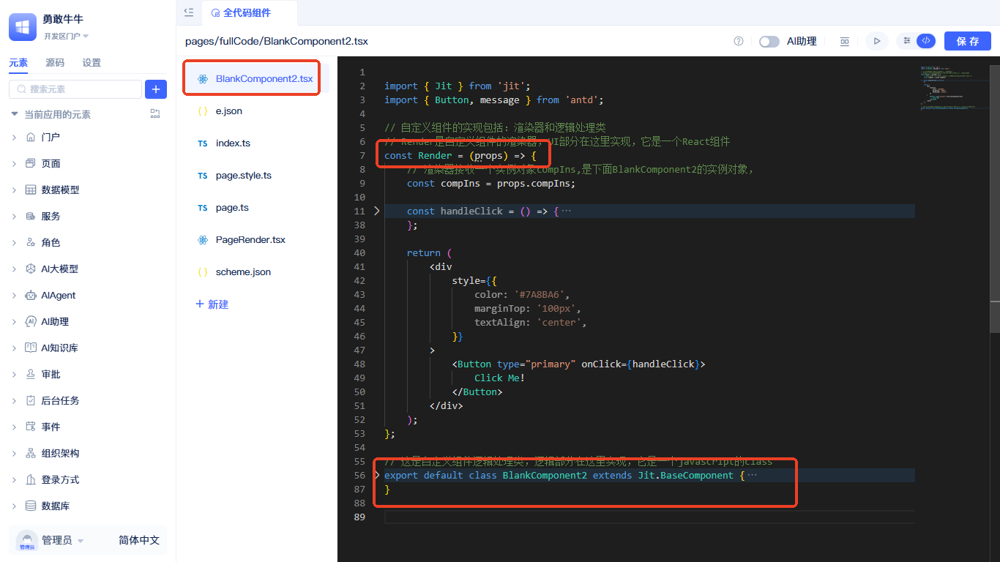
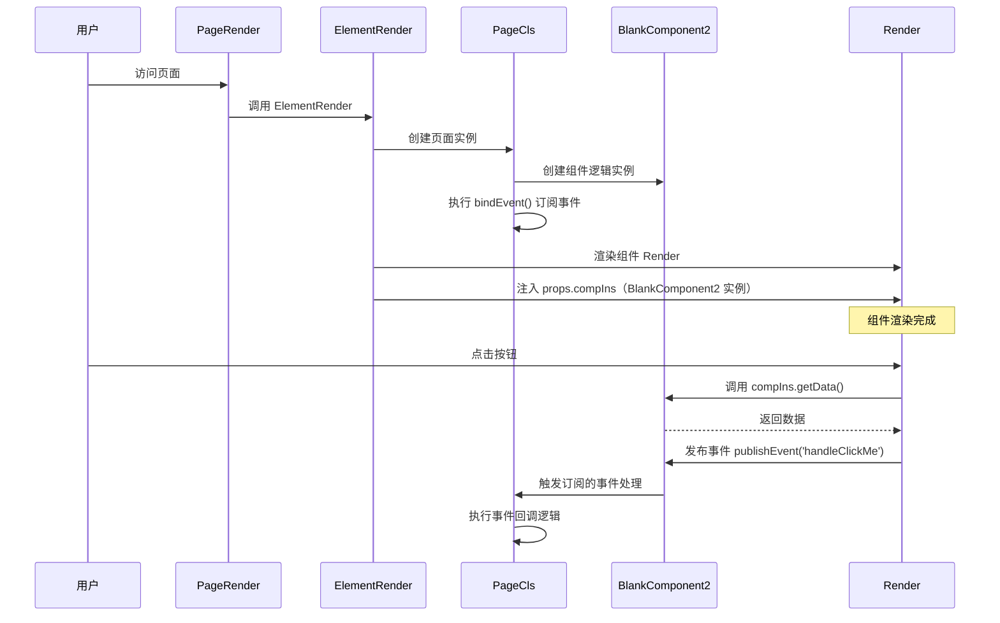

import Tabs from '@theme/Tabs';
import TabItem from '@theme/TabItem';

# 全代码组件

全代码组件是一种特殊类型的组件，它可以实现任何功能，但需要编写完整的组件逻辑；通过自定义界面、逻辑、样式及对模型数据的各种操作来扩展功能。全代码组件基于 React 开发，因此需要熟悉 React 开发知识。

:::tip
与自定义组件类型不同的是，全代码组件的适用范围是当前页面，而自定义组件类型可以在多个页面中重复使用。全代码组件适合一些快速验证，需求灵活多变的场景。
:::

## 创建全代码组件

在可视化页面编辑器中选择全代码组件，将全代码组件拖拽到页面画布中，就生成了一个全代码组件。生成的组件文件为 `BlankComponent2.tsx`，界面上展示一个居中的“Click Me!”按钮；点击后会触发 `handleClickMe` 事件，并通过 `message.success` 弹出“so cool !!!”。

## 界面渲染器 Page 与逻辑处理类



平台已把页面装配过程封装为黑盒：`ElementRender` 会渲染页面上每个组件的渲染器（Render），并将对应的“组件逻辑实例”通过 `props.compIns` 注入。开发者只需掌握 Page、Render、逻辑类三者关系及最小代码即可上手。

- 页面渲染器（`PageRender.tsx`）：调用平台提供的 `ElementRender` 渲染整页。
- 页面类（`page.ts`）：持有各个组件的“逻辑实例”，在 `bindEvent()` 中集中订阅组件事件等页面级逻辑。
- 组件文件（`BlankComponent2.tsx`）：包含组件渲染器 `Render`（React）与逻辑处理类（继承 `Jit.BaseComponent`）。平台会把逻辑实例作为 `props.compIns` 传入 `Render`。

最小接入代码：

<Tabs>
  <TabItem value="index" label="index.ts" default>

```ts
import PageCls from "./page";
import Render from "./PageRender";

export { PageCls, Render };
```

  </TabItem>
  <TabItem value="pageRender" label="PageRender.tsx">

```tsx
import { ElementRender } from 'jit-widgets';
import { pageStyle, pageGlobalStyle } from './page.style';

export default (props) => (
  <ElementRender
    pageStyle={pageStyle}
    pageGlobalStyle={pageGlobalStyle}
    {...props}
    elementPath="pages.GridPageType"
  />
);
```

  </TabItem>
  <TabItem value="page" label="page.ts">

```ts
import type { ComponentPageScheme } from "jit";
import { Jit } from "jit";
import schemeJson from "./scheme.json";
import BlankComponent2 from "./BlankComponent2";
type BaseComponent = InstanceType<typeof Jit.BaseComponent>;

class PageCls extends Jit.GridPage {
  // 名称需与 scheme.json 中组件 name 一致："BlankComponent2"
  BlankComponent2!: BaseComponent = new BlankComponent2();
  scheme: ComponentPageScheme = schemeJson;

  // 页面级事件订阅
  bindEvent() {
    // 订阅组件渲染器中通过 compIns.publishEvent 发布的事件
    this.BlankComponent2.subscribeEvent('handleClickMe', async () => {
      // 这里可调用服务、更新页面变量、提示信息等
      // console.log('收到事件 handleClickMe');
    });
  }
}

export default PageCls;
```

  </TabItem>
  <TabItem value="component" label="BlankComponent2.tsx">

```tsx
import { Jit } from 'jit';
import { Button, message } from 'antd';

// 组件渲染器：接收 compIns（逻辑实例），负责 UI 与交互
const Render = (props) => {
  const compIns = props.compIns;
  const handleClick = () => {
    // 1) 调用逻辑方法
    message.success(compIns.getData());
    // 2) 发布事件，供页面或其他组件订阅
    compIns.publishEvent('handleClickMe');
  };
  return (
    <div style={{ color:'#7A8BA6', marginTop:'100px', textAlign:'center' }}>
      <Button type="primary" onClick={handleClick}>Click Me!</Button>
    </div>
  );
};

// 逻辑处理类：对外暴露方法、事件等
export default class BlankComponent2 extends Jit.BaseComponent {
  // 将渲染器挂到逻辑对象上
  Render = Render;

  // 对外提供的方法，可被页面/其他组件调用
  getData() {
    return 'so cool !!!';
  }
}
```

  </TabItem>
  <TabItem value="scheme" label="scheme.json">

```json
{
  "layout": [
    {
      "i": "BlankComponent2",
      "x": 0,
      "y": 0,
      "w": 48,
      "h": 30
    }
  ],
  "componentList": [
    {
      "fullName": "components.BlankComponent",
      "type": "components.BlankComponent",
      "name": "BlankComponent2",
      "title": "全代码组件2",
      "config": {
        "requireElements": []
      },
      "showTitle": true,
      "eventList": [],
      "functionList": [],
      "variableList": []
    }
  ],
  "autoIncrementId": 4,
  "variableList": [],
  "functionList": [],
  "matchUarParamsVariableNameList": []
}
```

  </TabItem>
</Tabs>

运行时序



- `PageRender` 渲染 `ElementRender`，平台据 `scheme.json` 生成组件树。
- 平台创建 `BlankComponent2` 的逻辑实例，把它作为 `props.compIns` 传入其渲染器 `Render`。
- `Render` 可通过 `compIns` 调用逻辑方法、发布事件；`page.ts` 的 `bindEvent()` 里可订阅这些事件实现联动。

## 通过组件实例调用其他组件

在全代码组件中，你可以很方便地调用同一页面中其他组件的方法。**核心思路是：页面类作为"中央调度器"，管理着所有组件实例**。

调用原理：

想象页面就像一个"指挥中心"，所有组件都在这个中心注册了自己：

```typescript title="page.ts 中的组件注册"
class PageCls extends Jit.GridPage {
    Table3!: BaseComponent;          // 表格组件实例
    BlankComponent2!: BaseComponent; // 自定义组件实例
    // ... 其他组件实例
}
```

每个自定义组件都能通过 `compIns.page` 访问到这个“指挥中心”，进而调用其他组件：

```typescript
// 在自定义组件的 Render 中
const compIns = props.compIns; // 当前组件实例
const page = compIns.page;     // 访问页面“指挥中心”

// 调用其他组件的方法
page.Table3.call();            // 刷新表格数据
```

## 响应其他组件的事件

当页面上的其他组件发生事件时（比如表格行被点击、按钮被按下），你的自定义组件可以"监听"并响应这些事件。**核心思路是：在页面类的 `bindEvent()` 方法中统一订阅事件**。

### 事件订阅原理

页面类不仅管理组件实例，还负责协调组件间的事件通信，就像一个“消息中转站”：

```typescript title="page.ts 中的事件订阅"
class PageCls extends Jit.GridPage {
    Table3!: BaseComponent;
    BlankComponent2!: BaseComponent = new BlankComponent2();

    bindEvent() {
        // 订阅表格的行点击事件
        this.Table3.subscribeEvent('clickRow', (data) => {
            // 当表格行被点击时，通知自定义组件
            this.BlankComponent2.handleTableRowClick(data);
        });

        // 订阅自定义组件的事件
        this.BlankComponent2.subscribeEvent('handleClickMe', () => {
            // 可以在这里执行页面级逻辑
            console.log('收到自定义组件的点击事件');
        });
    }
}
```

### 在自定义组件中响应

要让自定义组件能响应其他组件的事件，需要在组件类中添加对应的方法：

```typescript title="BlankComponent2.tsx"
export default class BlankComponent2 extends Jit.BaseComponent {
    Render = Render;

    // 响应表格行点击事件的方法
    handleTableRowClick(rowData) {
        // 获取点击行的数据
        const rowId = rowData?.id?.value;
        message.info(`表格行被点击，ID：${rowId}`);

        // 可以触发组件重新渲染或执行其他逻辑
        this.setState({ selectedRowId: rowId });
    }

    getData() {
        return 'so cool !!!';
    }
}
```

### 可订阅的事件

每个组件可订阅的事件来自 `scheme.json` 中该组件的 `eventList` 配置。例如，表格组件常用事件：

- `clickRow` - 点击行事件，传递当前行数据
- `selectedChange` - 选中行变化事件，传递选中行列表
- 自定义组件可通过 `publishEvent()` 发布自己的事件

### 双向通信示例

```typescript title="完整的双向通信示例"
// 在自定义组件中发布事件
const Render = (props) => {
    const compIns = props.compIns;

    const handleClick = () => {
        // 1) 发布事件给页面
        compIns.publishEvent('customButtonClick', { message: 'Hello' });

        // 2) 同时调用其他组件方法
        compIns.page.Table3.refresh();
    };

    return <Button onClick={handleClick}>交互按钮</Button>;
};

// 在页面类中处理
bindEvent() {
    // 监听自定义组件事件
    this.BlankComponent2.subscribeEvent('customButtonClick', (data) => {
        console.log('收到自定义组件消息:', data.message);
        // 可以继续操作其他组件
        this.Table3.call();
    });
}
```

:::tip
这种事件机制实现了松耦合的组件通信：组件只需发布事件，不用关心谁在监听；页面类统一协调所有事件，便于管理复杂的组件交互逻辑。
:::
