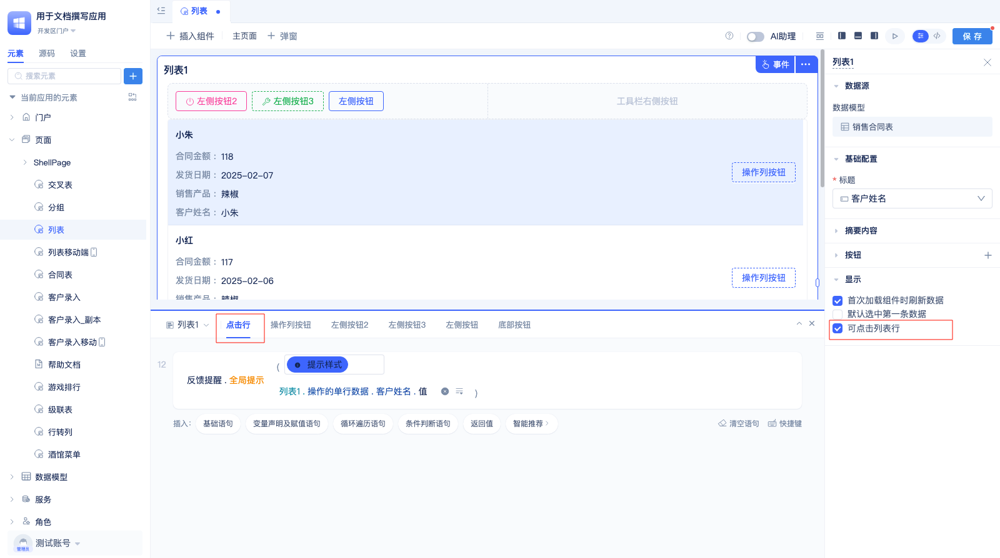

# 列表组件

列表组件以列表形式展示数据，支持标题、摘要、按钮等灵活配置，适用于各类列表展示场景，如新闻列表、消息列表、任务列表等，比如在企业管理系统中展示员工信息。

## 配置列表标题

在[页面编辑器](../门户与页面开发/组件化页面开发.md#可视化页面编辑器)中拖入列表组件后，会默认使用数据表模型中的第一个字段作为字段标题。用户可以按照下面操作修改标题：

点击当前标题字段名称，在下拉框中选择新的字段作为标题。

## 设置摘要内容

列表组件会默认将除主键id外的第一个字段设为摘要内容。用户可以根据实际需求重新配置摘要内容，支持多选。

点击配置区”摘要内容“栏下的“已显示X个字段”，在左侧弹出的面板中，勾选要展示的摘要字段。

## 摘要中显示字段标题

列表组件默认不会勾选 “显示字段标题”。

用户可在摘要内容配置栏下勾选 "显示字段标题"。

## 设置摘要内容布局

列表组件默认采用纵向布局。在此布局下，字段标题和内容上下排列：

用户可在"字段布局"配置栏中切换布局方向为"横向"， 这样标题和内容就会左右排列：

## 按钮

JitAi不仅可以展示列表，还可以为列表添加按钮来增强交互能力。列表组件的按钮分为以下三种类型：

- **工具栏按钮**：位于列表顶部，常用于处理公共逻辑。
- **底部按钮**：位于列表底部，常用于处理公共逻辑。
- **操作列按钮**：位于列表的每一项中，一般处理与本行数据有关的逻辑。

### 添加按钮

点击配置区中 “按钮”右侧的 `+`按钮，在弹出框中选择按钮类型，然后配置按钮属性后点击确定。

### 修改按钮属性

在配置完按钮后，开发者可以二次修改按钮属性：

在配置区按钮列表中，点击按钮名称，弹出按钮配置的对话框：

在对话框中，可重新设置按钮名称，图标，按钮类型和按钮颜色。点击确定，即可在编辑区预览按钮。

### 按钮收起到更多

当按钮太多时，可以把按钮收起到”更多“按钮中，让页面更简洁。

鼠标放到按钮名称上，按钮右侧出现按钮操作图标，点击”收起至更多“。即可将按钮收起。

### 按钮拖拽排序

JitAi支持拖拽调整按钮顺序。

鼠标放到按钮列表的按钮上，按钮右侧会弹出操作图标，鼠标放到最后一个图标上，鼠标变成 ✛ 后拖拽调整按钮顺序。

### 设置底部按钮大小

添加底部按钮后，会在配置区出现”底部按钮大小“的配置项。默认大小为”中“，用户可以自行调整为其他大小。

## 首次加载组件时刷新数据

 本配置项是指页面上列表渲染完后，是否走查询接口获取数据。默认勾选，当需要跟[筛选器](./筛选器组件.md)配合使用时，可不勾选，在筛选器组件中调用列表的刷新方法根据筛选条件更新数据。

## 可点击列表行

本配置项用于控制点击列表行时是否触发”点击行“事件，默认勾选。

本示例中，点击行时，弹窗展示操作的单行数据的客户名称的值，使用效果如下：

## 默认选中第一条数据

本配置项用于在组件渲染后自动点击第一条数据。

在配置区”显示“栏中，可勾选本配置，勾选后效果如下：

## 显示行间距

用于控制列表每条数据之间是否显示间距，只在**移动端**有这个选项。

在配置区，"显示"配置项下，勾选 "显示行间距"。

勾选后效果：

## 列表事件

事件用于处理交互逻辑，常用的场景如下： 列表顶部的操作栏中点击按钮后刷新列表或者新增一条列表数据，列表的操作列按钮点击后在弹窗中编辑当前数据。列表事件支持”点击行“事件和按钮事件。

## 点击行事件

点击列表中每一行后触发的事件。下图配置中，当我点击行后，打开”新增数据弹窗“，弹窗中的表单设置为”编辑“状态，然后把操作的数据的值赋值给表单。

下图是弹窗中的表单

下面是使用效果：

## 按钮事件

当开发者在配置区配置按钮后，在事件编辑区会显示对应的按钮事件。相比于点击行事件，按钮可以有很多个，而且功能更强大。可通过按钮手动刷新列表。

[按钮刷新列表](#刷新列表)

 ## 列表组件变量

List组件提供以下变量用于访问数据和状态：

- **displayRowList**：当前展示的数据行列表
- **activeRow**：当前操作的单行数据  
- **filter**：当前筛选条件

 

 ## 列表组件方法

 ### 刷新列表

 列表组件自带刷新方法，可通过按钮或者其他组件触发。

 

 在事件编辑区，点击”请选择“， 鼠标放到列表名称上，选择”刷新“方法即可。开发者可以根据需要继续设置刷新的筛选条件。

  效果如下：

