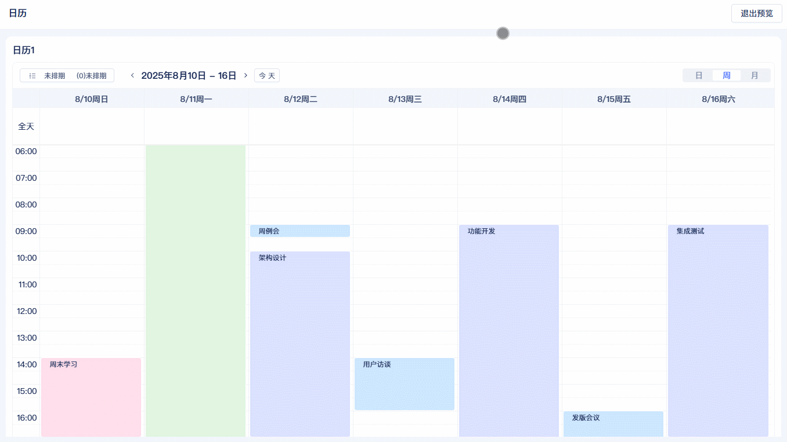
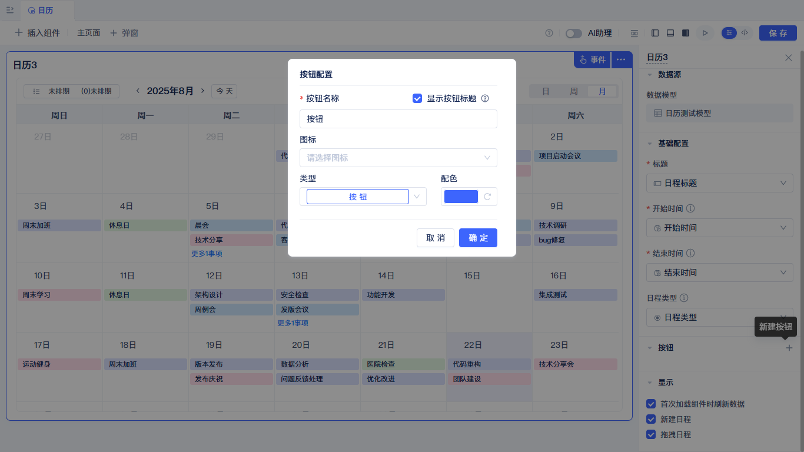

# 时间管理组件

## 日历

以日历形式展示你的数据，按时间线组织和管理信息，直观显示任务、会议、活动等时间相关事项。支持拖拽、点击等便捷交互操作，常见于OA系统、项目管理及预约类应用。

### 数据模型准备及组件创建

日历组件的数据模型，需要配置开始时间、结束时间及标题。开始时间和结束时间配置的字段类型项必须是日期/日期时间，标题配置项的字段类型必须是单行文本/手机/流水号/身份证/选项单选/下拉单选/车牌号/自增整数，日程类型配置项的字段类型必须是下拉框单选/选项组单选。准备好对应配置项的字段，即可到可视化页面编辑器中创建日历组件。
:::warning
开始时间和结束时间配置项必须是同一种类型，即全是日期或日期时间。
:::

在可视化页面编辑器中选择日历组件，将日历组件拖拽到页面画布中，会弹出选择数据模型弹窗，在弹窗中配置数据模型，点击确定，在右侧组件配置标题、开始时间、结束时间，这三个配置项是必填配置。

### 基础配置

可视化组件配置界面，主要分为预览区和配置区，预览区会实时显示组件当前配置的效果。日历组件显示的文字会对应标题配置项，文字的开始结束位置分别由开始时间和结束时间配置项控制。

### 日程类型

配置日程类型，可以改变任务背景展示颜色，日程类型对应的字段颜色，在数据模型配置中修改。

### 日/周/月视图切换

日历组件支持三种不同的视图：日/周/月，可以在右上角进行切换，组件初始化时默认显示月视图。

### 切换时间

点击日历组件左上角时间两端的"箭头"按钮，可以切换日期，查看不同日期的数据，切换日期的跨度与当前视图匹配，即日视图为日，周视图为周，月视图为月。点击"今天"按钮，可快速跳转到今天对应的日期。

### 列表展示及搜索

点击左上角排期按钮，可以打开列表面板，数据分为全部数据、已排期、未排期，顶部输入框支持搜索。

### 拖拽排期

拖拽左侧列表中数据项，可以拖放到日历组件中，拖拽完成后数据会自动保存到数据模型。
:::warning
拖拽排期功能需要开启"拖拽日程"的配置
:::

### 按钮配置

日历组件的按钮区域分为两部分，日历组件顶部的工具栏按钮以及列表视图中右侧的操作栏按钮。

按钮支持配置名称，图标，类型，颜色。

按钮支持新增、删除、修改、排序，工具栏按钮如果数量过多支持折将按钮叠到"更多"中。每添加一个按钮，就会在事件面板中生成一个按钮事件，开发者可以自己编辑事件逻辑。当事件过多不好定位时，可以点击按钮上的"小手"图标快速打开当前按钮的事件面板。

### 首次加载组件时刷新数据
下图展示开启"首次加载组件时刷新数据"配置，组件在页面中渲染后会主动加载数据，关闭"首次加载组件时刷新数据"配置，组件渲染后不会主动加载数据。

:::tip
关闭"首次加载组件时刷新数据"配置，可配合其他事件主动调用组件的刷新。如下图：在可视化页面编辑器中，添加一个按钮组件，打开按钮事件面板，在"按钮点击后"选项卡配置日历组件的刷新函数，可以实现点击按钮后，日历组件加载数据。
:::

### 新增日程

如果勾选"新增日程"，则在鼠标经过对应日程时会出现一个"加号"按钮，同时在事件面板中会出现"新建日程后"的事件，开发者可以自己编辑事件逻辑。如图：配置了全局提示函数，当点击加号按钮时会弹出一个"hello world"。

### 拖拽日程

如果勾选"拖拽日程"，则在日历中可以拖拽日程修改排期，还可以拖拽列表中的数据项添加排期，同时在事件面板中会出现"拖拽日期后"的事件，开发者可以自己编辑事件逻辑，如图：配置了全局提示函数，当拖拽结束时会弹出一个"hello world"。

## 时间轴

以时间轴形式展示你的数据，按时间顺序线性组织和管理信息，直观显示项目进度、事件流程、历史记录等时序相关事项。支持滚动浏览、节点点击、状态筛选等便捷交互操作，常见于项目管理、工作流追踪、历史记录查看及进度监控类应用。

### 数据模型准备及组件创建

**覆盖特性：**

*   选择一个日期/日期时间类型的模型字段作为时间轴中的日期

*   配置在时间轴中显示的模型字段

*   选择一个下拉框单选或选项组单选类型的模型字段作为颜色类型

*   配置时间轴位于模型信息的左侧/中间/右侧三种布局方式

*   添加时间轴工具栏左右侧按钮并编写点击事件逻辑

*   禁用或启用首次加载时间轴时刷新数据

**内容要点：**

*   时间轴组件的数据展示

*   时间相关组件的配置技巧

## 甘特图

**覆盖特性：**

*   选择一个模型字段作为甘特图数据项标题

*   分别选择一个日期时间字段作为甘特图数据项的开始和结束时间

*   选择一个百分比类型的模型字段作为甘特图中事项的进度

*   分别选择一个关联数据类型的模型字段作为甘特图中事项的层级关系和先后关系字段

*   配置甘特图的默认时间视图（年/季/月/周/日）

*   配置甘特图中显示的模型字段列表并设置顺序

*   配置甘特图中浮层上显示的数据字段并设置顺序

*   添加甘特图工具栏按钮并编写点击事件逻辑

*   添加甘特图数据浮层上的操作按钮并编写事件逻辑

*   配置工具栏和操作列按钮收至更多或直接显示

*   设置是否允许通过拖拽修改结束日期

*   设置是否允许添加新的排期

**内容要点：**

*   项目管理中甘特图的使用

*   甘特图的配置和交互
