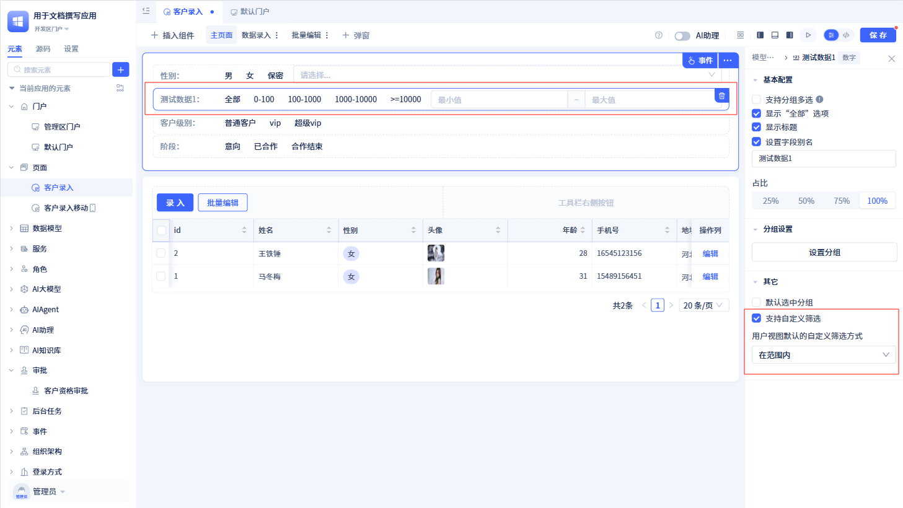

# 筛选器

筛选器是一种广泛使用的数据处理工具，主要用于从大量数据中筛选出满足特定条件的数据子集。允许用户自定义搜索参数，例如选择特定日期范围、价格区间或类别等，以展示符合用户需求的结果。

JitAi 提供了模型筛选器，可以针对特定的数据模型进行筛选。还提供了通用筛选器，在使用的时候再配置模型，可以做到一个筛选器对多个模型进行同时筛选。

## 模型筛选器

在页面可视化编辑器中点击“插入组件”，将“模型筛选器”组件拖拽到页面中。在数据源配置中选择数据模型，点击“确定”。

模型筛选器有三种操作模式，分别为：简单筛选、复杂筛选和自由筛选；默认模式为简单筛选。（移动端暂不支持自由筛选）

### 简单筛选

在简单筛选模式下，可以对各类型数据进行分组并以平铺的形式呈现在页面中。用户无需进行繁琐的输入操作，只需轻松地通过点击预设的各类分组标签，即可实现对海量信息的精准筛选与定位。

在简单筛选中，会对部分常用数据类型自动添加筛选字段，并提供内置的推荐筛选分组，如数字/金额的数值型分组，百分比的区间分组，选项组/下拉框的选项组分组等。

同时在此基础上，通过点击“已显示字段”来新增或删除筛选字段，再针对每个筛选字段配置不同的字段属性、分组等。

在页面配置区点击对应字段，会打开右侧字段配置面板，在这个面板可以对筛选字段进行更一步的配置。注意：每个筛选字段之间的逻辑关系为“与”的连接。

#### 基本配置

**支持多选**

    若勾选此项，该筛选字段在筛选的时候支持同时选中多个选项，每个选项间的逻辑关系为“或”的连接，符合其中一个选项的就会被筛选到。

若未勾选此项，那么该筛选字段在筛选的时候只能选择一个选项。

**显示“全部”选项**

    

    若勾选此项，在选项组中默认展示“全部”选项，且与其他选项之间互斥。

**显示标题**

    

    若未勾选此项，则筛选字段的标题将不显示。

**设置字段别名**

    

    若勾选此项，在下方会出现Input输入框，可输入字段别名。（注意：若不勾选“显示标题”，则无法设置字段别名）

#### 占比

在页面配置区可以对每个筛选字段通过拖拉的形式改变它的宽度，也可以在右侧配置区点击“占比”下的选项，对它设置预设的几个宽度比例。

#### 分组设置

对数据表模型的数据进行精细化分组，无论是处理离散型还是连续型变量，都能够实现数据的有序分类与整合。预设一些分组，如数字/金额的数值型分组，百分比的区间分组，选项组/下拉框的选项组分组，从而快速实现数据筛选。

点击“设置分组”会打开弹窗，对分组每个选项进行设置。分组包含三个要素：

-   分组名称：直接呈现在页面上的选项名，方便用户查看。
-   筛选方式： 针对每个分组设置指定的筛选方式。
-   筛选范围：设定分组在指定筛选方式下的范围，支持常量赋值和变量赋值。

:::tip 提示
筛选方式有很多种，如：包含任意一个、包含、不包含任意一个、不包含、等于任意一个、等于、不等于任意一个、不等于、开头为、结尾为、在范围内、\>、\<、\>=、\<=、属于、不属于、为空、不为空、选中、不选中等。但是每一种数据类型都有自己对应的筛选方法，并不是都会用到，具体要看数据类型详细介绍。
:::

#### 默认选中分组

预设选中状态，可以选择已有选项组中的某一个选项作为默认的筛选选项。

#### 支持自定义筛选

若勾选此项，可以通过选定的默认筛选方式对该字段进行自定义筛选。

#### 移动端差异

移动端下的简单筛选与 PC 端有些差异：

-   筛选配置项顺序调整：在右侧配置区，选中某个字段上下拖动进行排序
-   风格：移动端默认列表风格，最多展示三个筛选项，点击右侧图标可查看更多
-   排列方式：当选择“标签”风格时，可选择左右排列或上下排列

### 复杂筛选

复杂筛选相对于简单筛选而言灵活度更高，只需确定筛选字段，筛选方式由使用者自由选择，根据字段自身特性，可选择不同的筛选方式

复杂筛选新增筛选字段方式与简单筛选相同，也是通过勾选字段的方式，只是会生成每种数据类型相应的自定义筛选，且都会内置一种常用筛选方式作为默认方法

在复杂筛选的筛选字段配置中也只会提供最简单的“设置字段别名”，其他具体如何筛选由用户在实际使用时灵活改变

### 自由筛选

自由筛选是一种完全开放给用户自己配置的操作模式。它在复杂筛选的基础上放开了对于筛选字段的限制，用户可以任意选择筛选字段，同时基于字段选择想要的筛选条件，是灵活度最高的筛选模式

### 布局设置

筛选器（不包括自由筛选模式）可以通过“快捷操作”中的“快速布局”，可以对筛选器的配置项进行一行一列/一行两列/一行三列/一行四列布局。当然，用户也可以在页面配置区进行自行拖拽布局。

:::tip 提示
简单筛选模式下，还有一个“首次加载进行筛选”。勾选后，用户在打开页面时，会自动进行筛选。
:::

### 筛选器的使用

在页面配置区点击筛选器右上角“事件”按钮，打开事件配置面板。在“查询后”事件中，用户可以获取筛选后的值，再将这个值传递给其他组件实现筛选。

:::warning 注意
筛选器必须配置“查询后”事件，将筛选后的值传递给其他组件实现筛选。

筛选器通过“查询后”得到的结果是个 [Q 表达式对象](https://jit.pro/docs/reference/%E5%BC%80%E5%8F%91%E6%A1%86%E6%9E%B6/JitORM/Q%E8%A1%A8%E8%BE%BE%E5%BC%8F)，将该表达式对象传递给其他组件，其他组件会根据这个表达式对象进行筛选
:::

## 通用筛选器

通用筛选器相较于模型筛选器，最大的区别就是模型筛选器必须指定模型，而通用筛选器在配置的时候无需使用模型

### 筛选字段配置

通用筛选器默认不显示配置项，需要用户手动添加对应的筛选字段。添加后，在页面配置区点击相应的筛选字段，即可在右侧的配置区域看到该筛选字段的配置项。

:::tip 提示
通用筛选器中筛选字段的配置项和模型筛选器中的基本一致

由于通用筛选器没有模型，因此每个筛选字段会有“参数配置”选项。例如：单行文本可以限制字符长度，数字类型可以设置小数位数、单位等。
:::

### 快速布局

可以通过“快捷操作”中的“快速布局”，可以对筛选器的配置项进行一行一列/一行两列/一行三列/一行四列布局。当然，用户也可以在页面配置区进行自行拖拽布局。

### 显示 查询/重置 按钮

筛选器右侧出现查询/重置按钮，取消勾选则不显示这两个按钮。点击查询/重置按钮均会触发“查询后”事件方法。

### 条件变更后触发查询

默认情况下，当筛选字段的值发生变更是不会触发“查询后”事件。当用户勾选“条件变更后触发查询”复选框后，才会触发“查询后”事件。

### 首次加载进行筛选

默认情况下，当首次加载筛选器组件时，会触发“查询后”事件。用户可根据需求选择是否取消此功能。

:::tip 提示
若取消勾选“显示 查询/重置 按钮”，那么需要将“条件变更后触发查询”勾选，否则无法触发“查询后”事件
:::

### 筛选器的使用

通用筛选器和模型筛选器一样，需要在事件配置面板中配置“查询后”事件逻辑。注意的是，用户需要先指定数据表模型，调用通用筛选器的“获取筛选条件”方法，然后将筛选后的值传递给其他组件实现筛选。
