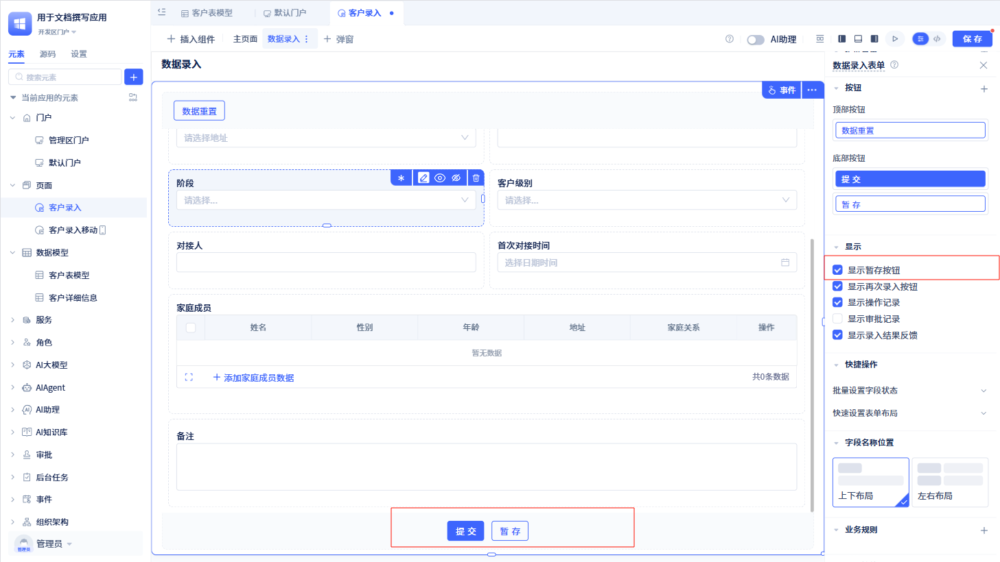

# 表单组件

表单，作为应用开发中最常用的组件。传统的表单只能用于收集、验证和提交用户输入的数据，而 JitAi 的表单组件不仅涵盖传统表单的功能，还提供了可视化设计、数据模型绑定、权限控制、业务规则配置等强大功能。只需拖拽操作，即可构建出具备复杂交互逻辑和数据处理能力的企业级表单应用。

## 基础配置与配置项管理

在页面可视化编辑器中点击“插入组件”，将“表单”组件拖拽到页面中。在数据源配置中选择数据模型，点击“确定”。

:::warning 注意
模型类型可以选择数据表、聚合表、扩展表，当选择聚合表时，数据不可提交。
:::

默认情况下，表单组件会展示该模型中的所有字段。当然，你也可以根据需求在页面右侧配置面板中的“显示字段”模块进行配置。

如果有些字段仅在该表单中使用到，但不需要提交到数据模型中。那么你可以通过“扩展变量”来实现。扩展变量和模型字段唯一区别就是它不会存储到数据模型中，扩展变量支持大部分数据类型，如单行文本、多行文本、数字等。

扩展变量默认添加到整个表单的最下面（底部按钮上面），字段名称默认为数据类型与序号组合。例如，我添加一个单行文本，字段名为“单行文本 1”，再次添加就是“单行文本 2”，以此类推。

:::tip 注意
所有字段在页面配置区面板中可以拖动位置，选中某个字段后再按住鼠标左键即可进行上下拖拽。
:::

### 配置项配置设计

在页面配置区点击对应字段，会打开右侧字段配置面板。

字段配置面板主要有以下配置项：

1. 字段名称：默认显示的是模型中字段标题，支持修改，也可以隐藏字段名称；对于扩展变量，字段名称默认为数据类型与序号组合。
2. 字段权限：可编辑、仅可见、隐藏；主键字段默认隐藏且不可编辑；在数据表模型中设置公式值字段默认只读，且不可编辑；关联字段下的字段默认只读，且不可编辑。
3. 字段编辑器/字段渲染器：默认使用系统自带的字段编辑器/字段渲染器，你也可以自定义字段编辑器/字段渲染器，然后在此选择自定义字段编辑器/字段渲染器。
4. 占比：该字段在表单中的宽度占比，默认 100%，即占满整行。
5. 校验：选择该字段是否需要必填限制。
6. 字段描述：仅数据表模型字段才可配置字段描述，可以设置在字段名称下方显示还是鼠标悬停时显示。
7. 参数设置：仅扩展变量支持参数设置，不同数据类型对应的参数配置也不一样（数据表模型字段参数设置在数据表模型中创建该字段时配置）。
8. 组件触发事件：当字段是可编辑状态，触发事件："XXX 字段"字段改变后，选中后，字段值的值发生改变后即可触发；当字段是仅可见时，触发事件："XXX 字段"点击后，选中后，字段在表单中是可点击的

部分字段会有特殊的配置：

#### 单行文本

    **输入时支持模糊匹配：** 开启后，用户输入内容时，会根据配置的选项进行模糊匹配，并给出匹配结果。

    **支持扫码录入：** 移动端专属，该功能开启后，用户再录入时，会自动打开手机摄像头，进行扫码，将扫码结果填入字段。

#### 选项组单选/下拉框单选

    显示的时候有两种模式：仅显示已选中选项和显示全部并选择部分突出显示。

:::tip 注意
注意显示模式仅当该字段只读时有效
:::

        **仅显示已选中选项**

          

        **显示全部并选择部分突出显示**

          

#### 图片

    显示的时候有两种模式：默认（一行四个展示）；按容器宽度缩放（占据容器 100%宽度）

:::tip 注意
显示模式仅当该字段为只读状态时生效，按容器宽度缩放仅当该字段只展示一张图片时生效
:::

**默认模式**

         

**按容器宽度缩放**

        

#### 关联单选

    关联单选在表单中显示的关联表的数据标题，可以对关联的数据设置筛选和下拉列表中显示的顺序

    **数据筛选：** 配置筛选条件，在请求关联数据的时候会通过筛选条件对数据进行过滤

    **数据排序：** 配置数据排序规则，对请求后返回的数据进行排序再展现给用户

#### 子表

    

    **可新增子表记录：** 勾选后显示新增子表的入口

    **可选择多行数据：** 勾选后子表的每行数据可选择

    **可删除选择的多行数据：** 勾选后出现批量删除按钮

    **可复制行数据：** 勾选后子表的每行数据可复制

    **可删除行数据：** 勾选后子表的每行数据可删除

    **可上移/下移子表顺序：** 勾选后子表的每行数据可上下移动

    **可插入子表数据：** 勾选后子表的每行数据前可插入数据

    **子表输入框开关：** 勾选后子表在新增和编辑模式下呈现编辑状态

    **子表显示字段：** 可设置子表中的字段的显示和隐藏，默认显示子表所有字段

    **业务规则：** 可针对子表的字段设置校验规则和编辑规则（如何设置参照表单主表的业务规则）

        -  校验规则：在表单提交时对子表中的字段进行校验，若不通过则组织表单提交或警告
        -  编辑规则：当满足编辑规则中的条件时，子表中的某些字段才可以进行编辑，否则为只读状态。

    **数据筛选：** 当表单处于新增或编辑模式下，对子表进行数据筛选，并展示筛选后结果。

    **按钮：** 除上面子表预设的按钮外，用户也可以为子表添加导航栏按钮和操作列按钮。

        

    **字段列宽调整：** 用户可以调整子表中每个字段的列宽。

    :::warning 注意
    所有的按钮都可以自定义按钮标题、类型等

    如果想勾选“可删除选择的多行数据”，需要先将“可选择多行数据”勾选
    :::

## 字段校验与交互

### 录入/查看/编辑模式

    表单有三种显示模式，分别是录入模式、查看模式和编辑模式；默认表单为录入模式。

    #### 录入模式

    

    录入模式下的表单为空表单，用户点击提交按钮后，数据表模型新增一条记录

    #### 查看模式

    

    查看模式下的表单中所有字段均为只读状态，且表单底部不会显示提交按钮。

    #### 编辑模式

    

    在编辑模式下，表单中所有字段呈现编辑状态，用户点击提交按钮后，数据表模型更新一条记录。

    

    可以在上级组件的事件配置中配置，在不同的事件上给表单的显示模式配置不同的值。

### 字段操作权限

#### 字段本身设置权限

    表单每个字段都可以设置权限，控制字段是否显示、是否可编辑、是否必填。

    

    可以在页面配置区点击每个字段右上角角标设置或进入右侧字段配置区进行设置。

    如果设置了隐藏，那么在使用的时候该字段将不再显示；如果设置了只读，那么在使用的时候该字段将只读，用户无法修改；如果设置了必填，那么在使用的时候该字段将变成必填项。

    

#### 字段规则设置权限

    表单主表可以设置四种规则：校验规则、显隐规则、必填规则、编辑规则。

    表单子表可以设置两种规则：校验规则、编辑规则。

    **校验规则**

        

        校验规则用于校验表单提交的数据是否符合规范，其配置项有：

        -   规则名称：校验规则名称，用于标识该条规则，方便用户查看和修改。
        -   校验条件：用于校验规则，当表单提交数据时需满足改条件才能提交成功。
        -   不符合校验规则时的处理方式：有两种。
            -   警告后仍可保存：表单提交的数据不满足校验条件，会有警告提示，点击“继续保存”，还是可以提交数据；点击“取消”，取消提交数据
            -   禁止提交：表单提交的数据不满足校验条件，将无法提交数据，并弹出错误提示
        -   不符合校验规则时的提示语：警告提示或错误提示中的内容

        :::warning 注意

        校验规则仅在表单的录入模式和编辑模式下才会生效

        当一个表单组件中有多个校验规则，从上往下依次校验“禁止提交”的规则，再依次校验“警告后仍可保存”的规则。
        :::

    **显隐规则**

        

        显隐规则用于表单数据满足一定条件才显示某些字段或布局控件。其配置项有：

        -   规则名称：显隐规则名称，用于标识该条规则，方便用户查看和修改
        -   校验条件：用于校验规则，当该条件满足时，下面配置的字段或布局控件会显示
        -   才显示的字段：当表单数据满足上面的校验条件，会在表单中显示的字段
        -   才显示选中的标签页/折叠面板/分割线：当表单数据满足上面的筛选条件，才会显示标签页/折叠面板/分割线，否则会是隐藏状态

        :::warning 注意

        显隐规则在表单的录入/编辑/查看模式中均会生效

        为了达到显隐规则效果，在不满足条件时或者表单初始状态，一般需要配置的字段是隐藏状态。所以，在保存显隐规则后，若字段在表单中的不是隐藏状态，会自动将字段设为隐藏。这不是强制的，你还是可以将字段改为非隐藏状态；

        在表单实际运行时，若表单数据不满足筛选条件，显隐规则不会将“才显示的字段”自动置为隐藏，保持为字段本身设置的状态；

        当一个表单组件有多个显隐规则，从上往下依次执行。

        :::

    **必填规则**

        

        必填规则用于表单数据满足一定条件时才必填某些字段。其配置项有：

        -   规则名称：必填规则名称，用于标识该条规则，方便用户查看和修改
        -   校验条件：用于校验规则，当该条件满足时，下面配置的字段会置为必填
        -   才必填的字段：当满足校验条件时，字段都会置为必填。

        :::warning 注意

        必填规则仅在表单的录入模式和编辑模式下才会生效

        为了达到必填规则效果，在不满足条件时或者表单初始状态，一般需要配置的字段是非必填状态。在保存必填规则后，若字段在表单是必填状态，会自动将字段设为非必填

        在表单实际运行时，若表单数据不满足筛选条件，必填规则不会将“才必填的字段”自动置为非必填

        当一个表单组件有多个必填规则，依次执行

        当必填的字段未满足显隐规则而被隐藏，则提交时不做必填校验

        :::

    **编辑规则**

        

        编辑规则用于表单数据满足一定条件时才可以编辑某些字段。其配置项有：
        -   规则名称：编辑规则名称，用于标识该条规则，方便用户查看和修改
        -   校验条件：用于校验规则，当该条件满足时，下面配置的字段会置为编辑状态
        -   才必填的字段：当满足校验条件时，字段状态置为可编辑状态。

        :::warning 注意

        编辑规则仅在表单的录入模式和编辑模式下才会生效

        为了达到编辑规则效果，在不满足条件时或者表单初始状态，一般需要配置的字段是只读。在保存必填规则后，若字段在表单中的编辑/隐藏状态，会自动将字段设为只读。这不是强制，你还是更改字段的状态

        在表单实际运行时，若表单数据不满足筛选条件，编辑规则不会将“才编辑的字段”自动置为只读，保持为字段本身设置的状态

        当一个表单组件有多个编辑规则，从左往右依次执行

        :::

#### 角色页面中设置权限

     当某些字段或按钮仅对某些角色可见时，可以在角色页面中设置权限。

### 字段描述显示

    

    在字段名称下方显示：在字段名称下方通过灰色小字显示字段的描述。

    

    鼠标悬停图标时显示：字段名称旁边有个灰色图标，鼠标悬停图标时显示字段的描述。

## 布局设计

    

    表单中每个字段都可以自行调节宽高。在页面配置区域，悬浮在字段上就会出现可调节宽高的图标。如果需要对整体布局进行调整，可以在右侧配置区域的“快速设置表单布局”中进行快捷操作。快速设置表单布局支持：一行一列、一行两列、一行三列、一行四列。

    另外，表单中字段名称和编辑器之间也可以调整为上下布局或左右布局；默认上下布局

    

    表单中除了可以添加字段，还可以添加按钮或标签页、折叠面板、占位符、分割线、二维码等布局控件。

    ### 按钮配置

        

        可以为表单添加顶部按钮、中部按钮和底部按钮，其中顶部按钮和底部按钮会固定在表单的顶部或底部。表单中添加按钮后，会在事件面板中增加对应的按钮事件

    ### 布局控件

        

        在表单右侧面板可进行添加布局控件，如标签页、折叠面板、占位符、分割线、二维码等。

        **标签页**

        

        在表单右侧添加标签页后，可自行调整标签页在表单中的位置。它的配置项有：

        标签页名称：方便识别，也可以在表单中隐藏标签页的名称

        位置：标签在表单标签页容器的相对位置

        风格：标签页风格，支持简约和卡片两种

        标签：默认三个标签，可以自行添加或删除标签

        **折叠面板**

        

        在表单右侧添加折叠面板后，可自行调整折叠面板在表单中的位置。它的配置项有：

        折叠面板名称：方便识别，也可以在表单中隐藏折叠面板的名称

        手风琴模式： 默认是选中状态，开启后每次只展开一个面板

        风格： 折叠面板风格，支持简约和卡片两种

        默认全部打开：勾选后折叠面板将全部展开，仅非手风琴模式下有效

        背景色：自定义面板中的背景颜色，默认为白色

        标签：默认三个标签，可以自行添加或删除标签

    :::warning 注意

        当使用标签页或折叠面板后，页面配置区所有字段的右上角会出现“移动到”按钮，点击后可以将字段移动到标签页或折叠面板中。

        

    :::

    **占位符**

        

        占位符可以占据一块空白区域，不会被其他字段或控件排挤覆盖。在表单实际运行，因显隐规则、用户字段权限等因素，表单在渲染时会根据显示的字段自动填充布局。这时，可以添加占位符，防止因自动布局而导致字段排版错乱。

    **分割线**

        

        在表单右侧添加分割线后，可自行调整分割线在表单中的位置，用于划分表单内容。它的配置有：

        分割线标题：方便识别，将会在分割线上方展示

        描述说明：描述该字段的用途，将会在分割线下方展示

        分割线样式：内置分割线的几种样式，可自行选择

        配色：分割线主题颜色配置

        标题颜色：分割线标题颜色配置

        

    **二维码**

        

        二维码控件主要是将某个链接通过二维码的形式在表单中展示，内容可以选择应用内菜单链接或文本值。它的配置有：

        名称：二维码控件名称，方便识别

        显示链接：勾选后在二维码下面显示链接

        显示名称：勾选后在二维码下面显示名称

        内容：二维码内容，可以是应用内菜单链接或文本值
            - 应用内菜单链接：点击选择应用内某个菜单，将其链接作为二维码内容
            - 文本值：直接输入文本值作为二维码内容

        

## 使用自定义控件渲染字段

**字段渲染器**

    当表单使用自定义控件作为字段渲染器时，所设计的自定义控件必须支持以下属性：

    fieldConfig：当前字段在表单配置中的配置信息

    fieldVar：当前字段的字段值

    rowData：当前数据表模型的单行数据，即当前表单的数据

**字段编辑器**

    当表单使用自定义控件作为字段编辑器时，同自定义渲染器一样，也要支持以下属性：

    fieldConfig：当前字段在表单配置中的配置信息

    fieldVar：当前字段的字段值

    rowData：当前数据表模型的单行数据，即当前表单的数据

    onChange： 当前字段的值在自定义控件中发生改变时，会触发该方法将新的值传递给表单

## 事件配置

    表单可以配置表单事件，用于监听表单的提交前、提交后、刷新后等，并执行相应的操作。默认情况下，表单可以配置提交前、提交后和刷新事件。

    

    除了表单默认的三个事件外，添加按钮或字段也会增加一些事件。

        

        **添加按钮后，会增加按钮点击事件**

        

        **添加普通字段（不是子表字段）后，在字段配置区打开组件触发事件，会相应添加字段的值改变后事件和字典值点击事件**

        

        **添加子表字段后，会增加子表的新增点击后事件、删除点击后事件、复制点击后事件、选中行后事件**

        

    表单配置区最下面有一个“触发数据模型新增/更新数据事件”选项，若勾选，则在表单提交时会触发数据模型的新增/更新事件。

## 高级功能

    

    表单还可以配置是否显示审批记录、操作记录、结果反馈以及批量设置字段状态等功能

    ### 是否显示暂存按钮

    

    

    勾选后，在表单底部会显示暂存按钮，用户可点击暂存按钮将表单数据保存到暂存区，下次打开表单时，表单顶部会提示暂存数据，用户可点击恢复数据。
    :::tip
    勾选后，事件面板会新增一个暂存事件，用于触发暂存后事件
    :::

    ### 是否显示再次录入按钮

    

    勾选后，当表单提交后会出现提交成功页面且可以点击“再次录入”按钮，进行表单再次录入。

    ### 是否显示审批记录

    

    勾选后，若该数据表模型关联审批流程，在页面的右侧将会显示审批记录。

    ### 是否显示操作记录

    

    勾选后，在页面的右侧将会显示操作记录。

    ### 是否显示录入结果反馈

    

    勾选后，在录入完成后，将录入结果反馈给用户。

    ### 批量设置字段状态

    

    可批量对表单中所有字段进行可编辑/仅可见/隐藏状态设置，或清空整个表单。

## 批量编辑表单配置

当我们需要对于数据表中的多行数据中的多个字段进行修改时，可以使用批量编辑表单来完成。在使用批量编辑表单修改数据后，点击提交按钮后将会对数据表模型进行更新。

在页面可视化编辑器中点击“插入组件”，将“批量编辑表单”组件拖拽到页面中。在数据源配置中选择数据模型，点击“确定”。

:::warning 注意
批量编辑表单组件是对于某个模型进行批量编辑的表单，因此它只能选择数据表模型作为数据源，且需要配合表格或看板等视图组件一并使用。
:::

默认情况下，批量编辑表单组件会展示该模型中的除了只读、子表外的所有字段。当然，你也可以根据需求在页面右侧配置面板中的“显示字段”模块进行配置。

:::tip 提示
批量编辑表单里面的字段必须是数据表模型字段，不支持添加扩展变量

批量编辑表单的字段配置、业务规则、布局控件的使用与表单组件一致

批量编辑表单不支持使用二维码作为布局控件
:::

## 批量编辑表单事件与交互

在使用批量编辑表单时，需要为该组件提供数据源，否则将无法进行提交数据。

如上图，我们使用表格和批量编辑表单配合使用，我们需要在表格的事件中为批量编辑表单提供数据源。

## 数据修正配置

数据修正属于操作类组件，有点类似于批量编辑表单，但没有批量编辑表单的功能强大，只能对数据表中某些字段做简单修正。例如，想将某个数据表模型中的多行数据的个别字段的值统一调整，且没有其他复杂操作，就可以使用该组件。

在页面可视化编辑器中点击“插入组件”，将“数据修正”组件拖拽到页面中。在数据源配置中选择数据模型，点击“确定”。

在“可编辑字段”下点击打开字段显示面板，可以进行字段预选操作。

:::warning 注意

数据修正仅支持对以下数据类型进行处理：单行文本、多行文本、数字、金额、百分比、日期、时间、日期时间、身份证号、手机号、车牌号、检查框、选项组单选、选项组多选、下拉框单选、下拉框多选、成员单选、成员多选、部门单选、部门多选。

:::

## 数据修正使用

由于数据修正必须配合表格或看板等视图组件一并使用。因此，首先需要在表格的“选中行后”事件内，将选中的值传给数据修正内部。

在页面可视化编辑器配置好后，勾选表格组件的行数据，再在数据修正里面进行修改，点击提交后就会生效了。
