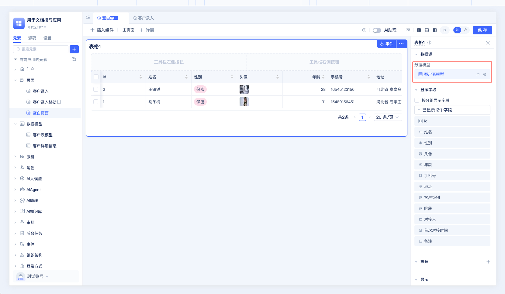
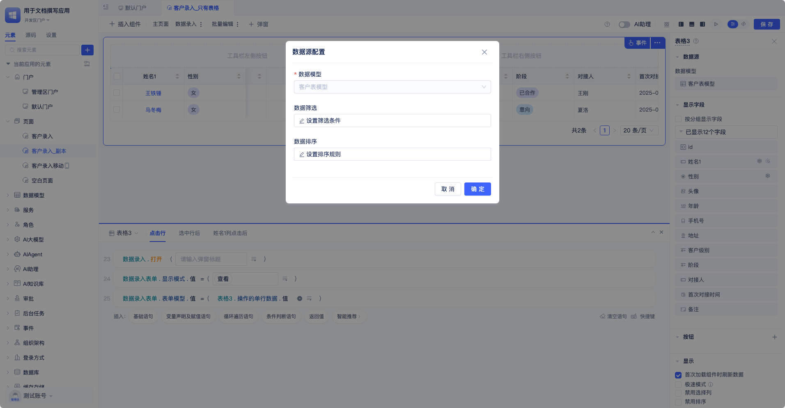
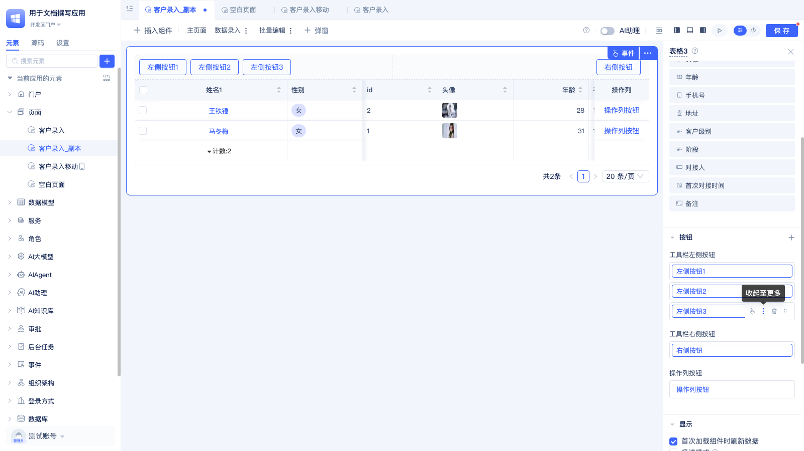
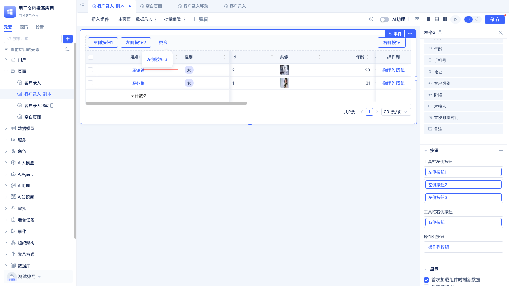
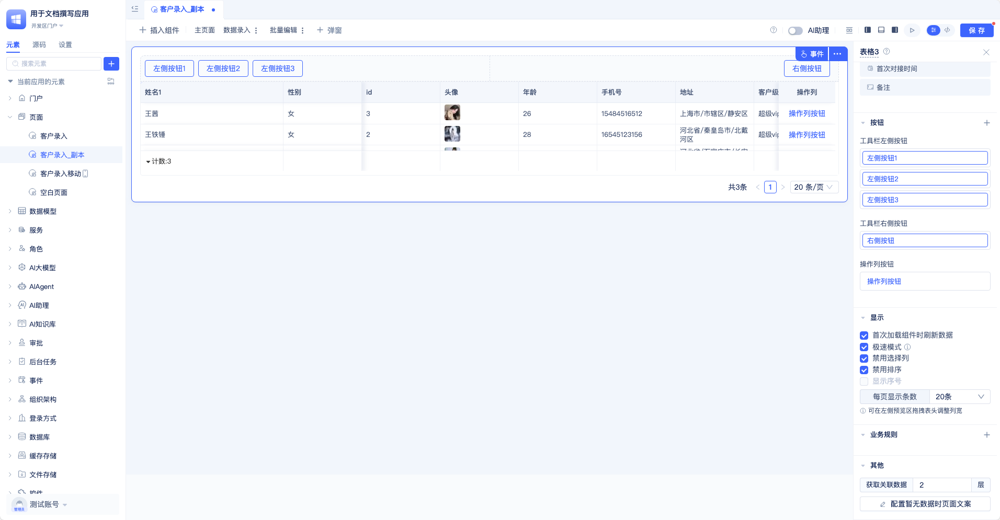

# 表格组件

## 基础表格

表格组件作为Web应用开发中最常用的组件之一，常用来展示结构化的数据，一般的表格组件都具有分页、排序、筛选等功能。

JitAi的表格不但具有以上常用功能，还具有按分组显示字段、设定自定义按钮、极速模式、自定义调整表格列宽、行内编辑、根据业务规则显示或编辑等功能。

### 页面编辑器中添加表格组件
在极态开发区门户中，页面上通过插入组件，选择表格组件，拖拽到编辑区。

### 修改数据源


鼠标放到到数据模型名称上，会出现两个按钮，点击第一个按钮可以直接跳转到模型设计器中，点击第二个按钮可以重新打开数据源配置弹框，修改数据筛选条件和数据排序条件。

点击配置按钮出现的数据源配置中，只能修改数据筛选条件和排序条件。



### 自定义显示字段

表格组件默认显示所有字段，点击`已显示X个字段`按钮，会弹出配置显示字段的面板。


### 按分组显示字段

当勾选按分组显示字段后，表格的表头会变成两行，用户可以添加分组，添加分组时可添加普通分组和子表分组，普通分组展示当前选择的数据模型中的字段，子表分组展示当前数据模型关联的子表的下属的字段。

用户可以设置每个分组中显示的字段，分组的名称和背景色，还可以拖动分组进行排序，分组中的字段也可以通过拖动设置列宽（设置列宽并保存后，在预览和使用区需要刷新浏览器才能生效）。


设置每个分组的字段
点击`已显示x个字段`即弹出左侧选择字段的面板。


设置子表分组中的字段


设置分组名和背景色


### 配置字段的属性


JitAi支持配置字段名称，对齐方式，冻结字段，列点击，行内编辑，统计，换行显示等，配置完字段属性后，点击确定即可在预览区看到效果。表格中的数据默认单行显示，过长显示省略号，勾选换行显示，即可在表格中展示全行数据。 


点击字段名称，即可配置字段的属性。

### 字段高级属性

冻结字段：字段冻结后固定显示在表格最左侧，不会随着滚动条的滚动而滚动或消失，支持冻结多个字段。下图为冻结了姓名和性别后的效果。


 
### 行内编辑

当字段勾选**行内编辑**后，编辑面板中会默认选中**编辑后触发数据模型更新数据事件**。
在使用区中，当鼠标悬停到配置了行内编辑属性的字段时，会显示一个编辑图标，点击编辑图标即可在表格中直接编辑字段，编辑完后，编辑框失去焦点会自动提交数据。

当选中**编辑后触发数据模型更新数据事件**时，每次在数据库保存编辑数据后都会触发模型事件，我们可以监听模型事件来做更高级的操作，详见模型事件文档。


鼠标放到字段值上显示编辑按钮


点击编辑按钮显示字段编辑器

编辑后失去焦点自动保存数据

### 自定义字段统计

字段勾选统计后，会在表格底部显示统计方式和值


### 自定义字段渲染器和字段编辑器 

 字段渲染器
    首先创建一个自定义控件，才能在字段渲染器中选择自定义的字段渲染器。自定义的字段渲染器中可以接受到以下参数。

    <!-- [自定义控件文档](./) -->

    ``` 
    fieldConfig：字段配置
    value: 字段变量的值
    rowData: 字段变量所属的单行数据。
    ```

字段编辑器
    字段编辑器中可以接受到以下参数
    ```     
    fieldConfig：字段配置
    value: 字段变量的值
    rowData: 表格中所编辑的那行数据。
    onChange：值变更后的回调函数
    ```
### 添加按钮
 JitAi PC端页面支持配置工具栏左侧\右侧按钮和操作列按钮。移动端支持工具栏按钮和操作列按钮。


点击按钮标题右边的`➕`按钮，会出现添加按钮的面板。



鼠标放在按钮名称上，会出现按钮配置面板，可以跳转到按钮事件面板，将按钮收起到**更多**，删除按钮，对按钮拖拽排序。

按钮收取到更多中的效果



### 显示配置

#### 首次加载时刷新数据。
表格组件会默认勾选本选项，表格渲染完成后会查询数据。如果表格需要与筛选器配合使用，则不勾选本选项，并在筛选器的**查询后**事件中调用表格刷新方法。 
#### 禁用选择列。
勾选后，不再显示表格第一列的选择列。
#### 禁用排序。
勾选后表头的排序按钮会隐藏。 

#### 显示序号。
勾选后会在表格第一列显示序号。当勾选禁用选择列时，本选项会被禁用。

#### 每页显示条数。
用于控制分页大小。


### 极速模式
极速模式。当表格数据量大或字段较多导致渲染时间过长时，可勾选极速模式选项，在极速模式下，大部分字段将仅显示文本内容；同时列点击/行内编辑/对齐方式/换行显示等配置将失效。

### 业务规则

点击业务规则右边的 + 按钮，出现新增编辑规则和样式规则的面板


##### 编辑规则

当满足特定的筛选条件时，选中的字段才可以被编辑（极速模式下不生效）。
按照如下配置，当名字中包含“铁”时，鼠标放到名字上才会出现编辑图标。


##### 样式规则

样式规则与编辑规则类似，控制字段的样式显示。


### 其他配置

####  设置获取关联数据层级。
当表格组件所用的数据模型存在关联字段、子表字段，子表字段中又有关联字段时，默认层级过深会导致查询缓慢。默认选择2层，用户可以根据需要调整成更深的层级。

#### 配置暂无数据时文案。

表格组件自带的无数据文案如下，用户可以自己定义喜欢的文案。


### 表格事件

表格事件主要包括表格自带事件，按钮事件，列点击事件，和值改变后事件。

表格自带事件：点击行，选中行后。

按钮点击事件：配置按钮后会显示按钮事件。


#### 列点击事件
<a id="列点击事件"></a>

当给字段配置列点击事件后，可以在事件编辑区看到字段的列点击事件，用户可以在其中配置自己的处理逻辑。


上图所示的配置，效果就是点击第一行的姓名时，会在页面中弹框展示王铁锤，点击第二行的姓名，会在页面中弹框展示马冬梅。


#### 值改变后事件
值改变后事件，会在行内编辑完，失去焦点的时候触发。


效果如下,会在页面中展示编辑后的值


**覆盖特性：**

*   控制表格只显示指定字段

*   自定义表格顶部分组并按分组显示不同字段

*   编辑表格的点击行以及选中行事件逻辑

*   给表格添加操作列按钮功能并配置显示条件以及编写点击事件逻辑

*   给表格添加工具栏按钮功能

*   首次加载表格时刷新数据

*   表格选择列和序号的启用禁用

*   表格列排序的启用禁用

*   配置表格的每页显示数据条数

*   满足条件的数据在表格中显示指定字体颜色和所在行背景色

*   用极速模式提高表格数据显示速度

*   配置暂无数据时页面文案

*   配置工具栏和操作列按钮收至更多或直接显示

**内容要点：**

*   表格组件的基本配置和使用

*   表格字段的显示控制

*   表格按钮和事件的配置

*   表格性能优化技巧

## 分组表

**覆盖特性：**

*   控制表格只显示指定字段

*   配置分组表的分组字段（支持多个）

*   表格的点击行以及选中行事件

*   给表格添加操作列按钮功能并配置显示条件以及实现点击事件逻辑

*   给表格添加工具栏左右侧按钮功能编写点击事件逻辑

*   首次加载表格时刷新数据

*   表格选择列启用禁用

*   满足条件的数据在表格中显示指定字体颜色和所在行背景色

*   用极速模式提高表格数据显示速度

*   配置工具栏和操作列按钮收至更多或直接显示

*   编辑分组表的点击行以及选中行事件逻辑

*   编辑分组表的任意字段值改变后事件逻辑

**内容要点：**

*   分组表的配置和应用场景

*   分组字段的设置方法

*   分组表事件的处理

## 级联表

**覆盖特性：**

*   分别选择两个模型字段作为级联表的子级数据字段和父级数据字段

*   配置是否有子级数据的判定条件

*   配置级联表显示的模型字段列表并设置好顺序

*   添加工具栏左右侧按钮并编写点击事件逻辑

*   添加操作列按钮并编写点击事件逻辑

*   启用或禁用选择列

*   编写选中行后/点击行/任意字段值改变后的事件逻辑

**内容要点：**

*   级联表的层级关系设计

*   父子级数据的配置方法

## 交叉表

**覆盖特性：**

*   分别选择多个模型字段作为交叉表的行维度和列维度并设置好显示顺序

*   设置交叉表中日期时间类型列维度的聚合粒度

*   选择多个模型字段并设置好聚合计算方式作为交叉表指标数据

*   设置交叉表的表头和表身内容对齐方式

*   启用或关闭交叉表行序号的显示

*   启用或关闭交叉表行列联动高亮

*   启用或关闭交叉表斑马纹显示

*   设置交叉表指标数据的合计计算方式

*   设置交叉表行维度合计的显示位置

*   设置交叉表列维度合计的显示位置

*   切换交叉表指标数据的排序规则

*   启用或关闭交叉表导出功能

*   启用或关闭交叉表刷新按钮

*   启用或关闭交叉表循环滚动功能

**内容要点：**

*   交叉表的数据分析应用

*   行列维度的配置方法

*   数据聚合和计算功能

## 行转列

**覆盖特性：**

*   配置行转列中展示的模型字段列表和顺序

*   选择一个下拉框单选类型的模型字段作为行转列的维度列

*   选择一个模型字段作为行转列中维度列的显示值

*   设置行转列中的模型字段渲染器和编辑器

*   给行转列添加统计列

*   给行转列添加顶部工具栏的左右侧按钮并编写点击事件逻辑

*   给行转列添加操作列按钮并编写点击事件逻辑

*   启用或关闭行转列的导出功能

*   启用或关闭行转列的数据编辑功能

*   启用或关闭行转列的渲染后立即加载数据功能

*   编辑行转列的值点击后事件逻辑

**内容要点：**

*   行转列的数据转换功能

*   维度列的配置方法

*   数据编辑和统计功能
