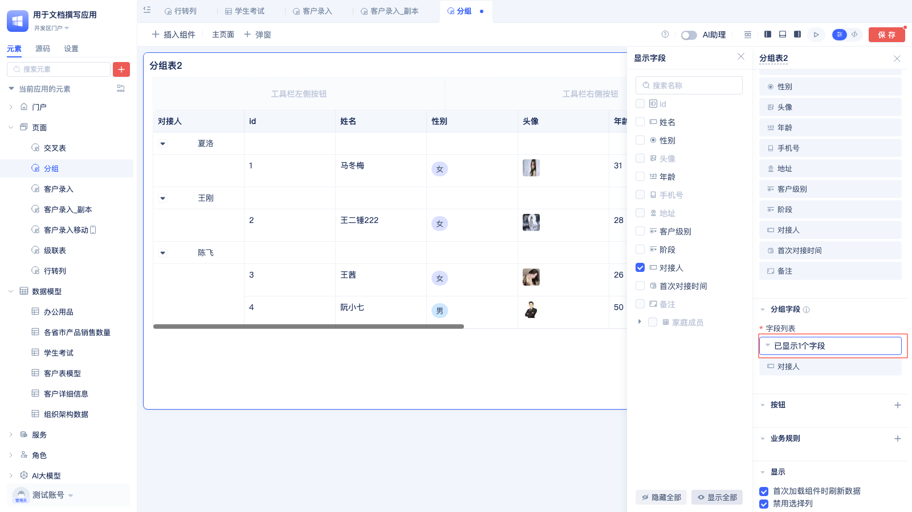

# 表格组件

## 基础表格

表格组件作为Web应用开发中最常用的组件之一，常用来展示结构化的数据，一般的表格组件都具有分页、排序、筛选等功能。

JitAi的表格不但具有以上常用功能，还具有按分组显示字段、设定自定义按钮、极速模式、自定义调整表格列宽、行内编辑、根据业务规则显示或编辑等功能。

### 设置数据源

表格组件是用来展示和操作模型数据的，因此，在页面中添加表格组件时需要绑定一个数据表模型作为数据源。

开发者在页面编辑器配置表格组件时，可以快速的跳转到数据模型页面，查看[数据表模型](../数据建模/数据表模型.md)的配置。


当[数据表模型](../数据建模/数据表模型.md)中的数据量比较大时，需要对数据进行筛选/排序后再展示。常见的场景：订单管理表中有数万条记录，销售人员只需查看本月自己负责的待处理订单，按创建时间倒序排列。


### 自定义显示字段

[数据表模型](../数据建模/数据表模型.md)中通常包含一些不需要对用户展示的技术字段，比如商品管理表有15个字段，但前台用户只需看到商品名称、价格、库存等关键信息，隐藏内部编码和审核状态。可通过自定义显示字段功能选择性展示业务相关字段，简化界面并提升用户体验。


表格组件默认显示所有字段，点击`已显示X个字段`按钮，会弹出配置显示字段的面板，在弹出的面板中勾选要展示的字段，然后点击页面右上角`保存`按钮。

### 按分组显示字段

当表格字段较多时，可通过表头分组将相关字段归类展示，如人事系统中员工档案表包含20多个字段，按"个人信息"、"职位信息"、"薪酬福利"分组，HR能快速查找所需数据。
 


首先勾选 “显示字段”下方的按分组显示字段，系统会默认把已选择的字段放到分组中。


可以在字段列表下方选择添加分组或者子表分组。
分组是使用当前[数据表模型](../数据建模/数据表模型.md)中的字段进行分组展示。
子表分组则是使用当前数据模型关联的子表的字段进行分组展示。

**设置每个分组的字段**


点击`已显示x个字段`即弹出左侧选择字段的面板，在面板中勾选要展示的字段。

**设置子表分组的字段**


点击`已显示x个字段`即弹出左侧选择字段的面板，在面板中勾选要展示的字段。

### 设置分组名和背景色

当表格包含多个分组时，通过设置有意义的分组名称和差异化背景色，可以帮助用户快速识别和定位不同类型的数据分组。财务报表表格有6个分组，通过设置"收入类"(绿色)、"成本类"(红色)、"资产类"(蓝色)等名称和颜色，财务人员能快速找到目标数据。


鼠标放到分组名称上，点击后面的`铅笔`按钮，在弹出的面板中设置分组名称和背景色。

### 配置字段的属性

为满足用户对表格样式的自定义展示需求，可以设置字段对齐方式、字段内容换行显示、配置字段统计值等功能。


点击字段名称，在弹出的面板中配置上述功能。

### 冻结字段

当表格字段较多需要横向滚动查看时，为了保持关键标识字段（如员工姓名、订单编号等）始终可见，可将这些字段设置为冻结。冻结后的字段固定显示在表格最左侧，在滚动查看其他数据时不会消失，便于用户对照和查找。下图为冻结了姓名和性别后的效果。


 
### 行内编辑

在数据录入、信息校正等场景中，用户需要快速修改表格中的某个字段值时，无需跳转到详情页面，可直接在表格中点击编辑。这种行内编辑方式特别适合批量数据处理、价格调整、状态更新等高频操作。


**配置步骤：**
点击字段名称，打开配置面板，勾选**行内编辑**选项

**默认设置：** 系统自动选中**编辑后触发数据模型更新数据事件**

**事件机制：** 启用该选项后，每次保存编辑数据都会触发模型事件，用户可监听模型事件实现更高级的业务逻辑，详见模型事件文档


在使用区中，当鼠标悬停到配置了行内编辑属性的字段时，会显示一个编辑图标，点击编辑图标即可在表格中直接编辑字段，编辑完后，编辑框失去焦点会自动提交数据。

鼠标放到字段值上显示编辑按钮。


点击编辑按钮显示字段编辑器。


编辑完成后，点击编辑框外面的空白处自动保存数据。

### 字段统计

在销售报表、财务统计等场景中，需要在表格底部展示汇总数据（如总销售额、订单数量等）。基础表格组件支持计数、已填写数、未填写数、去重计数等统计方式。


### 自定义字段渲染器与字段编辑器 

当标准字段展示无法满足特殊业务需求时，可通过自定义渲染器和编辑器实现个性化展示和交互。

####  字段渲染器
    首先创建一个[自定义控件](../样式与控件定制/自定义控件.md)，才能在字段渲染器中选择自定义的字段渲染器。自定义的字段渲染器中可以接受到以下参数：

    <!-- [自定义控件文档](./) -->

    ``` 
    fieldConfig：字段配置
    data: 字段变量的值
    rowData: 字段变量所属的单行数据。
    ```

#### 字段编辑器
    字段编辑器中可以接受到以下参数：
    ```     
    fieldConfig：字段配置
    data: 字段变量的值
    rowData: 表格中所编辑的那行数据。
    onChange：值变更后的回调函数
    ```
### 添加按钮

表格通常需要配合操作按钮实现完整的业务流程，如新增数据、批量删除、导出报表、审批流程等。可在工具栏或操作列添加自定义按钮来满足不同的业务需求。

JitAi PC端页面支持配置工具栏左侧/右侧按钮和操作列按钮。移动端支持工具栏按钮和操作列按钮。


点击按钮标题右边的`➕`按钮，会出现添加按钮的面板，然后选择添加按钮的位置。


在弹窗中设置按钮名称、图标、类型、颜色后点击确定。


最后，在事件中添加对应的处理逻辑即可。


### 删除按钮


鼠标放在按钮名称上，按钮名称的后面会出现四个图标，从左到右功能依次为：跳转到按钮事件区，将按钮收起至更多，删除按钮，拖拽排序。

### 多个按钮折叠到“更多”中

当按钮过多时，可以将按钮收起到`更多`中，使页面更简洁。


### 设置分页大小/禁用选择列/禁用排序/首次加载组件时刷新数据

根据不同的业务需求和性能要求，可在显示配置中调整表格的展示行为：分页大小、组件加载完是否显示数据、禁用选择列、极速模式等，以获得最佳的用户体验。


#### 配置说明

首次加载时刷新数据：表格组件会默认勾选本选项，表格渲染完成后会查询数据。如果表格需要与筛选器配合使用，则不勾选本选项，并在筛选器的**查询后**事件中调用表格刷新方法。 

禁用选择列：勾选后，不再显示表格第一列的选择框。

禁用排序：勾选后表头的排序按钮会隐藏。 

显示序号：勾选后会在表格第一列显示序号。当勾选禁用选择列时，本选项会被禁用。

每页显示条数：用于控制表格分页大小。


### 极速模式

当表格数据量大或字段较多导致渲染时间过长时，可勾选极速模式选项。在极速模式下，大部分字段将仅显示文本内容，同时列点击、行内编辑、对齐方式、换行显示等配置将失效。


### 编辑规则

在权限管控、状态区分等场景中，需要根据数据条件控制字段的编辑权限（已审核订单不可编辑等），可通过业务规则实现条件化控制。


点击业务规则右边的 `+` 按钮，出现新增编辑规则和样式规则的面板。


按照如下配置，当名字中包含"铁"时，鼠标放到名字上才会出现编辑图标：


使用区姓名包含"铁"时，鼠标放到姓名上才会出现编辑图标:


姓名不包含"铁"时，鼠标放到姓名上不会出现编辑图标:


### 样式规则

样式规则用于根据数据条件动态改变字段的显示样式，实现视觉化的数据区分。例如VIP客户名称高亮显示、逾期订单标红提醒、已完成状态显示绿色等。配置方法与编辑规则类似。


### 设置关联数据层级和表格无数据时文案
:::tip 注意
当表格组件所用的数据模型存在关联字段、子表字段，子表字段中又有关联字段时，层级过深会导致查询缓慢。系统默认选择2层，用户可以根据需要设置合适的层级。
:::


#### 无数据时文案

当表格无数据时，系统会显示默认提示文案。为了提升用户体验或匹配业务场景，可自定义更友好的提示内容。


**操作步骤：** 点击"其他"配置中的 `修改暂无数据时的页面文案`，在弹窗中输入自定义文案内容。


### 表格事件

在实际业务中，表格常需要与页面其他组件联动，如点击表格行查看详情、选中多行进行批量处理、字段变更后同步更新统计信息等。通过配置表格事件可以实现这些交互需求。

**事件类型：**
 - **表格自带事件：** 点击行、选中行后
 - **按钮事件：** 工具栏和操作列按钮的点击事件  
 - **值改变后事件：** 行内编辑完成后触发的事件，任意值改变后事件
 - **列点击后事件：** 字段配置列点击后触发的事件


#### 列点击事件
 

为字段配置列点击事件后，在事件编辑区可自定义该字段的点击处理逻辑，实现查看详情、跳转页面、数据联动等交互功能。


**示例效果：** 配置姓名字段的列点击事件后，点击不同行的姓名会弹框显示对应的用户信息（如王铁锤、马冬梅等）。


#### 值改变后事件

值改变后事件，会在行内编辑完成、失去焦点的时候触发。


效果如下，会在页面中展示编辑后的值:


#### 任意值改变后事件

任意值改变后事件是一个全局事件监听器，无论哪个字段发生编辑都会触发此事件。与普通的"值改变后事件"不同，该事件适用于需要统一处理所有字段变更的场景。

### 表格组件变量

在表格事件处理逻辑中，可以获取以下组件变量，用于实现动态交互和数据处理：


**属性说明：**

**当前页数据：** 表格当前分页显示的所有行数据

**操作的单行数据：** 用户点击操作的目标行数据  

**选中的多行数据：** 通过复选框选中的多行数据集合

**示例：** 如下图所示，选中id为4和3的两行数据时，选中的多行数据即为这两行组成的数组。


## 分组表

在人员管理、商品分类、销售统计等场景中，需要将数据分组后展示，便于分类查看和对比分析。分组表会根据指定的分组字段自动对数据进行分类，每个分组下显示对应的明细记录。

**注意事项：** 分组表默认禁用选择列，且不支持分页功能。


### 分组字段配置

分组字段会默认选择非主键的第一个字段作为分组字段，分组字段可以选择多个字段，如果不选择分组字段页面会提示配置出错。



点击分组字段下面的字段列表下的`已显示x个字段`按钮，在弹出面板中配置分组字段。

### 与基础表格相同的配置

分组表支持基础表格的大部分配置功能：

- [自定义显示字段](#自定义显示字段)
- [配置字段属性](#配置字段的属性)
- [冻结字段](#冻结字段)
- [行内编辑](#行内编辑)
- [字段统计](#字段统计)
- [添加按钮](#添加按钮)
- [删除按钮](#删除按钮)
- [多个按钮折叠到"更多"中](#多个按钮折叠到更多中)
- [编辑规则](#编辑规则)
- [样式规则](#样式规则)
- [首次加载时刷新数据](#设置分页大小禁用选择列禁用排序首次加载组件时刷新数据)
- [禁用选择列](#设置分页大小禁用选择列禁用排序首次加载组件时刷新数据)
- [极速模式](#极速模式)

### 与基础表格相同的事件

分组表支持基础表格的所有事件类型，详见[表格事件](#表格事件)章节：
- **表格自带事件：** 点击行、选中行后
- **按钮事件：** 工具栏和操作列按钮的点击事件  
- **值改变后事件：** 行内编辑完成后触发的事件，任意值改变后事件
- **列点击后事件：** 字段配置列点击后触发的事件

### 与基础表格相同的组件变量

分组表在事件处理过程中可获取的数据变量与基础表格完全一致，详见[表格组件变量](#表格组件变量)章节：

- **当前页数据**：表格当前分页显示的所有行数据
- **操作的单行数据**：用户点击操作的目标行数据  
- **选中的多行数据**：通过复选框选中的多行数据集合


## 级联表

级联表用于展示具有父子层级关系的数据。该组件支持多种功能，包括数据展开收起、行内编辑、列宽调整、工具栏按钮等。通过配置父子关系字段，可以轻松实现层级数据的展示。
级联表的显示字段配置和按钮的配置方法和基础表格组件一致。

:::tip 注意
级联表要求数据模型中包含用于标识层级关系的字段，以确定数据间的父子层级结构。

同时建议设置标识字段来标明每条记录是否存在子级数据，便于组件进行展开/收起操作。
:::

### 级联表示例数据

在本文档接下来的级联表示例中，使用的数据如下图：


### 配置级联逻辑字段

在页面编辑器中拖入级联表组件后，子级联字段和父级联字段默认为空，此时左侧预览区会显示"配置出错"提示，这是正常现象。完成逻辑字段配置后，组件即可正常显示数据。


首先配置父子级数据的关联关系。通过设置关联字段来建立数据间的层级关系：左侧配置子级数据的关联字段，右侧配置父级数据的关联字段：


第二步，配置是否有子级数据的判定条件：


在弹出的设定判定条件面板中设置是否有子级数据的条件。我们期望用户在初始化数据的时候，有明确的字段标明当前记录是否有子级数据：


### 级联表使用区效果

默认显示最高等级数据，并且默认只显示最顶层数据。


有子级数据的行，会显示展开图标，点击后会展开子级数据


### 与基础表格相同的配置
级联表支持基础表格的部分配置功能：

- [自定义显示字段](#自定义显示字段)
- [配置字段属性](#配置字段的属性)
- [行内编辑](#行内编辑)
- [添加按钮](#添加按钮)
- [删除按钮](#删除按钮)
- [多个按钮折叠到"更多"中](#多个按钮折叠到更多中)
- [首次加载时刷新数据](#设置分页大小禁用选择列禁用排序首次加载组件时刷新数据)
- [禁用选择列](#设置分页大小禁用选择列禁用排序首次加载组件时刷新数据)


### 与基础表格相同的事件

级联表支持基础表格的所有事件类型，详见[表格事件](#表格事件)章节：
- **表格自带事件：** 点击行、选中行后
- **按钮事件：** 工具栏和操作列按钮的点击事件  
- **值改变后事件：** 行内编辑完成后触发的事件，任意值改变后事件
- **列点击后事件：** 字段配置列点击后触发的事件

### 与基础表格相同的表格变量

级联表在事件处理过程中可获取的数据变量与基础表格完全一致，详见[表格组件变量](#表格组件变量)章节：

- **当前页数据**：表格当前分页显示的所有行数据
- **操作的单行数据**：用户点击操作的目标行数据  
- **选中的多行数据**：通过复选框选中的多行数据集合


## 交叉表

交叉表是一种常用的分类汇总表格，支持数据快速汇总、透视分析与多维度分组，提供求和、计数等汇总函数。

### 初始化配置

在页面编辑器中拖入交叉表组件后，预览区会先使用**默认数据**显示交叉表样式。完成维度和指标配置后，组件将根据实际数据展示交叉表内容。


本文档所用数据模型的原始数据：


配置完成后的交叉表：


### 配置维度和指标
交叉表中组成部分为行维度和列维度，以及指标，如下图所示：


交叉表中行维度和指标为必填项：


用户可以通过点击行维度、列维度、指标右侧的`+`按钮来添加维度/指标。所有的维度和指标分别最多可以添加30个。


用户将鼠标悬停在维度名称上，会在名称尾部显示删除图标和拖拽排序图标：


点击维度名称，会弹出设置别名和排序的面板；指标排序可设置为升序、降序、无序。

### 按年/季度/月/周/日统计

对于日期字段，可以在维度设置中选择聚合方式进行时间维度分析。支持按年、季度、月、周、日进行聚合，例如按月统计销售额、按季度分析用户增长等。


点击维度名称，然后鼠标悬停到聚合方式上，会显示聚合方式面板。

日期时间格式的维度会按照配置的聚合方式格式化后显示，如下图：


### 配置指标
指标是用于汇总计算的数值字段，支持求和、平均值、计数等聚合函数。


用户使用鼠标点击指标右侧的 `+`按钮，会出现配置指标和计算指标的面板。


在弹出的面板中，选择字段作为指标即可。

### 配置计算指标

计算指标用于基于已有指标创建新的计算字段，满足复杂的数据分析需求。例如通过“销售额/销售数量”计算平均单价，或“实际收入/预算收入*100”计算完成率等。配置步骤：先设置指标名称，再设置计算规则。


用户点击【设置计算属性】后，会弹出配置计算属性的面板，所有指标中是已经选的指标，右侧可以配置计算指标的处理逻辑。


计算指标预览效果如下：


### 自定义指标属性
用户可以自定义指标名称，数据格式，聚合方式（统计方式），数据筛选，和排序方式。


点击指标名称后，弹出指标属性面板

设置别名后，指标名称会显示为别名


设置数据格式，目前支持设置小数位数，单位，和指标数量级。


数据格式显示效果：


### 配置指标统计方式

指标统计方式默认为求和，支持求和、已填写数、未填写数、去重计算、最大值、最小值、平均值等聚合函数。例如统计订单总金额用求和，分析客户数量用去重计算，监控价格波动用最大值和最小值等。


### 指标数据筛选

指标数据筛选用于在聚合计算前过滤特定数据，实现更精准的统计分析。例如只统计状态为"已完成"的订单金额，或仅计算评分大于4分的商品平均价格等。


点击数据筛选，弹出配置筛选条件的对话框


筛选后效果：


去掉筛选条件效果：


### 配置图表样式

当默认的图表样式不满足用户需求时，可以配置图表样式。
JitAi的交叉表支持调整表头的和表身的对齐方式，行/列样式，行/列合计值的位置， `导出`、`刷新`、`循环滚动`按钮的显示/隐藏。


### 表头/表身对齐方式

表头居中，表身左对齐效果：


### 行/列样式

显示序号和斑马纹


行列联动高亮：鼠标悬浮在指标上，高亮显示其所属的行列维度。


### 导出/刷新/滚动显示 按钮

JitAi的交叉表默认支持刷新、滚动、导出。
滚动显示只支持上下循环滚动。

导出文件格式为csv格式。


导出的csv文件排版与页面排版一致。


导出原始格式时，会显示null值。


### 显示合计值

合计值支持求和和平均值两种计算方式。求和适用于累计统计场景，如总销售额、总订单数；平均值适用于均值分析场景，如平均单价、平均评分等。


点击图表属性，在基础配置中选择合计计算方式。
然后在图表样式中设置行/列合计值的显示位置。


行合计默认显示在底部，列合计默认显示在右侧。


 
### 交叉表事件

在有些场景下，用户不但要在交叉表中看统计数据，还希望看到这些指标的明细数据。这时候可以在页面上配置一个明细表，交叉表和明细表具有**相同**的数据模型，通过交叉表的事件控制明细表的刷新来显示明细数据。


具体操作如下：

#### 点击维度事件


在交叉表组件的“点击维度”事件中，点击请选择。


设置变量值


点击请选择


选择维度筛选条件的值。

#### 点击明细事件
 点击明细事件的使用方法和点击维度配置方法一样。
:::tip
明细筛选条件的值会额外带上指标的筛选条件。
:::


 在使用的时候，点击交叉表中的值，就更新明细表中的数据了。

 


### 交叉表组件变量
页面其他组件可以取到的交叉表变量为：维度筛选条件的值和明细筛选条件的值。


## 行转列

行转列组件用于将数据的行和列进行转换显示，便于从不同角度分析数据。例如将"员工-月份-销售额"的纵向数据转换为"员工为行、月份为列"的横向对比表，或将产品分类数据转换为便于对比的矩阵形式等。

本示例原始数据：


行转列后效果：


### 基础配置

在页面编辑器中拖入行转列组件后，由于尚未完成基础配置，组件会显示"配置出错"提示，这是正常现象。完成数据源和基础配置后，组件即可正常显示数据。


固定列是固定在每行数据前面的字段。
点击固定列下面的`已显示X个字段`，弹出配置面板配置固定列。


维度列用于确定表头列名，只能选择“下拉单选”或“选项组单选”类型的字段。


点击显示值下面的下拉框，选择显示值字段。


### 自定义字段名称/对齐方式


点击固定列下面的字段名称，在弹出框即可设置。

### 自定义字段渲染器
    
固定列和显示值支持自定义字段渲染器，用于个性化数据显示效果。例如将数值显示为进度条、状态显示为彩色标签等。

配置步骤：先创建自定义控件，然后在字段渲染器中选择该控件。渲染器可接受以下参数：
    <!-- [自定义控件文档](./) -->
    ``` 
    fieldConfig：字段配置
    value: 字段变量的值
    rowData: 字段变量所属的单行数据。
    ```
### 统计列

统计列用于在每行末尾显示汇总数据，支持合计、平均值、最大值、最小值等计算方式。例如在员工月度销售表中显示每人的年度总销售额，或在产品价格对比表中显示各产品的平均价格等。

注意：统计列仅对"数字"类型和"金额"类型的显示值生效。


点击统计列右侧的`+`按钮，选择统计列类型，支持多选。


### 导出/编辑/默认加载数据

行转列组件支持数据导出、新增和删除功能，满足数据管理需求。例如导出转换后的销售报表进行分析，或直接在表格中新增员工业绩数据等。在"其他"配置项中勾选相应功能即可启用。


在"其他"设置中勾选允许导出、允许编辑。


勾选后，会在表格上方左右两边显示"新增"按钮和"导出"按钮。


在新增弹窗中可以直接录入一条转换后的数据。


在源表中则保存了多条数据。


导出后的excel文件中的数据排版，与页面上行列转换后的排版一致。


删除操作会删除转换后的整条数据，并在源表中删除对应的多条数据。


### 值点击后事件

行转列默认支持值点击后事件。点击**统计值**不会触发值点击后事件。


行转列事件中，可以取到的行转列属性包括显示的多行数据，操作的多行数据，操作的单行数据，筛选条件。其中显示的多行数据和操作的多行数据为转换前的数据。


### 按钮配置
对于复杂的业务需求，可以添加自定义按钮实现特殊交互功能。例如添加"数据审核"按钮执行批量审核流程，或添加"同步数据"按钮与外部系统进行数据交互等。在按钮事件中编写相应的业务逻辑即可。


点击按钮右侧的 `+` 按钮，选择按钮类型，添加对应的按钮，然后在事件编辑区根据实际需求完善相应的业务逻辑。


### 行转列事件

行转列组件支持以下事件类型：

**内置事件：**
- **值点击后事件**：点击表格中的数值时触发

**编辑相关事件**（需在"其他"配置中启用编辑功能）：
- **新增数据后事件**：成功添加新记录时触发
- **删除行后事件**：成功删除行数据时触发  
- **值变更后事件**：行内编辑完成时触发

**自定义事件：**
- **按钮点击事件**：工具栏和操作列按钮的点击事件


### 行转列组件变量

页面中可以到行转列组件的以下变量：
显示的多行数据，操作的多行数据，操作的单行数据，筛选条件。
