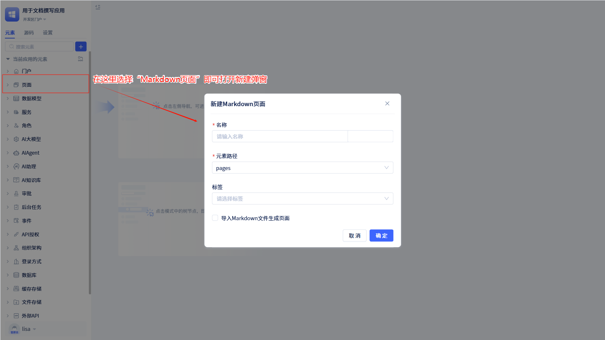
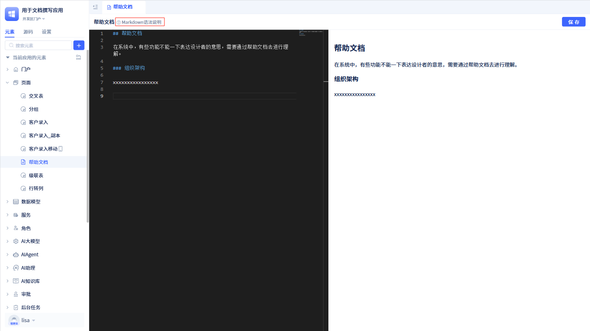

# Markdown 页面开发

在企业应用系统中，开发者想创建一个纯文本页面，比如帮助文档、公告、协议等，那么他就可以选择使用 Markdown 语法来进行编写。

JitAi 提供了 Markdown 页面开发功能，开发者可以在 JitAi 开发工具中创建 Markdown 页面，并使用 Markdown 语法编写页面内容。

## 创建 Markdown 页面



开发者可以在创建页面时选择页面类型为 `Markdown页面`，即可打开 Markdown 新建弹窗。

:::warning 注意
开发者在新建弹窗中填写页面名称后点击`确定`，就创建了一个 Markdown 页面。

开发者可以选择从外部导入 Markdown 文件到系统中，但导入的文件大小不能超过 2M。
:::

开发者通过新建弹窗创建后进入可视化编辑器中。



可视化编辑器分为左右两个部分，左侧是编辑区域，右侧是预览区域。用户编辑之后，在右侧预览区域中查看效果。

:::warning 注意
如果用户想在使用区展示 Markdown 页面，需要将创建的 Markdown 页面设置绑定到 SSR 门户下的某个菜单上。
:::

## Markdown 语法

JitAi 集成了 Markdown 的常用语法，开发者可以在可视化编辑器中编写 Markdown 页面。

常用的 Markdown 语法有

### 标题

```markdown
# 一级标题

## 二级标题

### 三级标题

#### 四级标题

##### 五级标题

###### 六级标题
```

### 文本格式

```markdown
**粗体文本**
_斜体文本_
~~删除线文本~~
`行内代码`
```

效果：

-   **粗体文本**
-   _斜体文本_
-   ~~删除线文本~~
-   `行内代码`

### 列表

#### 无序列表

```markdown
-   项目一
-   项目二
    -   子项目一
    -   子项目二
-   项目三
```

#### 有序列表

```markdown
1. 第一项
2. 第二项
    1. 子项目一
    2. 子项目二
3. 第三项
```

### 链接和图片

```markdown
[链接文本](http://example.com)
[带标题的链接](http://example.com "链接标题")


```

### 代码块

````markdown
```javascript
function hello() {
    console.log("Hello World!");
}
```
````

### 表格

```markdown
| 列 1   | 列 2   | 列 3   |
| ------ | ------ | ------ |
| 内容 1 | 内容 2 | 内容 3 |
| 内容 4 | 内容 5 | 内容 6 |
```

效果：
| 列 1 | 列 2 | 列 3 |
|-----|-----|-----|
| 内容 1 | 内容 2 | 内容 3 |
| 内容 4 | 内容 5 | 内容 6 |

### 引用

```markdown
> 这是一个引用块
>
> 支持多行引用
>
> > 嵌套引用
```

效果：

> 这是一个引用块
>
> 支持多行引用
>
> > 嵌套引用

### 分割线

```markdown
---
或
---

或

---
```

### 任务列表

```markdown
-   [x] 已完成的任务
-   [ ] 未完成的任务
-   [ ] 另一个未完成的任务
```

效果：

-   [x] 已完成的任务
-   [ ] 未完成的任务
-   [ ] 另一个未完成的任务

### 转义字符

如果需要显示特殊字符，可以使用反斜杠进行转义：

```markdown
\* 显示星号而不是斜体
\# 显示井号而不是标题
\` 显示反引号而不是代码
```

:::tip 提示
在 JitAi 的 Markdown 编辑器中，您可以实时预览效果。建议在编写时参考右侧的预览区域，确保格式正确。
:::
