# 了解JitAi开发工具

JitAi为开发者提供了可视化和全代码双模式的应用开发工具(后续简称IDE)，在节点控制台中点击"开发"按钮或在应用内切换到“开发区门户”均可进入应用开发界面，IDE会自动加载所有应用模块的源码，开发者可以同时进行可视化编辑和源码编辑，这些应用模块在JitAi技术体系中叫做“元素”。

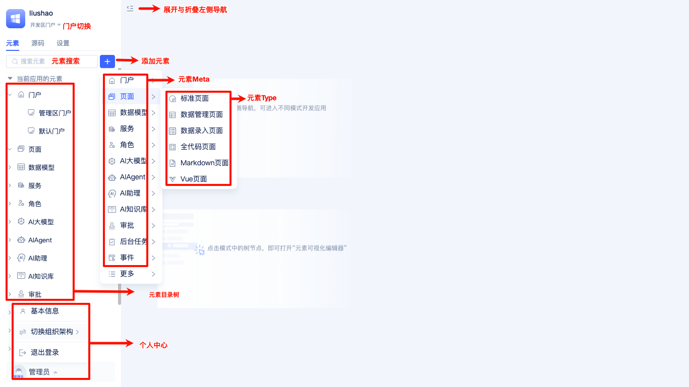

## 元素目录树
进入IDE后，左侧元素目录树展示常用的元素类型，展开后可以看到已经添加到当前应用的元素。

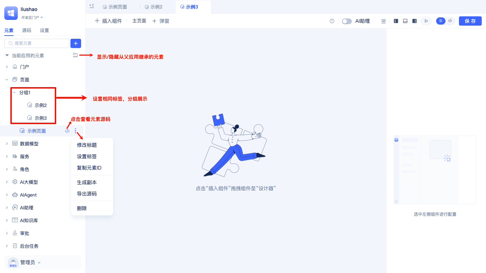

在目录树中，开发者可以进行元素的搜索、修改元素标题、复制元素ID、导出元素源码、删除元素、生成副本、使用标签进行分组、显示/隐藏继承应用元素。

## 添加元素

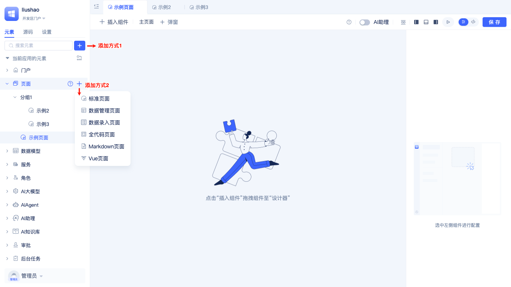

开发者点击`+`按钮添加元素时，需要依次选择元素的Meta和Type。Meta是最顶级的应用模块分类，例如：门户、页面、数据模型等。Type是Meta下的细分类型，例如页面Meta下的标准页面、数据管理页面、全代码页面等。

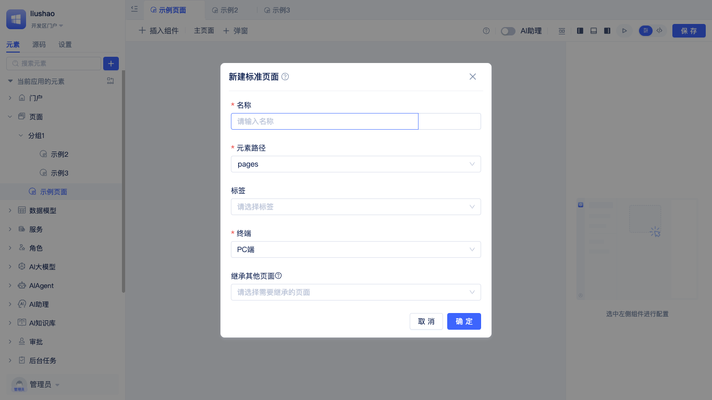

选定元素Type后，在弹窗中填写元素基本信息（如：名称），点击确定，元素会自动添加到目录树中并打开可视化编辑器。

IDE支持开发者在可视化编辑和源码编辑两种模式下随时切换。

## 可视化编辑器
添加元素后，或在元素目录树中点击某个元素，都可以在IDE右侧打开可视化编辑器。

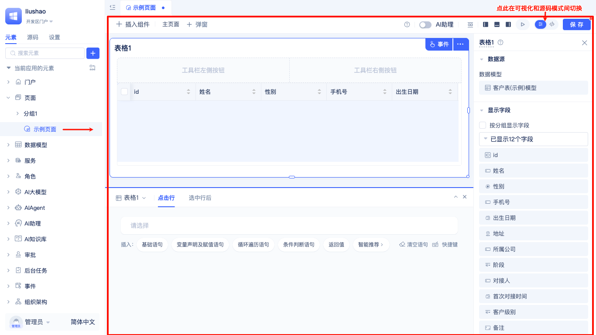

可视化编辑器是由元素的Type提供的，元素Type的开发者根据业务配置的需要而设计并开发可视化编辑器。

## 源码编辑器
当可视化编辑器无法满足高度定制化的编辑需求时，开发者可以切换到源码编辑器进行编辑。

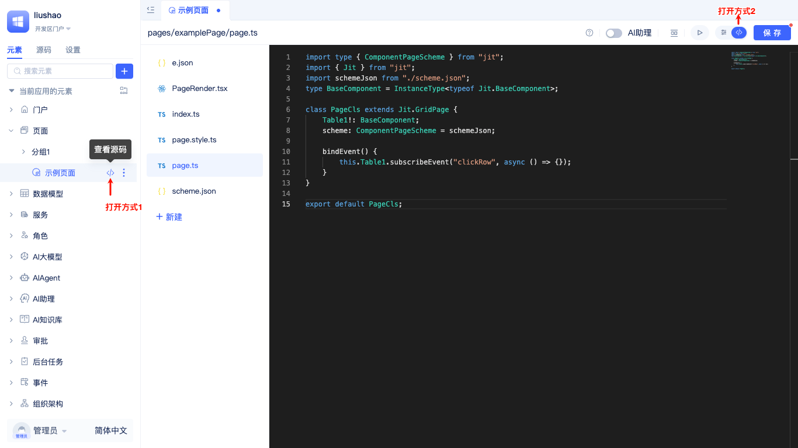

源码编辑器支持语法高亮、自动格式化、侧边预览、文件的新建/删除/重命名/内容编辑/保存等常用功能。

## 源码文件树
在IDE的左侧区域点击“源码”标签页，即可打开源码文件树。

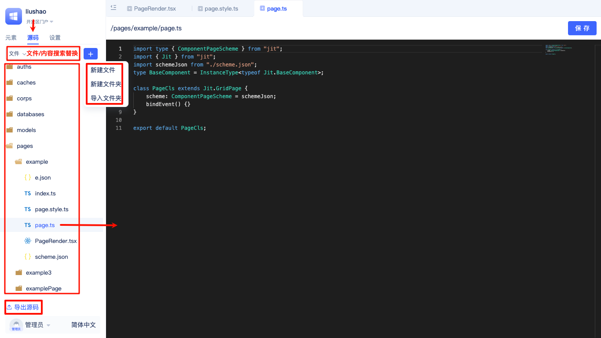

源码文件树中，开发者可以进行文件搜索、内容查找与替换、新建文件、新建文件夹、导入文件夹、文件夹的重命名/复制/移动/导出/删除、文件的重命名/删除、导出应用源码等操作。

在源码文件树视图下，开发者可以非常便捷地将其它应用导出的元素源码目录导入到当前应用中，实现复用。

## 应用设置
在IDE的左侧区域点击“设置”标签页，即可打开应用设置。

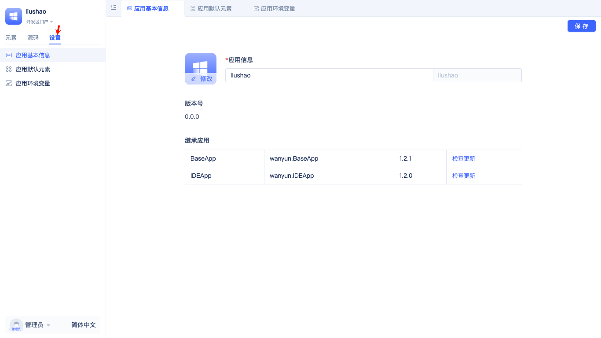

在应用基本信息中，开发者可以设置应用的标题、logo、继承的应用以及版本、检查继承应用版本更新。

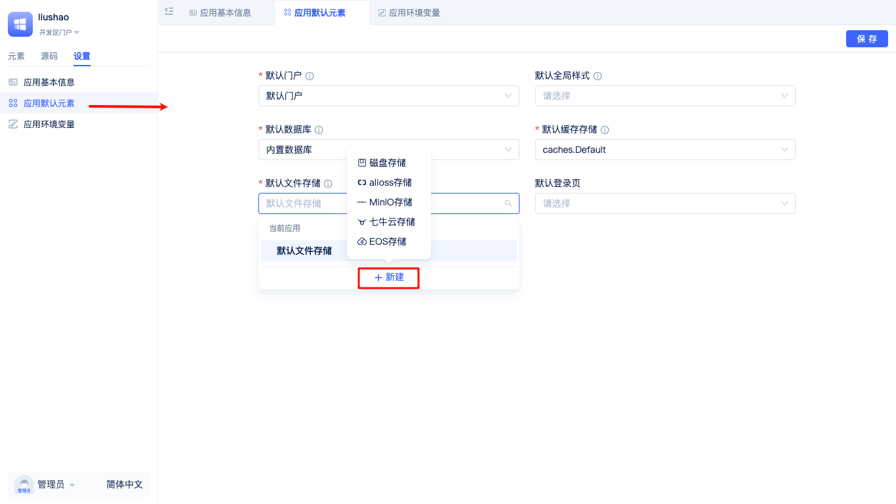

在应用默认元素中，开发者可以设置应用的默认元素（门户、全局样式、数据库、缓存、文件存储、登录页）。

开发者可以在设置的同时创建新的默认元素，例如：创建一个新的文件存储元素并设置为默认使用的文件存储。

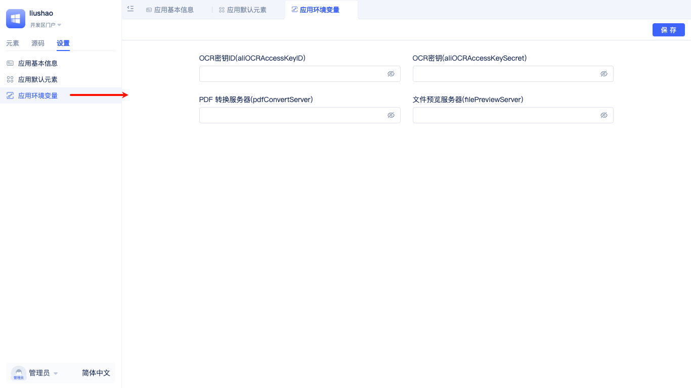

在应用环境变量中，开发者可以设置应用的环境变量值，设置后即可在当前运行环境下生效。

## 门户切换
应用通过给不同角色的人群分配不同的门户，从而提供不同的功能入口和导航界面。IDE支持开发者在开发过程中随时切换到不同的门户，验证门户的配置是否满足预期。

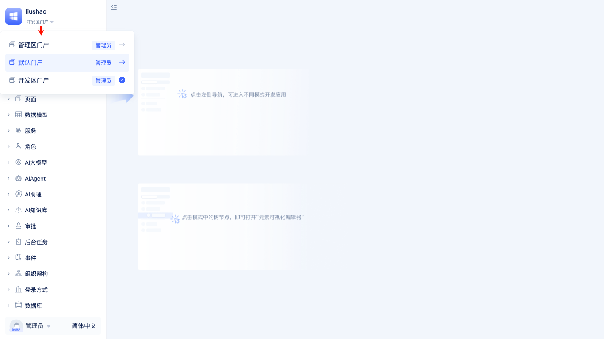

点击IDE左上角的下三角图标，即可点选切换门户。

## 个人中心

开发者可以在个人中心修改个人昵称、账号、密码。

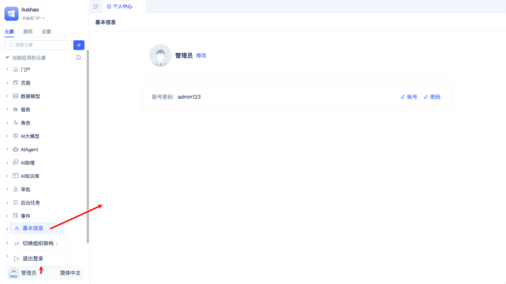

点击IDE左下角的下三角图标，并选择“基本信息”，即可打开个人中心。

## 语言切换

点击IDE左下角的语言文案（English、简体中文等），即可切换界面语言。

多语言是JitAi开发框架提供的元素之一，不仅用于IDE的国际化，同样可以用于任意其它应用的国际化。

## 导航标签
IDEApp中打开的所有界面都会显示为导航标签。

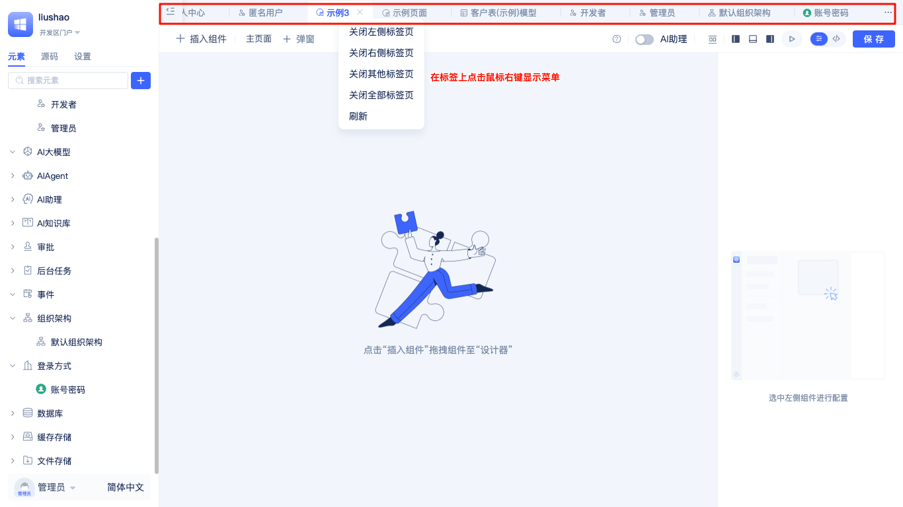

开发者可以快速切换标签，对指定标签执行关闭左侧、关闭右侧、关闭其它、关闭全部、刷新操作。
