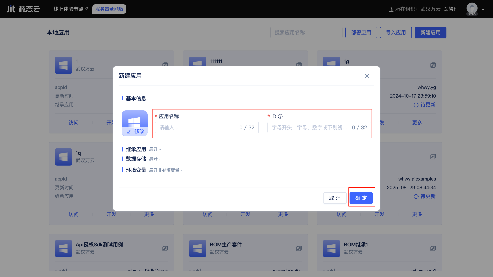
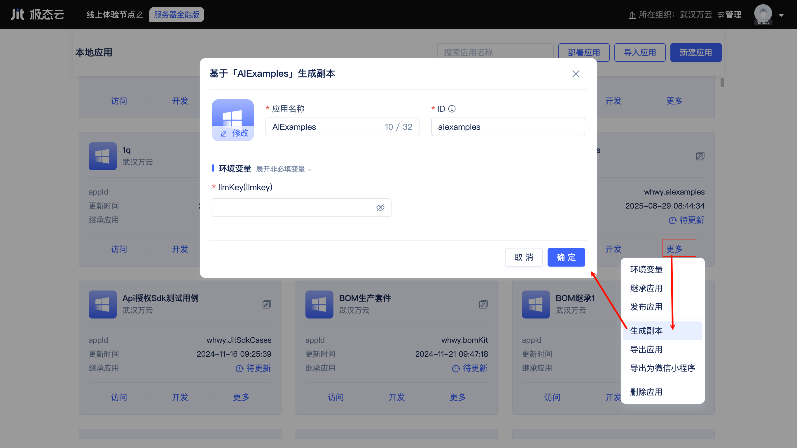
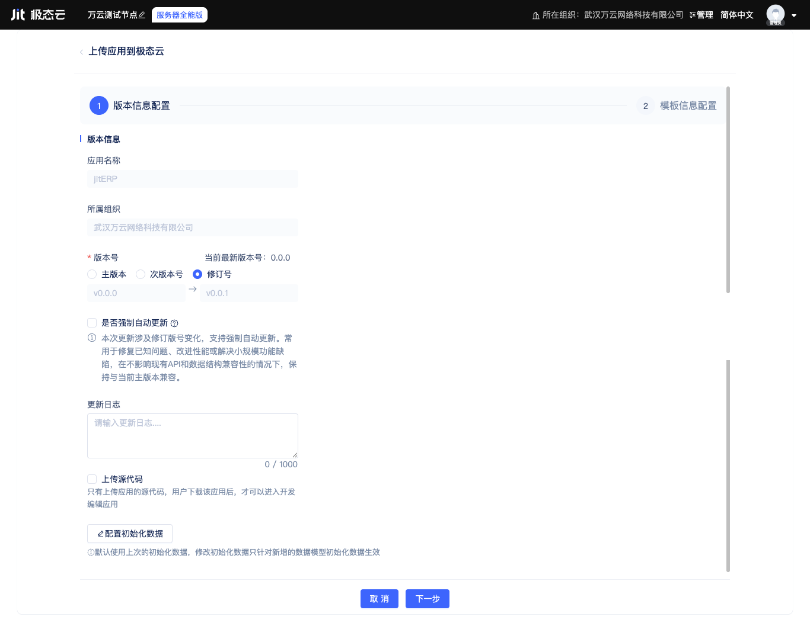

# 应用创建与管理

[节点控制台](./运行环境管理#节点的本地默认运行环境)为开发者提供了应用创建、导入、导出、发布、部署等功能入口，覆盖了从立项到运维的全生命周期。

## 创建第一个应用

在节点控制台中点击“新建应用”按钮，会打开新建应用弹窗。

开发者只需要填写应用名称、ID，然后点击确定，即可快速完成一个应用的创建。

## 基于已有应用快速开发

JitAi提供了两种基于已有应用快速开发的方式：继承应用、创建副本。
  
### 继承应用
继承可以让一个应用拥有被继承应用的功能模块（JitAi技术体系中称之为元素），每一个新建的应用都默认继承了两个官方应用模板：JIT开发框架、JIT开发工具。前者是JitAi官方开发框架，提供丰富的开箱即用的元素，后者为应用开发过程提供可视化与全代码双模式的开发工具。除了默认继承的官方应用模板，开发者也可以继续添加其它要继承的应用。

开发者点击展开`继承应用`折叠面板后点击右侧`添加应用模板`按钮，会打开应用模板列表。开发者在列表中查看全网公开或组织内部发布的应用模板，点击卡片即可添加到继承列表中。已添加的应用模板也可以点击右侧`移除`按钮进行移除，JIT开发框架不支持移除操作。

:::tip

被继承应用的开发者会持续发布新的版本，以修复bug、添加新功能等，开发者可以在[节点控制台](./运行环境管理#节点的本地默认运行环境)或[在应用设置](../JitAi可视化开发工具.md#应用设置)中检查新版本并更新。

:::

在JitAi开发工具中，开发者既可以开发新的元素，也可以查看从被继承应用中继承的元素，并针对个别元素进行重写覆盖。

开发者点击`显示继承的应用`按钮，即可在元素目录树底部找到被继承应用中的元素，点击元素即可在右侧打开元素编辑器。继承的元素不支持直接编辑，但可以点击编辑器右上角的`重写`按钮进行覆盖重写。

### 创建副本
继承方式只能对指定的父应用的元素进行覆盖重写，如果想要在源码的基础上对应用进行修改，又不想破坏原来的应用，则可以创建一个副本。

创建出的副本是一个全新的应用，开发者需要填写新的应用名称和ID，在副本上的任何修改不会影响原应用。

## 数据存储与环境变量配置
在新建应用时，JitAi会使用本地磁盘作为应用的默认文件存储方式。桌面版本使用SQLite作为应用默认的数据库和缓存，服务器版本使用MySQL作为默认数据库以及使用Redis作为默认缓存。开发者可以在创建应用时对默认配置进行修改，连接到自己指定的OSS存储、数据库以及缓存服务。

以连接MySQL数据库为例，开发者准备好自己的MySQL服务，并填写连接信息即可（开发者需确保MySQL服务是可访问的）。

官方基础框架中封装了阿里云OCR识别、高德地图API，所需要的API密钥信息被定义成了环境变量。PDF转换、文件预览默认使用JitAi官方服务器，开发者可以自行搭建服务器，并在环境变量中配置服务地址。

开发者在开发自己的应用时也可以定义环境变量，比如用环境变量来存储数据库连接信息、API密钥等，应用导出/发布时就不会泄露敏感信息。

## 应用版本管理与发布

当应用完成开发后，开发者可以发布应用版本，并在目标[运行环境](./运行环境管理#在运行环境中部署应用)中部署该应用版本。

在节点控制台的应用列表中，点击应用卡片上的`更多`按钮，在弹出菜单列表表点击`发布应用`按钮，会打开发布应用弹窗，开发者需确认和填写以下信息：版本号、是否强制自动更新、更新日志、是否上传源代码、包含哪些初始化数据。

### 语义化版本号
默认情况下会更新修订版本号，如果需要更新次版本号或主版本号，开发者可以自行勾选对应选项。

:::tip 语义化版本号

建议开发者遵循[语义化版本](https://semver.org/lang/zh-CN/)规范，主版本号用于表示重大变更，次版本号用于表示功能新增或优化，修订版本号用于表示bug修复。

:::

### 是否强制自动更新

如果开发者选择强制自动更新，则部署该版本应用的运行环境会在应用有新版本时自动更新，否则需要手动更新。

### 有意义的更新日志

建议开发者填写有意义的更新日志，以便用户了解应用的更新内容。

### 是否包含源代码

如果开发者选择包含源代码，则应用部署时可以以[开发模式](./运行环境管理#以开发模式部署)部署，否则只能以[生产模式](./运行环境管理#以生产模式部署)部署。

平台会对源码进行加密，保证源码不会泄露。

### 包含一些初始化数据

如果开发者选择包含一些初始化数据，则该应用版本被部署时会自动写入这些数据到数据库中。有部署演示版本的需求时，包含初始化数据会非常方便。

开发者可以选择要包含初始数据的数据表模型，但初始化数据累计最多1000条，请提前规划好每个数据表的数据量并准备好数据。

## 应用导出导入

## 导出源码zip包

在[节点控制台](./运行环境管理#节点的本地默认运行环境)的“应用”列表中，点击应用卡片上的“更多”-“导出应用”按钮，即可下载应用源码zip包。

## 导出为微信小程序

平台支持将应用导出为微信小程序，应用源码会嵌入到微信小程序的工程目录中，便于开发者在微信小程序生态下二次开发和发布。

## 导入应用源码包

在[节点控制台](./运行环境管理#节点的本地默认运行环境)中点击“导入应用”按钮，可以把应用源码zip包导入到节点的默认运行环境中，并在新节点上继续开发。
