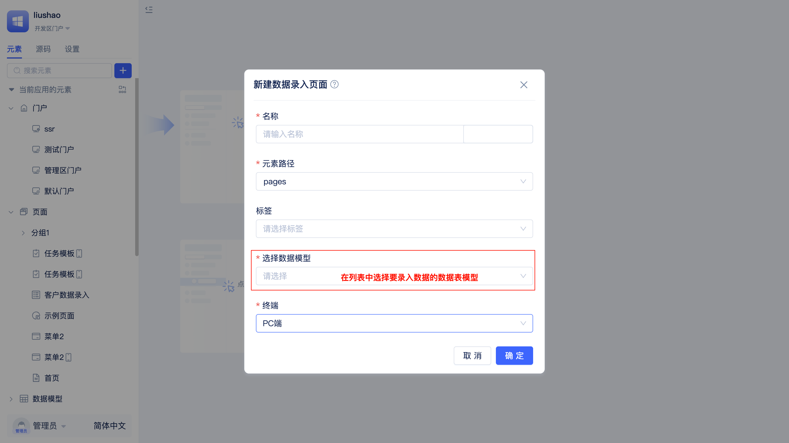
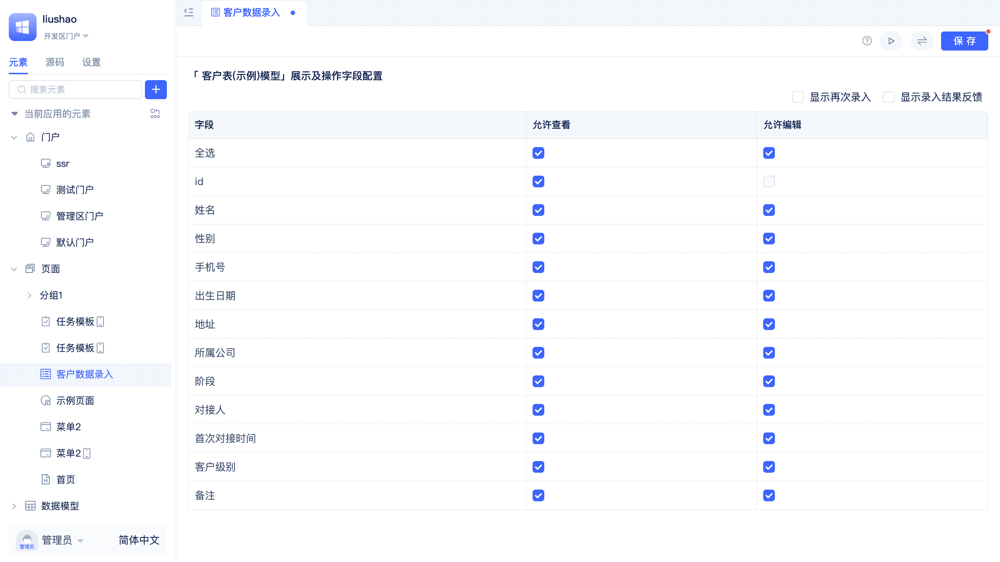
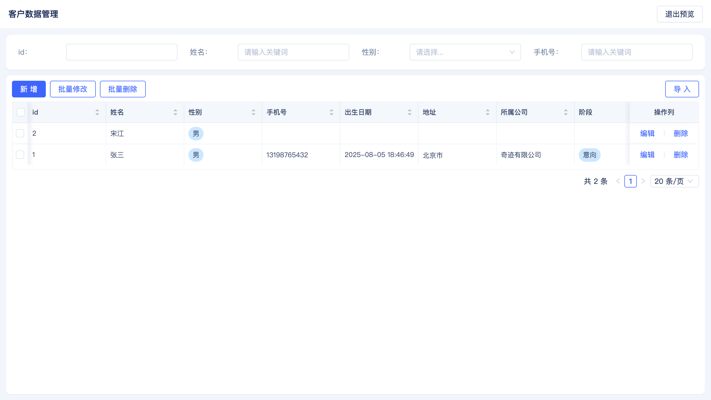
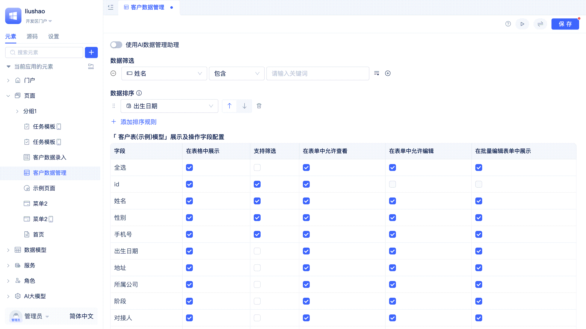

# 配置数据录入与管理页面
[标准页面的开发](./页面UI与功能开发.md)需要开发者自行组织页面中的组件布局和功能，而在企业应用系统中，问卷表单数据收集、数据增删改查是极为常见的业务需求，实现模式也相对固定。因此，JitAi直接提供了对应类型的页面，帮助开发者快速完成功能开发并且能够进行自由修改。

对于定制化程度较高的业务需求，开发者也可以使用全代码页面进行开发。

## 数据录入页面开发
人员信息登记、车辆信息登记、设备信息登记等业务场景中，需要用户填写表单数据，并提交到后台进行处理。JitAi直接提供了数据录入页面，帮助开发者快速完成表单数据收集功能的开发。

### 创建数据录入页面

数据录入页面的创建过程和[标准页面的创建过程](./页面UI与功能开发.md#创建一个标准页面)基本一致，不同的是数据录入页面需要绑定一个[数据表模型](../数据建模/数据表模型.md)，用于存储用户录入的数据。

开发者可以在创建页面时选择页面类型为`数据录入页面`，并在`选择数据表`处选择要录入数据的[数据表模型](../数据建模/数据表模型.md)，点击`确定`按钮后会自动进入可视化编辑器。

### 配置允许查看和编辑的字段
当不想向用户暴露个别字段时，开发者可以配置用户可查看的字段。当只想让用户看到字段值，但又不想让用户修改时，开发者可以配置用户可编辑的字段。

开发者在页面编辑器的`允许查看`一列中，将不需要向用户暴露的字段取消勾选（例如： ID），则用户看到的录入表单中将不再显示对应字段。

开发者在页面编辑器的`允许编辑`一列中，将不允许用户修改的字段取消勾选，则用户在录入表单中看到的对应字段将是只读状态。

### 提交后显示再次录入按钮

当用户有使用一个表单连续录入多条数据的需求时，开发者可以开启`显示再次录入`的开关，即可完成对该需求的支持。

开发者在开发页面时可以勾选`显示再次录入`选项，使得用户每次`提交`数据后点击`再次录入`按钮即可回到录入界面并填写新的数据。该选项默认是打开状态。

### 提交后展示结果反馈界面
当用户完成一次数据提交后，可以给出一个录入结果的反馈界面，告知用户本次录入结果。这是一种常见的交互设计，可以提升用户体验。

开发者在页面编辑器中勾选`显示录入结果反馈`选项，则用户在完成表单数据填写并点击`提交`按钮后，会看到一个数据录入成功的反馈提醒界面。该选项默认是打开状态。

## 数据管理页面开发

常见的数据管理功能页面中，通常都会提供数据增删改查的功能，包含筛选条件、排序、分页、工具栏按钮、操作列按钮等常见的界面元素和功能。JitAi直接提供了数据管理页面，帮助开发者快速完成数据管理功能的开发。

### 创建数据管理页面

和数据录入页面创建流程一致，数据管理页面也需要绑定一个[数据表模型](../数据建模/数据表模型.md)，用于存储数据。

开发者可以在创建页面时选择页面类型为`数据管理页面`，并在`选择数据表`处选择要管理数据的[数据表模型](../数据建模/数据表模型.md)，点击`确定`按钮后会自动进入可视化编辑器。

开发者通常不需要进行任何额外配置，页面即可直接使用。当然，开发者也可以根据实际需求进行配置修改，参考后续章节。

点击可视化编辑器右上角的预览按钮，看看效果吧！用户在访问页面时将会看到一个功能完整的数据管理界面，包含数据表格、筛选条件、分页、工具栏中的新增/批量修改/批量删除/导入、操作列中的编辑/删除、点击列标题进行排序。

### 通过默认筛选条件限制页面表格查询的数据
在实际业务中，可能需要限制页面表格中能查询和展示的数据。例如，仅展示近一年的数据。通过设置默认筛选条件，可以有效保障数据安全，提升用户的使用效率，避免无关数据干扰业务操作。JitAi的[筛选器](../在页面中使用功能组件/筛选器.md)支持对文本、数字、日期时间等各类型字段的多种筛选条件设置，能够满足几乎所有筛选需求。

开发者可以在页面编辑器中配置`数据筛选`，点击每个筛选条件右侧的加号按钮，可以添加多个条件。

:::tip 基于角色的数据权限控制
除了在页面中配置默认筛选条件，开发者还可以对不同用户在应用内的角色进行数据查询和操作的细粒度控制，这是一种更高级的配置方式，开发者可以参考角色权限的文档。

角色权限中的配置会和页面中配置的条件叠加生效，是`与`的关系。
:::

### 配置默认的数据排序规则
数据表格的展示顺序往往会影响用户的工作效率。例如，销售人员希望优先看到最新的订单，财务人员则可能更关注金额较大的交易。合理设置默认的数据排序规则，可以让用户在进入页面时第一时间看到最重要或最相关的数据，提升数据查找和处理的效率。

开发者可以在页面编辑器中配置`数据排序`，点击每个排序条件右侧的加号按钮，可以添加多个排序条件。

### 在页面表格中隐藏部分字段
在实际业务中，可能需要隐藏部分字段，例如，用户不需要看到`创建时间`、`更新时间`等字段。通过隐藏字段，可以减少无关数据对用户的干扰，提升页面整洁度和使用效率。

开发者可以在页面编辑器的`在表格中展示`中进行配置，勾选则展示对应字段，取消勾选则隐藏对应字段。

### 配置支持条件筛选的字段
并不是所有字段都需要支持条件筛选，例如，备注字段通常不需要支持条件筛选。

开发者可以在页面编辑器的`支持筛选`中进行配置，将不需要参与条件筛选的字段取消勾选，勾选则支持条件筛选。

### 配置表单中允许查看和编辑的字段
在用户新增或编辑数据时，主键ID通常不需要让用户在表单中看到，创建时间也不需要让用户在表单中编辑，而是由系统自动生成。以此类推，JitAI支持对所有字段在表单中的查看和编辑权限进行配置。

开发者可以在页面编辑器的`允许查看`和`允许编辑`中进行配置，将不需要让用户在表单中看到或编辑的字段取消勾选，勾选则允许查看和编辑。

:::tip
在表单中不允许查看和编辑并不会对[批量编辑表单](#配置批量编辑表单中展示的字段)生效。
:::

### 配置批量编辑表单中展示的字段
批量编辑通常用于在表格中选中多条数据后，对这些数据进行批量修改。但并不是所有字段都适合进行批量修改，例如：手机号、邮箱等极具区分度的字段通常不适合批量修改。

开发者可以在页面编辑器的`在批量编辑表单中展示`中进行配置，勾选则在批量编辑表单中展示对应字段，取消勾选则不展示对应字段。另外，批量表单要求至少配置一个展示字段。

### 启用AI数据管理助手
JitAi支持在数据管理页面中直接启用AI数据管理助手，帮助用户快速完成数据管理操作。例如：快速生成测试数据。

开发者在页面编辑器中开启`使用AI数据管理助手`开关，在配置面板中配置好大模型后，点击`保存`即可。

欢迎语以及开场白是可选配置，开发者可以按需设置。关于AI助理的更多信息，请阅读AI助理相关文档。

## 转换为标准页面进行修改
数据录入页面和数据管理页面是JitAi提供的开箱即用的内置页面类型，开发者可以快速创建并使用。当开发者想要基于默认实现进行更精细化的定制修改时，可以将页面转换为标准页面进行无限制地修改。

开发者可以在页面编辑器中点击右上角的`转为标准页面`按钮，即可将页面转换为标准页面。关于标准页面的开发方法参考[页面UI与功能开发](./页面UI与功能开发.md)。

:::warning
转换为标准页面后无法再恢复为原来的`数据录入页面`或`数据管理页面`类型。
:::
