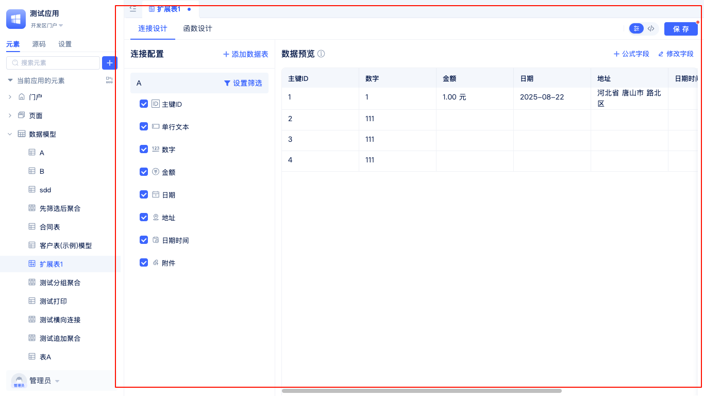
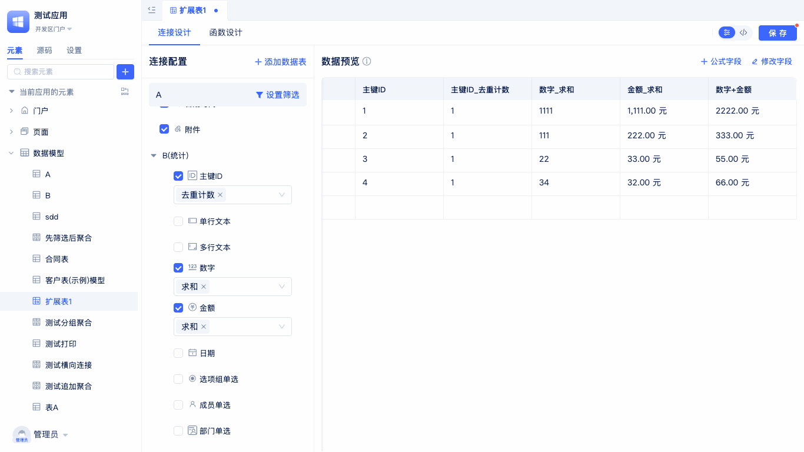

# 扩展表模型

扩展表模型是一种在不改变原有基础数据表结构的前提下，通过灵活关联其他数据表，实现业务字段扩展和多表数据整合的建模方式。

以`员工信息表`为例，原本仅用于存储员工的基础资料。随着业务发展，可能需要在`员工信息表`中统计每位员工的年度销售额和参与项目数量等维度数据，而这些信息并未直接包含在`员工信息表`中。此时，可以借助扩展表模型，将`员工信息表`与`销售记录表`、`项目参与表`等相关数据表进行灵活关联，动态扩展出`年度销售额`、`项目数`等统计字段。通过这种方式，无需变更原有表结构，即可在扩展表中集中展示和分析员工的多维业务数据，满足复杂的数据整合与分析需求。

## 扩展表创建

系统在开发区为开发者提供了便捷的扩展表创建入口，支持一站式新建、配置和实时编辑扩展表。通过可视化操作，开发者可以快速完成扩展表的创建、字段设置及关联关系配置，极大提升了建模效率和灵活性。所有配置变更均可实时预览。

在开发区的元素树中，定位到`数据模型`，点击右侧的`+`按钮，在弹出的列表中选择`扩展表`，即可打开`新建扩展表`弹窗。

在`新建扩展表`弹窗中，填写扩展表名称（系统会自动生成英文名），选择一个基准表，点击`确定`即可完成扩展表的创建，并自动进入扩展表的可视化编辑界面。

在扩展表可视化编辑器中，开发者不仅可以灵活配置扩展表的结构和字段，还能实时预览数据效果，便于快速验证和调整设计。

## 连接设计

在扩展表的可视化编辑页面，切换至`连接设计`标签页，可灵活配置扩展表与基准表及其他数据表的关联关系。你可以直接选择基准表，设置筛选条件以限定数据范围；也可以添加其他关联表，配置匹配条件、数据筛选及排序规则。所有已建立的表连接均支持随时调整或删除。合理设计连接关系后，扩展表能够高效整合多表数据，满足多维度分析与建模需求。每一次连接配置的变更，右侧数据预览窗口都会实时反映最新效果，助你直观验证配置结果。

### 设置基准表筛选条件

在实际业务场景中，往往需要对扩展表所关联的基准表数据进行筛选，例如只关注某一类状态的数据、某个时间段内的记录，或是特定部门的数据等。通过设置基准表筛选条件，可以让扩展表只聚焦于业务所需的数据子集，提升数据分析的针对性和效率。

在扩展表的`连接设计`标签页中，开发者可以通过点击基准表右侧的`设置筛选`按钮，进入筛选条件配置界面。此处可根据实际业务需求，灵活添加多个筛选条件，例如按状态、时间区间、部门等字段进行过滤。配置完成后，点击保存即可生效，扩展表将仅展示符合条件的数据。设置完成后，按钮名称会变为`修改筛选`，后续如需调整筛选规则，可随时点击进行修改，所有变更均会实时反映在数据预览中，便于开发者直观验证筛选效果。

### 添加数据表

在扩展表模型中，常常需要将多个相关的数据表进行关联，以实现数据的整合与统计。例如，主表与子表、主表与统计表的多表关联，适用于需要跨表汇总、分析或补充业务信息的场景。数据表添加后会出现在连接配置中，形成统计表。

在扩展表的连接配置界面，点击右侧的`添加数据表`按钮，选择需要关联的目标数据表。设置好`匹配条件`、`数据筛选`和`数据排序`后，点击`确定`即可完成关联，实现多表数据的灵活整合。
关联成功后，所添加的数据表将出现在连接配置列表下方。你可以灵活勾选需要统计的字段，并为其选择合适的统计方式，右侧会实时预览前50条数据，帮助你直观验证配置效果。

:::tip 注意
扩展表仅支持添加数据表的统计字段，如需展示原始字段值，请使用[聚合表](./聚合表模型.md#多表横向连接)。
:::

### 实时编辑统计表配置

在成功添加数据表后，系统支持对已添加的统计表进行实时编辑和删除操作。你可以根据业务需求，灵活调整统计表的配置，确保数据整合的准确性和灵活性。下图展示了如何在扩展表中对统计表进行编辑和删除。

开发者将鼠标移动到需要编辑的统计表名称所在行，右侧会自动显示`更多操作`按钮（三个点图标）。点击该按钮后，会弹出`编辑`和`删除`选项。选择`编辑`可以进入统计表的详细配置页面，修改匹配条件、筛选规则等内容，保存后立即生效。选择`删除`则可以将该统计表从扩展表的连接配置中移除，操作前请确认无误。

### 字段统计

在扩展表的字段统计功能中，开发者可以根据业务需求，对不同类型的字段进行灵活的统计和汇总，帮助快速获得关键数据指标。

使用时，首先在扩展表的连接配置界面，选择已关联的统计表。然后在字段列表中，勾选需要参与统计的字段，并为每个字段选择合适的统计方式。不同类型的字段支持的统计方式各不相同：数字类字段可以选择求和、平均值、最大值、最小值等统计方式；文本类字段可以进行计数或去重计数；日期类字段则支持最大日期、最小日期等操作。配置完成后，右侧会实时展示统计结果的预览，方便开发者直观验证统计配置的效果。

### 添加公式字段

在扩展表中，开发者可以通过添加公式字段，实现对已有字段的灵活计算与数据加工，满足业务中的统计、转换、条件判断等多样化需求。公式字段支持多种内置函数和表达式，能够动态生成新的数据列，极大提升数据分析的灵活性。

在扩展表的可视化编辑界面，点击`添加字段`，选择`公式字段`。在弹窗中填写公式名称，输入所需的计算表达式，保存后即可在表结构中新增该公式字段，并可实时预览其计算结果。

### 修改字段别名

在扩展表中，开发者可以根据实际业务需求，对字段的显示名称（别名）进行自定义修改，使数据表结构更贴合业务语境，提升可读性和易用性。

在扩展表的可视化编辑界面，点击右上角的`修改字段`按钮，弹出`修改字段`面板后，可直接编辑并保存字段的显示别名。你还可以通过搜索框快速查找目标字段，便捷定位并修改。保存后，新的字段别名会即时在表格中更新显示，提升数据表的可读性和业务贴合度。

## 函数设计

扩展表支持灵活的函数设计，帮助开发者实现复杂的数据处理、业务逻辑计算和自定义数据输出。通过为扩展表编写函数，可以对表内数据进行批量处理、条件判断、数据转换、聚合统计等操作，极大提升数据建模的能力和自动化水平。

在扩展表的可视化编辑器中，开发者可以切换到`函数设计`标签页，进入函数设计面板。

### 新建函数

在扩展表的函数设计面板中，开发者可以便捷地创建自定义函数，用于实现复杂的数据处理和业务逻辑。

点击函数设计面板左侧的`新建函数`按钮后，系统会弹出`新建函数`窗口。此时只需输入函数名称（英文名会自动生成），点击`确定`即可完成函数的创建，并自动跳转到函数设计页面。此处的函数示例主要演示了对当前模型行数据的保存操作，开发者可根据实际需求进一步完善函数逻辑。

### 源码查看编辑

扩展表支持源码模式，开发者可以直接查看和编辑扩展表的底层配置源码，满足高级自定义和批量修改的需求。

在扩展表的函数设计面板右上角，点击`</>`按钮即可进入源码编辑模式。此时你可以直接查看和编辑扩展表的全部配置源码，修改后保存即可立即生效。
