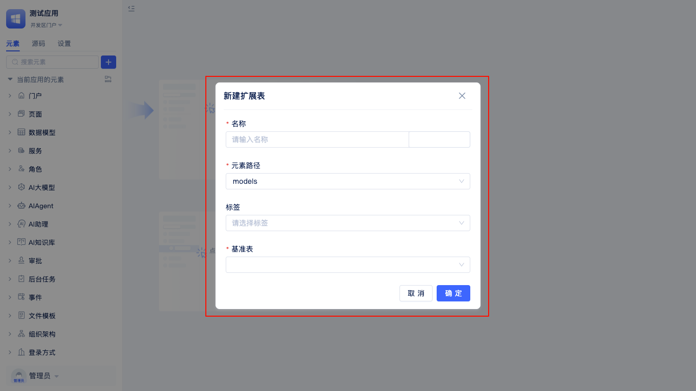
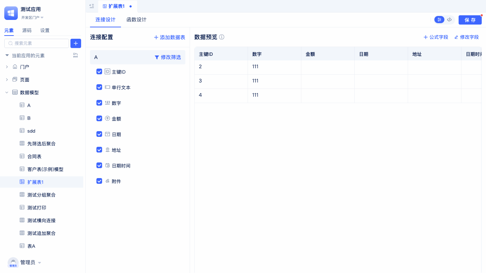

# 扩展表模型

扩展表模型是一种在基础数据表的基础上，通过关联其他数据表，实现数据字段扩展和灵活数据整合的建模方式。它适用于以下典型场景：

- 需要在不改变原有基础表结构的前提下，动态增加新的业务字段或统计信息；
- 需要将多个相关数据表的数据进行整合、聚合，形成更丰富的数据视图；
- 需要根据业务需求灵活配置扩展字段、计算字段，满足多样化的数据分析和展示需求；
- 适用于主表与子表、主表与统计表等多表关联的复杂业务场景。

通过扩展表模型，用户可以低代码方式快速搭建多维度、可扩展的数据结构，提升数据建模的灵活性和可维护性。

## 扩展表创建

为了让开发者能够根据业务需求灵活扩展数据模型，系统在开发区提供了便捷的扩展表创建入口。通过该入口，用户无需修改原有基础表结构，即可快速搭建和管理扩展表，满足多样化的数据整合与分析场景。

在开发区的元素树中，定位到`数据模型`，点击右侧的`+`按钮，在弹出的列表中选择`扩展表`，即可打开`新建扩展表`弹窗。

在`新建扩展表`弹窗中，填写扩展表名称（系统会自动生成英文名），选择一个基准表，点击`确定`即可完成扩展表的创建，并自动进入扩展表的可视化编辑界面。

在扩展表可视化编辑器中，开发者不仅可以灵活配置扩展表的结构和字段，还能实时预览数据效果，便于快速验证和调整设计。

## 连接设计

在扩展表的可视化编辑页面，切换到`连接设置`标签页，可以配置扩展表与基准表及其他数据表的连接关系。可直接选择基准表，设置筛选条件，限定数据范围。也可以添加其他关联表，设置匹配条件、数据筛选和排序规则。所有已建立的表连接可随时调整或删除。合理配置连接关系后，扩展表可实现多表数据整合，满足多维度分析和建模需求。

### 设置基准表筛选条件

在实际业务场景中，往往需要对扩展表所关联的基准表数据进行筛选，例如只关注某一类状态的数据、某个时间段内的记录，或是特定部门的数据等。通过设置基准表筛选条件，可以让扩展表只聚焦于业务所需的数据子集，提升数据分析的针对性和效率。

开发者在`连接设置`标签页点击基准表右侧的`设置筛选`按钮，配置并保存筛选条件即可。

### 添加数据表

在扩展表模型中，常常需要将多个相关的数据表进行关联，以实现数据的整合与统计。例如，主表与子表、主表与统计表的多表关联，适用于需要跨表汇总、分析或补充业务信息的场景。

在扩展表的连接配置界面，点击右侧的`添加数据表`按钮，选择需要关联的目标数据表。设置好`匹配条件`、`数据筛选`和`数据排序`后，点击`确定`即可完成关联，实现多表数据的灵活整合。
关联成功后，所添加的数据表会显示在连接配置列表下方。你可以勾选需要统计的字段，并选择相应的统计方式，右侧会实时展示前50条数据的预览效果，方便你直观验证配置结果。

### 添加公式字段

在扩展表中，开发者可以通过添加公式字段，实现对已有字段的灵活计算与数据加工，满足业务中的统计、转换、条件判断等多样化需求。公式字段支持多种内置函数和表达式，能够动态生成新的数据列，极大提升数据分析的灵活性。

在扩展表的可视化编辑界面，点击`添加字段`按钮，选择`公式字段`类型。随后在弹窗中输入公式名称，编辑所需的计算表达式，保存后即可在表结构中看到新添加的公式字段，并实时预览其计算结果。

### 修改字段别名

在扩展表中，开发者可以根据实际业务需求，对字段的显示名称（别名）进行自定义修改，使数据表结构更贴合业务语境，提升可读性和易用性。

在扩展表的可视化编辑界面，点击右上角的`修改字段`按钮，弹出`修改字段`面板后，可直接编辑并保存字段的显示别名。你还可以通过搜索框快速查找目标字段，便捷定位并修改。保存后，新的字段别名会即时在表格中更新显示，提升数据表的可读性和业务贴合度。

## 函数设计

扩展表支持灵活的函数设计，帮助开发者实现复杂的数据处理、业务逻辑计算和自定义数据输出。通过为扩展表编写函数，可以对表内数据进行批量处理、条件判断、数据转换、聚合统计等操作，极大提升数据建模的能力和自动化水平。

在扩展表的可视化编辑器中，开发者可以切换到`函数设计`标签页，进入函数设计面板。

### 新建函数

在扩展表的函数设计面板中，开发者可以便捷地创建自定义函数，用于实现复杂的数据处理和业务逻辑。

点击函数设计面板左侧的`新建函数`按钮后，系统会弹出`新建函数`窗口。此时只需输入函数名称（英文名会自动生成），点击`确定`即可完成函数的创建，并自动跳转到函数设计页面。此处的函数示例主要演示了对当前模型行数据的保存操作，开发者可根据实际需求进一步完善函数逻辑。

### 源码查看编辑

扩展表支持源码模式，开发者可以直接查看和编辑扩展表的底层配置源码，满足高级自定义和批量修改的需求。

在扩展表的函数设计面板右上角，点击`</>`按钮即可进入源码编辑模式。此时你可以直接查看和编辑扩展表的全部配置源码，修改后保存即可立即生效。
