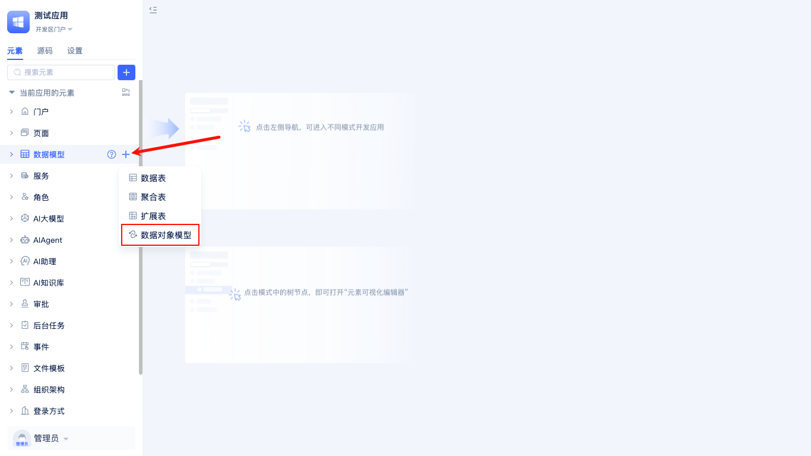
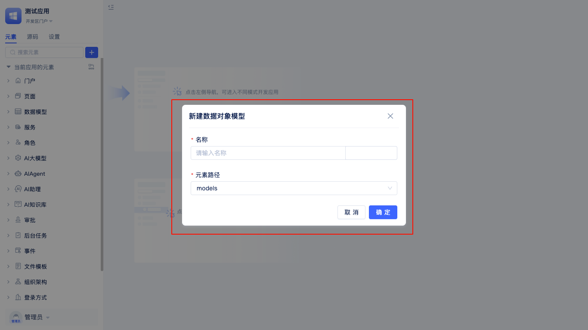
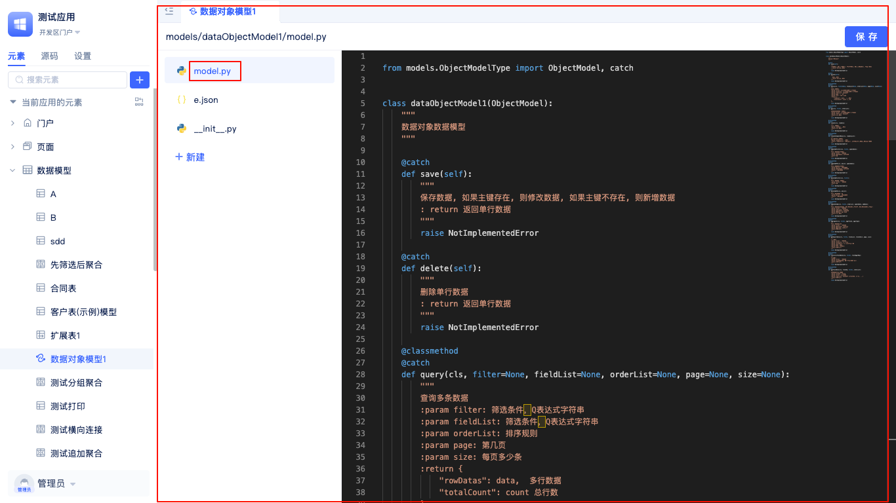
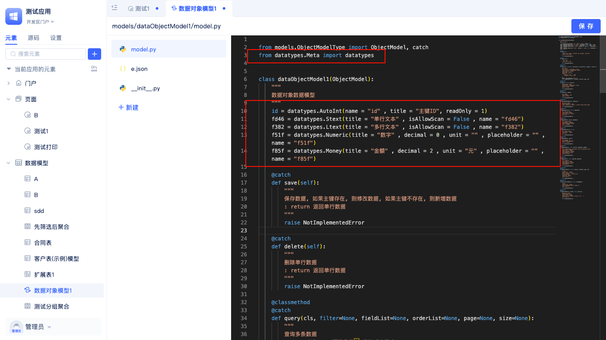
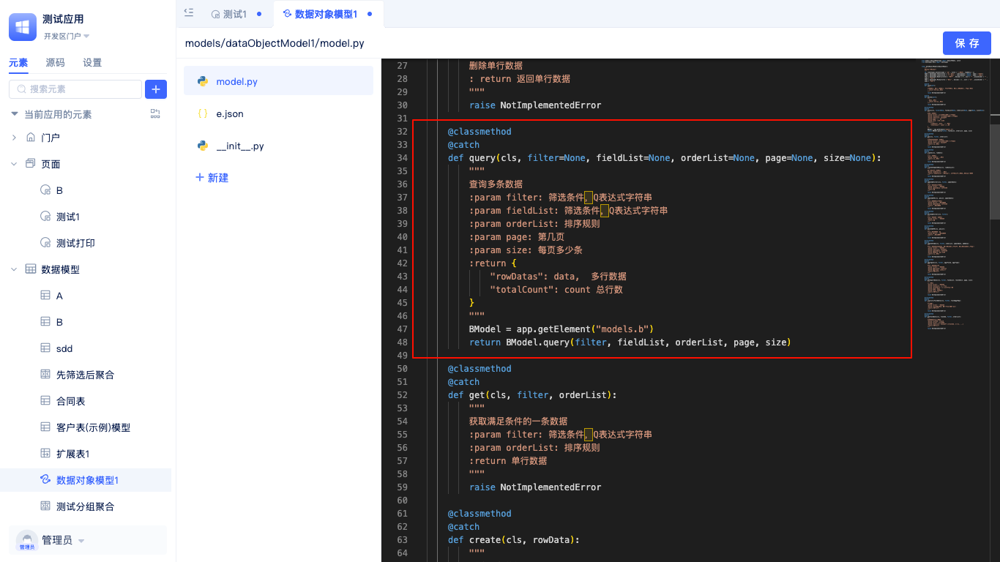
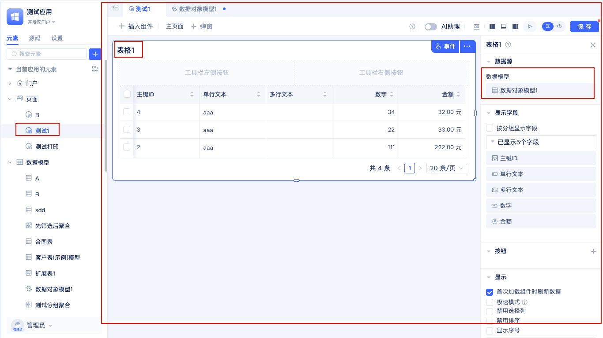

# 数据对象模型

数据对象模型（Data Object Model）是一种专为全代码开发模式设计的数据结构，类似于 DTO（Data Transfer Object，数据传输对象）。它由开发者根据具体业务需求自定义，不直接映射或关联任何数据库表。数据对象模型主要用于在服务函数、事件处理、流程编排等业务逻辑中，进行数据的结构化表达、传递与转换。通过数据对象模型，开发者可以灵活定义多层嵌套、复杂组合的数据结构，实现不同模块间的数据标准化交互，提升代码的可维护性、复用性和业务解耦能力。数据对象模型非常适合处理复杂业务逻辑、多层数据交互、临时数据封装等场景，是构建高质量企业级应用的重要工具之一。

## 数据对象模型创建

JitAi支持开发者在全代码模式下灵活创建和管理数据对象模型。

在开发区的元素树中，点击数据模型右侧的`+`按钮，在弹出的列表中选择`数据对象模型`，即可打开`新建数据对象模型`弹窗。

在`新建数据对象模型`弹窗中，填写模型名称（系统会自动生成英文名），点击`确定`即可完成创建，并自动进入数据对象模型的全代码编辑界面。

## 数据对象模型使用

数据对象模型的使用非常灵活，适用于服务函数、事件处理等业务逻辑中，作为输入参数或输出结果的数据载体，实现不同模块间的数据标准化传递。在实际开发过程中，数据对象模型常用于表达和转换复杂的数据结构，避免直接操作数据库表，从而提升代码的可维护性和复用性。同时，数据对象模型支持多层嵌套和组合，能够满足复杂业务场景下的数据组织需求。

在全代码编辑界面中，开发者可以通过点击左侧文件列表中的 `model.py` 文件，便捷地查看和编辑数据对象模型的具体实现。数据对象模型需继承平台提供的基类（如 `BaseModel`），并可根据业务需求灵活定义属性（字段）和方法。

以下是一个数据对象模型的典型使用流程：

首先，在对象模型的 `model.py` 文件中定义所需字段。字段的详细配置方式可参考[数据表模型](./数据表模型.md)。

接着，重写模型的 `query` 方法，用于为表格组件提供自定义的数据查询逻辑。

最后，在页面中添加表格组件，并将数据对象模型设置为数据源，即可展示 `query` 方法返回的数据内容。
