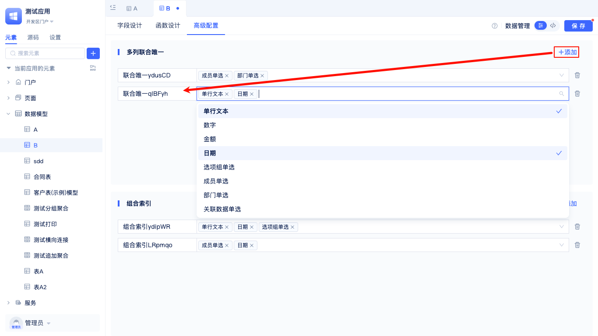
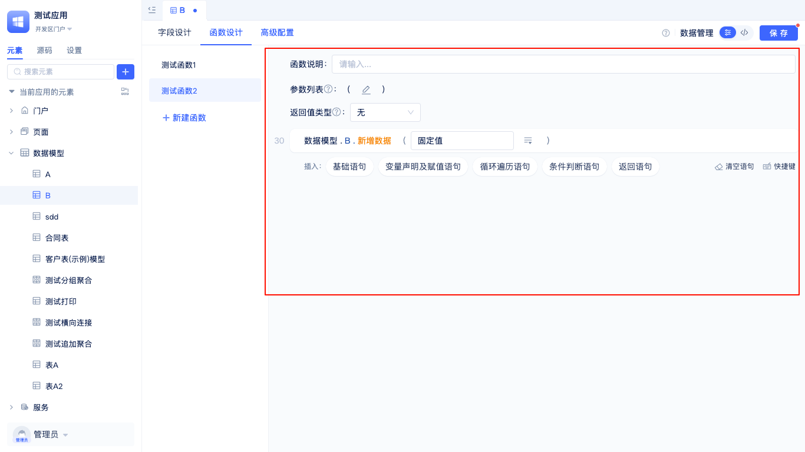

# 数据表模型

## 什么是数据表模型
数据表模型是JitAi应用的数据基础，用于定义业务数据的结构、类型和约束规则, 一个数据表模型就对应着数据库里面的一张表。

## 创建数据表模型

### 数据表创建入口

在开发区的元素树中，可以创建数据表模型。

### 创建方式
#### 新建数据表数据模型
   

   填写模型名称，创建方式选择新建数据表数据模型,选择已有数据库

#### 基于已有数据表创建模型
   

   填写模型名称，创建方式选择基于已有表创建模型，选择已有数据库

   

   点击选择数据库表的输入框即可弹出该数据库所有表

   

   选择一个数据库表后，点击确定，进入到字段配置页面，点击从关联的数据库表中生成数据模型字段，然后将数据库字段映射成对应数据类型

---

## 设计表字段与数据类型
JitAi应用中有单行文本、多行文本、富文本、数字、金额等多种数据类型可以用作数据库表字段。

在创建数据表时，应根据具体业务需求选择合适的字段类型。

每种数据类型都有各自的配置选项。以**单行文本**为例：

单行文本数据类型应用广泛，是数据建模中最基础、最常用的字段类型之一。主要特点包括：仅支持单行文本内容且不允许换行，系统会自动生成字段名称（如 `f5f6`）方便数据库操作，默认最大可存储255个字符。该类型字段支持多种个性化设置和约束条件，可以设置提示文字，限制最大文本长度，还可通过唯一性控制确保字段值不重复，并支持创建数据库索引以优化查询性能。此外，单行文本字段还支持设置计算公式实现动态计算，以及预设默认值等高级功能，满足不同业务场景下的灵活需求。

单行文本字段适用于存储如下类型的数据：姓名、用户名、产品编号、订单号、标题、简短描述、电话号码、邮箱地址及其他不需要换行的简短文本信息。

更多数据类型介绍

## 配置表索引优化查询
在高级配置中，可以为数据表添加索引来优化查询性能和保证数据完整性。

### 多列联合唯一索引
通过选择多个字段创建联合唯一约束，确保这些字段的组合值在整个表中唯一。例如，可以将“产品名称”和“规格”字段设置为联合唯一，防止相同规格的产品出现重复。

### 组合索引  
选择多个字段创建组合索引，根据这些字段同时筛选可显著提升查询性能。

:::warning 警告
合理配置索引能有效提升查询速度，但过多的索引会影响数据写入性能，需要根据实际业务场景平衡。
:::

## 使用内置数据管理功能
JitAi为数据表模型提供了数据管理功能，无需编写代码即可对数据表进行CRUD操作，在开发区也能对数据进行管理。

点击数据管理，就可以进入到数据管理可视化页面

数据管理功能包括数据筛选查询、新增、编辑、删除、批量修改、批量删除、清空重置数据和导入导出等，用户可以直观地管理数据表中的所有记录。

## 扩展模型功能

### 模型函数配置
通过自定义模型函数，可以为数据模型扩展业务逻辑处理能力。

点击新建函数，弹框内输入函数名称

点击确定即可进入到函数编辑页面

模型函数支持新建、编辑、删除，参数和返回值类型可自定义，内置可视化代码编辑器便于快速插入常用语句，并可通过自定义函数扩展复杂业务逻辑。

### 源码模式
除了可视化配置外，还支持在代码模式下直接修改模型源码，为高级开发者提供更大的灵活性。

切换到源码模式下，可以看到模型定义，模型函数等整个模型的源代码。
