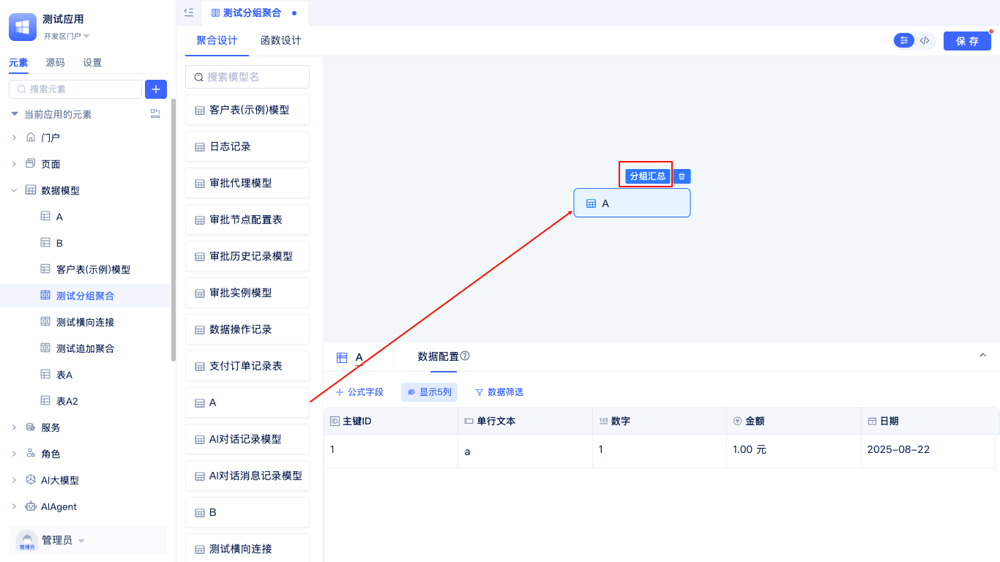

# 聚合表模型
聚合表模型是JitAi提供的一种高级数据建模方式，专门用于处理复杂的数据分析和统计场景。与[普通数据表模型](./数据表模型.md)不同，聚合表模型不直接对应数据库中的单一表结构，而是通过灵活的配置将多个数据表模型进行关联、合并和计算，最终生成满足特定业务需求的虚拟数据表。

## 新建聚合表模型

在开发区元素树中，可以新建聚合表。

在元素树中找到数据模型，点击右侧`+`新建，选择聚合表。

输入名称，英文名称会自动生成，点击确定按钮进入到聚合表可视化编辑器。

## 多表数据合并

追加合并是将多个结构相似的数据表按行方向合并成一个统一的数据集，类似于SQL中的UNION操作。系统会自动匹配各表中的相同字段，将所有数据追加到一起，并可选择是否对重复数据进行去重处理。

适用于以下场景：合并不同时期的销售数据、整合多个分店或部门的业务数据，以及合并相同业务类型但分散存储的历史数据等场景。

在左侧将你要追加合并的表拖入到右侧面板中。在节点配置中，完成两个表的字段映射配置。
追加合并后的数据默认会去重，即不会存在两条一样的数据，如果不想对数据进行去重，可以不勾选`对合并后的数据去重`。

点击数据配置按钮进入数据预览，仅显示前50条数据。

## 多表横向连接

横向连接通过指定的关联字段将多个数据表按列方向进行连接，类似于SQL中的JOIN操作。支持左连接、右连接、内连接等多种连接方式，可以将分散在不同表中的相关信息整合到同一行记录中。

适用于以下场景：可以关联用户基本信息表和用户订单表，从而查看用户的完整档案；也可以连接产品信息表和库存信息表，获得产品的详细库存状态。此外，还可以关联员工信息表和部门信息表，生成包含部门详情的员工报表，或者将客户表与其联系记录表连接，形成客户关系管理视图。

在左侧将你要横向连接的表拖入到右侧面板中。

选择连接方式，默认左连接，添加匹配字段。

点击数据配置进入数据预览。

## 分组统计

分组统计是对数据表按照指定字段进行分组，然后对每个分组内的数据执行聚合计算（如求和、计数、平均值等），类似于SQL中的GROUP BY操作。支持多层级分组和多种聚合函数，可以快速生成各种统计报表。

适用于以下场景：各种维度的数据统计分析，如按地区、时间、部门、产品类别、客户等级等字段进行分组汇总，快速生成销售报表、员工统计、库存分析、客户价值评估等业务报告。

在左侧将你要分组聚合的表拖入到右侧面板中，在面板中点击分组汇总进入到聚合配置页面。

在节点配置中添加分组字段，添加统计字段。
除了普通字段分组外，还有一些特殊的字段分组：日期或日期时间字段按年月日等分组、地址字段按省市区分组。

分组字段选择日期或日期时间字段，分组方式可以选择年、年-季度、年-月、年-周、年-月-日。

分组字段选择地址字段，分组方式可以选择省、省-市、省-市-区。

节点配置完成后，点击数据配置进入数据预览页面，仅显示前50条数据。

## 扩展计算字段

聚合表可以基于已有的聚合字段添加公式字段，公式字段显示的值就是公式计算出来的值。

以横向连接聚合表为例，在数据配置页面，点击`+公式字段`进入公式配置面板。

在公式面板中，可以选择字段，可以选择函数，可以选择上方的`+`、`-`、`*`、`/`等运算符，点击即可添加到面板中。

JitAi应用支持多种公式类型：  
-- 数值类型：最大值（`MAX`）、平均值（`AVG`）、求和（`SUM`）...    
--日期类型：当前时间（`NOW`）、日期增加（`DATEADD`）、月初（`MONTHSTART`）...   
--文本类型：文本拼接（`CONCAT`）、文本替换（`REPLACE`）、文本长度（`LEN`）...  
--逻辑类型：条件判断（`IF`）、多层判断（`IFS`）、条件拼接（`AND`/`OR`）...

如果想计算两个字段的最大值，可以使用上述公式`MAX(数字, 金额)`。

如果想确认公式是否设置正确，可以点击右侧的预览按钮。

填写公式中用到的数字字段和金额字段的值，然后点击测试按钮，测试结果就会出来正确的计算结果。

预览成功后，配置公式字段名称，类型以及字段配置等，点击确定就可以看到公式计算够的数据。

## 添加筛选条件

可以设置筛选条件对聚合后的数据进行筛选。

以追加合并聚合表为例，在数据配置预览页面，点击`数据筛选`进入到筛选条件配置页面。在设置筛选条件弹窗中，点击`+`添加筛选条件。如果想筛选数字在1-300之间的数据，先选择对应数字字段，再选择比较符`在范围内`，最后填入范围值1和300，点击确定。数据预览只会显示满足数字字段在1-300之间的行数据。

