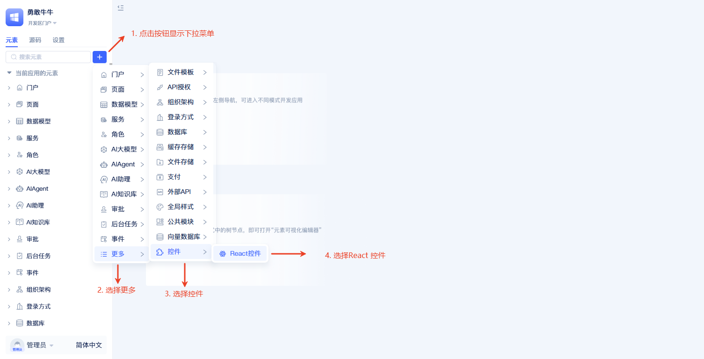
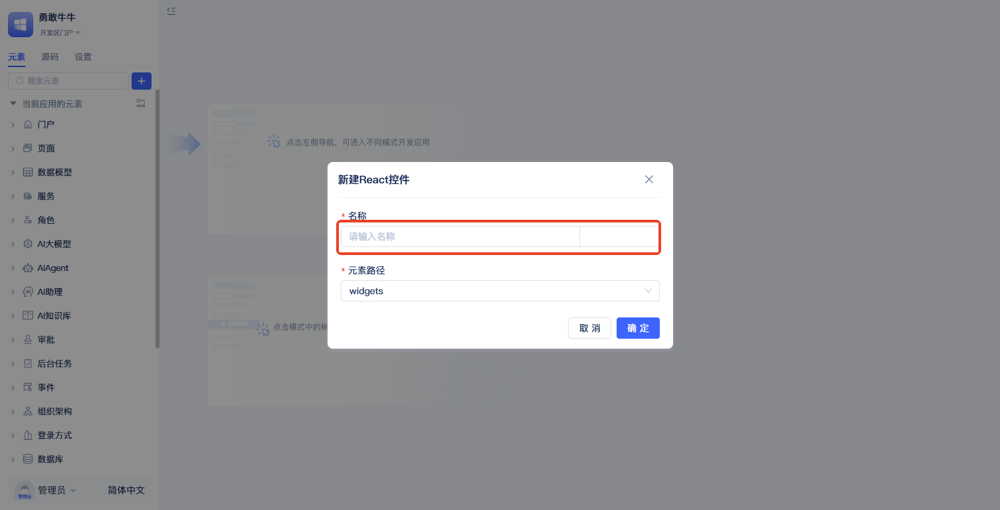
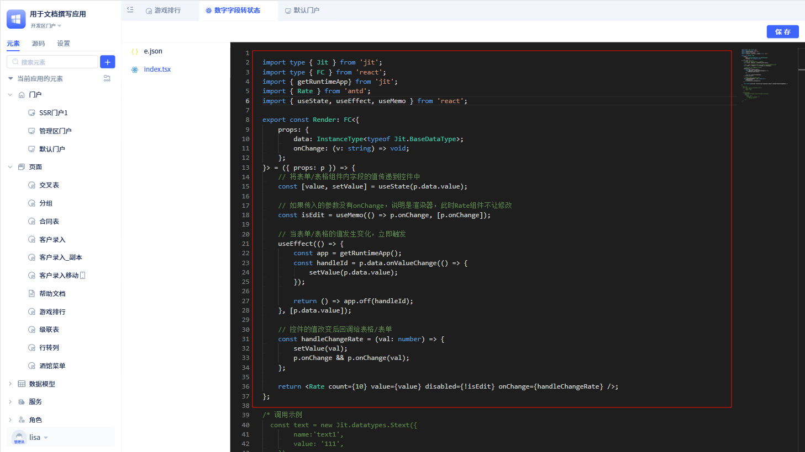
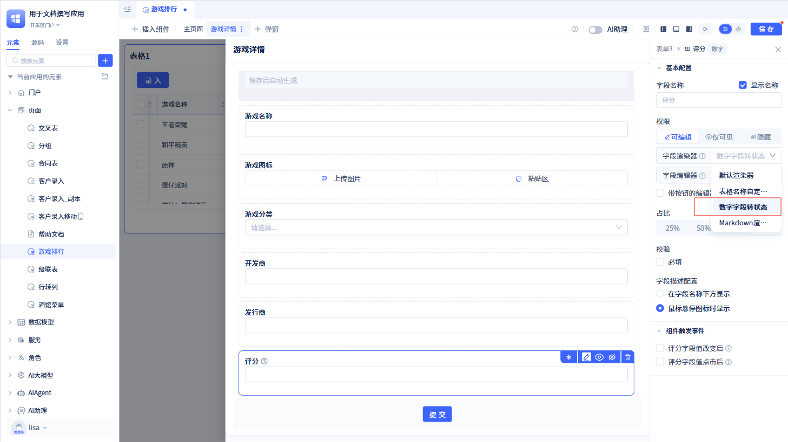

# 自定义控件

系统对各种数据类型提供了默认的渲染方式，但个别定制化需求是不能满足，需要用户使用自定义控件来完成。例如，将数字渲染成图标形式、将文本渲染某种特定样式等。

自定义控件功能允许开发者为数据类型创建专属的渲染器，通过React语法实现复杂的展示逻辑和交互效果。这些自定义渲染器可以应用在表格组件的单元格或表单组件的字段中，让开发者能够灵活控制数据的展示方式，实现从简单的样式美化到复杂的数据可视化等各种展示需求。

## 创建自定义控件元素



在元素目录树点击搜索框右侧的`+`按钮，选择`更多`-`控件`-`React 控件`，随后弹出创建控件元素的弹窗。



创建弹窗中只需填写`名称`即可，点击`确定`完成创建。

## 修改自定义控件

创建完成后会在左侧元素树中显示。接下来，我们通过一个示例来展示如何修改自定义控件。


点击元素树中创建的自定义控件元素，进入编辑器。编辑器中有两个文件`index.tsx`和`e.json`，`e.json`是元素的定义，`index.tsx`是控件渲染器的实现。现在我们进行修改`index.tsx`文件。



``` typescript

import type { Jit } from 'jit';
import type { FC } from 'react';
import { getRuntimeApp} from 'jit';
import { Rate } from 'antd';
import { useState, useEffect, useMemo } from 'react';

export const Render: FC<{
    props: {
        data: InstanceType<typeof Jit.BaseDataType>;
        onChange: (v: string) => void;
    };
}> = ({ props: p }) => {
    // 将表单/表格组件内字段的值传递到控件中
    const [value, setValue] = useState(p.data.value);

    // 如果传入的参数没有onChange，说明是渲染器，此时Rate组件不让修改
    const isEdit = useMemo(() => p.onChange, [p.onChange]);

    // 当表单/表格的值发生变化，立即触发
    useEffect(() => {
        const app = getRuntimeApp();
        const handleId = p.data.onValueChange(() => {
            setValue(p.data.value);
        });

        return () => app.off(handleId);
    }, [p.data.value]);

    // 控件的值改变后回调给表格/表单
    const handleChangeRate = (val: number) => {
        setValue(val);
        p.onChange && p.onChange(val);
    };

    return <Rate count={10} value={value} disabled={!isEdit} onChange={handleChangeRate} />;
};

```
再将修改后的`index.tsx`文件保存，并使用该自定义控件替换表单/表格组件内字段的渲染器或编辑器。

:::tip 提示
自定义控件的实现原理是针对数据类型的渲染器或编辑器，使用React语法，将数据渲染成特定的样式和交互效果。


在开发自定义控件时，需要用到全代码进行开发。如何使用全代码开发，可参考[全代码页面开发](../应用开发基础/全代码页面开发.md)。
:::

### 表单中使用自定义控件



在表单组件内打开[字段属性面板](../在页面中使用功能组件/表单组件.md#基础配置与配置项管理)，在字段渲染器或字段编辑器中选择创建的自定义控件元素。

### 表格中使用自定义控件


在表格组件内打开[字段属性弹窗](../在页面中使用功能组件/表格组件.md#配置字段的属性)，在字段渲染器或字段编辑器中选择创建的自定义控件元素。

通过上面的操作，将自定义控件应用到表单/表格组件内字段后，最后展示的效果：


## 自定义控件参数

表单/表格组件内使用自定义控件时，会向自定义控件的`index.tsx`文件中的`props`传入参数。props参数包含以下字段：
- `data`: 表单/表格组件内字段的值
- `rowData`: 对于表格组件，表示当前行数据。对于表单组件，表示当前表单的数据。
- `fieldConfig`:  当前字段在表格/表单组件中的配置项，以及该字段在数据表中的信息。
- `onChange`：当前字段的值发生改变时，将新的值作为参数，调用该方法传递给表格/表单组件。

:::tip 注意
当自定义控件作为渲染器时，传递的参数中没有`onChange`字段。因此，我们可以使用`onChange`判断是用于组件的渲染器还是编辑器，从而实现不同的逻辑。
:::
