# 登录认证

JitAi平台支持多种灵活的登录认证方式，满足不同场景下的用户接入需求：
- **基础登录**：支持账号密码登录、手机号登录。
- **企业级登录**：支持钉钉登录、企业微信登录，便于企业用户统一身份认证。
- **社交与开放平台登录**：支持微信登录、微信公众号登录、微信小程序登录、Github登录、Google登录，方便用户多渠道快捷接入。

## 登录方式创建

JitAi支持开发者根据实际业务需求，自由配置和新增多种登录方式，帮助应用实现多端便捷接入与统一认证管理。

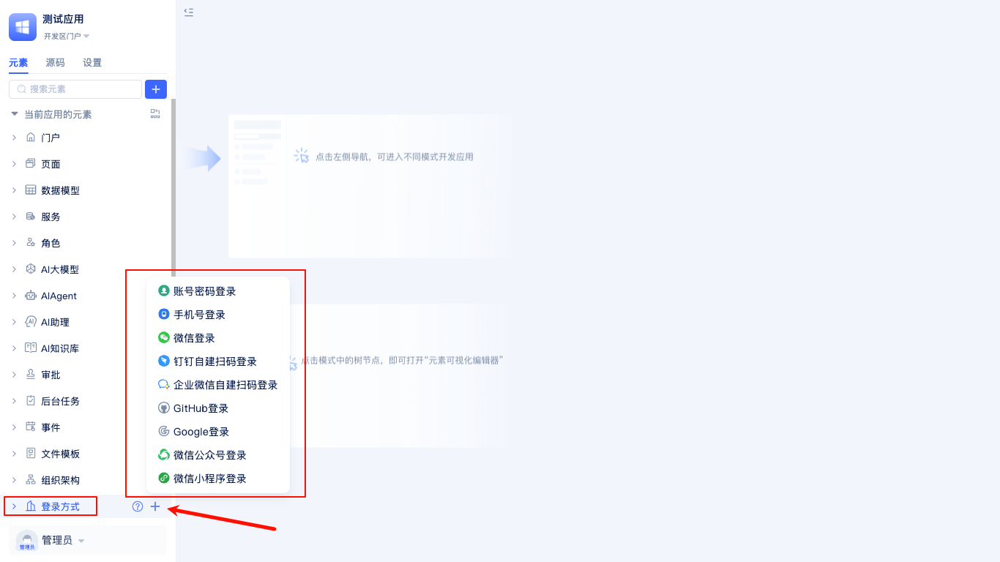

在开发区的元素树中，找到`登录方式`，点击右侧的`+`按钮，即可弹出登录方式选择列表。开发者可根据业务场景，选择并配置所需的登录方式，快速完成接入。

## 基础登录

### 账号密码登录

账号密码登录是最常用且基础的登录方式，允许用户通过输入账号和密码安全地访问应用，在创建JitAi应用时会自动创建一个账号密码登录方式。

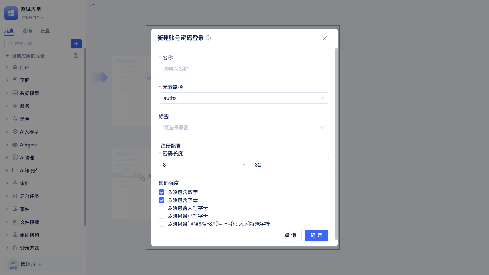

当开发者选择创建`账号密码登录`时，将弹出`新建账号密码登录`窗口。在该窗口中，需填写登录方式名称（英文名自动生成），设置密码长度（默认8-32位，需包含数字和字母）。点击`确定`后，即可完成创建并进入详细配置页面。

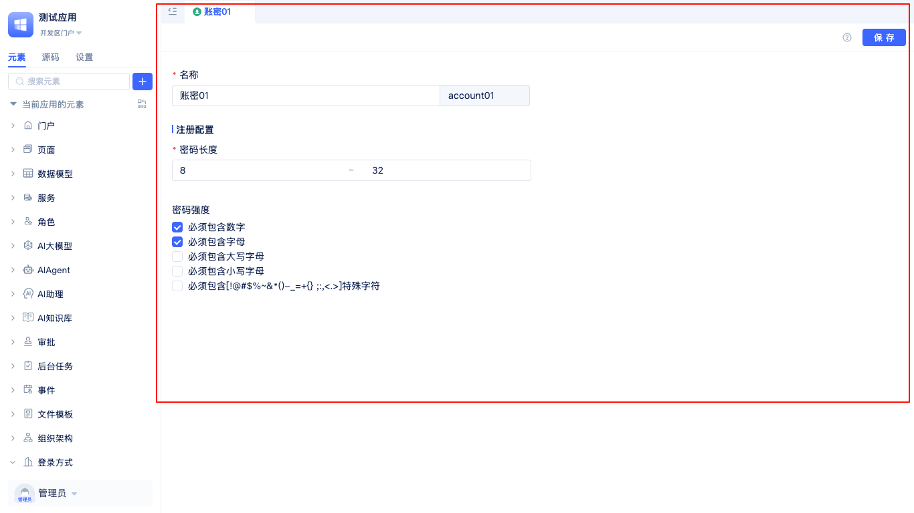

在右侧的详情配置页面，开发者可灵活调整登录方式名称、密码长度及密码强度要求。

密码强度规则支持灵活组合以下五种类型的字符要求：数字、字母、小写字母、大写字母、特殊字符。开发者可根据实际安全需求，自由配置这些类型的组合，有效提升账户安全性，满足不同等级的业务场景。

### 手机号登录

手机号登录是一种便捷且安全的登录方式，用户可通过输入手机号并接收短信验证码完成身份验证，适用于移动端和需要快速注册/登录的场景。

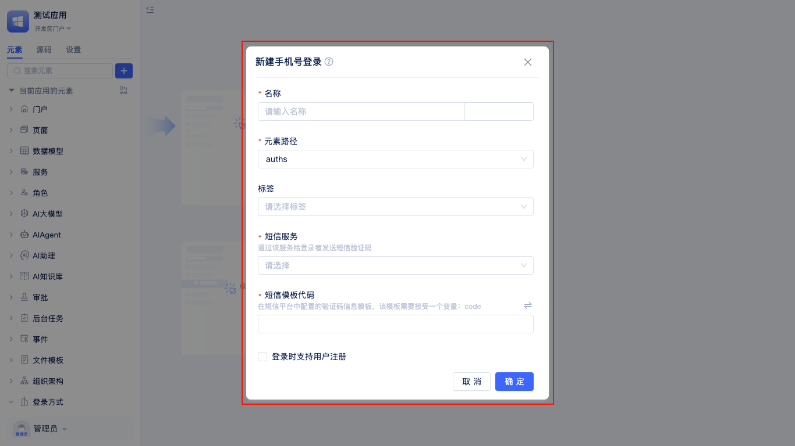

当开发者选择创建`手机号登录`时，将弹出`新建手机号登录`窗口。在该窗口中，需填写登录方式名称（英文名自动生成），并选择短信服务及短信模板代码用于发送验证码。下面有个勾选框`登录时支持用户注册`（默认勾选）。

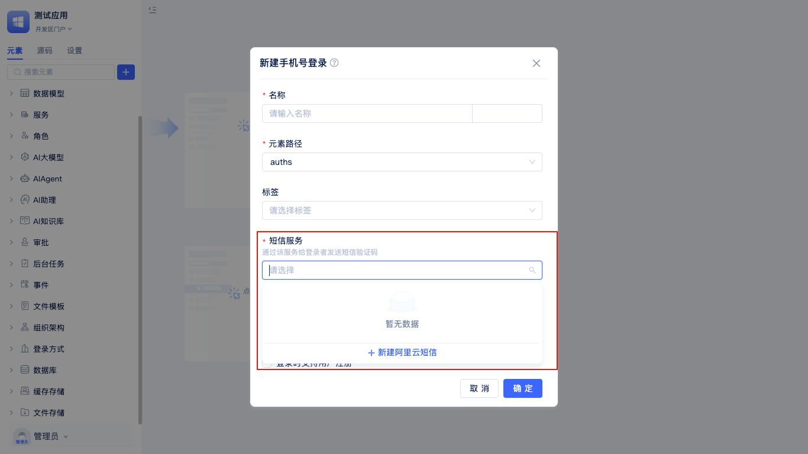

点击短信服务选择框，下拉菜单中可点击``新建阿里云短信``按钮，弹出`新建阿里云短信`配置窗口。

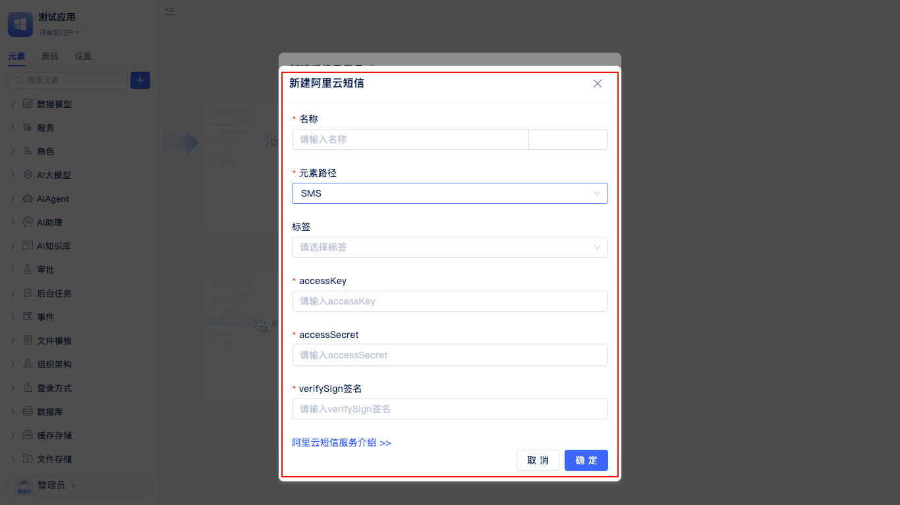

在`新建阿里云短信`窗口中，需填写短信服务名称（英文名自动生成）、AccessKey、AccessSecret 及短信签名（verifySign）。

完成配置后，系统将自动集成短信服务，实现验证码的发送与校验。

**阿里云短信相关配置获取方式如下**：

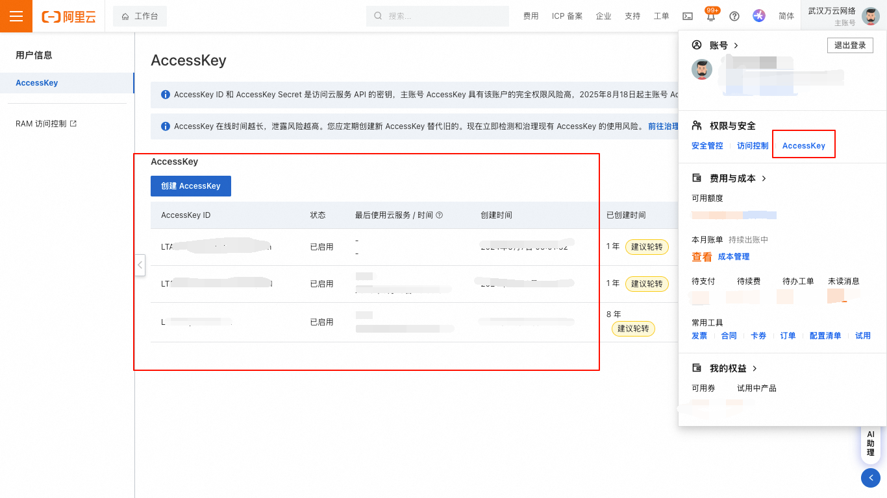

在阿里云控制台，点击右上角头像，选择`权限与安全`下的`AccessKey`即可查看和管理AccessKey信息。您也可以进入`访问控制`，选择对应用户后创建新的AccessKey。

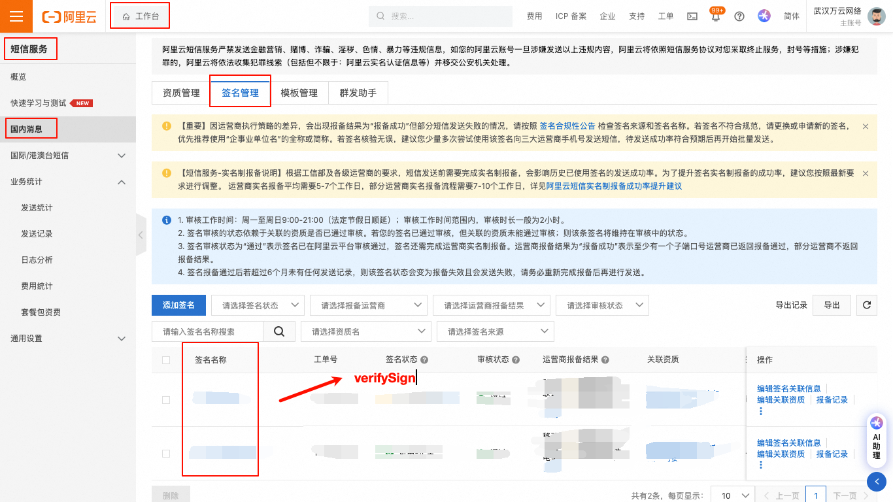

短信签名（verifySign）可在阿里云短信服务的签名管理页面进行查看和申请。

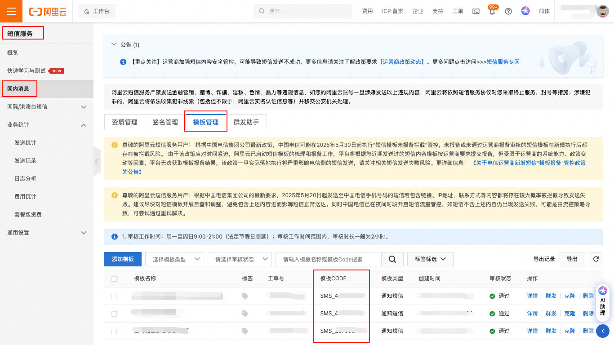

短信模板代码可在阿里云短信服务的模板管理页面获取，用于指定发送的短信内容模板。

**更多阿里云短信服务介绍参考**：[阿里云短信服务](https://help.aliyun.com/zh/sms/)

## 企业级登录集成

### 钉钉自建扫码登录

钉钉自建扫码登录是一种基于钉钉平台的企业级身份认证方式，用户可通过钉钉客户端扫码授权，安全便捷地登录系统。该方式适用于企业内部员工统一身份认证、无密码登录等场景，能够有效提升登录体验与安全性。在创建钉钉自建组织架构时，系统会自动为该组织架构生成一个钉钉自建扫码登录方式，开发者也可根据实际需求，单独新增钉钉自建扫码登录方式。

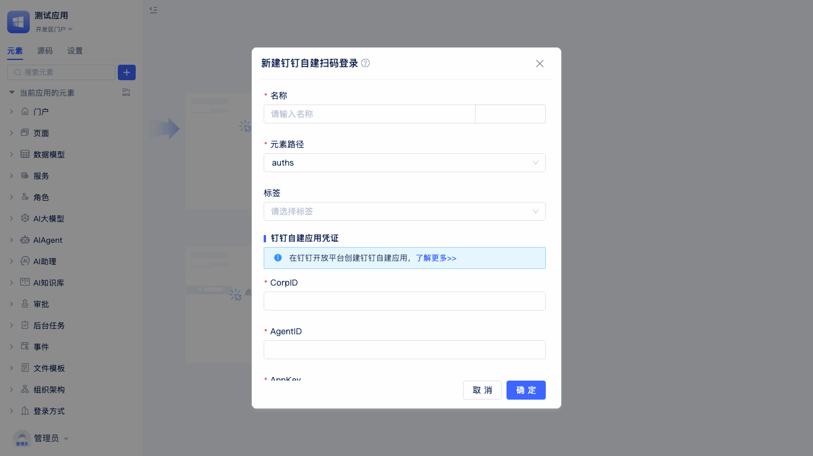

当开发者选择创建`钉钉自建扫码登录`时，将弹出`新建钉钉自建扫码登录`配置窗口。在该窗口中，需填写登录方式名称（英文名自动生成），并配置钉钉自建应用的凭证信息，包括`CorpId`（企业ID）、`AgentID`、`appKey`、`appSecret`。相关配置信息的获取方式可参考[组织架构文档](./组织架构#钉钉自建组织)。

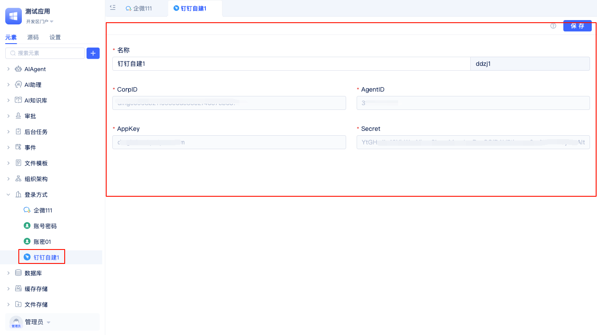

完成相关配置后，系统将自动创建钉钉扫码登录方式，并跳转至登录方式配置页面，方便您进行后续查看与管理。

:::tip
钉钉自建扫码登录方式需与[钉钉自建组织架构](./组织架构.md#钉钉自建组织)配套使用。创建钉钉自建组织架构时，系统会自动同步生成对应的扫码登录方式，无需单独配置。
:::

### 企业微信自建扫码登录

企业微信自建扫码登录是一种基于企业微信平台的企业级扫码认证方式，用户可通过企业微信客户端扫码授权，快速、安全地登录系统。该方式适用于企业微信生态下的员工统一认证、无密码登录等场景。在创建企业微信自建组织架构时，系统会自动生成一个企业微信自建扫码登录方式，开发者也可根据实际业务需求，单独新增企业微信自建扫码登录方式。

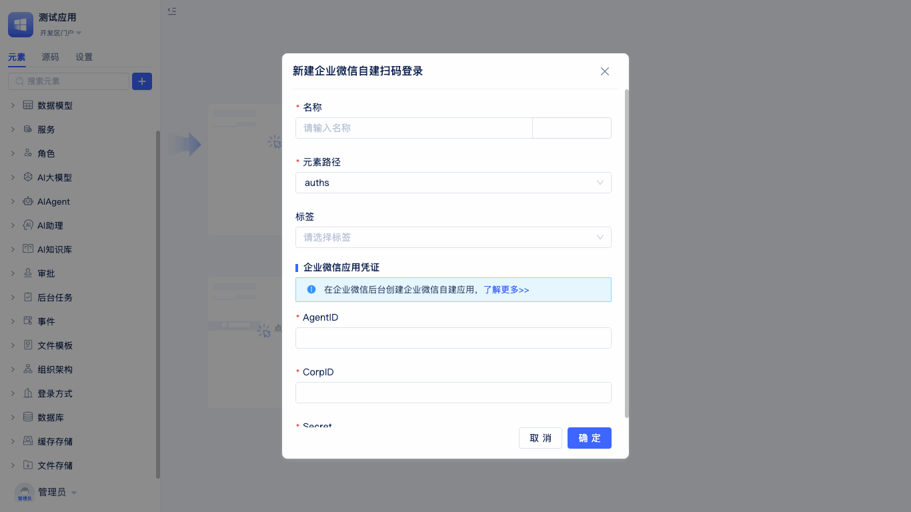

当开发者选择创建`企业微信自建扫码登录`时，将弹出`新建企业微信自建扫码登录`配置窗口。在该窗口中，需填写登录方式名称（英文名自动生成），并配置企业微信自建应用的凭证信息，包括`CorpId`（企业ID）、`AgentID`、`Secret`。相关配置信息的获取方式可参考[组织架构文档](./组织架构#企业微信自建组织)。

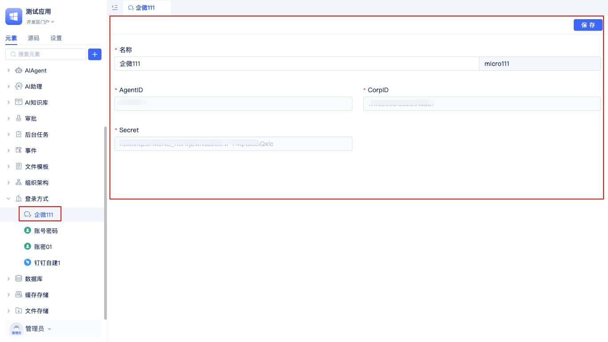

配置完成后，系统会自动生成企业微信扫码登录方式，并跳转至登录方式配置页面，便于您后续的查看与管理。

:::tip
企业微信自建扫码登录方式需与[企业微信自建组织架构](./组织架构.md#企业微信自建组织)配套使用。创建企业微信自建组织架构时，系统会自动同步生成对应的扫码登录方式，无需单独配置。
:::

## 社交平台登录集成

### 微信登录

微信登录是一种基于微信开放平台的第三方登录方式，允许用户通过微信账号授权，快速、安全地登录系统。该方式适用于面向C端用户的应用场景，能够极大提升用户注册和登录的便捷性，降低用户流失率，同时支持微信生态下的用户信息获取与管理。

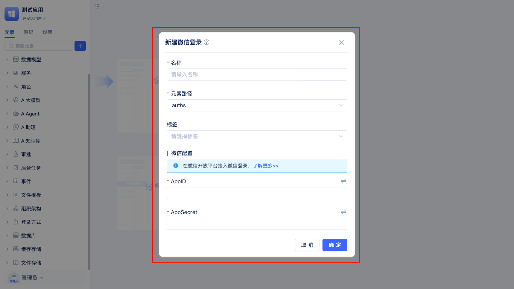

当开发者选择创建`微信登录`方式时，系统会弹出`新建微信登录`配置窗口。在该窗口中，需填写登录方式名称（英文名自动生成），并配置微信开放平台的相关凭证信息，包括`AppID`和`AppSecret`。

**微信凭证获取**：

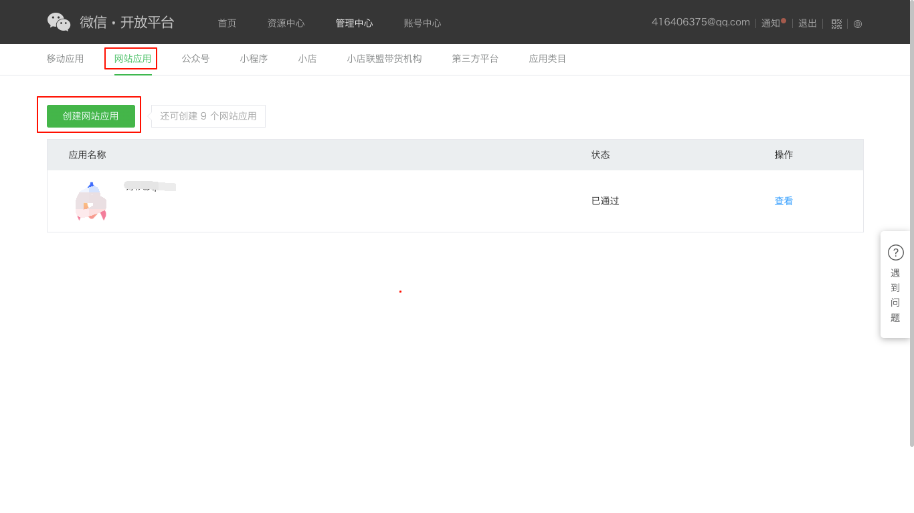

1. 登录[微信开放平台](https://open.weixin.qq.com/)。
2. 在`管理中心`中`网站应用`标签页选择`创建网站应用`，按照指引填写应用信息并提交审核。
3. 审核通过后，在应用详情页即可获取到该应用的`AppID`和`AppSecret`，用于系统的微信登录集成配置。

如需详细操作指引，可参考[微信开放平台官方文档](https://open.weixin.qq.com/)。

:::tip 注意
微信应用的 AppSecret 仅在创建时展示一次，请务必妥善保存，后续无法再次查看。
:::

### 微信公众号登录

微信公众号登录是指用户通过微信扫描二维码并授权后，使用其微信身份登录系统的一种方式。用户需关注指定的微信公众号，并在微信中完成授权，即可实现安全、便捷的身份认证。该登录方式适合需要与用户建立长期联系、推送消息或搭建会员体系的场景，常见于企业服务、内容分发、O2O等应用领域。

当开发者选择创建`微信公众号登录`方式时，系统会弹出`新建微信公众号登录`配置窗口。在该窗口中，需填写登录方式名称（英文名会自动生成），并输入微信公众号的相关凭证信息，包括`AppID`和`AppSecret`。此外，可选择是否勾选`登录时支持用户注册`（默认勾选）。若勾选，系统将显示`用户注册时自动加入的组织架构`选择框，需从已有组织架构中进行选择。

**公众号凭证获取**：

如上图所示，登录[微信公众平台](https://mp.weixin.qq.com/)，在左侧菜单栏点击`设置与开发`-`公众号设置`，即可查看并复制公众号的原始ID、微信号等基础信息。

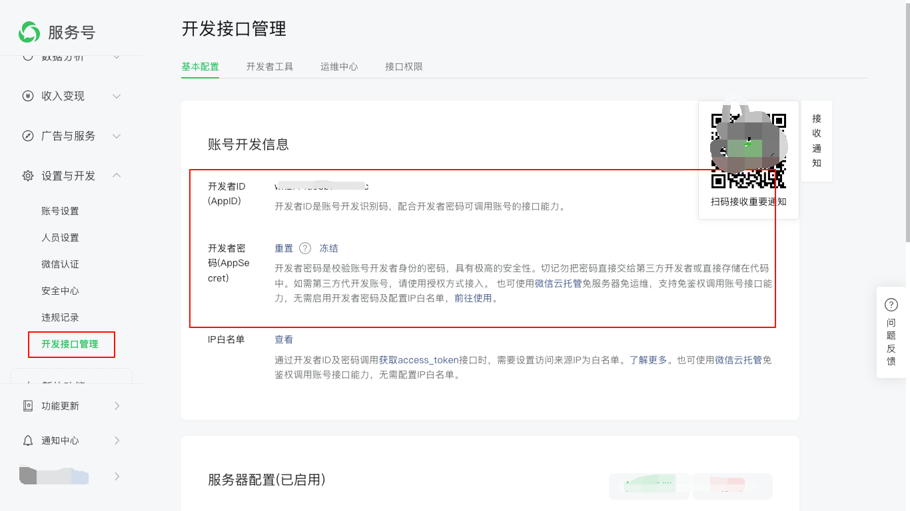
如上图所示，进入`设置与开发`-`开发接口管理`-`基本配置`页面，可以获取到AppID（应用ID）和AppSecret（应用密钥）。

:::tip 注意
AppSecret（开发者密码）仅在创建时展示一次，请务必妥善保存，后续无法再次查看。
:::

### 微信小程序登录

微信小程序登录是一种基于微信小程序平台的第三方登录方式，用户可通过微信小程序授权，实现快速、安全的身份认证。该方式适用于移动端应用、轻量级服务、工具类产品等场景，能够提升用户体验，降低注册和登录门槛。

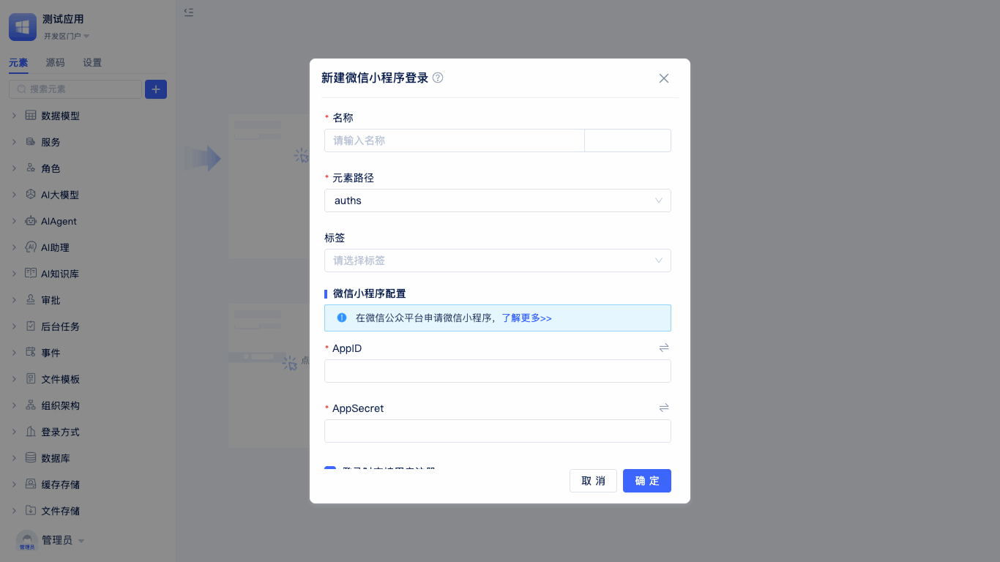

当开发者选择创建`微信小程序登录`方式时，系统会弹出`新建微信小程序登录`配置窗口。在该窗口中，需填写登录方式名称（英文名会自动生成），并配置微信小程序的相关凭证信息，包括`AppID`和`AppSecret`。此外，还可选择是否勾选`登录时支持用户注册`（默认勾选）。

如需了解微信小程序的开发流程，可参考[微信官方开发文档](https://developers.weixin.qq.com/miniprogram/dev/framework/quickstart/getstart.html#%E7%94%B3%E8%AF%B7%E8%B4%A6%E5%8F%B7)。

## 开放平台登录集成

### Github登录

Github 登录基于 Github 开放平台，用户可通过 Github 账号授权，安全便捷地登录系统。该方式非常适合开发者社区、技术类产品及开源项目管理等场景，帮助用户统一管理身份信息。

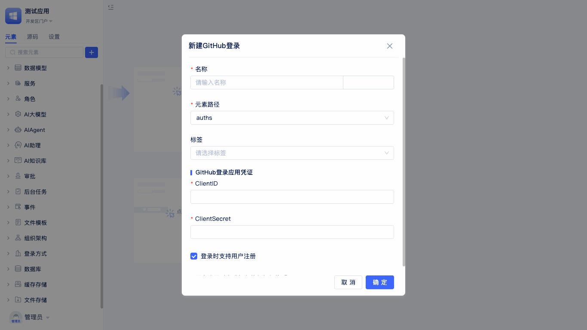

创建`Github 登录`时，系统会弹出配置窗口。请填写登录方式名称（英文名自动生成），并输入 Github 的`ClientID`和`ClientSecret`。这些信息可在 [Github 开发者中心](https://github.com/settings/developers) 的 OAuth Apps 中获取。配置完成后，系统会自动生成 Github 登录方式，并跳转至登录方式配置页面，便于后续管理。

---

### Google登录

Google 登录基于 Google 开放平台，用户可通过 Google 账号授权，快速、安全地登录系统。该方式适用于面向国际用户的应用、SaaS 平台、教育类产品等，能够提升用户体验，简化注册流程。

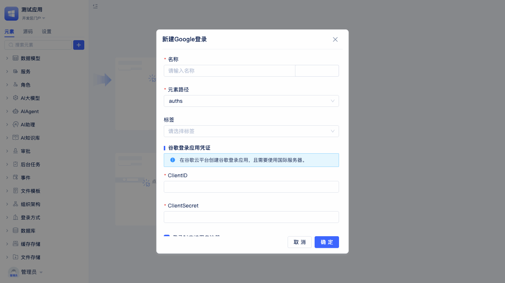

创建`Google 登录`时，系统会弹出配置窗口。请填写登录方式名称（英文名自动生成），并输入 Google 的`ClientID`和`ClientSecret`。相关信息可在 [Google Cloud Console](https://console.cloud.google.com/apis/credentials) 的 OAuth 2.0 凭据中获取。配置完成后，系统会自动生成 Google 登录方式，并跳转至登录方式配置页面，方便后续查看与管理。

:::tip
在谷歌云平台创建谷歌登录应用，且需要使用国际服务器。
:::
