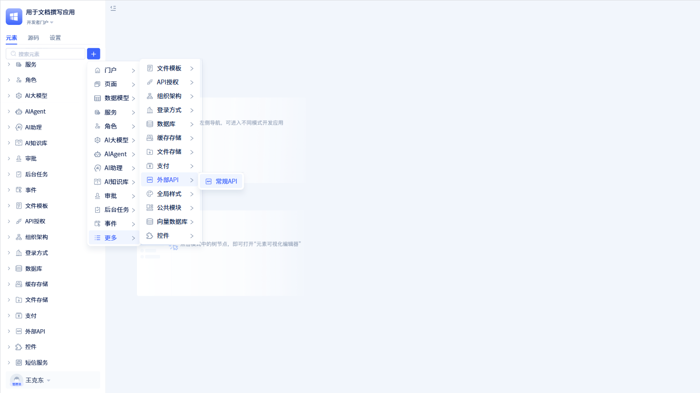
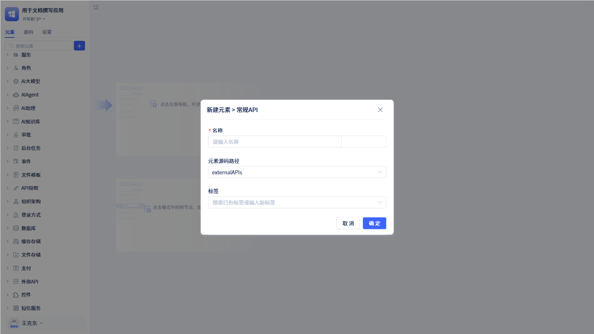

# 外部API

外部 API 集成是用于调用第三方 HTTP 接口的元素，基于 requests 库实现 RESTful API 的统一调用管理。它负责 HTTP 请求封装、参数处理和响应解析，支持 GET、POST、PUT、DELETE 等标准 HTTP 方法，提供请求前后处理和回调机制。

## 外部API创建

在左侧元素树上点击`+`会打开弹窗，将鼠标移动到“更多”中，会看到“外部 API”。点击“外部 API”里面的“通用 API”，就会打开通用 API 的新建弹窗页面。

在新建弹窗页面中，填写好外部 API 名称后，点击`确定`就创建了一个外部 API 元素。

进入外部 API 的配置页面，可以看到外部 API 包含两个模块：公共配置和接口列表。

## 公共配置

公共配置是指外部 API 的一些通用配置，比如：域名、公共的请求头、请求前置处理、响应后置处理等。

### 访问域名

访问域名是集成外部 API 的必填项。

它可以是 IP 和端口号组合，也可以是域名。

### 公共请求头

公共请求头是当前外部 API 服务下所有接口通用的请求头，在公共请求头中可以配置一些常用的参数，如：Content-Type、Accept 等。

点击`+ 添加参数`后，出现添加参数弹窗。填写完参数信息后，点击`保存`即可添加公共请求头。

### 请求前置处理

某些 API 在请求时需要进行签名、加密等动态实时计算，可以使用请求前置处理函数实现。

### 响应后置处理

在 API 响应后，可能需要对响应数据进行二次处理，比如解密、数据校验等，可以使用响应后置处理函数实现。

:::warning 注意

请求前置函数和响应处理函数都不是必填的。如果响应处理函数没有填写，则响应数据将原样返回。

在配置这两个函数之前，需要到标准服务中创建对应的服务函数。

:::

## API接口管理

就像一个服务有多个方法一样，一个外部 API 服务也可以有多个接口，这些接口都定义在“接口列表”中。

开发者可以根据具体情况添加单个接口以及对多个接口进行分组展示。

### API接口分组

开发者可以将同类接口放在同一个分组中，方便管理。例如，订单相关接口放在订单分组下，用户相关接口放在用户分组下等。

开发者在左侧点击添加分组，会打开添加分组的弹窗。输入分组名称后保存，就可以创建一个分组。

接口分组创建成功后，点击分组后面的`更多`图标，可以对分组进行添加接口、修改分组名称、删除分组等操作。

### API接口

每个 API 接口有自己的名称、请求方式（GET/POST/PUT/DELETE）和接口路径等信息。

点击`添加接口`，会打开添加接口的弹窗。在弹窗中，填写接口标题、接口名称、请求方式和接口路径，点击`确定`，就创建了一个新的接口。

:::warning 注意
接口名称一般用英文，作为外部 API 接口的标识，不允许重复。

真正的接口请求路径是由域名和接口路径拼接而成。
:::

创建弹窗保存后进入接口详情页面，开发者可以进一步对接口进行配置。

#### 请求参数

每个 API 接口都可以配置 Params 参数、Body 参数以及 Header 参数。

点击`+ 添加参数`就可以在对应的 tab 下面添加参数。

:::tip 提示
Params 参数会放在 url 的 query string 中，一般情况下，当前请求类型是'GET' 类型才进行设置。

Body 参数会放在请求体中，一般情况下，当前请求类型是'POST'、'PUT'类型才进行设置。

Header 参数会放在请求头中，在请求的时候，会将公共配置中的 Header 参数进行合并处理。

:::

#### 返回值类型

如果当前接口有返回值，那么就需要配置对应的返回值类型。通常接口返回 JSON 格式的数据，可以使用“字典”作为返回值类型，并配置字段的映射关系。

注意：这里的返回值类型都是 JitAi 里面定义的[数据类型](/docs/reference/开发框架/JitORM/数据类型.md)

#### 回调函数

JitAi 通过回调函数配置服务元素中的函数，对最终结果进行业务处理。

在设置回调函数之前，需要到标准服务中创建对应的函数。

### API接口的测试及调用

#### API接口测试

创建好一个接口后，可以测试接口是否可用。

在接口详情页面点击`测试`，会打开测试弹窗。在测试弹窗中，填写参数，点击`测试`按钮，就可以测试接口是否可用。

:::warning 注意

使用测试功能得到的数据是完整的原始数据，没有经过数据处理。
:::

#### API调用

在常规页面或者服务中，配置相关函数，即可进行 API 接口的调用。

在函数逻辑中，选择“服务 -> 外部 API 服务 -> 调用外部 API”后，实现了一个 API 函数调用的声明。

在`设置参数`弹窗中选择 API 接口后，填写相关参数，并点击`确定`。那么就创建了一个完整的 API 函数调用。

在使用者门户中，点击“获取当前天气”按钮，就可以获取当前天气信息了。
