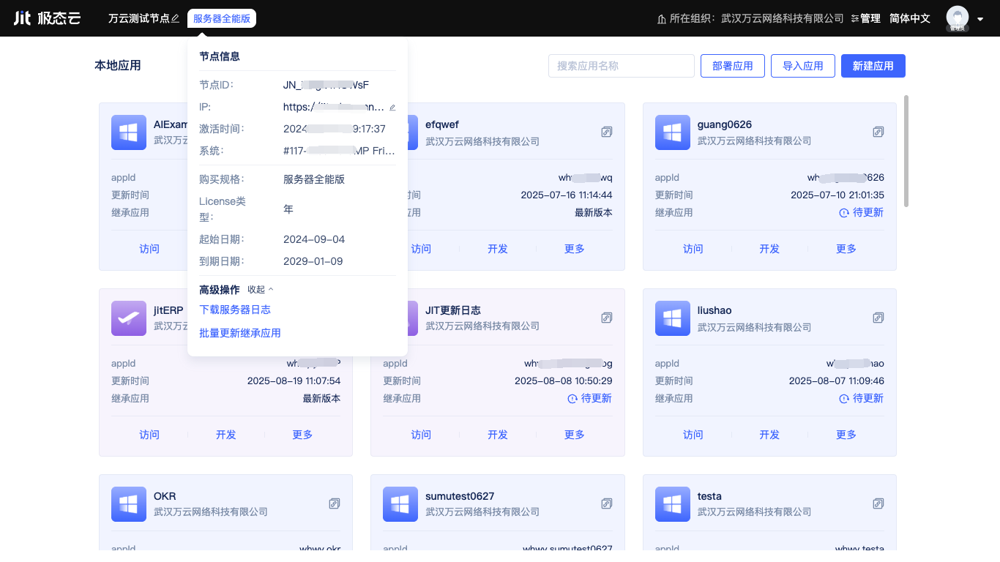
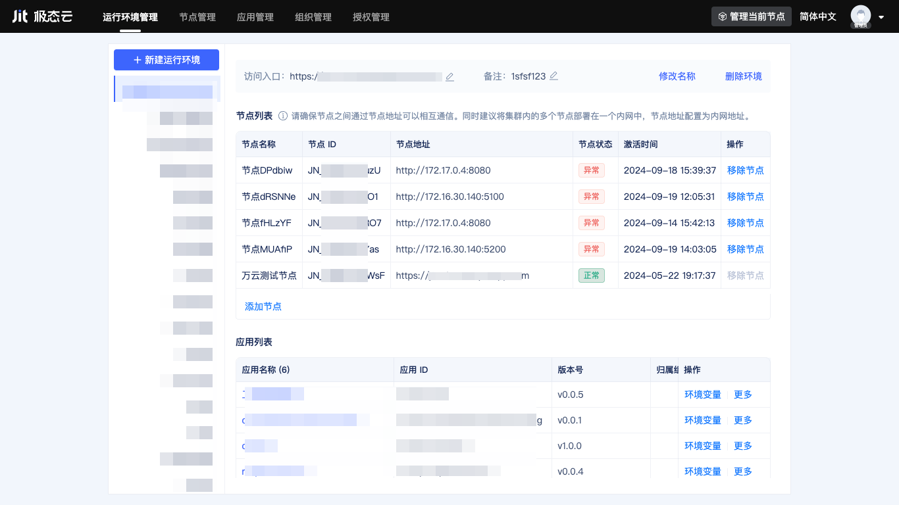
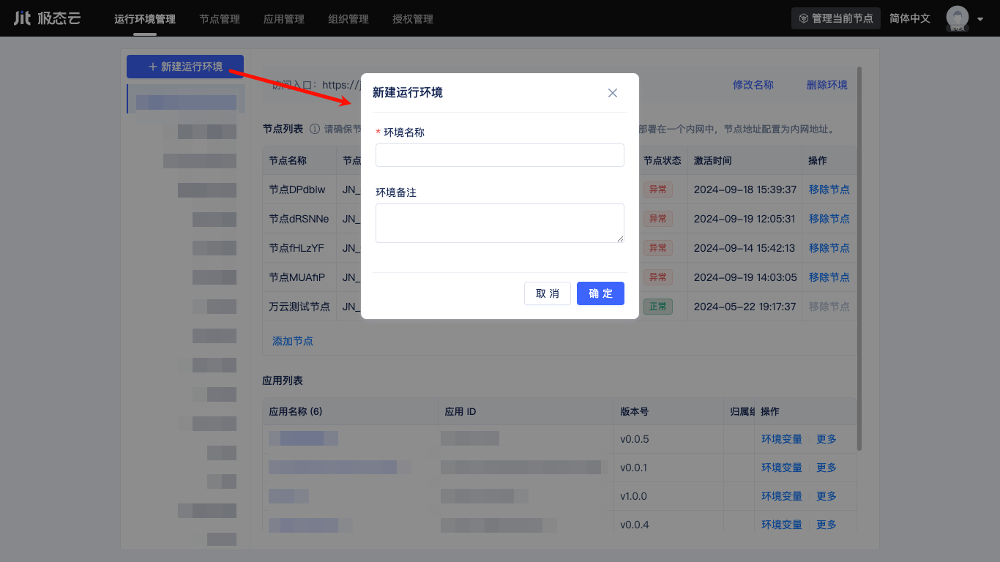
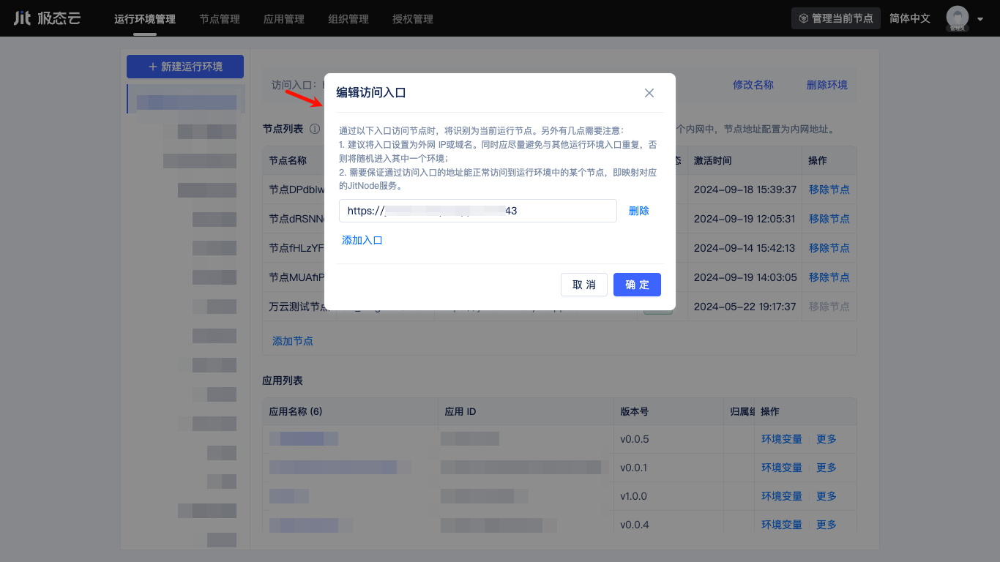
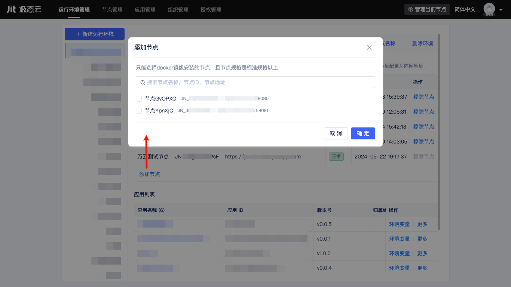
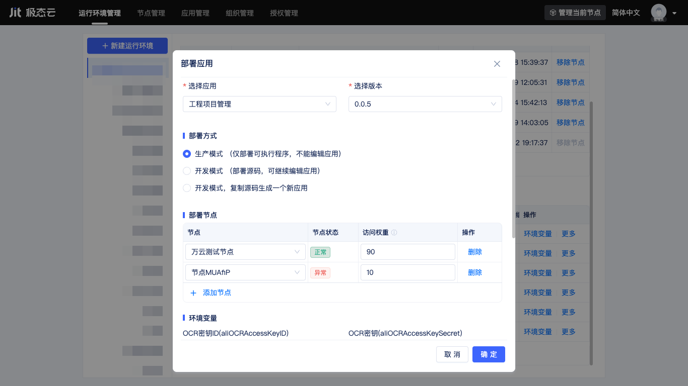

# 运行环境管理

## 什么是运行环境

运行环境用于隔离应用部署和运行空间，各运行环境之间在运行时的资源目录是隔离的。

每个[开发者组织](./开发者组织管理.md)可以创建多个运行环境，每个运行环境中可以添加一个或多个Jit节点（默认运行环境除外）、部署多个应用，每个节点可以同时加入多个运行环境。

## 节点的本地默认运行环境

节点激活时会自动创建一个本地默认运行环境，它在运行环境管理界面中不可见，用于在该节点上运行JitAi内置的运维管理平台。用户访问节点时，会自动跳转本地默认运行环境管理页面，即节点控制台。

在节点控制台中，用户可以修改节点名称、查看节点规格授权信息、下载当前节点运行日志、更新继承应用。

用户还可以进行应用创建、导入、导出、发布、部署、删除、修改继承应用、配置环境变量、生成副本、进入应用开发区门户等操作，关于这些操作的详细介绍请查看[应用创建与管理](../应用开发基础/应用创建与管理)。

## 创建新的运行环境

运行环境的管理需要在组织管理控制台中进行，用户在节点控制台界面右上角点击`管理`按钮，即可进入组织管理控制台。反之，在组织管理控制台界面的右上角，点击`管理当前节点`按钮，则可切换回当前节点的节点控制台。

切换到运行环境管理页面，点击”新建运行环境“按钮，输入运行环境名称，点击”创建“按钮即可创建一个运行环境。

用户可以按照测试、生产的维度创建多个运行环境，也可以按照其它自定义维度创建不同的运行环境。每个运行环境可以添加一个或多个专用访问入口地址，用于访问运行环境中的应用。

:::tip 注意

运行环境访问入口地址可以是IP或域名，用户需做好域名解析，确保入口地址能正常访问到运行环境中指定节点的Jit启动端口。该节点会处理请求在集群内的转发、负载均衡。

默认启动端口为8080，服务器Docker版会自动映射到宿主机80端口，用户也可修改启动端口配置。

:::

用户可以对已创建的运行环境进行修改名称、修改备注、删除操作。

## 使用运行环境管理节点集群

当一个运行环境添加了多个节点后，即形成了由多个节点构成的集群，集群可以提供横向扩缩容能力，保证服务可用性和性能。目前仅支持添加服务器版本节点到运行环境中。

节点列表中会展示每个节点的名称、ID、节点地址、节点状态、激活时间、部署的应用数量，用户也可以对集群中的节点进行移除操作。

### 节点地址

运行环境访问入口地址指向的节点会通过集群内其它节点的地址进行请求转发和负载均衡，节点激活时会自动取内网IP作为节点地址，用户可以手动修改节点地址。

### 节点状态
当节点并未启动Jit进程或网络异常与极态云失联时，节点状态显示为“异常”，当节点Jit进程处于运行状态时，节点状态显示为“正常”。

## 在运行环境中部署应用

用户可以将应用部署到运行环境下的一个或多个节点，一个运行环境中也可以部署多个应用。

用户在部署时可以设置应用在不同节点上的访问权重并按需配置环境变量值，支持随时修改以及删除部署记录。

### 以生产模式部署
以生产模式部署的应用仅包含可执行程序，不包含源码，无法进行应用的在线修改开发。

### 以开发模式部署
当应用发布时携带了源码，则部署时支持以开发模式部署，用户可以在线修改开发应用。

开发模式又分为部署源码和复制并生成新应用两种方式。
