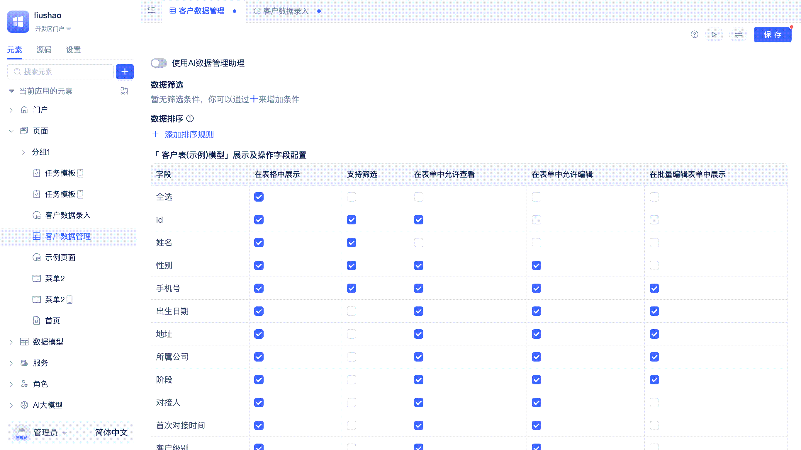

# 数据录入页面

人员信息登记、车辆信息登记、设备信息登记等业务场景中，需要用户填写表单数据，并提交到后台进行处理。JitAi 直接提供了数据录入页面，帮助开发者快速完成表单数据收集功能的开发。

## 创建数据录入页面

数据录入页面的创建过程和[常规页面的创建过程](./组件化页面开发#创建一个常规页面)基本一致，不同的是数据录入页面需要绑定一个[数据表模型](../数据建模/数据表模型.md)，用于存储用户录入的数据。

开发者可以在创建页面时选择页面类型为`数据录入页面`，并在`选择数据表`处选择要录入数据的[数据表模型](../数据建模/数据表模型.md)，点击`确定`按钮后会自动进入可视化编辑器。

## 配置允许查看和编辑的字段

当不想向用户暴露个别字段时，开发者可以配置用户可查看的字段。当只想让用户看到字段值，但又不想让用户修改时，开发者可以配置用户可编辑的字段。

开发者在页面编辑器的`允许查看`一列中，将不需要向用户暴露的字段取消勾选（例如： ID），则用户看到的录入表单中将不再显示对应字段。

开发者在页面编辑器的`允许编辑`一列中，将不允许用户修改的字段取消勾选，则用户在录入表单中看到的对应字段将是只读状态。

## 提交后显示再次录入按钮

当用户有使用一个表单连续录入多条数据的需求时，开发者可以开启`显示再次录入`的开关，即可完成对该需求的支持。

开发者在开发页面时可以勾选`显示再次录入`选项，使得用户每次`提交`数据后点击`再次录入`按钮即可回到录入界面并填写新的数据。该选项默认是打开状态。

## 提交后展示结果反馈界面

当用户完成一次数据提交后，可以给出一个录入结果的反馈界面，告知用户本次录入结果。这是一种常见的交互设计，可以提升用户体验。

开发者在页面编辑器中勾选`显示录入结果反馈`选项，则用户在完成表单数据填写并点击`提交`按钮后，会看到一个数据录入成功的反馈提醒界面。该选项默认是打开状态。

## 转换为常规页面进行修改

数据录入页面是 JitAi 提供的开箱即用的内置页面类型，开发者可以快速创建并使用。当开发者想要基于默认实现进行更精细化的定制修改时，可以将页面转换为常规页面进行无限制地修改。

开发者可以在页面编辑器中点击右上角的`转为常规页面`按钮，即可将页面转换为常规页面。关于常规页面的开发方法参考[组件化页面开发](./组件化页面开发)。

:::warning
转换为常规页面后无法再恢复为原来的`数据录入页面`类型。
:::
