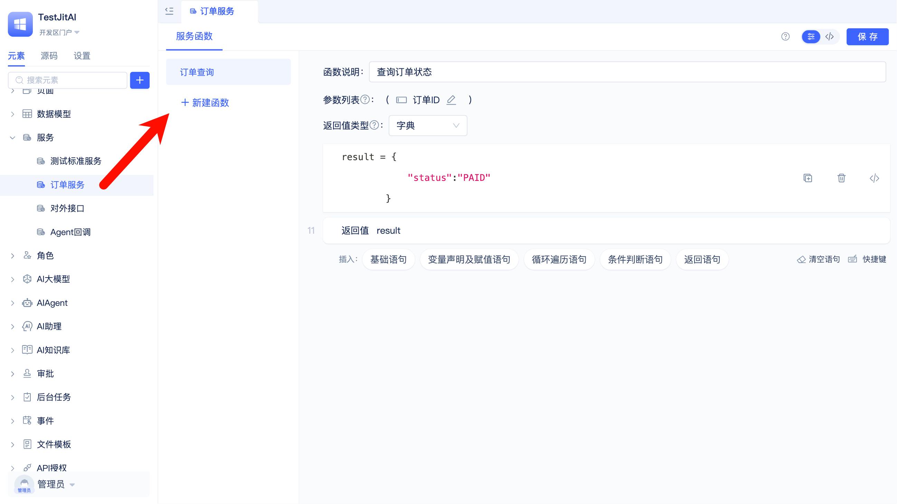
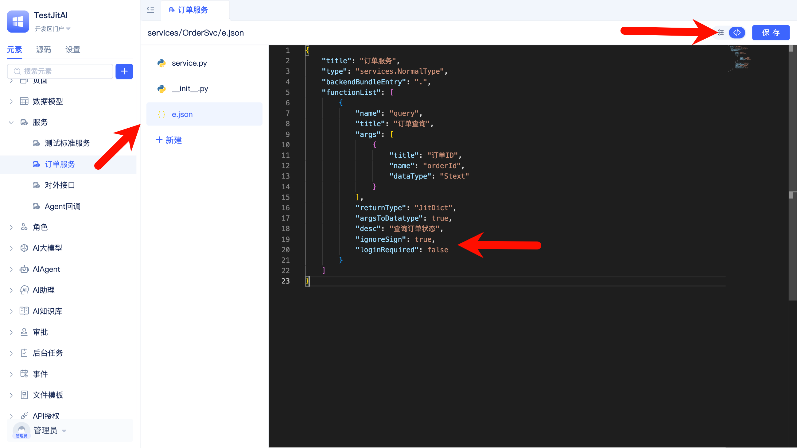

# 使用拦截器实现自定义请求鉴权
当系统需要为外部合作方提供API时，常需要进行鉴权，限制非授权调用。JitAi的API授权元素可以实现[对外开放API接口](/docs/devguide/进阶指南/对外开放API接口.md)（推荐使用方式），但需要调用方使用JitAi提供的客户端SDK。当调用方无法使用SDK时，可以使用[后端拦截器](/docs/reference/开发框架/JitService/后端拦截器.md)实现自定义的鉴权方式，以适配调用方的调用方式，本文以自定义Bearer Token鉴权为例。

## 创建拦截器实例元素目录
拦截器元素暂不支持在可视化开发工具中创建，请开发者使用桌面版进行[本地开发与调试](./本地开发与调试.md)，在应用目录中手动创建元素目录。

```text title="拦截器元素目录结构"
interceptors/
└── BearerToken/
    ├── e.json
    ├── __init__.py
    └── interceptor.py
```

### 实现拦截逻辑
继承`RequestInterceptor`，在before方法中实现鉴权逻辑：仅当目标服务函数在白名单内时才执行校验，否则放过。

```python title="interceptors/BearerToken/interceptor.py"
from interceptors.Http import RequestInterceptor

class BearerToken(RequestInterceptor):
    # 可配置：允许的 Bearer Token 清单（生产可改为从配置元素或数据模型读取）
    ALLOWED_TOKENS = {
        "testtoken123": "demoapp"
    }

    # 可配置：启用鉴权的接口函数白名单（元素全名, 函数名）
    WHITELISTED_FUNCS = {
        ("services.OrderSvc", "query"),
        # ("元素全名", "函数名"),
    }

    def _getElemAndFunc(self, request):
        """解析请求路径，得到元素全名与函数名"""
        path = request.path.replace("/api", "", 1).strip("/").replace("/", ".")
        element, func = path.replace(app.appId, "").strip(".").rsplit(".", maxsplit=1)
        return element, func

    def before(self):
        # 若无法解析到函数定义，直接放过
        function_define = self.functionDefine
        if not function_define:
            return
        try:
            element, func = self._getElemAndFunc(self.request)
        except Exception:
            return

        if (element, func) not in self.WHITELISTED_FUNCS:
            return

        headers = getattr(self.request, 'headers', {}) or {}
        auth = headers.get('Authorization') or headers.get('authorization')
        if not auth or not isinstance(auth, str):
            raise PermissionError("鉴权失败")

        scheme, _, credential = auth.partition(' ')
        if scheme.lower() != 'bearer' or not credential:
            raise PermissionError("鉴权失败")

        token = credential.strip()
        if token not in self.ALLOWED_TOKENS:
            raise PermissionError("鉴权失败")
    
```

### 导出拦截器的类
```python title="interceptors/BearerToken/__init__.py"
#导出的类名必须与元素目录名一致
from .interceptor import BearerToken
```

### 编辑`e.json`

```json title="interceptors/BearerToken/e.json"
{
  "title": "BearerToken鉴权",
  "type": "interceptors.Http",
  "backendBundleEntry": ".",
  "icon": "lanjieqi1",
  "sort": 10
}
```

## 创建服务函数

开发者可以借助JitAi可视化开发工具快速创建服务元素以及函数。



```text title="服务元素目录结构"
services/
└── OrderSvc/
    ├── e.json
    ├── __init__.py
    └── service.py
```

### 实现函数逻辑

```python title="services/OrderSvc/service.py"

from services.NormalType import NormalService

class OrderSvc(NormalService):

    def query(self, orderId):
        result = {
            "status":"PAID"
        }
        return result

```

```python title="services/OrderSvc/__init__.py"
from .service import OrderSvc

```

### 编辑e.json

```json title="services/OrderSvc/e.json"
{
    "title": "订单服务",
    "type": "services.NormalType",
    "backendBundleEntry": ".",
    "functionList": [
        {
            "name": "query",
            "title": "订单查询",
            "args": [
                {
                    "title": "订单ID",
                    "name": "orderId",
                    "dataType": "Stext"
                }
            ],
            "returnType": "JitDict",
            "argsToDatatype": true,
            "desc": "查询订单状态",
            "ignoreSign": true,
            "loginRequired": false
        }
    ]
}
```

注意：
1. 声明 `ignoreSign: true` ，使函数跳过平台默认验签。
2. 声明 `loginRequired: false` ，使函数跳过平台默认登录状态校验。

上述两个配置需要切换到全代码模式进行修改。



## 测试验证

先删除应用目录下的dist目录，重新启动Jit，然后使用curl命令测试。

```shell title="测试curl命令"
curl -X POST \
     -H "Authorization: Bearer testtoken123" \
     -H "Content-Type: application/json" \
     -d '{"orderId": "1001"}' \
     "http://localhost:8080/api/whwy/testjitai/services/OrderSvc/query"
```

```json title="成功响应"
{
    "errcode": 0,
    "errmsg": null,
    "requestId": "29c8dc9ebfc843f29e8b7f3e472bb641",
    "sysTime": 1754983379088,
    "duration": 12531,
    "data": {
        "status": "PAID"
    },
    "jitNodeValid": {
        "valid": true,
        "data": {
            "expired": false,
            "willExpired": false,
            "specExceed": false,
            "stopped": false,
            "errorMsg": ""
        }
    }
}
```

```json title="失败响应"
{
    "errcode": 20005,
    "errmsg": "interceptors.BearerToken【BearerToken鉴权】元素异常,请检查元素代码或参数。错误信息：鉴权失败",
    "requestId": "92a83ecb785e41fa8c97e88ecf87545a",
    "sysTime": 1754983556693,
    "duration": 388,
    "data": {

    },
    "errHandler": "promptError",
    "traceBack": [
        {
            "filePath": ".home.environs.JED_c1tqsCN7Q5.whwy.testjitai.0_0_0.interceptors.BearerToken.interceptor.py",
            "lineNumber": 50,
            "funcName": "before",
            "errorMsg": "鉴权失败"
        },
        {
            "filePath": ".system.jit.elements.element.py",
            "lineNumber": 33,
            "funcName": "wrapper"
        }
    ]
}
```