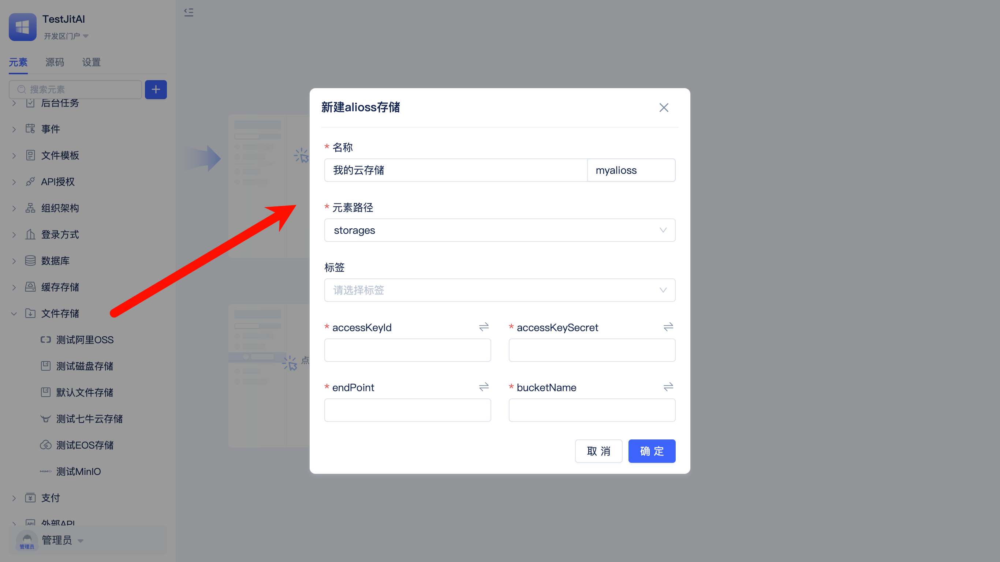
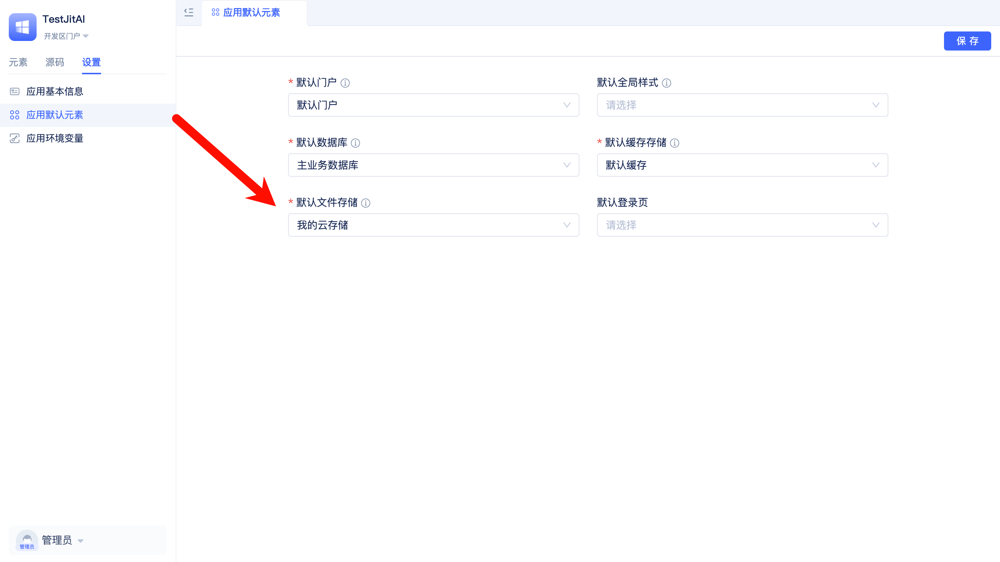
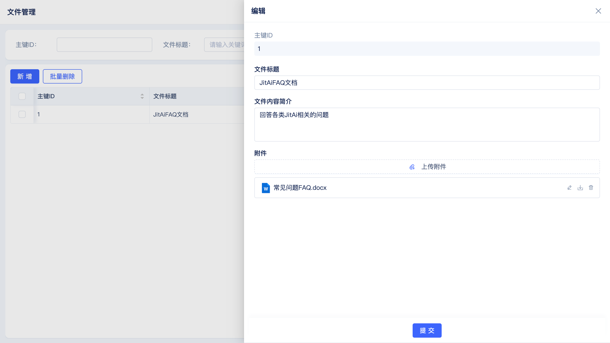

# 基于文件存储元素实现文件管理

某制造企业的生产部门需要管理设备操作手册、安全规程文档、培训视频等生产资料，传统方式存在文件分散在各个车间电脑中、查找困难、更新不及时等问题。

通过[JitStorage](/docs/category/jitstorage)中的文件存储元素，实现生产资料的统一上传、安全存储和便捷访问。

## 创建文件存储实例元素

创建阿里云OSS存储实例，用于统一保存生产部门的各类文件资料。

开发者也可以根据需要选择其它存储类型。
## 设置为默认文件存储元素

将刚才创建的文件存储实例元素设置为系统默认，确保所有上传的文件都自动保存到云端存储。

## 在资料管理中使用文件存储

在资料管理页面中上传文件，系统会自动存储到配置的存储中。

相关文档：在[业务实体建模与数据分析](./业务实体建模与数据分析.md)中了解如何创建数据模型，在[系统界面设计与组件应用](./系统界面设计与组件应用.md)中了解如何搭建系统页面。
